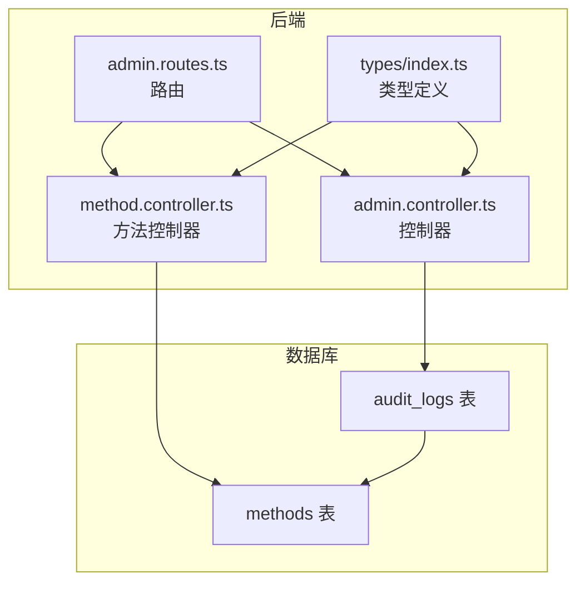
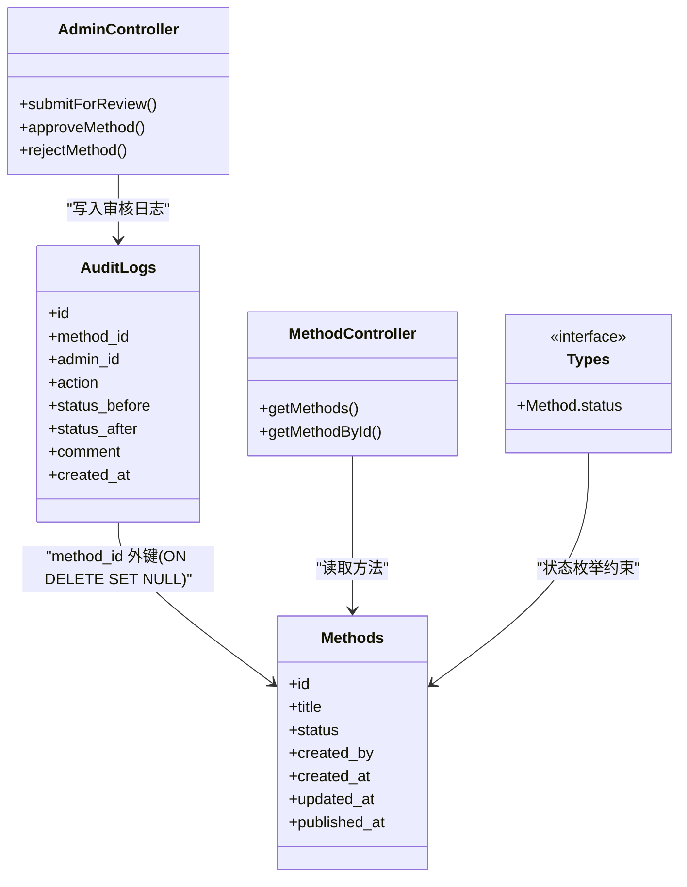
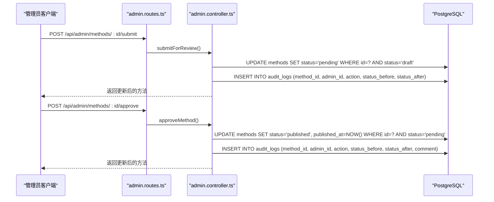

# 方法与审核记录

<cite>
**本文引用的文件**
- [init.sql](file://database/init.sql)
- [admin.controller.ts](file://backend/src/controllers/admin.controller.ts)
- [admin.routes.ts](file://backend/src/routes/admin.routes.ts)
- [method.controller.ts](file://backend/src/controllers/method.controller.ts)
- [types/index.ts](file://backend/src/types/index.ts)
</cite>

## 目录
1. [引言](#引言)
2. [项目结构](#项目结构)
3. [核心组件](#核心组件)
4. [架构总览](#架构总览)
5. [详细组件分析](#详细组件分析)
6. [依赖关系分析](#依赖关系分析)
7. [性能考量](#性能考量)
8. [故障排查指南](#故障排查指南)
9. [结论](#结论)

## 引言
本文件围绕 nian 项目中“心理调节方法”与“审核记录”的一对多关系展开，系统性说明：
- audit_logs 表如何通过 method_id 外键关联到 methods 表，记录每个方法从草稿提交、审核到发布的完整生命周期操作；
- ON DELETE SET NULL 策略在方法被删除时如何保留历史审核日志，并将 method_id 置空以维护引用完整性；
- 结合 admin.controller.ts 中的 submitMethod 和 approveMethod 等控制器逻辑，展示管理员操作如何触发审核日志的写入；
- 提供具体示例：内容管理员提交方法后系统自动记录 'submit' 动作；超级管理员批准后记录 'approve' 动作及状态变更前后值，形成完整可追溯的操作链。

## 项目结构
与“方法-审核记录”关系直接相关的代码分布在以下位置：
- 数据库初始化脚本定义了 methods 与 audit_logs 的表结构与约束；
- 后端控制器负责处理管理员提交、审批、拒绝等业务逻辑，并写入 audit_logs；
- 路由层将 HTTP 请求映射到对应控制器；
- 类型定义明确了方法状态枚举与返回结构。

图表来源
- [init.sql](file://database/init.sql#L110-L119)
- [admin.routes.ts](file://backend/src/routes/admin.routes.ts#L1-L98)
- [admin.controller.ts](file://backend/src/controllers/admin.controller.ts#L266-L387)
- [method.controller.ts](file://backend/src/controllers/method.controller.ts#L1-L153)
- [types/index.ts](file://backend/src/types/index.ts#L18-L35)

章节来源
- [init.sql](file://database/init.sql#L110-L119)
- [admin.routes.ts](file://backend/src/routes/admin.routes.ts#L1-L98)
- [admin.controller.ts](file://backend/src/controllers/admin.controller.ts#L266-L387)
- [method.controller.ts](file://backend/src/controllers/method.controller.ts#L1-L153)
- [types/index.ts](file://backend/src/types/index.ts#L18-L35)

## 核心组件
- methods 表：存储心理调节方法的元数据与状态，包含草稿(draft)、待审(pending)、发布(published)、归档(archived)等状态。
- audit_logs 表：记录每次审核动作，包含 action、status_before、status_after、comment 等字段，并通过 method_id 与 methods 关联。
- admin.controller.ts：提供创建方法、提交审核、审批通过、拒绝等接口，关键点在于提交与审批时写入 audit_logs。
- admin.routes.ts：暴露 /api/admin/methods/:id/submit、/approve、/reject 等审核相关路由。
- types/index.ts：定义 Method 接口中的 status 字段取值范围，确保状态一致性。

章节来源
- [init.sql](file://database/init.sql#L19-L36)
- [init.sql](file://database/init.sql#L110-L119)
- [admin.controller.ts](file://backend/src/controllers/admin.controller.ts#L266-L387)
- [admin.routes.ts](file://backend/src/routes/admin.routes.ts#L36-L45)
- [types/index.ts](file://backend/src/types/index.ts#L18-L35)

## 架构总览
下面的类图展示了“方法-审核记录”的核心关系与关键方法调用路径。

图表来源
- [init.sql](file://database/init.sql#L19-L36)
- [init.sql](file://database/init.sql#L110-L119)
- [admin.controller.ts](file://backend/src/controllers/admin.controller.ts#L266-L387)
- [method.controller.ts](file://backend/src/controllers/method.controller.ts#L1-L153)
- [types/index.ts](file://backend/src/types/index.ts#L18-L35)

## 详细组件分析

### 1) 表结构与外键约束
- methods 表：包含主键 id 与状态字段 status，默认草稿状态 draft。
- audit_logs 表：
  - method_id 引用 methods(id)，使用 ON DELETE SET NULL；
  - admin_id 引用 admins(id)，使用 ON DELETE SET NULL；
  - action 字段限定为 'submit'、'approve'、'reject'；
  - 记录状态变更前后的值 status_before、status_after，以及可选 comment。

章节来源
- [init.sql](file://database/init.sql#L19-L36)
- [init.sql](file://database/init.sql#L110-L119)

### 2) 控制器逻辑与审核日志写入
- 提交审核（submitForReview）：
  - 将方法状态从 draft 更新为 pending；
  - 同步插入一条 action='submit' 的审核记录，status_before='draft'，status_after='pending'。
- 审核通过（approveMethod）：
  - 仅允许角色为 super_admin 的管理员执行；
  - 将方法状态从 pending 更新为 published，并设置 published_at；
  - 插入一条 action='approve' 的审核记录，status_before='pending'，status_after='published'，并记录 comment。
- 审核拒绝（rejectMethod）：
  - 仅允许角色为 super_admin 的管理员执行；
  - 将方法状态从 pending 回退为 draft；
  - 插入一条 action='reject' 的审核记录，status_before='pending'，status_after='draft'，并记录 comment。

章节来源
- [admin.controller.ts](file://backend/src/controllers/admin.controller.ts#L266-L387)

### 3) 路由与权限控制
- 路由层对 /api/admin/methods/:id/submit、/approve、/reject 进行映射；
- authenticateAdmin 中间件保证这些接口需要管理员身份；
- approveMethod 与 rejectMethod 在执行前校验管理员角色是否为 super_admin。

章节来源
- [admin.routes.ts](file://backend/src/routes/admin.routes.ts#L36-L45)
- [admin.controller.ts](file://backend/src/controllers/admin.controller.ts#L298-L340)
- [admin.controller.ts](file://backend/src/controllers/admin.controller.ts#L342-L387)

### 4) ON DELETE SET NULL 策略的意义
- 当某条 methods 记录被删除时：
  - audit_logs 中对应的 method_id 不会被级联删除，而是被置为 NULL；
  - 保留了完整的审核历史，满足审计合规性要求；
  - 通过 method_id 置空，维护了外键引用完整性，避免孤立记录。

章节来源
- [init.sql](file://database/init.sql#L110-L119)

### 5) 生命周期示例（从草稿到发布）
- 内容管理员提交方法：
  - 触发 submitForReview，方法状态从 draft 变为 pending；
  - 审核日志记录 action='submit'，status_before='draft'，status_after='pending'。
- 超级管理员批准方法：
  - 触发 approveMethod，方法状态从 pending 变为 published，并设置发布时间；
  - 审核日志记录 action='approve'，status_before='pending'，status_after='published'，并附带 comment。
- 若方法被删除：
  - 审核历史仍可查询，但 method_id 字段为 NULL，表示原方法已被移除。

章节来源
- [admin.controller.ts](file://backend/src/controllers/admin.controller.ts#L266-L387)
- [init.sql](file://database/init.sql#L110-L119)

### 6) 与前端交互与状态枚举
- 前端通过 method.controller.ts 的公开接口获取已发布方法列表与详情；
- Method 接口中的 status 字段取值范围涵盖 draft/pending/published/archived，确保状态一致性。

章节来源
- [method.controller.ts](file://backend/src/controllers/method.controller.ts#L1-L153)
- [types/index.ts](file://backend/src/types/index.ts#L18-L35)

## 依赖关系分析
- 控制器依赖数据库连接池进行 SQL 操作；
- 审核日志写入与方法状态更新在同一事务中执行，确保数据一致性；
- 路由层与控制器解耦，便于扩展更多审核动作或状态流转。

图表来源
- [admin.routes.ts](file://backend/src/routes/admin.routes.ts#L36-L45)
- [admin.controller.ts](file://backend/src/controllers/admin.controller.ts#L266-L387)

章节来源
- [admin.routes.ts](file://backend/src/routes/admin.routes.ts#L1-L98)
- [admin.controller.ts](file://backend/src/controllers/admin.controller.ts#L266-L387)

## 性能考量
- 审核日志表包含 method_id、admin_id、created_at 索引，有利于按方法或管理员检索审核历史；
- 对 methods 的状态、分类、难度等字段建立索引，提升方法列表与筛选性能；
- 审核日志写入为轻量级操作，建议与方法状态更新在同一事务中完成，减少锁竞争。

章节来源
- [init.sql](file://database/init.sql#L110-L119)
- [init.sql](file://database/init.sql#L38-L41)

## 故障排查指南
- 提交审核失败：
  - 检查方法当前状态是否为 draft；
  - 确认请求参数 id 是否正确；
  - 查看 audit_logs 是否成功写入。
- 审批/拒绝失败：
  - 确认管理员角色为 super_admin；
  - 检查方法当前状态是否为 pending；
  - 确认 comment 参数（拒绝场景）是否传入。
- 方法删除后无法定位审核记录：
  - 审核记录仍存在，但 method_id 为 NULL，需通过 created_at 或其他维度过滤。

章节来源
- [admin.controller.ts](file://backend/src/controllers/admin.controller.ts#L266-L387)
- [init.sql](file://database/init.sql#L110-L119)

## 结论
nian 项目通过 audit_logs 与 methods 的一对多关系，实现了方法生命周期的完整审计追踪。ON DELETE SET NULL 策略在保障合规性的前提下，维护了引用完整性。admin.controller.ts 中的 submitForReview 与 approveMethod 等接口清晰地刻画了从草稿到发布的审核流程，配合路由层与类型定义，形成了稳定、可扩展的审核体系。