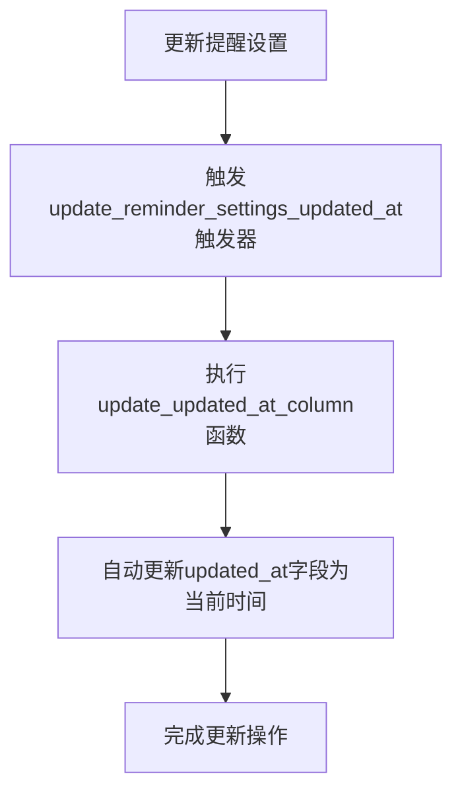
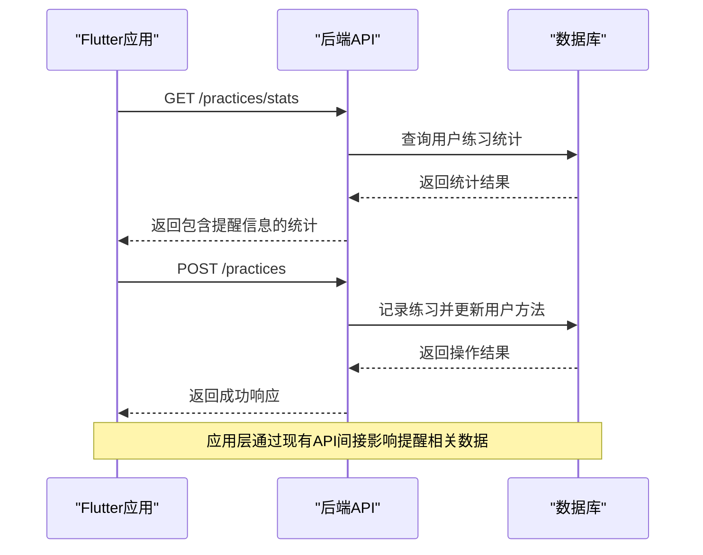

# 用户与提醒设置

<cite>
**本文档引用的文件**
- [init.sql](file://database/init.sql#L80-L93)
- [init.sql](file://database/init.sql#L301-L314)
- [api_constants.dart](file://flutter_app/lib/config/api_constants.dart#L4-L36)
- [practice.routes.ts](file://backend/src/routes/practice.routes.ts#L1-L20)
- [practice.controller.ts](file://backend/src/controllers/practice.controller.ts#L1-L261)
</cite>

## 目录
1. [引言](#引言)
2. [数据库结构分析](#数据库结构分析)
3. [一对一关系实现](#一对一关系实现)
4. [一对多语义实现](#一对多语义实现)
5. [时间戳自动更新机制](#时间戳自动更新机制)
6. [应用层交互分析](#应用层交互分析)
7. [用户行为引导作用](#用户行为引导作用)
8. [数据完整性与一致性](#数据完整性与一致性)
9. [结论](#结论)

## 引言
nian项目中的用户与提醒设置关系设计旨在为用户提供个性化的心理自助练习提醒功能。该设计通过数据库层面的约束和应用逻辑的配合，实现了用户与提醒设置之间的一对一关系，同时支持每位用户配置多个提醒时间和周期性规则。本文将深入解析这一关系的实现机制及其在应用中的作用。

## 数据库结构分析

```mermaid
erDiagram
USER ||--o{ REMINDER_SETTINGS : "has"
USER {
int id PK
string email UK
string password_hash
string nickname
string avatar_url
timestamp created_at
timestamp last_login_at
boolean is_active
}
REMINDER_SETTINGS {
int id PK
int user_id FK UK
boolean enabled
jsonb reminder_times
jsonb reminder_days
string notification_type
timestamp created_at
timestamp updated_at
}
```

**图表来源**
- [init.sql](file://database/init.sql#L5-L14)
- [init.sql](file://database/init.sql#L80-L90)

**本节来源**
- [init.sql](file://database/init.sql#L5-L14)
- [init.sql](file://database/init.sql#L80-L90)

## 一对一关系实现

在nian项目的数据库设计中，用户与提醒设置之间的一对一关系通过`reminder_settings`表中的外键约束和唯一性约束实现。`user_id`字段不仅作为外键引用`users`表的主键，还被设置为UNIQUE约束，确保每位用户只能拥有一条提醒设置记录。

这种设计保证了数据的完整性，防止了同一用户出现多条提醒配置的情况。当应用需要查询或更新用户的提醒设置时，可以直接通过`user_id`进行精确查找，无需处理多条记录的复杂逻辑。

**本节来源**
- [init.sql](file://database/init.sql#L83)

## 一对多语义实现

尽管用户与提醒设置表之间是一对一的关系，但通过JSONB格式的`reminder_times`和`reminder_days`字段，实现了用户可以设置多个提醒时间的"一对多"语义。

`reminder_times`字段存储用户配置的多个提醒时间点，而`reminder_days`字段则定义了提醒的周期性规则（如工作日、周末或每天）。这种设计在保持数据库结构简洁的同时，提供了灵活的提醒配置能力，满足了用户多样化的提醒需求。

**本节来源**
- [init.sql](file://database/init.sql#L85-L86)

## 时间戳自动更新机制



**图表来源**
- [init.sql](file://database/init.sql#L301-L314)

**本节来源**
- [init.sql](file://database/init.sql#L301-L314)

nian项目通过数据库触发器机制实现了`updated_at`时间戳的自动更新。`update_updated_at_column()`函数被定义为一个通用的时间戳更新函数，而`update_reminder_settings_updated_at`触发器在每次更新`reminder_settings`表之前被激活，自动将`updated_at`字段设置为当前时间。

这种机制确保了提醒设置的最后更新时间始终准确，无需在应用层代码中手动维护，减少了开发复杂性和潜在的错误。

## 应用层交互分析



**图表来源**
- [practice.routes.ts](file://backend/src/routes/practice.routes.ts#L1-L20)
- [practice.controller.ts](file://backend/src/controllers/practice.controller.ts#L1-L261)

**本节来源**
- [practice.routes.ts](file://backend/src/routes/practice.routes.ts#L1-L20)
- [practice.controller.ts](file://backend/src/controllers/practice.controller.ts#L1-L261)

尽管在API端点中没有直接的提醒设置管理接口，但应用层通过现有的练习记录和统计API与提醒系统间接交互。当用户完成练习时，系统会更新相关统计信息，这些信息可能被用于调整提醒策略或向用户展示进度。

## 用户行为引导作用

用户与提醒设置的关系设计在引导用户建立持续练习习惯方面发挥着重要作用。通过定时推送提醒，系统能够：

1. **建立规律性**：固定的提醒时间帮助用户形成规律的练习习惯
2. **提高参与度**：个性化的提醒配置增加用户的参与意愿
3. **增强连续性**：周期性提醒减少练习中断的可能性
4. **提供反馈**：结合练习统计，让用户看到持续练习的成果

这种设计利用行为心理学原理，通过外部提醒逐步内化为用户的自主行为，最终帮助用户建立长期的心理自助练习习惯。

**本节来源**
- [init.sql](file://database/init.sql#L80-L90)

## 数据完整性与一致性

nian项目通过多层次的机制确保用户与提醒设置关系的数据完整性与应用层逻辑的一致性：

1. **数据库约束**：外键约束确保提醒设置必须关联到存在的用户，唯一性约束防止重复配置
2. **触发器机制**：自动更新时间戳确保数据状态的准确性
3. **事务处理**：在相关操作中使用事务保证数据的一致性
4. **应用层验证**：在API层面进行输入验证，防止无效数据进入数据库

这些机制共同作用，确保了用户提醒设置数据的可靠性和一致性，为应用的稳定运行提供了基础保障。

**本节来源**
- [init.sql](file://database/init.sql#L83)
- [init.sql](file://database/init.sql#L301-L314)

## 结论
nian项目中用户与提醒设置的关系设计体现了数据库设计与应用需求的紧密结合。通过一对一的表关系配合JSONB字段的灵活存储，既保证了数据结构的规范性，又实现了功能的丰富性。自动更新的触发器机制减轻了应用层的负担，而整体设计在用户行为引导和数据完整性方面都表现出色。这一设计模式为类似的心理健康应用提供了有价值的参考。