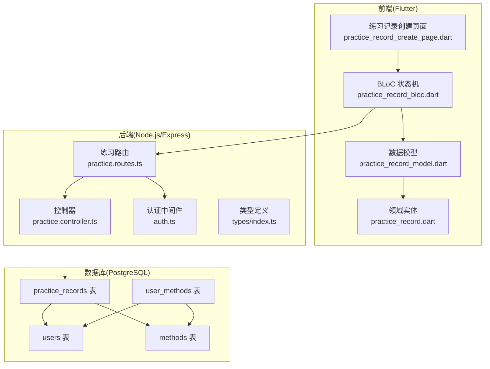
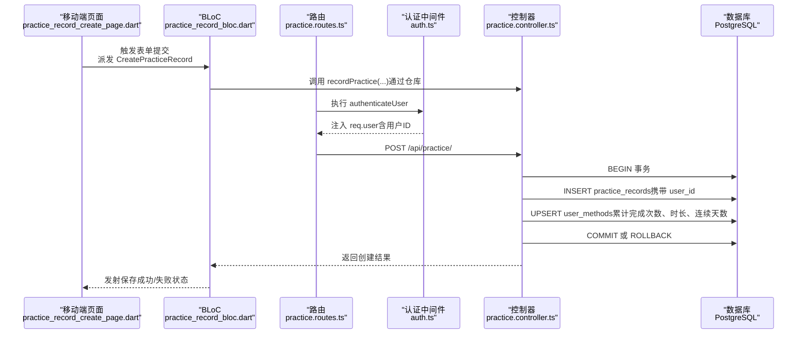
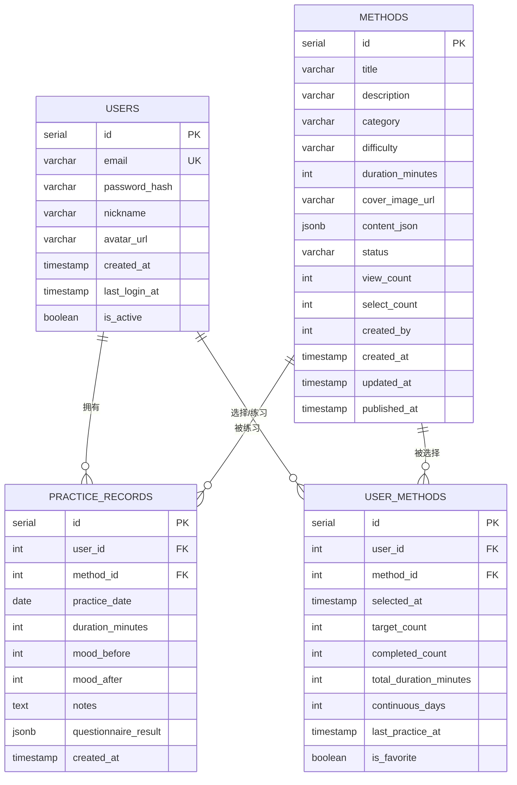
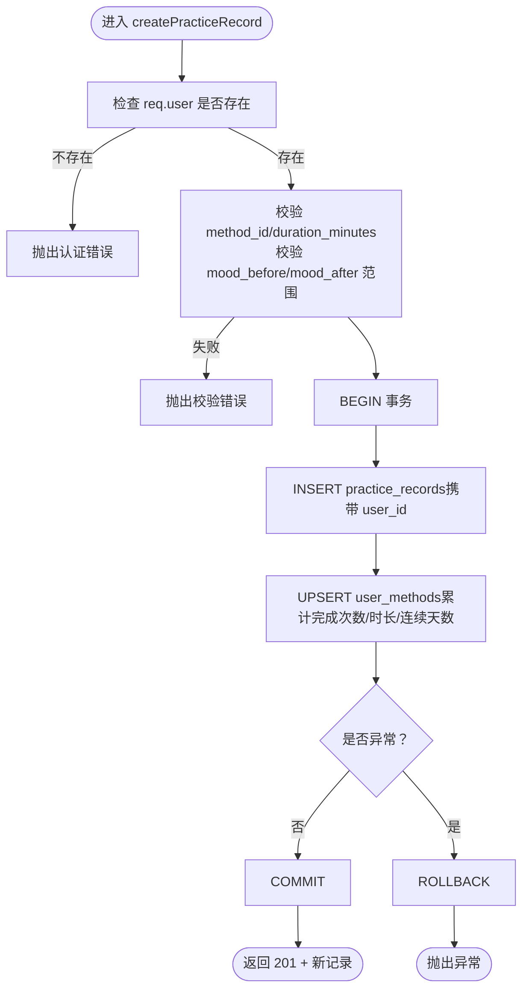
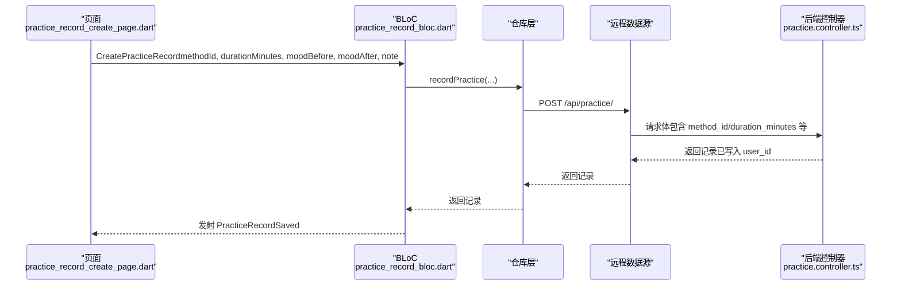
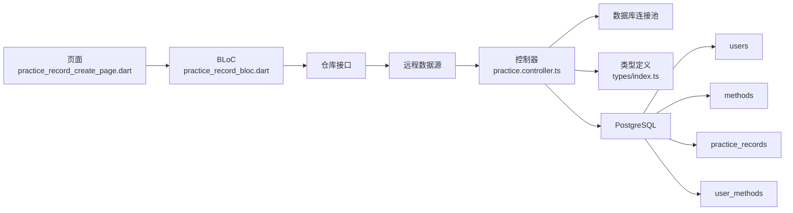

# 用户与练习记录

<cite>
**本文引用的文件**
- [database/init.sql](file://database/init.sql)
- [backend/src/controllers/practice.controller.ts](file://backend/src/controllers/practice.controller.ts)
- [backend/src/routes/practice.routes.ts](file://backend/src/routes/practice.routes.ts)
- [backend/src/middleware/auth.ts](file://backend/src/middleware/auth.ts)
- [backend/src/types/index.ts](file://backend/src/types/index.ts)
- [flutter_app/lib/presentation/practice/pages/practice_record_create_page.dart](file://flutter_app/lib/presentation/practice/pages/practice_record_create_page.dart)
- [flutter_app/lib/presentation/practice/bloc/practice_record_bloc.dart](file://flutter_app/lib/presentation/practice/bloc/practice_record_bloc.dart)
- [flutter_app/lib/presentation/practice/bloc/practice_record_state.dart](file://flutter_app/lib/presentation/practice/bloc/practice_record_state.dart)
- [flutter_app/lib/presentation/practice/bloc/practice_record_event.dart](file://flutter_app/lib/presentation/practice/bloc/practice_record_event.dart)
- [flutter_app/lib/data/models/practice_record_model.dart](file://flutter_app/lib/data/models/practice_record_model.dart)
- [flutter_app/lib/domain/entities/practice_record.dart](file://flutter_app/lib/domain/entities/practice_record.dart)
</cite>

## 目录
1. [引言](#引言)
2. [项目结构](#项目结构)
3. [核心组件](#核心组件)
4. [架构总览](#架构总览)
5. [详细组件分析](#详细组件分析)
6. [依赖分析](#依赖分析)
7. [性能考虑](#性能考虑)
8. [故障排查指南](#故障排查指南)
9. [结论](#结论)
10. [附录](#附录)

## 引言
本文件围绕 nian 项目中“用户与练习记录”的一对多关系展开，系统性说明：
- practice_records 表通过 user_id 外键关联 users 表，确保每个用户可拥有多个练习记录；
- ON DELETE CASCADE 在用户删除时自动清理相关练习数据，避免数据不一致；
- 后端通过 practice.controller.ts 的创建与查询逻辑实现用户维度的数据隔离；
- 移动端通过 BLoC 状态管理流程提交属于当前用户的新练习记录；
- 结合业务场景，给出“用户每日多次练习的心理调节方法记录及其情绪变化追踪”的实践示例。

## 项目结构
本项目采用前后端分离架构：
- 后端使用 Express + PostgreSQL，数据库初始化脚本定义了 users、methods、user_methods、practice_records 等核心表及索引；
- 前端使用 Flutter，采用 BLoC 架构进行状态管理，页面负责收集用户输入并通过仓库层调用后端接口。

图表来源
- [flutter_app/lib/presentation/practice/pages/practice_record_create_page.dart](file://flutter_app/lib/presentation/practice/pages/practice_record_create_page.dart#L1-L382)
- [flutter_app/lib/presentation/practice/bloc/practice_record_bloc.dart](file://flutter_app/lib/presentation/practice/bloc/practice_record_bloc.dart#L1-L37)
- [flutter_app/lib/data/models/practice_record_model.dart](file://flutter_app/lib/data/models/practice_record_model.dart#L1-L93)
- [flutter_app/lib/domain/entities/practice_record.dart](file://flutter_app/lib/domain/entities/practice_record.dart#L1-L67)
- [backend/src/routes/practice.routes.ts](file://backend/src/routes/practice.routes.ts#L1-L20)
- [backend/src/controllers/practice.controller.ts](file://backend/src/controllers/practice.controller.ts#L1-L261)
- [backend/src/middleware/auth.ts](file://backend/src/middleware/auth.ts#L1-L87)
- [backend/src/types/index.ts](file://backend/src/types/index.ts#L1-L126)
- [database/init.sql](file://database/init.sql#L1-L120)

章节来源
- [database/init.sql](file://database/init.sql#L1-L120)
- [backend/src/routes/practice.routes.ts](file://backend/src/routes/practice.routes.ts#L1-L20)
- [backend/src/controllers/practice.controller.ts](file://backend/src/controllers/practice.controller.ts#L1-L261)
- [backend/src/middleware/auth.ts](file://backend/src/middleware/auth.ts#L1-L87)
- [flutter_app/lib/presentation/practice/pages/practice_record_create_page.dart](file://flutter_app/lib/presentation/practice/pages/practice_record_create_page.dart#L1-L382)

## 核心组件
- 数据库层
  - users：存储用户基本信息，主键 id；
  - practice_records：存储练习记录，包含 user_id 外键指向 users.id，method_id 外键指向 methods.id，并带有 ON DELETE CASCADE；
  - user_methods：记录用户与方法的关联及练习统计，包含 user_id、method_id、completed_count、total_duration_minutes、continuous_days 等字段；
  - methods：心理自助方法元数据。
- 后端层
  - practice.routes.ts：所有练习相关路由均经过 authenticateUser 中间件，确保仅认证用户可访问；
  - practice.controller.ts：实现创建练习记录、查询练习历史、统计分析等逻辑；创建时使用事务，同时更新 user_methods；
  - auth.ts：基于 JWT 的用户认证中间件，向请求注入 req.user；
  - types/index.ts：定义 PracticeRecord、User、UserMethod 等类型。
- 前端层
  - practice_record_create_page.dart：构建表单，收集方法、时长、前后情绪评分、备注等，派发 CreatePracticeRecord 事件；
  - practice_record_bloc.dart：监听事件，调用仓库层发起网络请求，发射保存中/保存成功/保存失败状态；
  - practice_record_state.dart、practice_record_event.dart：定义 BLoC 的状态与事件；
  - practice_record_model.dart、practice_record.dart：数据模型与领域实体，映射后端返回的练习记录字段。

章节来源
- [database/init.sql](file://database/init.sql#L62-L79)
- [backend/src/routes/practice.routes.ts](file://backend/src/routes/practice.routes.ts#L1-L20)
- [backend/src/controllers/practice.controller.ts](file://backend/src/controllers/practice.controller.ts#L1-L261)
- [backend/src/middleware/auth.ts](file://backend/src/middleware/auth.ts#L1-L87)
- [backend/src/types/index.ts](file://backend/src/types/index.ts#L1-L126)
- [flutter_app/lib/presentation/practice/pages/practice_record_create_page.dart](file://flutter_app/lib/presentation/practice/pages/practice_record_create_page.dart#L1-L382)
- [flutter_app/lib/presentation/practice/bloc/practice_record_bloc.dart](file://flutter_app/lib/presentation/practice/bloc/practice_record_bloc.dart#L1-L37)
- [flutter_app/lib/presentation/practice/bloc/practice_record_state.dart](file://flutter_app/lib/presentation/practice/bloc/practice_record_state.dart#L1-L41)
- [flutter_app/lib/presentation/practice/bloc/practice_record_event.dart](file://flutter_app/lib/presentation/practice/bloc/practice_record_event.dart#L1-L39)
- [flutter_app/lib/data/models/practice_record_model.dart](file://flutter_app/lib/data/models/practice_record_model.dart#L1-L93)
- [flutter_app/lib/domain/entities/practice_record.dart](file://flutter_app/lib/domain/entities/practice_record.dart#L1-L67)

## 架构总览
下面的序列图展示了“移动端提交练习记录”到“后端创建并更新统计”的完整流程，体现用户维度的数据隔离与一致性保障。

图表来源
- [flutter_app/lib/presentation/practice/pages/practice_record_create_page.dart](file://flutter_app/lib/presentation/practice/pages/practice_record_create_page.dart#L333-L382)
- [flutter_app/lib/presentation/practice/bloc/practice_record_bloc.dart](file://flutter_app/lib/presentation/practice/bloc/practice_record_bloc.dart#L16-L35)
- [backend/src/routes/practice.routes.ts](file://backend/src/routes/practice.routes.ts#L1-L20)
- [backend/src/middleware/auth.ts](file://backend/src/middleware/auth.ts#L1-L87)
- [backend/src/controllers/practice.controller.ts](file://backend/src/controllers/practice.controller.ts#L1-L120)

## 详细组件分析

### 数据库层：用户与练习记录的一对多关系
- users 表与 practice_records 表通过 user_id 外键建立一对多关系：一个用户可有多条练习记录；
- 外键定义包含 ON DELETE CASCADE，确保当用户被删除时，其所有练习记录会被自动清理，避免悬挂数据；
- practice_records 表还包含 method_id 外键，用于关联具体练习方法；
- 为提升查询效率，建立了复合索引 idx_practice_records_user_id_date、idx_practice_records_user_id_method_id、idx_practice_records_created_at。

图表来源
- [database/init.sql](file://database/init.sql#L5-L14)
- [database/init.sql](file://database/init.sql#L20-L36)
- [database/init.sql](file://database/init.sql#L44-L56)
- [database/init.sql](file://database/init.sql#L62-L79)

章节来源
- [database/init.sql](file://database/init.sql#L5-L14)
- [database/init.sql](file://database/init.sql#L62-L79)

### 后端：用户维度的数据隔离与事务一致性
- 路由保护：所有练习相关路由均通过 authenticateUser 中间件，未认证用户无法访问；
- 控制器创建流程：
  - 校验必填参数（method_id、duration_minutes），并对 mood_before/mood_after 进行范围校验；
  - 使用数据库连接池开启事务，插入 practice_records；
  - 同步更新 user_methods（累计完成次数、总时长、最近练习时间、连续天数）；
  - 成功提交事务，失败回滚；
- 查询历史与统计：
  - getPracticeHistory：按用户维度过滤，支持按方法、日期范围分页查询；
  - getPracticeStatistics：按用户维度统计总体次数、总时长、练习天数、平均情绪改善度、最长连续天数等。

图表来源
- [backend/src/controllers/practice.controller.ts](file://backend/src/controllers/practice.controller.ts#L1-L99)
- [backend/src/middleware/auth.ts](file://backend/src/middleware/auth.ts#L1-L87)
- [backend/src/types/index.ts](file://backend/src/types/index.ts#L51-L63)

章节来源
- [backend/src/routes/practice.routes.ts](file://backend/src/routes/practice.routes.ts#L1-L20)
- [backend/src/controllers/practice.controller.ts](file://backend/src/controllers/practice.controller.ts#L1-L261)
- [backend/src/middleware/auth.ts](file://backend/src/middleware/auth.ts#L1-L87)
- [backend/src/types/index.ts](file://backend/src/types/index.ts#L51-L63)

### 前端：BLoC 状态管理与用户维度隔离
- 页面构建：收集方法、时长、前后情绪评分、备注等，派发 CreatePracticeRecord 事件；
- BLoC 监听：将事件转换为仓库调用，发射保存中/保存成功/保存失败状态；
- 数据模型：PracticeRecordModel 将后端返回的 JSON 映射为领域实体 PracticeRecord，包含 userId、methodId、moodBefore、moodAfter、durationMinutes、practicedAt 等字段；
- 用户维度隔离：由于后端在创建时强制使用 req.user.id 作为 user_id，且查询/统计均按用户过滤，前端无需关心用户 ID，只需确保登录态有效即可。

图表来源
- [flutter_app/lib/presentation/practice/pages/practice_record_create_page.dart](file://flutter_app/lib/presentation/practice/pages/practice_record_create_page.dart#L333-L382)
- [flutter_app/lib/presentation/practice/bloc/practice_record_bloc.dart](file://flutter_app/lib/presentation/practice/bloc/practice_record_bloc.dart#L16-L35)
- [flutter_app/lib/data/models/practice_record_model.dart](file://flutter_app/lib/data/models/practice_record_model.dart#L1-L93)
- [flutter_app/lib/domain/entities/practice_record.dart](file://flutter_app/lib/domain/entities/practice_record.dart#L1-L67)
- [backend/src/controllers/practice.controller.ts](file://backend/src/controllers/practice.controller.ts#L1-L120)

章节来源
- [flutter_app/lib/presentation/practice/pages/practice_record_create_page.dart](file://flutter_app/lib/presentation/practice/pages/practice_record_create_page.dart#L1-L382)
- [flutter_app/lib/presentation/practice/bloc/practice_record_bloc.dart](file://flutter_app/lib/presentation/practice/bloc/practice_record_bloc.dart#L1-L37)
- [flutter_app/lib/presentation/practice/bloc/practice_record_state.dart](file://flutter_app/lib/presentation/practice/bloc/practice_record_state.dart#L1-L41)
- [flutter_app/lib/presentation/practice/bloc/practice_record_event.dart](file://flutter_app/lib/presentation/practice/bloc/practice_record_event.dart#L1-L39)
- [flutter_app/lib/data/models/practice_record_model.dart](file://flutter_app/lib/data/models/practice_record_model.dart#L1-L93)
- [flutter_app/lib/domain/entities/practice_record.dart](file://flutter_app/lib/domain/entities/practice_record.dart#L1-L67)

### 业务场景示例：每日多次练习与情绪追踪
- 场景描述：用户每天多次练习不同的心理调节方法（如深呼吸放松法、正念冥想、渐进式肌肉放松），每次练习记录练习时长、练习前/后的主观情绪评分（1-10），并可添加备注；
- 数据流向：
  - 移动端页面收集用户输入并派发事件；
  - BLoC 调用仓库层，后端控制器创建练习记录并写入 user_id；
  - 后端同步更新 user_methods（累计完成次数、总时长、连续天数）；
  - 用户可在移动端查看练习历史与统计，观察情绪改善趋势与方法分布。
- 数据一致性保障：
  - ON DELETE CASCADE：若用户被删除，其所有练习记录与统计将一并清理；
  - 事务：创建记录与更新统计在单事务内完成，保证原子性；
  - 用户维度过滤：查询与统计均按用户过滤，避免跨用户数据泄露。

章节来源
- [database/init.sql](file://database/init.sql#L62-L79)
- [backend/src/controllers/practice.controller.ts](file://backend/src/controllers/practice.controller.ts#L1-L261)
- [flutter_app/lib/presentation/practice/pages/practice_record_create_page.dart](file://flutter_app/lib/presentation/practice/pages/practice_record_create_page.dart#L1-L382)

## 依赖分析
- 前端依赖链
  - 页面依赖 BLoC，BLoC 依赖仓库接口，仓库依赖远程数据源；
  - 数据模型依赖领域实体，用于前后端数据映射；
- 后端依赖链
  - 路由依赖认证中间件，控制器依赖数据库连接池与类型定义；
  - 控制器依赖事务与多条 SQL 操作，确保数据一致性；
- 数据库依赖链
  - practice_records 外键依赖 users 与 methods；
  - user_methods 依赖 users 与 methods；
  - 索引覆盖用户维度查询与统计。

图表来源
- [flutter_app/lib/presentation/practice/pages/practice_record_create_page.dart](file://flutter_app/lib/presentation/practice/pages/practice_record_create_page.dart#L1-L382)
- [flutter_app/lib/presentation/practice/bloc/practice_record_bloc.dart](file://flutter_app/lib/presentation/practice/bloc/practice_record_bloc.dart#L1-L37)
- [backend/src/controllers/practice.controller.ts](file://backend/src/controllers/practice.controller.ts#L1-L261)
- [backend/src/types/index.ts](file://backend/src/types/index.ts#L1-L126)
- [database/init.sql](file://database/init.sql#L62-L79)

章节来源
- [backend/src/routes/practice.routes.ts](file://backend/src/routes/practice.routes.ts#L1-L20)
- [backend/src/middleware/auth.ts](file://backend/src/middleware/auth.ts#L1-L87)
- [backend/src/controllers/practice.controller.ts](file://backend/src/controllers/practice.controller.ts#L1-L261)
- [database/init.sql](file://database/init.sql#L62-L79)

## 性能考虑
- 索引优化
  - practice_records 上的复合索引 idx_practice_records_user_id_date、idx_practice_records_user_id_method_id、idx_practice_records_created_at，有助于按用户与方法维度快速检索与统计；
- 事务与批量更新
  - 创建练习记录与更新 user_methods 放在同一事务中，减少锁竞争与数据不一致风险；
- 分页与排序
  - 历史查询按 practice_date 与 created_at 降序排序，配合分页参数，避免一次性返回大量数据；
- 建议
  - 对高频查询（如按用户统计）可考虑物化视图或缓存策略；
  - 对大规模数据可按月/日分区表进一步优化。

章节来源
- [database/init.sql](file://database/init.sql#L72-L79)
- [backend/src/controllers/practice.controller.ts](file://backend/src/controllers/practice.controller.ts#L101-L172)

## 故障排查指南
- 认证失败
  - 现象：返回 401；
  - 排查：确认请求头 Authorization 是否为 Bearer Token，Token 是否过期或无效；
- 参数校验失败
  - 现象：返回 400，提示 method_id/duration_minutes 或情绪评分范围非法；
  - 排查：确保 method_id 存在，duration_minutes 为正数，mood_before/mood_after 在 1-10 范围内；
- 事务回滚
  - 现象：创建失败但无记录；
  - 排查：检查数据库连接、外键约束、user_methods 冲突处理逻辑；
- 数据不一致
  - 现象：练习记录存在但统计缺失；
  - 排查：确认事务是否正常提交，user_methods 是否正确更新；
- 删除用户后残留数据
  - 现象：用户被删但仍有练习记录；
  - 排查：确认 ON DELETE CASCADE 是否生效，数据库版本与迁移脚本是否正确执行。

章节来源
- [backend/src/middleware/auth.ts](file://backend/src/middleware/auth.ts#L1-L87)
- [backend/src/controllers/practice.controller.ts](file://backend/src/controllers/practice.controller.ts#L1-L120)
- [database/init.sql](file://database/init.sql#L62-L79)

## 结论
nian 项目通过数据库外键与 ON DELETE CASCADE 实现了用户与练习记录的一对多关系，并在后端控制器中以事务方式确保创建与统计更新的一致性。前端通过 BLoC 在用户维度上安全地提交与展示数据，配合路由认证中间件与严格的参数校验，形成了完整的用户维度数据隔离与安全保障。该设计既满足了业务需求（每日多次练习与情绪追踪），又兼顾了性能与可维护性。

## 附录
- 关键字段与含义
  - practice_records.user_id：所属用户；
  - practice_records.method_id：练习方法；
  - practice_records.practice_date：练习日期；
  - practice_records.duration_minutes：练习时长；
  - practice_records.mood_before/mood_after：练习前后主观情绪评分；
  - user_methods.completed_count/total_duration_minutes/continuous_days：练习统计指标。
- 相关文件路径
  - 数据库初始化：database/init.sql
  - 练习路由：backend/src/routes/practice.routes.ts
  - 练习控制器：backend/src/controllers/practice.controller.ts
  - 认证中间件：backend/src/middleware/auth.ts
  - 类型定义：backend/src/types/index.ts
  - 练习记录页面：flutter_app/lib/presentation/practice/pages/practice_record_create_page.dart
  - 练习记录 BLoC：flutter_app/lib/presentation/practice/bloc/practice_record_bloc.dart
  - 练习记录状态/事件：flutter_app/lib/presentation/practice/bloc/practice_record_state.dart、flutter_app/lib/presentation/practice/bloc/practice_record_event.dart
  - 练习记录模型/实体：flutter_app/lib/data/models/practice_record_model.dart、flutter_app/lib/domain/entities/practice_record.dart