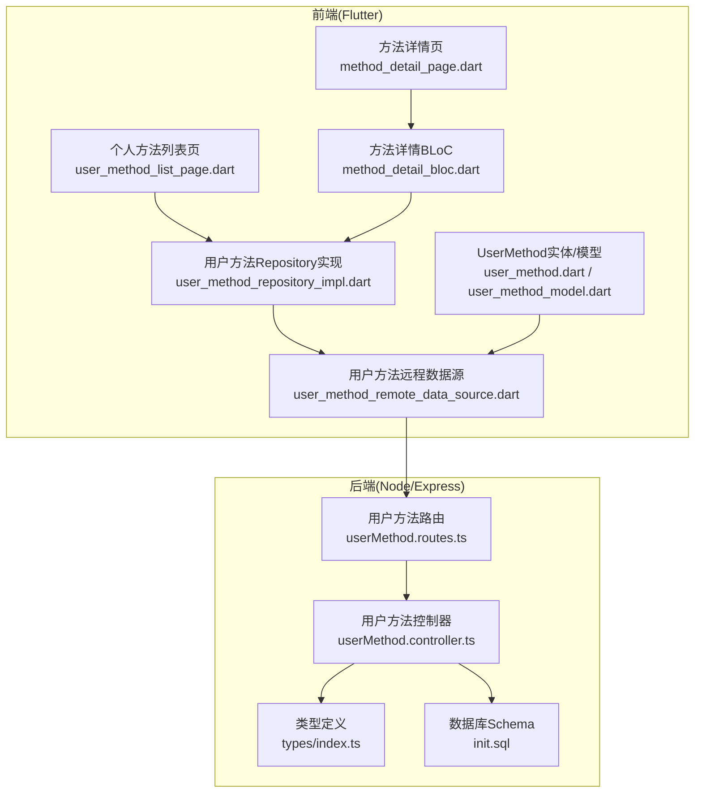
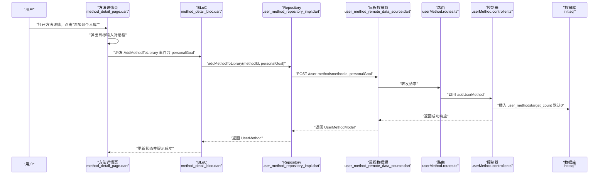
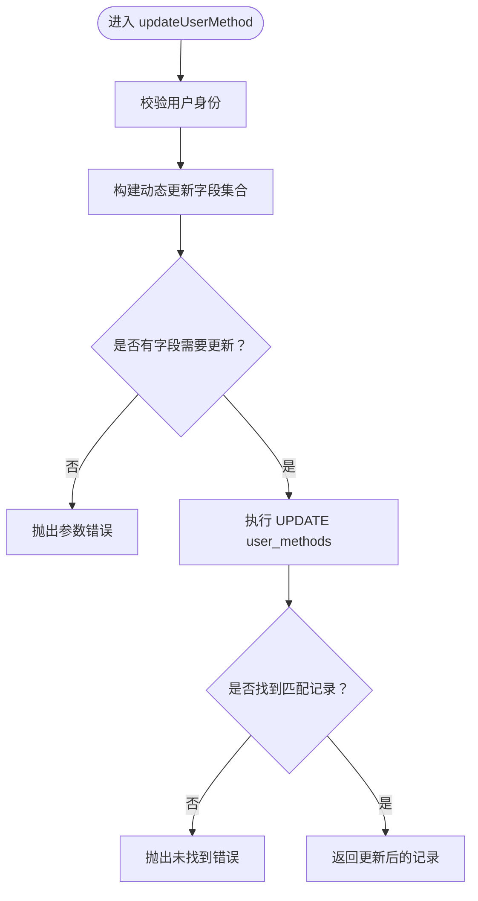
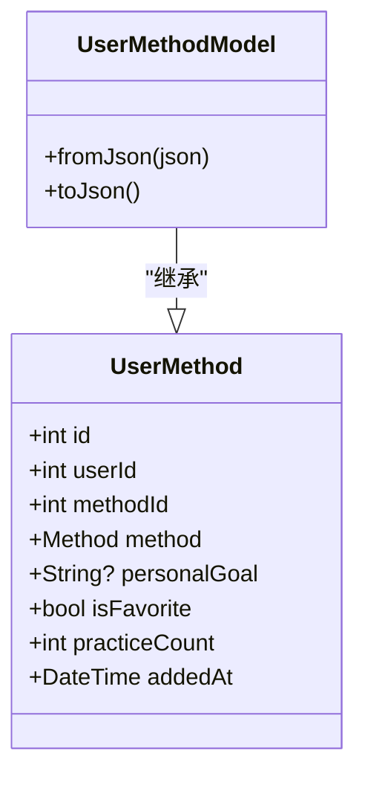
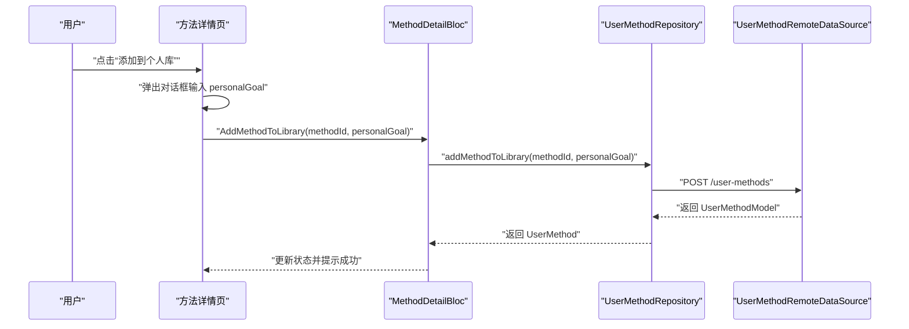
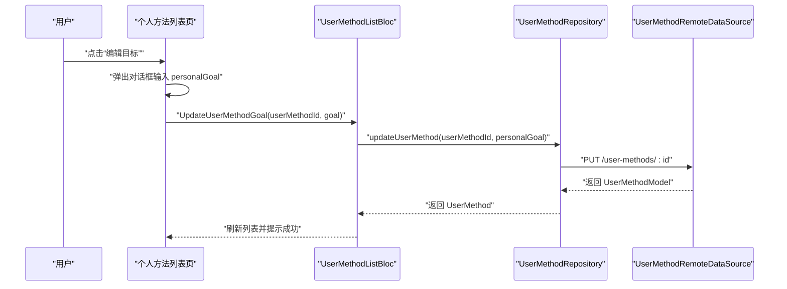
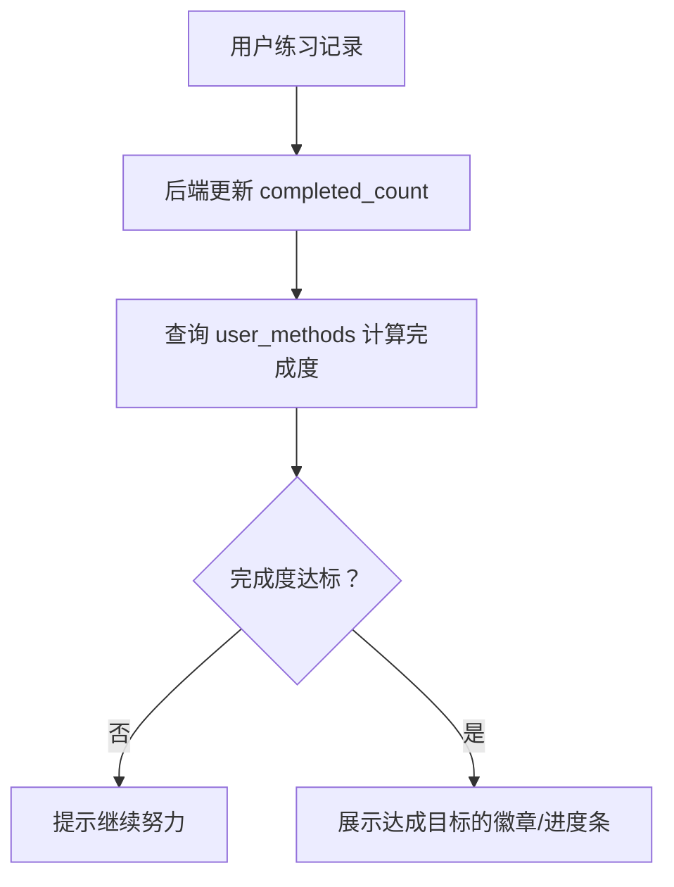
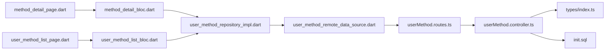

# 个人目标管理机制

<cite>
**本文引用的文件**
- [backend/src/controllers/userMethod.controller.ts](file://backend/src/controllers/userMethod.controller.ts)
- [backend/src/routes/userMethod.routes.ts](file://backend/src/routes/userMethod.routes.ts)
- [backend/src/types/index.ts](file://backend/src/types/index.ts)
- [database/init.sql](file://database/init.sql)
- [flutter_app/lib/data/models/user_method_model.dart](file://flutter_app/lib/data/models/user_method_model.dart)
- [flutter_app/lib/domain/entities/user_method.dart](file://flutter_app/lib/domain/entities/user_method.dart)
- [flutter_app/lib/data/datasources/remote/user_method_remote_data_source.dart](file://flutter_app/lib/data/datasources/remote/user_method_remote_data_source.dart)
- [flutter_app/lib/data/repositories/user_method_repository_impl.dart](file://flutter_app/lib/data/repositories/user_method_repository_impl.dart)
- [flutter_app/lib/presentation/methods/pages/method_detail_page.dart](file://flutter_app/lib/presentation/methods/pages/method_detail_page.dart)
- [flutter_app/lib/presentation/methods/bloc/method_detail_bloc.dart](file://flutter_app/lib/presentation/methods/bloc/method_detail_bloc.dart)
- [flutter_app/lib/presentation/user_methods/pages/user_method_list_page.dart](file://flutter_app/lib/presentation/user_methods/pages/user_method_list_page.dart)
</cite>

## 目录
1. [引言](#引言)
2. [项目结构](#项目结构)
3. [核心组件](#核心组件)
4. [架构总览](#架构总览)
5. [详细组件分析](#详细组件分析)
6. [依赖关系分析](#依赖关系分析)
7. [性能与扩展性考虑](#性能与扩展性考虑)
8. [故障排查指南](#故障排查指南)
9. [结论](#结论)

## 引言
本文件围绕“个人目标管理机制”展开，重点说明用户如何为心理调节方法设定个人练习目标（personalGoal 字段），以及该目标在 Flutter UI 中的呈现与交互流程；同时结合后端 userMethod 控制器的更新逻辑，解释目标值如何通过 API 持久化存储至数据库，并说明目标完成度（completed_count / target_count）的计算方式及其在激励用户持续练习中的作用。文档还提供完整的数据流示例路径，帮助开发者快速定位实现位置。

## 项目结构
- 后端采用 Express + PostgreSQL，用户方法与练习记录通过 user_methods 和 practice_records 表进行管理。
- 前端 Flutter 应用通过 BLoC 状态管理，配合 Repository/DataSource 层调用后端 API，实现目标设置与展示。
- 数据模型在前端以 UserMethod 实体与 UserMethodModel 映射，后端类型定义包含 target_count、completed_count 等字段。

图表来源
- [flutter_app/lib/presentation/methods/pages/method_detail_page.dart](file://flutter_app/lib/presentation/methods/pages/method_detail_page.dart#L1-L380)
- [flutter_app/lib/presentation/methods/bloc/method_detail_bloc.dart](file://flutter_app/lib/presentation/methods/bloc/method_detail_bloc.dart#L1-L141)
- [flutter_app/lib/data/repositories/user_method_repository_impl.dart](file://flutter_app/lib/data/repositories/user_method_repository_impl.dart#L1-L84)
- [flutter_app/lib/data/datasources/remote/user_method_remote_data_source.dart](file://flutter_app/lib/data/datasources/remote/user_method_remote_data_source.dart#L1-L86)
- [backend/src/routes/userMethod.routes.ts](file://backend/src/routes/userMethod.routes.ts#L1-L23)
- [backend/src/controllers/userMethod.controller.ts](file://backend/src/controllers/userMethod.controller.ts#L1-L162)
- [backend/src/types/index.ts](file://backend/src/types/index.ts#L37-L49)
- [database/init.sql](file://database/init.sql#L43-L61)

章节来源
- [backend/src/routes/userMethod.routes.ts](file://backend/src/routes/userMethod.routes.ts#L1-L23)
- [backend/src/controllers/userMethod.controller.ts](file://backend/src/controllers/userMethod.controller.ts#L1-L162)
- [backend/src/types/index.ts](file://backend/src/types/index.ts#L37-L49)
- [database/init.sql](file://database/init.sql#L43-L61)
- [flutter_app/lib/presentation/methods/pages/method_detail_page.dart](file://flutter_app/lib/presentation/methods/pages/method_detail_page.dart#L1-L380)
- [flutter_app/lib/presentation/methods/bloc/method_detail_bloc.dart](file://flutter_app/lib/presentation/methods/bloc/method_detail_bloc.dart#L1-L141)
- [flutter_app/lib/data/repositories/user_method_repository_impl.dart](file://flutter_app/lib/data/repositories/user_method_repository_impl.dart#L1-L84)
- [flutter_app/lib/data/datasources/remote/user_method_remote_data_source.dart](file://flutter_app/lib/data/datasources/remote/user_method_remote_data_source.dart#L1-L86)
- [flutter_app/lib/domain/entities/user_method.dart](file://flutter_app/lib/domain/entities/user_method.dart#L1-L59)
- [flutter_app/lib/data/models/user_method_model.dart](file://flutter_app/lib/data/models/user_method_model.dart#L1-L89)

## 核心组件
- 后端类型定义：UserMethod 包含 target_count、completed_count 等字段，用于目标与完成度计算。
- 数据库 Schema：user_methods 表包含 target_count、completed_count 等列，支持目标持久化。
- 前端实体与模型：UserMethod 实体包含 personalGoal 字段；UserMethodModel 支持 JSON 序列化/反序列化。
- 前端页面与 BLoC：方法详情页提供“添加到个人库”的目标输入；个人方法列表页提供“编辑目标”的弹窗输入。
- 前端 Repository/DataSource：封装用户方法的增删改查 API 调用，负责参数组装与错误处理。

章节来源
- [backend/src/types/index.ts](file://backend/src/types/index.ts#L37-L49)
- [database/init.sql](file://database/init.sql#L43-L61)
- [flutter_app/lib/domain/entities/user_method.dart](file://flutter_app/lib/domain/entities/user_method.dart#L1-L59)
- [flutter_app/lib/data/models/user_method_model.dart](file://flutter_app/lib/data/models/user_method_model.dart#L1-L89)
- [flutter_app/lib/presentation/methods/pages/method_detail_page.dart](file://flutter_app/lib/presentation/methods/pages/method_detail_page.dart#L331-L378)
- [flutter_app/lib/presentation/user_methods/pages/user_method_list_page.dart](file://flutter_app/lib/presentation/user_methods/pages/user_method_list_page.dart#L362-L401)
- [flutter_app/lib/data/repositories/user_method_repository_impl.dart](file://flutter_app/lib/data/repositories/user_method_repository_impl.dart#L1-L84)
- [flutter_app/lib/data/datasources/remote/user_method_remote_data_source.dart](file://flutter_app/lib/data/datasources/remote/user_method_remote_data_source.dart#L1-L86)

## 架构总览
以下序列图展示了“设置个人目标”的完整数据流，从前端 UI 到后端 API 再到数据库持久化。

图表来源
- [flutter_app/lib/presentation/methods/pages/method_detail_page.dart](file://flutter_app/lib/presentation/methods/pages/method_detail_page.dart#L331-L378)
- [flutter_app/lib/presentation/methods/bloc/method_detail_bloc.dart](file://flutter_app/lib/presentation/methods/bloc/method_detail_bloc.dart#L37-L69)
- [flutter_app/lib/data/repositories/user_method_repository_impl.dart](file://flutter_app/lib/data/repositories/user_method_repository_impl.dart#L28-L46)
- [flutter_app/lib/data/datasources/remote/user_method_remote_data_source.dart](file://flutter_app/lib/data/datasources/remote/user_method_remote_data_source.dart#L23-L40)
- [backend/src/routes/userMethod.routes.ts](file://backend/src/routes/userMethod.routes.ts#L10-L12)
- [backend/src/controllers/userMethod.controller.ts](file://backend/src/controllers/userMethod.controller.ts#L6-L20)
- [database/init.sql](file://database/init.sql#L43-L61)

## 详细组件分析

### 后端：用户方法控制器与目标持久化
- 新增个人方法时，后端会检查方法存在性与重复添加，并将 target_count 默认写入 0；同时更新方法选择计数。
- 更新个人方法时，后端支持按需更新 target_count、is_favorite 等字段，确保只更新传入的字段。
- 类型定义中明确包含 target_count、completed_count 等字段，为后续完成度计算提供基础。

图表来源
- [backend/src/controllers/userMethod.controller.ts](file://backend/src/controllers/userMethod.controller.ts#L82-L131)
- [backend/src/types/index.ts](file://backend/src/types/index.ts#L37-L49)

章节来源
- [backend/src/controllers/userMethod.controller.ts](file://backend/src/controllers/userMethod.controller.ts#L6-L20)
- [backend/src/controllers/userMethod.controller.ts](file://backend/src/controllers/userMethod.controller.ts#L82-L131)
- [backend/src/types/index.ts](file://backend/src/types/index.ts#L37-L49)

### 前端：UserMethod 实体与模型
- UserMethod 实体包含 personalGoal 字段，用于 UI 层展示用户的个人目标文本。
- UserMethodModel 支持从 JSON 反序列化与序列化，便于与后端 API 的数据交换。

图表来源
- [flutter_app/lib/domain/entities/user_method.dart](file://flutter_app/lib/domain/entities/user_method.dart#L1-L59)
- [flutter_app/lib/data/models/user_method_model.dart](file://flutter_app/lib/data/models/user_method_model.dart#L1-L89)

章节来源
- [flutter_app/lib/domain/entities/user_method.dart](file://flutter_app/lib/domain/entities/user_method.dart#L1-L59)
- [flutter_app/lib/data/models/user_method_model.dart](file://flutter_app/lib/data/models/user_method_model.dart#L1-L89)

### 前端：方法详情页的目标设置
- 方法详情页提供“添加到个人库”对话框，允许用户输入 personalGoal 文本。
- BLoC 在收到 AddMethodToLibrary 事件后，调用 Repository 发起 API 请求，成功后回到详情页状态并提示成功。

图表来源
- [flutter_app/lib/presentation/methods/pages/method_detail_page.dart](file://flutter_app/lib/presentation/methods/pages/method_detail_page.dart#L331-L378)
- [flutter_app/lib/presentation/methods/bloc/method_detail_bloc.dart](file://flutter_app/lib/presentation/methods/bloc/method_detail_bloc.dart#L37-L69)
- [flutter_app/lib/data/repositories/user_method_repository_impl.dart](file://flutter_app/lib/data/repositories/user_method_repository_impl.dart#L28-L46)
- [flutter_app/lib/data/datasources/remote/user_method_remote_data_source.dart](file://flutter_app/lib/data/datasources/remote/user_method_remote_data_source.dart#L23-L40)

章节来源
- [flutter_app/lib/presentation/methods/pages/method_detail_page.dart](file://flutter_app/lib/presentation/methods/pages/method_detail_page.dart#L331-L378)
- [flutter_app/lib/presentation/methods/bloc/method_detail_bloc.dart](file://flutter_app/lib/presentation/methods/bloc/method_detail_bloc.dart#L37-L69)
- [flutter_app/lib/data/repositories/user_method_repository_impl.dart](file://flutter_app/lib/data/repositories/user_method_repository_impl.dart#L28-L46)
- [flutter_app/lib/data/datasources/remote/user_method_remote_data_source.dart](file://flutter_app/lib/data/datasources/remote/user_method_remote_data_source.dart#L23-L40)

### 前端：个人方法列表页的目标编辑
- 个人方法列表页提供“编辑目标”按钮，弹窗中允许用户修改 personalGoal。
- 修改后通过 BLoC 的 UpdateUserMethodGoal 事件调用 Repository 的 updateUserMethod 接口，实现目标更新。

图表来源
- [flutter_app/lib/presentation/user_methods/pages/user_method_list_page.dart](file://flutter_app/lib/presentation/user_methods/pages/user_method_list_page.dart#L362-L401)
- [flutter_app/lib/data/repositories/user_method_repository_impl.dart](file://flutter_app/lib/data/repositories/user_method_repository_impl.dart#L48-L68)
- [flutter_app/lib/data/datasources/remote/user_method_remote_data_source.dart](file://flutter_app/lib/data/datasources/remote/user_method_remote_data_source.dart#L42-L60)

章节来源
- [flutter_app/lib/presentation/user_methods/pages/user_method_list_page.dart](file://flutter_app/lib/presentation/user_methods/pages/user_method_list_page.dart#L362-L401)
- [flutter_app/lib/data/repositories/user_method_repository_impl.dart](file://flutter_app/lib/data/repositories/user_method_repository_impl.dart#L48-L68)
- [flutter_app/lib/data/datasources/remote/user_method_remote_data_source.dart](file://flutter_app/lib/data/datasources/remote/user_method_remote_data_source.dart#L42-L60)

### 目标完成度计算与激励机制
- 后端类型定义包含 target_count、completed_count 字段，为完成度计算提供数据基础。
- 前端 UserMethod 实体包含 practiceCount 字段，用于 UI 展示练习次数。
- 完成度通常以 completed_count / target_count 计算；当 completed_count 达到或超过 target_count 时，可作为达成目标的视觉反馈，用于激励用户持续练习。

图表来源
- [backend/src/types/index.ts](file://backend/src/types/index.ts#L37-L49)
- [flutter_app/lib/domain/entities/user_method.dart](file://flutter_app/lib/domain/entities/user_method.dart#L1-L59)
- [database/init.sql](file://database/init.sql#L43-L61)

章节来源
- [backend/src/types/index.ts](file://backend/src/types/index.ts#L37-L49)
- [flutter_app/lib/domain/entities/user_method.dart](file://flutter_app/lib/domain/entities/user_method.dart#L1-L59)
- [database/init.sql](file://database/init.sql#L43-L61)

## 依赖关系分析
- 前端依赖链：页面 -> BLoC -> Repository -> DataSource -> API -> 后端路由 -> 控制器 -> 数据库。
- 后端依赖链：路由 -> 控制器 -> 类型定义 -> 数据库 Schema。
- 数据一致性：前端 personalGoal 字段与后端 target_count 字段语义不同，前者用于 UI 展示与用户输入，后者用于完成度计算与统计。

图表来源
- [flutter_app/lib/presentation/methods/pages/method_detail_page.dart](file://flutter_app/lib/presentation/methods/pages/method_detail_page.dart#L1-L380)
- [flutter_app/lib/presentation/user_methods/pages/user_method_list_page.dart](file://flutter_app/lib/presentation/user_methods/pages/user_method_list_page.dart#L1-L432)
- [flutter_app/lib/presentation/methods/bloc/method_detail_bloc.dart](file://flutter_app/lib/presentation/methods/bloc/method_detail_bloc.dart#L1-L141)
- [flutter_app/lib/data/repositories/user_method_repository_impl.dart](file://flutter_app/lib/data/repositories/user_method_repository_impl.dart#L1-L84)
- [flutter_app/lib/data/datasources/remote/user_method_remote_data_source.dart](file://flutter_app/lib/data/datasources/remote/user_method_remote_data_source.dart#L1-L86)
- [backend/src/routes/userMethod.routes.ts](file://backend/src/routes/userMethod.routes.ts#L1-L23)
- [backend/src/controllers/userMethod.controller.ts](file://backend/src/controllers/userMethod.controller.ts#L1-L162)
- [backend/src/types/index.ts](file://backend/src/types/index.ts#L37-L49)
- [database/init.sql](file://database/init.sql#L43-L61)

章节来源
- [flutter_app/lib/presentation/methods/pages/method_detail_page.dart](file://flutter_app/lib/presentation/methods/pages/method_detail_page.dart#L1-L380)
- [flutter_app/lib/presentation/user_methods/pages/user_method_list_page.dart](file://flutter_app/lib/presentation/user_methods/pages/user_method_list_page.dart#L1-L432)
- [flutter_app/lib/presentation/methods/bloc/method_detail_bloc.dart](file://flutter_app/lib/presentation/methods/bloc/method_detail_bloc.dart#L1-L141)
- [flutter_app/lib/data/repositories/user_method_repository_impl.dart](file://flutter_app/lib/data/repositories/user_method_repository_impl.dart#L1-L84)
- [flutter_app/lib/data/datasources/remote/user_method_remote_data_source.dart](file://flutter_app/lib/data/datasources/remote/user_method_remote_data_source.dart#L1-L86)
- [backend/src/routes/userMethod.routes.ts](file://backend/src/routes/userMethod.routes.ts#L1-L23)
- [backend/src/controllers/userMethod.controller.ts](file://backend/src/controllers/userMethod.controller.ts#L1-L162)
- [backend/src/types/index.ts](file://backend/src/types/index.ts#L37-L49)
- [database/init.sql](file://database/init.sql#L43-L61)

## 性能与扩展性考虑
- 前端：对话框输入建议限制 personalGoal 长度与字符集，避免过长文本影响渲染与存储。
- 后端：更新操作使用动态 SQL 拼接字段，注意参数绑定与 SQL 注入防护；批量更新时可考虑事务保证一致性。
- 数据库：user_methods 表已建立索引，建议根据查询模式进一步优化（如按 user_id、method_id 的复合索引）。
- 监控与日志：建议在控制器层增加请求耗时与错误率监控，便于定位性能瓶颈。

## 故障排查指南
- 添加到个人库失败：检查用户认证状态、method_id 是否存在、是否重复添加。
- 更新目标失败：确认 userMethodId 是否正确、是否传入了 personalGoal 或 isFavorite 等有效字段。
- UI 不显示目标：确认后端返回的数据包含 personalGoal 字段，且前端 UserMethodModel.fromJson 正确解析。
- 完成度异常：核对 completed_count 与 target_count 的来源与更新逻辑，确保练习记录与目标设置一致。

章节来源
- [backend/src/controllers/userMethod.controller.ts](file://backend/src/controllers/userMethod.controller.ts#L6-L20)
- [backend/src/controllers/userMethod.controller.ts](file://backend/src/controllers/userMethod.controller.ts#L82-L131)
- [flutter_app/lib/data/datasources/remote/user_method_remote_data_source.dart](file://flutter_app/lib/data/datasources/remote/user_method_remote_data_source.dart#L71-L86)
- [flutter_app/lib/presentation/methods/pages/method_detail_page.dart](file://flutter_app/lib/presentation/methods/pages/method_detail_page.dart#L331-L378)
- [flutter_app/lib/presentation/user_methods/pages/user_method_list_page.dart](file://flutter_app/lib/presentation/user_methods/pages/user_method_list_page.dart#L362-L401)

## 结论
- 用户可通过方法详情页与个人方法列表页设置与编辑 personalGoal，实现个性化目标管理。
- 后端通过 userMethod 控制器将目标持久化至 user_methods 表，支持按需更新字段。
- 完成度计算基于 completed_count 与 target_count，可用于激励用户持续练习。
- 建议在 UI 层补充完成度可视化与提醒功能，提升用户体验与坚持度。