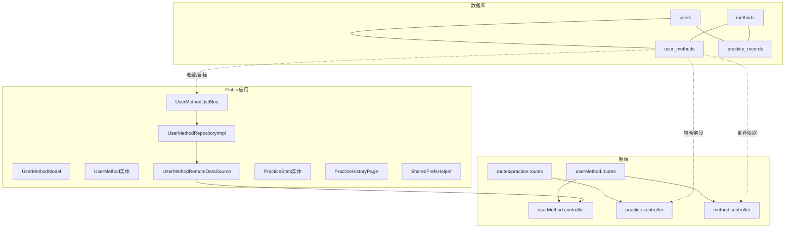
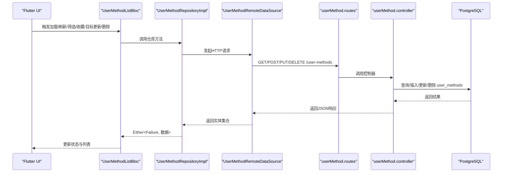
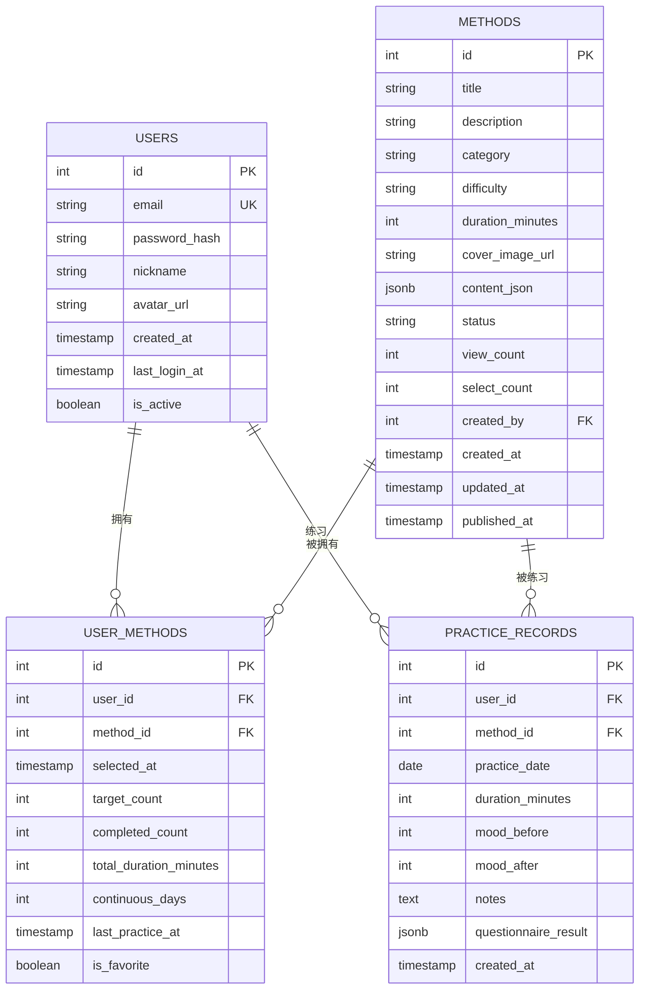
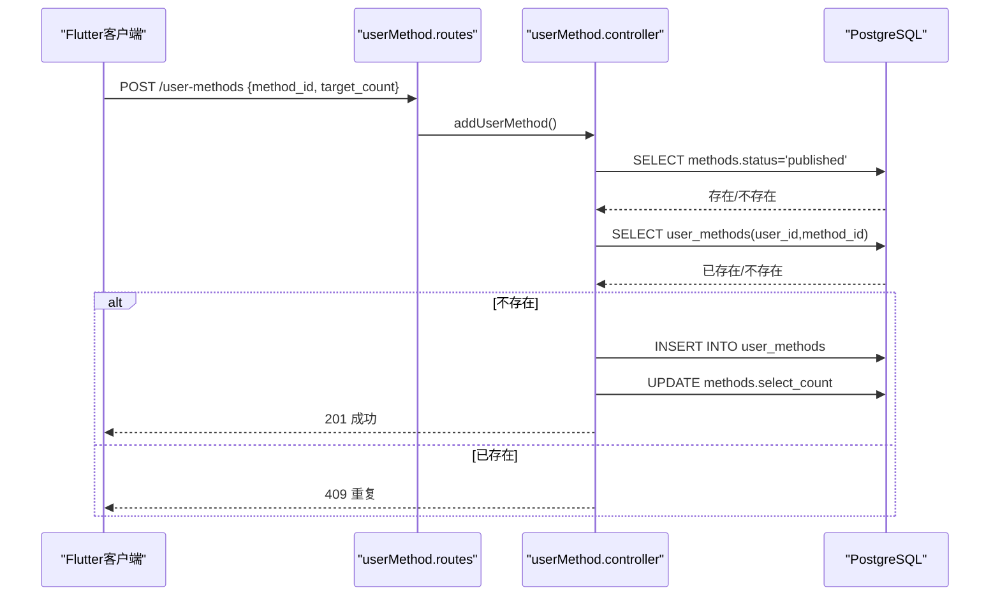
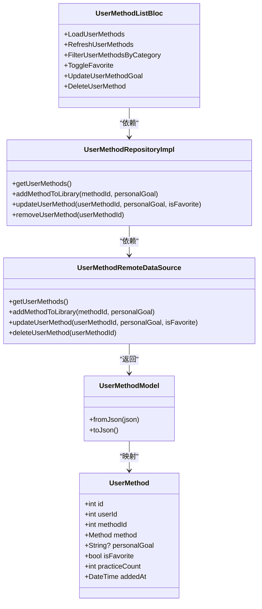
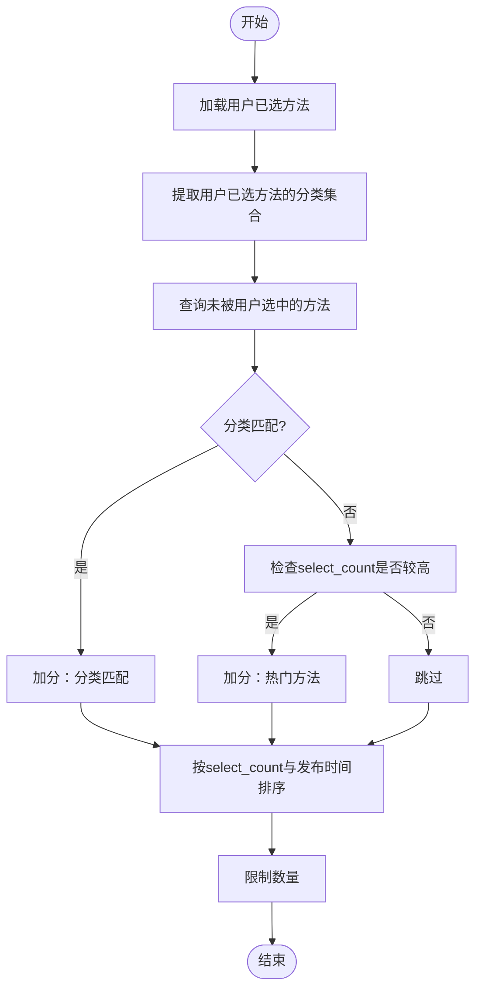

# 多对多关系

<cite>
**本文引用的文件**
- [database/init.sql](file://database/init.sql)
- [backend/src/controllers/userMethod.controller.ts](file://backend/src/controllers/userMethod.controller.ts)
- [backend/src/routes/userMethod.routes.ts](file://backend/src/routes/userMethod.routes.ts)
- [backend/src/types/index.ts](file://backend/src/types/index.ts)
- [backend/src/controllers/method.controller.ts](file://backend/src/controllers/method.controller.ts)
- [backend/src/controllers/practice.controller.ts](file://backend/src/controllers/practice.controller.ts)
- [flutter_app/lib/data/models/user_method_model.dart](file://flutter_app/lib/data/models/user_method_model.dart)
- [flutter_app/lib/domain/entities/user_method.dart](file://flutter_app/lib/domain/entities/user_method.dart)
- [flutter_app/lib/data/datasources/remote/user_method_remote_data_source.dart](file://flutter_app/lib/data/datasources/remote/user_method_remote_data_source.dart)
- [flutter_app/lib/data/repositories/user_method_repository_impl.dart](file://flutter_app/lib/data/repositories/user_method_repository_impl.dart)
- [flutter_app/lib/presentation/user_methods/bloc/user_method_list_bloc.dart](file://flutter_app/lib/presentation/user_methods/bloc/user_method_list_bloc.dart)
- [flutter_app/lib/domain/entities/practice_stats.dart](file://flutter_app/lib/domain/entities/practice_stats.dart)
- [flutter_app/lib/presentation/practice/pages/practice_history_page.dart](file://flutter_app/lib/presentation/practice/pages/practice_history_page.dart)
- [flutter_app/lib/core/storage/shared_prefs_helper.dart](file://flutter_app/lib/core/storage/shared_prefs_helper.dart)
</cite>

## 目录
1. [简介](#简介)
2. [项目结构](#项目结构)
3. [核心组件](#核心组件)
4. [架构总览](#架构总览)
5. [详细组件分析](#详细组件分析)
6. [依赖分析](#依赖分析)
7. [性能考量](#性能考量)
8. [故障排查指南](#故障排查指南)
9. [结论](#结论)
10. [附录](#附录)

## 简介
本文件聚焦于nian项目中通过关联表实现的“用户-心理自助方法”多对多关系，重点围绕user_methods表的设计与使用，解释其如何支撑用户收藏、练习目标设定、连续练习天数统计等核心功能，并说明联合唯一索引如何避免重复关联，以及completed_count、total_duration_minutes等聚合字段如何服务于个性化推荐算法。同时，结合Flutter应用的领域模型与后端API，展示该多对多关系在跨平台数据同步中的实际应用。

## 项目结构
- 数据库层：通过init.sql定义users、methods、user_methods、practice_records等核心表及索引、视图。
- 后端层：提供user_methods的增删改查接口，配合方法推荐与练习统计逻辑。
- Flutter应用层：定义领域实体与数据模型，封装远程数据源与仓库，通过BLoC协调UI交互。

图表来源
- [database/init.sql](file://database/init.sql#L43-L61)
- [backend/src/routes/userMethod.routes.ts](file://backend/src/routes/userMethod.routes.ts#L1-L23)
- [backend/src/controllers/userMethod.controller.ts](file://backend/src/controllers/userMethod.controller.ts#L1-L162)
- [backend/src/controllers/method.controller.ts](file://backend/src/controllers/method.controller.ts#L100-L136)
- [backend/src/controllers/practice.controller.ts](file://backend/src/controllers/practice.controller.ts#L223-L260)
- [flutter_app/lib/data/models/user_method_model.dart](file://flutter_app/lib/data/models/user_method_model.dart#L1-L89)
- [flutter_app/lib/domain/entities/user_method.dart](file://flutter_app/lib/domain/entities/user_method.dart#L1-L59)
- [flutter_app/lib/data/datasources/remote/user_method_remote_data_source.dart](file://flutter_app/lib/data/datasources/remote/user_method_remote_data_source.dart#L1-L86)
- [flutter_app/lib/data/repositories/user_method_repository_impl.dart](file://flutter_app/lib/data/repositories/user_method_repository_impl.dart#L1-L84)
- [flutter_app/lib/presentation/user_methods/bloc/user_method_list_bloc.dart](file://flutter_app/lib/presentation/user_methods/bloc/user_method_list_bloc.dart#L1-L192)
- [flutter_app/lib/domain/entities/practice_stats.dart](file://flutter_app/lib/domain/entities/practice_stats.dart#L1-L46)
- [flutter_app/lib/presentation/practice/pages/practice_history_page.dart](file://flutter_app/lib/presentation/practice/pages/practice_history_page.dart#L280-L324)
- [flutter_app/lib/core/storage/shared_prefs_helper.dart](file://flutter_app/lib/core/storage/shared_prefs_helper.dart#L243-L259)

章节来源
- [database/init.sql](file://database/init.sql#L43-L61)
- [backend/src/routes/userMethod.routes.ts](file://backend/src/routes/userMethod.routes.ts#L1-L23)
- [flutter_app/lib/data/models/user_method_model.dart](file://flutter_app/lib/data/models/user_method_model.dart#L1-L89)

## 核心组件
- user_methods关联表：承载用户与方法的多对多关系，包含selected_at、target_count、completed_count、total_duration_minutes、continuous_days、last_practice_at、is_favorite等字段，用于支持收藏、目标设定、统计与推荐。
- 后端控制器与路由：提供添加、查询、更新、删除用户方法的REST接口；方法推荐接口基于用户已选方法的分类与select_count进行简单排序。
- Flutter领域模型与数据源：UserMethod实体与UserMethodModel映射后端返回的数据；UserMethodRemoteDataSource封装HTTP调用；UserMethodRepositoryImpl统一错误处理；UserMethodListBloc协调UI事件与状态。
- 练习统计与连续天数：后端通过user_methods的continuous_days字段与practice_records统计综合得出最大连续天数；前端页面也提供本地连续天数计算逻辑作为参考。

章节来源
- [database/init.sql](file://database/init.sql#L43-L61)
- [backend/src/controllers/userMethod.controller.ts](file://backend/src/controllers/userMethod.controller.ts#L1-L162)
- [backend/src/controllers/method.controller.ts](file://backend/src/controllers/method.controller.ts#L100-L136)
- [flutter_app/lib/domain/entities/user_method.dart](file://flutter_app/lib/domain/entities/user_method.dart#L1-L59)
- [flutter_app/lib/data/models/user_method_model.dart](file://flutter_app/lib/data/models/user_method_model.dart#L1-L89)
- [flutter_app/lib/data/datasources/remote/user_method_remote_data_source.dart](file://flutter_app/lib/data/datasources/remote/user_method_remote_data_source.dart#L1-L86)
- [flutter_app/lib/data/repositories/user_method_repository_impl.dart](file://flutter_app/lib/data/repositories/user_method_repository_impl.dart#L1-L84)
- [flutter_app/lib/presentation/user_methods/bloc/user_method_list_bloc.dart](file://flutter_app/lib/presentation/user_methods/bloc/user_method_list_bloc.dart#L1-L192)
- [backend/src/controllers/practice.controller.ts](file://backend/src/controllers/practice.controller.ts#L223-L260)
- [flutter_app/lib/presentation/practice/pages/practice_history_page.dart](file://flutter_app/lib/presentation/practice/pages/practice_history_page.dart#L280-L324)

## 架构总览
下图展示了从Flutter应用到后端API再到数据库的完整链路，突出user_methods在多对多关系中的作用。

图表来源
- [backend/src/routes/userMethod.routes.ts](file://backend/src/routes/userMethod.routes.ts#L1-L23)
- [backend/src/controllers/userMethod.controller.ts](file://backend/src/controllers/userMethod.controller.ts#L1-L162)
- [flutter_app/lib/data/datasources/remote/user_method_remote_data_source.dart](file://flutter_app/lib/data/datasources/remote/user_method_remote_data_source.dart#L1-L86)
- [flutter_app/lib/data/repositories/user_method_repository_impl.dart](file://flutter_app/lib/data/repositories/user_method_repository_impl.dart#L1-L84)
- [flutter_app/lib/presentation/user_methods/bloc/user_method_list_bloc.dart](file://flutter_app/lib/presentation/user_methods/bloc/user_method_list_bloc.dart#L1-L192)

## 详细组件分析

### user_methods表设计与约束
- 字段说明
  - user_id、method_id：外键，分别指向users与methods。
  - selected_at：用户添加到个人库的时间。
  - target_count：用户为该方法设定的练习目标（如次数）。
  - completed_count：已完成次数（可由练习记录累计）。
  - total_duration_minutes：该用户在该方法上的累计练习时长（分钟）。
  - continuous_days：连续练习天数（可由练习记录推导或手动维护）。
  - last_practice_at：最近一次练习时间。
  - is_favorite：是否收藏。
  - 联合唯一索引：UNIQUE(user_id, method_id)，确保同一用户不能重复关联同一方法。
- 索引设计
  - idx_user_methods_user_id、idx_user_methods_method_id、idx_user_methods_selected_at：提升按用户、方法、添加时间的查询效率。
- 与视图的关系
  - method_popularity视图通过user_methods统计方法被用户选择的情况，辅助热度与推荐。

图表来源
- [database/init.sql](file://database/init.sql#L5-L14)
- [database/init.sql](file://database/init.sql#L20-L36)
- [database/init.sql](file://database/init.sql#L43-L61)
- [database/init.sql](file://database/init.sql#L63-L79)
- [database/init.sql](file://database/init.sql#L329-L346)

章节来源
- [database/init.sql](file://database/init.sql#L43-L61)
- [database/init.sql](file://database/init.sql#L329-L346)

### 后端API与业务流程
- 添加方法到个人库
  - 控制器校验用户身份与method_id存在性，检查是否已存在关联，若不存在则插入user_methods并增加methods.select_count。
  - 联合唯一索引保证不会重复添加。
- 获取个人方法列表
  - 通过JOIN methods返回用户个人库中的方法详情，并按selected_at倒序。
- 更新个人方法
  - 支持更新target_count、is_favorite等字段，返回最新记录。
- 删除个人方法
  - 删除user_methods记录并回减methods.select_count。
- 方法推荐
  - 基于用户已选方法的分类与select_count进行过滤与排序，限制数量返回推荐列表。
- 练习统计与连续天数
  - 从practice_records统计总次数、总时长、平均情绪改善等；从user_methods取最大连续天数。

图表来源
- [backend/src/routes/userMethod.routes.ts](file://backend/src/routes/userMethod.routes.ts#L1-L23)
- [backend/src/controllers/userMethod.controller.ts](file://backend/src/controllers/userMethod.controller.ts#L1-L56)
- [database/init.sql](file://database/init.sql#L43-L61)

章节来源
- [backend/src/controllers/userMethod.controller.ts](file://backend/src/controllers/userMethod.controller.ts#L1-L162)
- [backend/src/controllers/method.controller.ts](file://backend/src/controllers/method.controller.ts#L100-L136)
- [backend/src/controllers/practice.controller.ts](file://backend/src/controllers/practice.controller.ts#L223-L260)

### Flutter领域模型与数据流
- 领域实体与模型
  - UserMethod实体：包含id、userId、methodId、method、personalGoal、isFavorite、practiceCount、addedAt等属性。
  - UserMethodModel：负责JSON与实体之间的转换，便于网络传输与序列化。
- 远程数据源与仓库
  - UserMethodRemoteDataSource：封装HTTP请求，处理Dio异常并转换为应用侧异常。
  - UserMethodRepositoryImpl：统一错误处理，将网络/服务端异常转换为Failure。
- BLoC状态管理
  - UserMethodListBloc：处理加载、刷新、筛选、收藏切换、目标更新、删除等事件，维护列表状态与当前分类。
- 练习统计与连续天数
  - PracticeStats实体：封装总次数、总时长、平均情绪改善、当前/最长连续天数。
  - PracticeHistoryPage：提供本地连续天数计算逻辑（按日期去重与递减比较），作为参考实现。

图表来源
- [flutter_app/lib/domain/entities/user_method.dart](file://flutter_app/lib/domain/entities/user_method.dart#L1-L59)
- [flutter_app/lib/data/models/user_method_model.dart](file://flutter_app/lib/data/models/user_method_model.dart#L1-L89)
- [flutter_app/lib/data/datasources/remote/user_method_remote_data_source.dart](file://flutter_app/lib/data/datasources/remote/user_method_remote_data_source.dart#L1-L86)
- [flutter_app/lib/data/repositories/user_method_repository_impl.dart](file://flutter_app/lib/data/repositories/user_method_repository_impl.dart#L1-L84)
- [flutter_app/lib/presentation/user_methods/bloc/user_method_list_bloc.dart](file://flutter_app/lib/presentation/user_methods/bloc/user_method_list_bloc.dart#L1-L192)

章节来源
- [flutter_app/lib/domain/entities/user_method.dart](file://flutter_app/lib/domain/entities/user_method.dart#L1-L59)
- [flutter_app/lib/data/models/user_method_model.dart](file://flutter_app/lib/data/models/user_method_model.dart#L1-L89)
- [flutter_app/lib/data/datasources/remote/user_method_remote_data_source.dart](file://flutter_app/lib/data/datasources/remote/user_method_remote_data_source.dart#L1-L86)
- [flutter_app/lib/data/repositories/user_method_repository_impl.dart](file://flutter_app/lib/data/repositories/user_method_repository_impl.dart#L1-L84)
- [flutter_app/lib/presentation/user_methods/bloc/user_method_list_bloc.dart](file://flutter_app/lib/presentation/user_methods/bloc/user_method_list_bloc.dart#L1-L192)
- [flutter_app/lib/domain/entities/practice_stats.dart](file://flutter_app/lib/domain/entities/practice_stats.dart#L1-L46)
- [flutter_app/lib/presentation/practice/pages/practice_history_page.dart](file://flutter_app/lib/presentation/practice/pages/practice_history_page.dart#L280-L324)

### 推荐算法与聚合字段
- 推荐依据
  - 方法推荐接口基于用户已选方法的分类，同时考虑select_count较高的热门方法，避免重复推荐已选方法。
- 聚合字段的作用
  - completed_count、total_duration_minutes：可用于个性化推荐的权重因子（例如偏好高完成度或高时长的方法）。
  - continuous_days：反映用户坚持程度，可作为推荐或激励策略的输入。
- 数据来源
  - user_methods中的聚合字段由练习记录与用户行为累积而来；后端统计接口会直接查询user_methods与practice_records以生成综合指标。

图表来源
- [backend/src/controllers/method.controller.ts](file://backend/src/controllers/method.controller.ts#L100-L136)

章节来源
- [backend/src/controllers/method.controller.ts](file://backend/src/controllers/method.controller.ts#L100-L136)
- [backend/src/controllers/practice.controller.ts](file://backend/src/controllers/practice.controller.ts#L223-L260)
- [database/init.sql](file://database/init.sql#L43-L61)

### 跨平台数据同步实践
- 同步点
  - 用户方法列表、收藏状态、练习目标等均通过user_methods表持久化，前后端一致。
  - 练习记录practise_records与user_methods共同驱动统计与推荐。
- 本地存储
  - SharedPrefsHelper提供last_sync_time等本地同步时间戳，便于后续增量同步或离线策略扩展。
- 建议
  - 在移动端可缓存user_methods快照，结合last_sync_time进行差异同步，减少网络开销与冲突。

章节来源
- [flutter_app/lib/core/storage/shared_prefs_helper.dart](file://flutter_app/lib/core/storage/shared_prefs_helper.dart#L243-L259)
- [database/init.sql](file://database/init.sql#L43-L61)
- [backend/src/controllers/practice.controller.ts](file://backend/src/controllers/practice.controller.ts#L223-L260)

## 依赖分析
- 组件耦合
  - Flutter层通过Repository抽象隔离RemoteDataSource，降低对具体HTTP库的耦合。
  - 后端通过路由与控制器解耦业务逻辑与HTTP协议细节。
- 外部依赖
  - PostgreSQL提供强一致的多对多关系与索引支持；视图辅助统计与推荐。
  - Flutter使用Dio进行网络请求，统一异常处理。
- 潜在循环依赖
  - 未发现直接循环依赖；各层职责清晰，接口边界明确。

图表来源
- [backend/src/routes/userMethod.routes.ts](file://backend/src/routes/userMethod.routes.ts#L1-L23)
- [backend/src/controllers/userMethod.controller.ts](file://backend/src/controllers/userMethod.controller.ts#L1-L162)
- [flutter_app/lib/data/datasources/remote/user_method_remote_data_source.dart](file://flutter_app/lib/data/datasources/remote/user_method_remote_data_source.dart#L1-L86)
- [flutter_app/lib/data/repositories/user_method_repository_impl.dart](file://flutter_app/lib/data/repositories/user_method_repository_impl.dart#L1-L84)
- [database/init.sql](file://database/init.sql#L43-L61)

章节来源
- [backend/src/types/index.ts](file://backend/src/types/index.ts#L37-L49)
- [flutter_app/lib/data/models/user_method_model.dart](file://flutter_app/lib/data/models/user_method_model.dart#L1-L89)

## 性能考量
- 数据库层面
  - user_methods表的联合唯一索引与多列索引有助于快速去重与高效查询。
  - 视图method_popularity通过LEFT JOIN user_methods与practice_records聚合，适合离线或定时任务生成报表。
- 后端层面
  - 方法推荐与个人方法列表查询均为轻量级SQL，建议配合分页与索引优化。
- Flutter层面
  - 使用BLoC管理状态，避免频繁重建；网络请求统一错误处理，减少UI抖动。
- 建议
  - 对高频查询（如个人方法列表、推荐）可引入Redis缓存；对大列表分页加载；对统计类任务采用后台作业定期更新。

[本节为通用性能建议，无需特定文件来源]

## 故障排查指南
- 重复添加方法
  - 现象：添加接口返回重复条目错误。
  - 原因：联合唯一索引阻止重复关联。
  - 处理：先检查用户是否已添加，再发起添加请求。
- 权限问题
  - 现象：401未认证。
  - 原因：路由中间件要求登录。
  - 处理：确保携带有效认证信息。
- 参数校验
  - 现象：400参数错误。
  - 原因：缺少method_id或无更新字段。
  - 处理：补齐必填字段或提供至少一个可更新字段。
- 删除后计数回退
  - 现象：方法选择次数未正确减少。
  - 原因：删除后需回减select_count。
  - 处理：确认删除流程已执行回退逻辑。

章节来源
- [backend/src/controllers/userMethod.controller.ts](file://backend/src/controllers/userMethod.controller.ts#L1-L162)
- [backend/src/routes/userMethod.routes.ts](file://backend/src/routes/userMethod.routes.ts#L1-L23)

## 结论
nian项目通过user_methods表实现了用户与心理自助方法的稳定多对多关系，借助联合唯一索引避免重复关联，利用target_count、completed_count、total_duration_minutes、continuous_days等字段支撑收藏、目标设定与统计分析，并为个性化推荐提供基础数据。后端API与Flutter应用层协同，形成从数据模型到UI交互的完整闭环，同时具备良好的扩展性与性能潜力。

[本节为总结性内容，无需特定文件来源]

## 附录
- 关键字段速览
  - user_methods：user_id、method_id、selected_at、target_count、completed_count、total_duration_minutes、continuous_days、last_practice_at、is_favorite、UNIQUE(user_id, method_id)
  - methods：select_count、view_count等用于推荐与热度统计
  - practice_records：练习日期、时长、情绪评分等用于统计与趋势分析

章节来源
- [database/init.sql](file://database/init.sql#L43-L61)
- [database/init.sql](file://database/init.sql#L329-L346)
- [backend/src/controllers/practice.controller.ts](file://backend/src/controllers/practice.controller.ts#L223-L260)