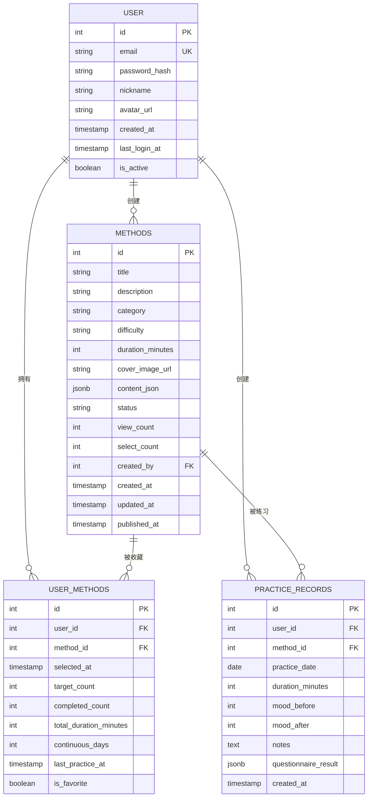
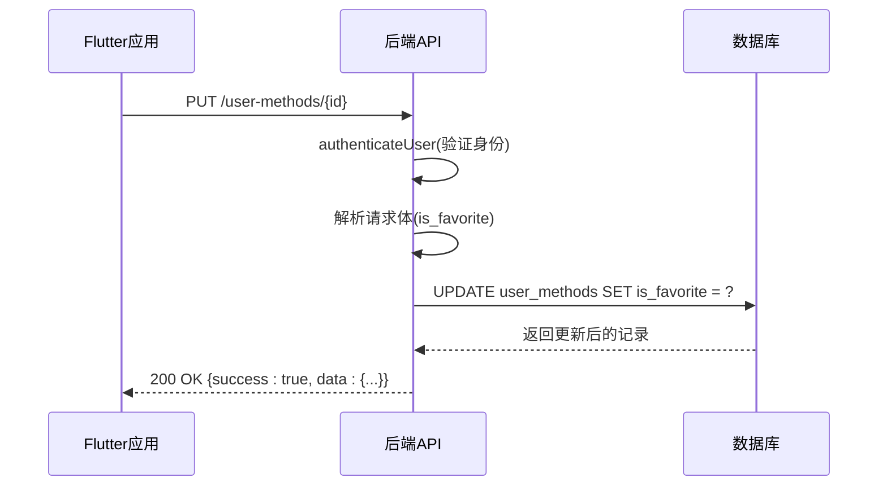
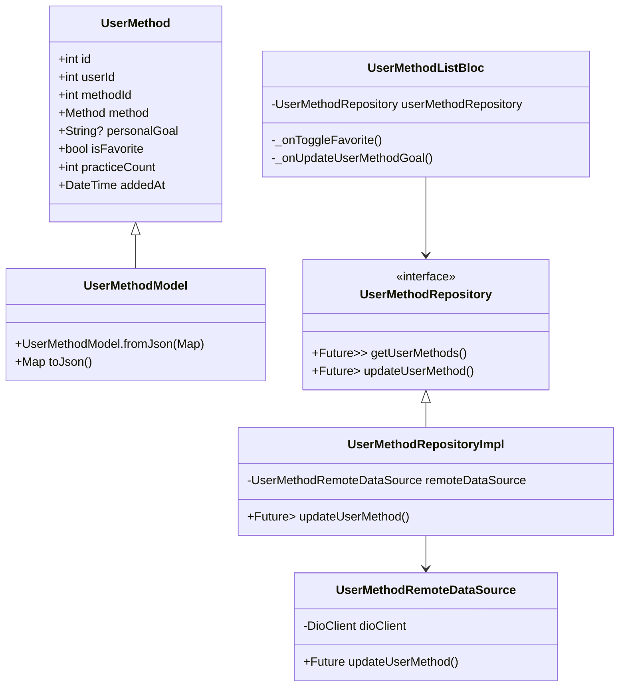
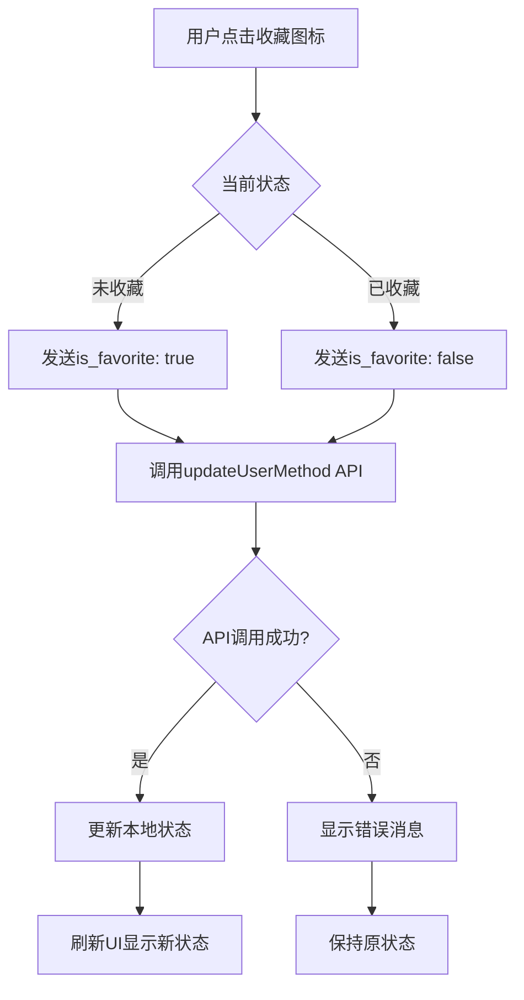
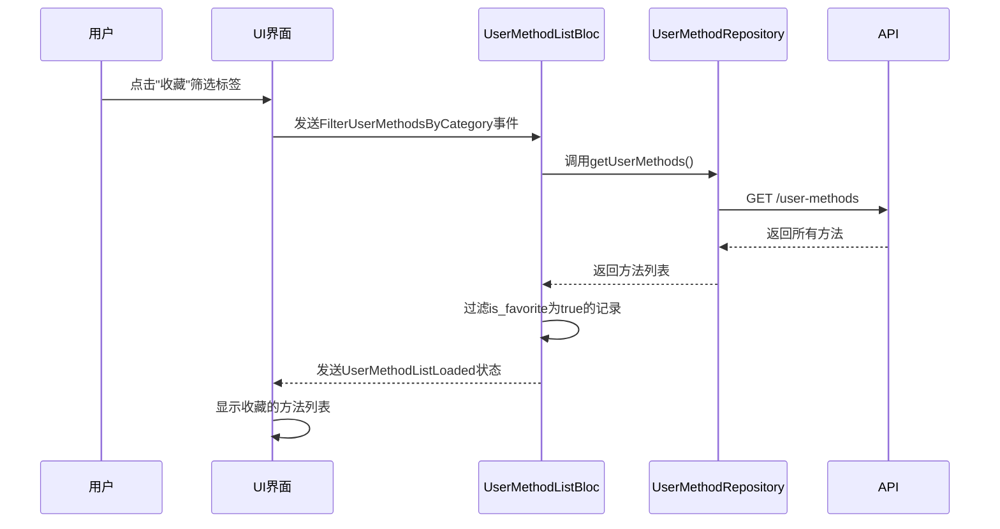

# 收藏与收藏夹功能

<cite>
**本文档引用文件**  
- [userMethod.controller.ts](file://backend/src/controllers/userMethod.controller.ts)
- [userMethod.routes.ts](file://backend/src/routes/userMethod.routes.ts)
- [init.sql](file://database/init.sql)
- [types/index.ts](file://backend/src/types/index.ts)
- [user_method_model.dart](file://flutter_app/lib/data/models/user_method_model.dart)
- [user_method.dart](file://flutter_app/lib/domain/entities/user_method.dart)
- [user_method_repository.dart](file://flutter_app/lib/domain/repositories/user_method_repository.dart)
- [user_method_repository_impl.dart](file://flutter_app/lib/data/repositories/user_method_repository_impl.dart)
- [user_method_remote_data_source.dart](file://flutter_app/lib/data/datasources/remote/user_method_remote_data_source.dart)
- [user_method_list_bloc.dart](file://flutter_app/lib/presentation/user_methods/bloc/user_method_list_bloc.dart)
- [user_method_list_page.dart](file://flutter_app/lib/presentation/user_methods/pages/user_method_list_page.dart)
- [method_card.dart](file://flutter_app/lib/presentation/widgets/method_card.dart)
- [method_detail_page.dart](file://flutter_app/lib/presentation/methods/pages/method_detail_page.dart)
- [empty_state.dart](file://flutter_app/lib/presentation/widgets/empty_state.dart)
</cite>

## 目录
1. [收藏功能概述](#收藏功能概述)
2. [数据库设计](#数据库设计)
3. [后端实现](#后端实现)
4. [Flutter前端实现](#flutter前端实现)
5. [UI交互与状态管理](#ui交互与状态管理)
6. [收藏夹功能流程](#收藏夹功能流程)
7. [错误处理与边界情况](#错误处理与边界情况)

## 收藏功能概述

收藏功能是心理自助应用中的核心用户交互特性，允许用户将感兴趣的心理自助方法添加到个人库中并标记为收藏。该功能通过`user_methods`表中的`is_favorite`布尔字段来标记用户的收藏状态，为用户提供快速访问常用方法的途径。收藏状态直接影响UI展示，如显示星标图标，并支持用户通过筛选功能快速访问所有收藏的方法。整个功能从前端UI交互到后端数据持久化形成了完整的闭环。

**Section sources**
- [user_method_list_page.dart](file://flutter_app/lib/presentation/user_methods/pages/user_method_list_page.dart#L1-L432)
- [user_method_list_bloc.dart](file://flutter_app/lib/presentation/user_methods/bloc/user_method_list_bloc.dart#L1-L192)

## 数据库设计

收藏功能的核心数据模型是`user_methods`表，该表作为用户与方法之间的关联表，存储了用户对方法的个性化信息。其中`is_favorite`字段是布尔类型，用于标记用户是否将某个方法收藏。该字段在数据库层面设置了默认值`DEFAULT FALSE`，确保新添加的方法默认不被收藏。

**Diagram sources**
- [init.sql](file://database/init.sql#L43-L56)

**Section sources**
- [init.sql](file://database/init.sql#L43-L56)
- [types/index.ts](file://backend/src/types/index.ts#L38-L49)

## 后端实现

后端通过`userMethod.controller.ts`文件中的`updateUserMethod`控制器方法处理收藏状态的更新。该方法接收包含`is_favorite`字段的请求体，动态构建SQL更新语句，确保只有提供的字段才会被更新。所有相关路由都通过`authenticateUser`中间件进行身份验证，确保只有认证用户才能操作自己的收藏数据。

**Diagram sources**
- [userMethod.controller.ts](file://backend/src/controllers/userMethod.controller.ts#L83-L131)
- [userMethod.routes.ts](file://backend/src/routes/userMethod.routes.ts#L17-L18)

**Section sources**
- [userMethod.controller.ts](file://backend/src/controllers/userMethod.controller.ts#L83-L131)
- [userMethod.routes.ts](file://backend/src/routes/userMethod.routes.ts#L17-L18)
- [auth.ts](file://backend/src/middleware/auth.ts#L8-L33)

## Flutter前端实现

Flutter应用采用BLoC模式管理收藏功能的状态。`UserMethodListBloc`处理所有与收藏相关的业务逻辑，包括切换收藏状态、更新个人目标等。`UserMethodRepository`作为数据访问层，协调远程数据源和本地缓存，确保数据的一致性。

**Diagram sources**
- [user_method.dart](file://flutter_app/lib/domain/entities/user_method.dart#L7-L58)
- [user_method_model.dart](file://flutter_app/lib/data/models/user_method_model.dart#L5-L44)
- [user_method_repository.dart](file://flutter_app/lib/domain/repositories/user_method_repository.dart#L8-L41)
- [user_method_repository_impl.dart](file://flutter_app/lib/data/repositories/user_method_repository_impl.dart#L9-L84)
- [user_method_remote_data_source.dart](file://flutter_app/lib/data/datasources/remote/user_method_remote_data_source.dart#L7-L86)
- [user_method_list_bloc.dart](file://flutter_app/lib/presentation/user_methods/bloc/user_method_list_bloc.dart#L7-L192)

**Section sources**
- [user_method.dart](file://flutter_app/lib/domain/entities/user_method.dart#L7-L58)
- [user_method_model.dart](file://flutter_app/lib/data/models/user_method_model.dart#L5-L44)
- [user_method_repository_impl.dart](file://flutter_app/lib/data/repositories/user_method_repository_impl.dart#L9-L84)
- [user_method_remote_data_source.dart](file://flutter_app/lib/data/datasources/remote/user_method_remote_data_source.dart#L7-L86)

## UI交互与状态管理

用户在`method_card.dart`和`user_method_list_page.dart`中通过点击收藏图标触发收藏/取消收藏操作。UI根据`is_favorite`字段的值动态显示实心或空心星标图标，并通过BLoC模式调用API更新状态。收藏状态的变更会立即反映在UI上，提供流畅的用户体验。

**Diagram sources**
- [method_card.dart](file://flutter_app/lib/presentation/widgets/method_card.dart#L74-L119)
- [user_method_list_page.dart](file://flutter_app/lib/presentation/user_methods/pages/user_method_list_page.dart#L233-L242)

**Section sources**
- [method_card.dart](file://flutter_app/lib/presentation/widgets/method_card.dart#L74-L119)
- [user_method_list_page.dart](file://flutter_app/lib/presentation/user_methods/pages/user_method_list_page.dart#L233-L242)
- [empty_state.dart](file://flutter_app/lib/presentation/widgets/empty_state.dart#L151-L170)

## 收藏夹功能流程

收藏夹功能支持用户快速访问所有收藏的方法。在`user_method_list_page.dart`中，用户可以通过筛选标签选择"收藏"选项，客户端会过滤出所有`is_favorite`为`true`的记录并展示。当收藏夹为空时，会显示专门的空状态组件引导用户浏览和收藏方法。

**Diagram sources**
- [user_method_list_page.dart](file://flutter_app/lib/presentation/user_methods/pages/user_method_list_page.dart#L138-L184)
- [user_method_list_bloc.dart](file://flutter_app/lib/presentation/user_methods/bloc/user_method_list_bloc.dart#L49-L81)

**Section sources**
- [user_method_list_page.dart](file://flutter_app/lib/presentation/user_methods/pages/user_method_list_page.dart#L138-L184)
- [user_method_list_bloc.dart](file://flutter_app/lib/presentation/user_methods/bloc/user_method_list_bloc.dart#L49-L81)

## 错误处理与边界情况

系统实现了完善的错误处理机制。后端控制器会验证用户身份和输入参数，返回适当的HTTP状态码和错误消息。前端通过Dartz库的Either类型处理成功和失败情况，在BLoC中将失败转换为错误状态，并在UI中显示SnackBar提示用户。对于网络错误、认证失败等边界情况都有相应的处理策略。

**Section sources**
- [userMethod.controller.ts](file://backend/src/controllers/userMethod.controller.ts#L88-L124)
- [user_method_repository_impl.dart](file://flutter_app/lib/data/repositories/user_method_repository_impl.dart#L19-L25)
- [user_method_list_bloc.dart](file://flutter_app/lib/presentation/user_methods/bloc/user_method_list_bloc.dart#L103-L104)