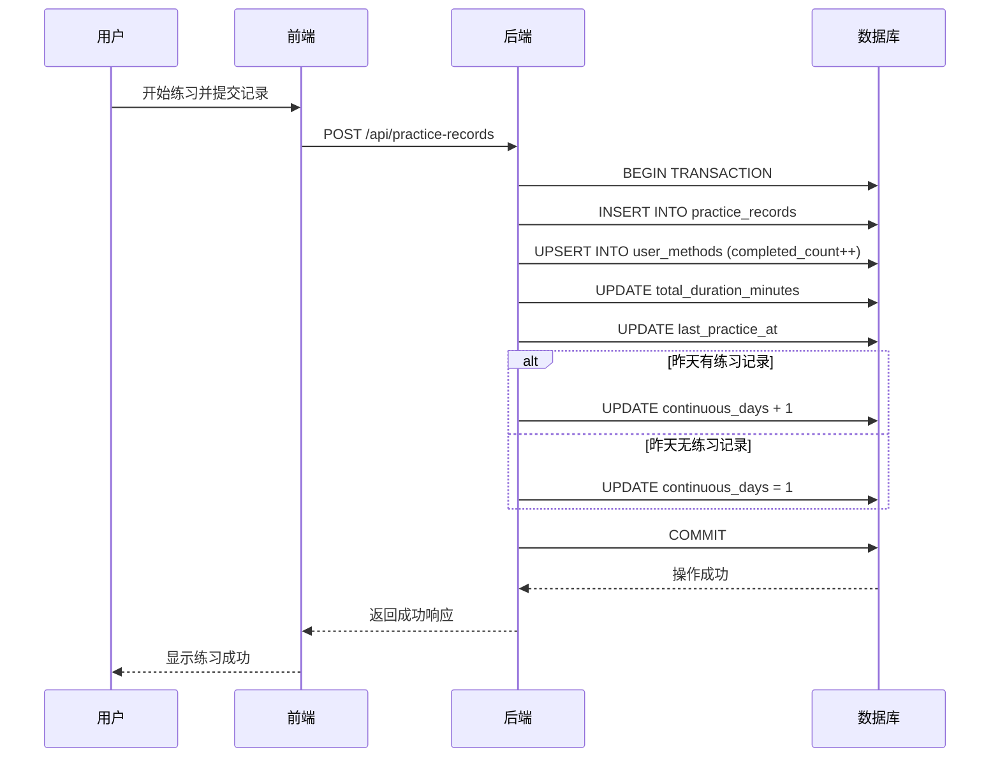
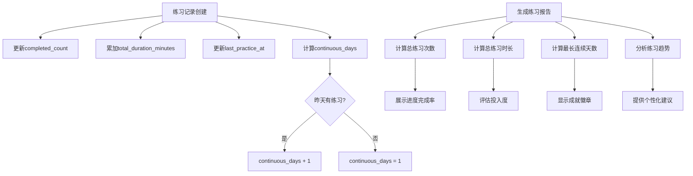

# 业务状态字段设计

<cite>
**本文档引用的文件**   
- [init.sql](file://database/init.sql#L43-L56)
- [index.ts](file://backend/src/types/index.ts#L38-L49)
- [user_method.controller.ts](file://backend/src/controllers/userMethod.controller.ts#L40-L44)
- [practice.controller.ts](file://backend/src/controllers/practice.controller.ts#L49-L84)
- [user_method.dart](file://flutter_app/lib/domain/entities/user_method.dart#L9-L30)
- [user_method_model.dart](file://flutter_app/lib/data/models/user_method_model.dart#L6-L15)
- [user_method_list_page.dart](file://flutter_app/lib/presentation/user_methods/pages/user_method_list_page.dart#L279-L286)
</cite>

## 目录
1. [引言](#引言)
2. [核心业务字段设计意图](#核心业务字段设计意图)
3. [字段数据类型与默认值分析](#字段数据类型与默认值分析)
4. [字段协同工作机制](#字段协同工作机制)
5. [用户练习报告生成应用](#用户练习报告生成应用)
6. [结论](#结论)

## 引言
本系统通过user_methods表中的多个业务状态字段，实现了对用户个性化练习目标的全面跟踪与统计功能。这些字段不仅记录了用户的基本练习数据，还支持复杂的用户行为分析和个性化推荐。通过深入分析这些字段的设计意图和协同工作机制，可以更好地理解系统如何支持用户的心理自助练习目标。

## 核心业务字段设计意图

user_methods表中的业务字段设计旨在全面跟踪用户的练习行为和进度，支持个性化目标的设定与达成。这些字段共同构成了用户练习行为的完整画像，为系统提供数据支持以生成个性化的练习报告和建议。

selected_at字段记录了用户将特定心理自助方法添加到个人库的时间点，这不仅是用户兴趣的体现，也是个性化推荐算法的重要输入。target_count字段允许用户设定练习目标次数，体现了系统的个性化目标管理功能。completed_count字段则实时跟踪用户已完成的练习次数，与target_count形成对比，直观展示目标完成进度。

total_duration_minutes字段累计用户在特定方法上的总练习时长，为评估练习投入度提供了量化指标。continuous_days字段是系统激励机制的核心，通过连续打卡天数的设计鼓励用户形成持续练习的习惯。last_practice_at字段记录最近一次练习时间，对于提醒系统和活跃度分析至关重要。

这些字段的设计体现了系统对用户行为的精细化跟踪，不仅关注练习的数量，还重视练习的持续性和规律性，从而全面支持用户的心理健康目标。

**Section sources**
- [init.sql](file://database/init.sql#L43-L56)
- [index.ts](file://backend/src/types/index.ts#L38-L49)

## 字段数据类型与默认值分析

从TypeScript接口UserMethod的定义可以看出，各字段的数据类型选择充分考虑了业务需求和数据完整性。id、user_id和method_id均采用number类型，作为表的主键和外键，确保了数据关联的准确性。selected_at字段使用Date类型，精确到时间点，为时间序列分析提供了基础。

target_count、completed_count和total_duration_minutes字段均采用number类型，初始默认值为0，这符合业务逻辑——用户刚添加方法时，尚未开始练习。这种设计避免了null值处理的复杂性，简化了前端展示逻辑。continuous_days字段同样以0为默认值，当用户开始连续练习时逐步递增。

last_practice_at字段被定义为可选的Date类型（Date?），初始值为null，这准确反映了业务场景：用户添加方法后可能不会立即练习。is_favorite字段采用boolean类型，默认值为false，实现了收藏状态的二元标记，支持用户对方法进行个性化管理。

数据类型的选择还考虑了计算效率。整数类型的使用使得count和duration的累加运算高效且精确，避免了浮点数运算可能带来的精度问题。这种设计在保证数据准确性的同时，也优化了数据库的存储和查询性能。

**Section sources**
- [index.ts](file://backend/src/types/index.ts#L38-L49)
- [init.sql](file://database/init.sql#L49-L53)

## 字段协同工作机制

这些业务字段通过后端控制器的协同工作，形成了完整的用户练习跟踪闭环。当用户添加方法到个人库时，addUserMethod控制器会创建新的user_methods记录，selected_at自动设置为当前时间，target_count可由用户指定或默认为0。

最关键的工作机制体现在练习记录创建过程中。createPracticeRecord控制器通过事务处理，确保了数据的一致性：首先插入练习记录，然后更新user_methods表的相关字段。completed_count字段通过"completed_count = user_methods.completed_count + 1"的SQL表达式实现原子性递增，避免了并发问题。

total_duration_minutes字段的更新同样采用累加方式，将本次练习时长加入总时长。last_practice_at字段更新为当前时间，确保了时间戳的实时性。continuous_days字段的更新逻辑更为复杂：系统首先查询用户昨天是否进行了相同方法的练习，如果有则连续天数加1，否则重置为1。这种设计准确实现了"连续打卡"的概念。

这种协同工作机制确保了用户每次练习后，所有相关统计字段都能得到准确更新，为后续的数据分析和报告生成提供了可靠的基础。

**Diagram sources **
- [practice.controller.ts](file://backend/src/controllers/practice.controller.ts#L49-L84)
- [init.sql](file://database/init.sql#L43-L56)

**Section sources**
- [practice.controller.ts](file://backend/src/controllers/practice.controller.ts#L49-L84)
- [user_method.controller.ts](file://backend/src/controllers/userMethod.controller.ts#L40-L44)

## 用户练习报告生成应用

这些业务字段在生成用户练习报告时发挥着关键作用，通过综合应用实现多维度的分析展示。在Flutter前端的用户方法列表页面中，practiceCount字段（对应completed_count）和addedAt字段（对应selected_at）被直接用于展示卡片上的统计信息，让用户一目了然地看到练习次数和添加时间。

getPracticeStatistics控制器综合运用这些字段生成全面的练习统计报告。系统通过查询user_methods表中continuous_days的最大值，确定用户的最长连续练习天数，作为成就系统的一部分。completed_count和total_duration_minutes的组合分析可以识别用户的偏好方法——那些完成次数多且总时长长的方法通常是用户认为最有效或最喜欢的。

在个性化推荐方面，系统可以分析last_practice_at字段，识别长时间未练习的方法，从而推送提醒或重新推荐。target_count与completed_count的对比可以生成进度报告，如"您已完成了目标的75%"，这种正向反馈有助于提升用户参与度。

这些字段的综合应用不仅生成静态报告，还支持动态的个性化体验。例如，当用户接近完成练习目标时，系统可以发送鼓励通知；当连续打卡天数达到里程碑时，可以解锁成就奖励。这种基于数据的智能交互设计，极大地增强了用户粘性和练习效果。

**Diagram sources **
- [user_method_list_page.dart](file://flutter_app/lib/presentation/user_methods/pages/user_method_list_page.dart#L279-L286)
- [practice.controller.ts](file://backend/src/controllers/practice.controller.ts#L240-L246)

**Section sources**
- [user_method_list_page.dart](file://flutter_app/lib/presentation/user_methods/pages/user_method_list_page.dart#L279-L286)
- [practice.controller.ts](file://backend/src/controllers/practice.controller.ts#L197-L258)

## 结论
user_methods表中的业务字段设计体现了对用户练习行为的深入理解和精细化管理。通过selected_at、target_count、completed_count、total_duration_minutes、continuous_days和last_practice_at等字段的协同工作，系统构建了一个完整的用户练习跟踪体系。这些字段不仅满足了基本的数据记录需求，还支持复杂的统计分析、个性化推荐和用户激励机制。

数据类型和默认值的选择充分考虑了业务场景和系统性能，确保了数据的准确性和处理效率。后端控制器通过事务性操作保证了数据更新的一致性，前端则充分利用这些数据为用户提供直观的反馈和个性化的体验。这种端到端的设计使得系统能够有效支持用户实现心理自助目标，体现了良好的用户体验设计和技术实现的结合。