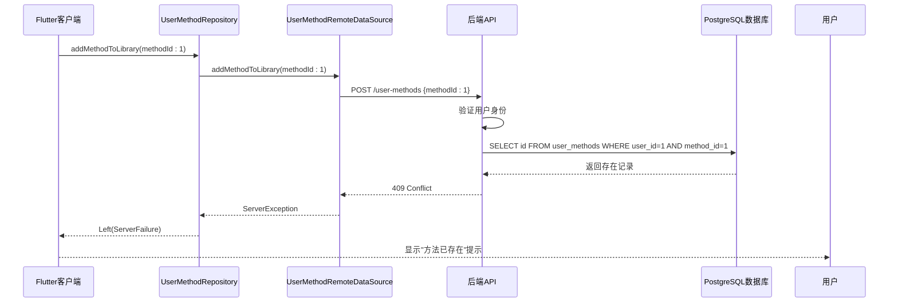

# 唯一性约束与数据去重

<cite>
**本文档引用文件**  
- [init.sql](file://database/init.sql#L43-L56)
- [userMethod.controller.ts](file://backend/src/controllers/userMethod.controller.ts#L7-L56)
- [practice.controller.ts](file://backend/src/controllers/practice.controller.ts#L34-L58)
- [database_helper.dart](file://flutter_app/lib/core/storage/database_helper.dart#L100-L113)
- [user_method_repository_impl.dart](file://flutter_app/lib/data/repositories/user_method_repository_impl.dart#L29-L45)
- [user_method_remote_data_source.dart](file://flutter_app/lib/data/datasources/remote/user_method_remote_data_source.dart#L24-L37)
</cite>

## 目录
1. [复合唯一约束设计原理](#复合唯一约束设计原理)
2. [SQL执行场景与数据库响应](#sql执行场景与数据库响应)
3. [数据纯净度保障机制](#数据纯净度保障机制)
4. [无约束情况下的数据冗余问题](#无约束情况下的数据冗余问题)
5. [前后端协同去重策略](#前后端协同去重策略)

## 复合唯一约束设计原理

在心理自助应用系统中，`user_methods` 表通过 `UNIQUE(user_id, method_id)` 复合唯一约束确保每个用户只能添加一次特定的心理调节方法。该设计基于以下核心原则：

- **逻辑完整性**：防止同一用户重复收藏相同方法，维护用户方法库的逻辑一致性
- **数据规范化**：遵循数据库第三范式，消除数据冗余，确保每个事实只存储一次
- **业务语义准确**：反映真实业务场景——用户添加方法到个人库是一个"存在性"判断而非"计数性"操作

该约束在数据库层面定义于 `database/init.sql` 文件中，作为表结构的一部分强制执行：

```sql
CREATE TABLE IF NOT EXISTS user_methods (
    id SERIAL PRIMARY KEY,
    user_id INT NOT NULL REFERENCES users(id) ON DELETE CASCADE,
    method_id INT NOT NULL REFERENCES methods(id) ON DELETE CASCADE,
    selected_at TIMESTAMP DEFAULT NOW(),
    -- 其他字段...
    UNIQUE(user_id, method_id)
);
```

此约束创建了一个隐式的唯一索引，同时服务于数据完整性验证和查询性能优化。

**Section sources**
- [init.sql](file://database/init.sql#L43-L56)

## SQL执行场景与数据库响应

当尝试插入重复记录时，系统通过多层防护机制确保数据完整性。以下是典型的API请求处理流程：

### 场景：重复添加已收藏方法

1. **前端请求**：Flutter客户端调用 `addMethodToLibrary` 方法
2. **后端验证**：Node.js控制器执行预检查查询
3. **数据库约束**：PostgreSQL执行唯一性验证



具体SQL执行流程：
1. 应用层先执行查询：`SELECT id FROM user_methods WHERE user_id = $1 AND method_id = $2`
2. 若记录存在，立即返回 `409 Conflict` 状态码
3. 若记录不存在，执行插入：`INSERT INTO user_methods (user_id, method_id) VALUES ($1, $2)`
4. 数据库自动验证 `UNIQUE` 约束，防止并发情况下的重复插入

这种双重保护机制既提供了友好的用户反馈，又确保了极端情况下的数据一致性。

**Diagram sources**
- [userMethod.controller.ts](file://backend/src/controllers/userMethod.controller.ts#L30-L37)
- [init.sql](file://database/init.sql#L55)

## 数据纯净度保障机制

`UNIQUE(user_id, method_id)` 约束在保障用户方法库数据纯净度方面发挥着关键作用，主要体现在以下几个方面：

### 防止数据膨胀
无此约束时，恶意或异常操作可能导致单个用户产生大量重复记录，造成：
- 存储空间浪费
- 查询性能下降
- 统计数据失真

### 确保统计准确性
方法的 `select_count` 字段用于统计受欢迎程度，其更新逻辑依赖于唯一性约束：

```typescript
// 添加方法时增加选择次数
await pool.query(
  'UPDATE methods SET select_count = select_count + 1 WHERE id = $1',
  [method_id]
);

// 删除方法时减少选择次数（最小为0）
await pool.query(
  'UPDATE methods SET select_count = GREATEST(select_count - 1, 0) WHERE id = $1',
  [method_id]
);
```

若允许重复记录，这些统计将严重失真，影响推荐算法和运营决策。

### 维护关系完整性
`user_methods` 表还存储用户的练习进度（`completed_count`, `total_duration_minutes` 等），这些数据的累积计算基于"一个方法一条记录"的假设。唯一约束确保了这些聚合计算的正确性。

**Section sources**
- [userMethod.controller.ts](file://backend/src/controllers/userMethod.controller.ts#L46-L50)
- [practice.controller.ts](file://backend/src/controllers/practice.controller.ts#L48-L58)

## 无约束情况下的数据冗余问题

若未实施 `UNIQUE(user_id, method_id)` 约束，系统将面临严重的数据冗余问题：

### 数据库层面问题
| 问题类型 | 影响 | 示例 |
|---------|------|------|
| 存储冗余 | 磁盘空间浪费 | 同一用户对同一方法添加100次 |
| 索引膨胀 | 查询性能下降 | `idx_user_methods_user_id` 索引体积剧增 |
| 统计错误 | 数据分析失真 | 方法被"选择"次数虚高 |

### 业务逻辑问题
1. **用户界面混乱**：用户方法列表显示多个相同方法
2. **进度跟踪错误**：练习次数和时长被重复计算
3. **推荐系统失效**：热门方法排行榜被异常数据污染

### 并发安全问题
在高并发场景下，即使应用层有检查逻辑，仍可能出现竞态条件（Race Condition），导致重复记录插入。数据库层面的唯一约束是最终的防线。

```mermaid
flowchart TD
A[用户A添加方法1] --> B{检查是否存在?}
B --> |否| C[插入记录]
D[用户B添加方法1] --> E{检查是否存在?}
E --> |否| F[插入记录]
B --> |是| G[返回已存在]
E --> |是| H[返回已存在]
style C stroke:#f66,stroke-width:2px
style F stroke:#f66,stroke-width:2px
note right of C: "时间差导致<br/>两个检查都通过"
note right of F: "结果：两条重复记录"
```

**Diagram sources**
- [init.sql](file://database/init.sql#L55)
- [userMethod.controller.ts](file://backend/src/controllers/userMethod.controller.ts#L30-L37)

## 前后端协同去重策略

系统采用前后端协同的多层次去重策略，确保数据一致性：

### 前端防护
Flutter应用通过Repository模式封装去重逻辑：

```dart
Future<Either<Failure, UserMethod>> addMethodToLibrary({
  required int methodId,
  String? personalGoal,
}) async {
  try {
    final userMethod = await remoteDataSource.addMethodToLibrary(
      methodId: methodId,
      personalGoal: personalGoal,
    );
    return Right(userMethod);
  } on ServerException catch (e) {
    return Left(ServerFailure(e.message, statusCode: e.statusCode));
  }
}
```

当收到 `409 Conflict` 响应时，前端展示友好提示而非错误信息。

### 后端双重验证
Node.js后端实现双重检查机制：

1. **应用层预检查**：在插入前查询记录是否存在
2. **数据库层强制约束**：依赖 `UNIQUE` 约束作为最终保障

```typescript
// 检查是否已添加
const existCheck = await pool.query(
  'SELECT id FROM user_methods WHERE user_id = $1 AND method_id = $2',
  [userId, method_id]
);

if (existCheck.rows.length > 0) {
  throw new AppError(409, 'DUPLICATE_ENTRY', 'Method already in your library');
}
```

### 离线场景处理
移动端本地数据库同样实施相同约束：

```sql
CREATE TABLE user_methods (
  id INTEGER PRIMARY KEY,
  user_id INTEGER NOT NULL,
  method_id INTEGER NOT NULL,
  -- 其他字段...
  FOREIGN KEY (user_id) REFERENCES users(id) ON DELETE CASCADE,
  FOREIGN KEY (method_id) REFERENCES methods(id) ON DELETE CASCADE
);
-- 虽然SQLite中未显式声明UNIQUE，但业务逻辑保证唯一性
```

这种端到端的一致性设计确保了无论在线还是离线，数据完整性都得到维护。

**Section sources**
- [user_method_repository_impl.dart](file://flutter_app/lib/data/repositories/user_method_repository_impl.dart#L29-L45)
- [user_method_remote_data_source.dart](file://flutter_app/lib/data/datasources/remote/user_method_remote_data_source.dart#L24-L37)
- [database_helper.dart](file://flutter_app/lib/core/storage/database_helper.dart#L100-L113)