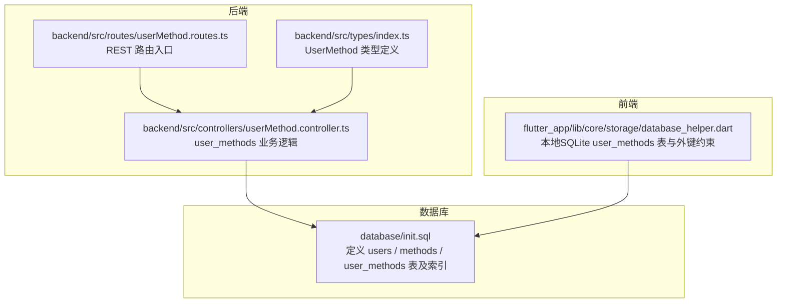
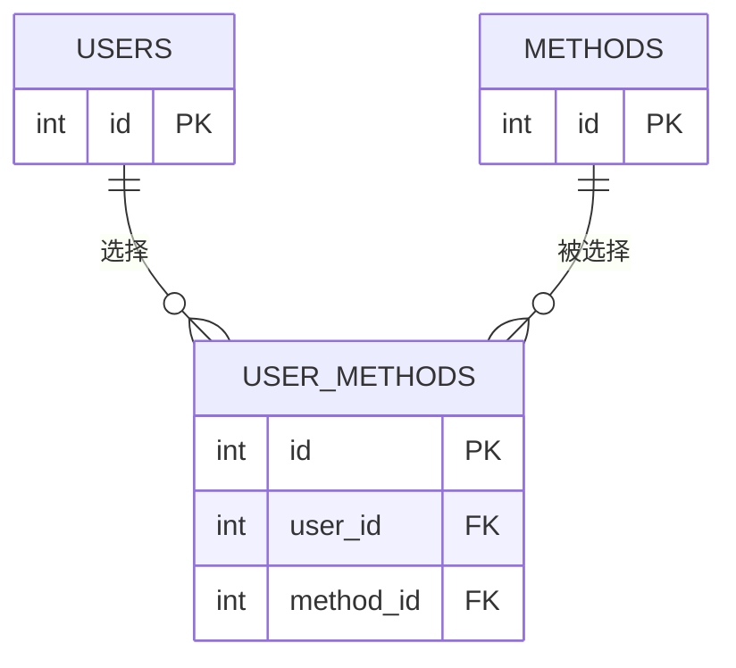
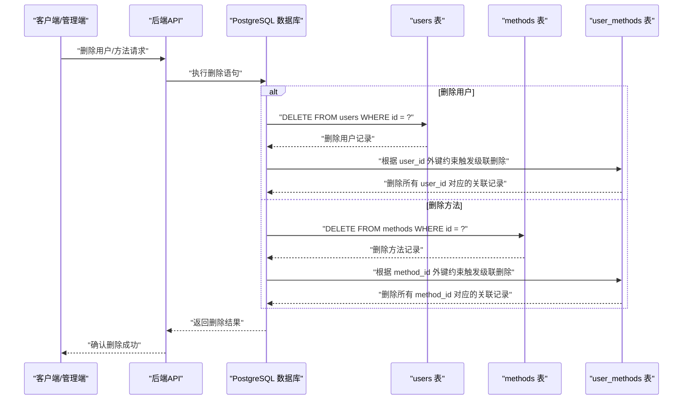
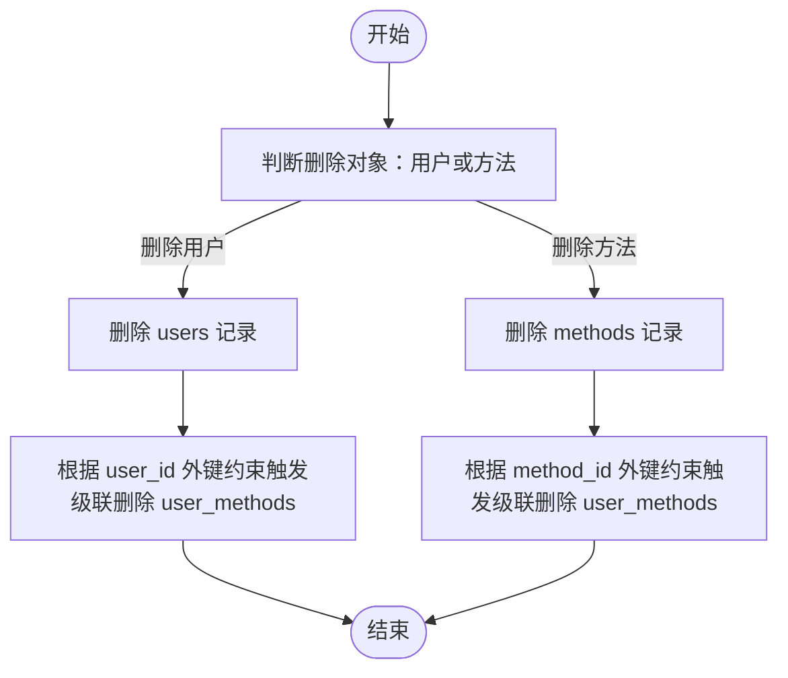
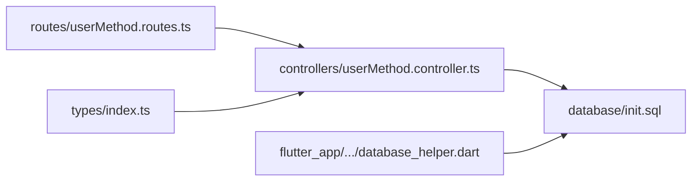

# 外键约束与级联删除

<cite>
**本文引用的文件**
- [database/init.sql](file://database/init.sql)
- [backend/src/controllers/userMethod.controller.ts](file://backend/src/controllers/userMethod.controller.ts)
- [backend/src/routes/userMethod.routes.ts](file://backend/src/routes/userMethod.routes.ts)
- [backend/src/types/index.ts](file://backend/src/types/index.ts)
- [flutter_app/lib/core/storage/database_helper.dart](file://flutter_app/lib/core/storage/database_helper.dart)
</cite>

## 目录
1. [简介](#简介)
2. [项目结构](#项目结构)
3. [核心组件](#核心组件)
4. [架构总览](#架构总览)
5. [详细组件分析](#详细组件分析)
6. [依赖关系分析](#依赖关系分析)
7. [性能考量](#性能考量)
8. [故障排查指南](#故障排查指南)
9. [结论](#结论)

## 简介
本文件聚焦于数据库中 user_methods 表的外键约束机制，特别是 user_id 和 method_id 字段分别引用 users(id) 与 methods(id)，并启用 ON DELETE CASCADE 的作用与影响。我们将结合 init.sql 中的表定义，解释当用户或方法被删除时，数据库如何自动清理关联记录以维持数据一致性；同时讨论该策略对系统稳定性与数据完整性的重要保障，并结合实际业务场景说明其必要性。

## 项目结构
本项目采用多模块架构，数据库初始化脚本位于 database/init.sql，后端控制器负责 user_methods 的增删改查操作，前端 Flutter 应用通过本地 SQLite 缓存 user_methods 表并同样启用外键约束。下图展示与本文主题直接相关的文件与职责映射。

图表来源
- [database/init.sql](file://database/init.sql#L43-L61)
- [backend/src/routes/userMethod.routes.ts](file://backend/src/routes/userMethod.routes.ts#L1-L23)
- [backend/src/controllers/userMethod.controller.ts](file://backend/src/controllers/userMethod.controller.ts#L1-L161)
- [backend/src/types/index.ts](file://backend/src/types/index.ts#L37-L49)
- [flutter_app/lib/core/storage/database_helper.dart](file://flutter_app/lib/core/storage/database_helper.dart#L100-L114)

章节来源
- [database/init.sql](file://database/init.sql#L43-L61)
- [backend/src/routes/userMethod.routes.ts](file://backend/src/routes/userMethod.routes.ts#L1-L23)
- [backend/src/controllers/userMethod.controller.ts](file://backend/src/controllers/userMethod.controller.ts#L1-L161)
- [backend/src/types/index.ts](file://backend/src/types/index.ts#L37-L49)
- [flutter_app/lib/core/storage/database_helper.dart](file://flutter_app/lib/core/storage/database_helper.dart#L100-L114)

## 核心组件
- user_methods 表：用于记录“用户-方法”的选择关系，包含 user_id、method_id 等字段，并通过外键约束与 users、methods 表关联。
- 外键约束与级联删除：
  - user_id 引用 users(id)，ON DELETE CASCADE
  - method_id 引用 methods(id)，ON DELETE CASCADE
- 后端控制器：提供添加、查询、更新、删除 user_methods 的接口，确保业务一致性。
- 前端本地缓存：Flutter 使用 SQLite 缓存 user_methods 表，并显式启用外键约束，保证离线数据与线上一致。

章节来源
- [database/init.sql](file://database/init.sql#L43-L61)
- [backend/src/controllers/userMethod.controller.ts](file://backend/src/controllers/userMethod.controller.ts#L1-L161)
- [flutter_app/lib/core/storage/database_helper.dart](file://flutter_app/lib/core/storage/database_helper.dart#L100-L114)

## 架构总览
下图展示了 user_methods 表在数据库层的外键约束与级联删除行为，以及后端与前端如何协同维护数据一致性。

图表来源
- [database/init.sql](file://database/init.sql#L43-L61)

## 详细组件分析

### user_methods 表的外键与级联删除
- user_id 引用 users(id)，ON DELETE CASCADE：当 users 表中某条记录被删除时，user_methods 中对应 user_id 的所有关联记录会自动被删除，避免悬挂引用。
- method_id 引用 methods(id)，ON DELETE CASCADE：当 methods 表中某条记录被删除时，user_methods 中对应 method_id 的所有关联记录会自动被删除，防止数据不一致。
- 唯一性约束：UNIQUE(user_id, method_id) 保证同一用户不能重复选择同一方法，配合外键级联删除，确保删除任一方后不会残留重复或孤立的关联。

章节来源
- [database/init.sql](file://database/init.sql#L43-L61)

### 后端控制器对 user_methods 的操作
- 添加个人方法：向 user_methods 插入一条记录，并同步更新 methods 的 select_count。
- 查询个人方法：按 user_id 查询 user_methods 并关联返回方法信息。
- 更新个人方法：支持更新目标次数、收藏标记等字段。
- 删除个人方法：删除 user_methods 记录，并回退 methods 的 select_count。

这些操作与数据库外键约束共同保证了：
- 业务层面的幂等性与原子性（插入/更新/删除均受约束保护）。
- 数据一致性：删除 user_methods 不会破坏其他表的数据完整性。

章节来源
- [backend/src/controllers/userMethod.controller.ts](file://backend/src/controllers/userMethod.controller.ts#L1-L161)

### 前端本地缓存与外键约束
- Flutter 本地 SQLite 也定义了 user_methods 表，并显式声明外键约束：
  - FOREIGN KEY (user_id) REFERENCES users(id) ON DELETE CASCADE
  - FOREIGN KEY (method_id) REFERENCES methods(id) ON DELETE CASCADE
- 在数据库打开时启用 PRAGMA foreign_keys = ON，确保外键检查生效。
- 该设计使本地缓存与线上数据库在约束层面保持一致，避免离线状态下产生不一致的数据。

章节来源
- [flutter_app/lib/core/storage/database_helper.dart](file://flutter_app/lib/core/storage/database_helper.dart#L100-L114)
- [flutter_app/lib/core/storage/database_helper.dart](file://flutter_app/lib/core/storage/database_helper.dart#L41-L45)

### 级联删除的工作流程（序列图）
以下序列图展示当用户或方法被删除时，数据库如何自动清理 user_methods 关联记录。

图表来源
- [database/init.sql](file://database/init.sql#L43-L61)
- [backend/src/controllers/userMethod.controller.ts](file://backend/src/controllers/userMethod.controller.ts#L133-L161)

### 删除流程的算法示意（流程图）

图表来源
- [database/init.sql](file://database/init.sql#L43-L61)

## 依赖关系分析
- 外键依赖链：
  - user_methods.user_id → users.id（ON DELETE CASCADE）
  - user_methods.method_id → methods.id（ON DELETE CASCADE）
- 控制流依赖：
  - 后端路由层依赖控制器处理业务逻辑。
  - 控制器依赖数据库连接池执行 SQL。
  - 前端本地数据库依赖外键约束保证一致性。
- 类型契约：
  - UserMethod 类型定义了 user_methods 的字段结构，确保前后端交互一致。

图表来源
- [backend/src/routes/userMethod.routes.ts](file://backend/src/routes/userMethod.routes.ts#L1-L23)
- [backend/src/controllers/userMethod.controller.ts](file://backend/src/controllers/userMethod.controller.ts#L1-L161)
- [backend/src/types/index.ts](file://backend/src/types/index.ts#L37-L49)
- [flutter_app/lib/core/storage/database_helper.dart](file://flutter_app/lib/core/storage/database_helper.dart#L100-L114)
- [database/init.sql](file://database/init.sql#L43-L61)

章节来源
- [backend/src/routes/userMethod.routes.ts](file://backend/src/routes/userMethod.routes.ts#L1-L23)
- [backend/src/controllers/userMethod.controller.ts](file://backend/src/controllers/userMethod.controller.ts#L1-L161)
- [backend/src/types/index.ts](file://backend/src/types/index.ts#L37-L49)
- [flutter_app/lib/core/storage/database_helper.dart](file://flutter_app/lib/core/storage/database_helper.dart#L100-L114)
- [database/init.sql](file://database/init.sql#L43-L61)

## 性能考量
- 索引与查询效率：
  - user_methods 表建立了 user_id、method_id、selected_at 等索引，有助于快速定位用户选择记录与排序。
- 级联删除的代价：
  - 删除用户或方法时，数据库需自动删除大量 user_methods 关联记录，可能带来一定写放大。
  - 建议在批量删除前评估影响范围，必要时分批处理或在低峰期执行。
- 前后端一致性：
  - 前端本地 SQLite 同样启用外键约束，避免离线数据导致后续同步困难。

章节来源
- [database/init.sql](file://database/init.sql#L58-L61)
- [flutter_app/lib/core/storage/database_helper.dart](file://flutter_app/lib/core/storage/database_helper.dart#L100-L114)

## 故障排查指南
- 删除后仍存在关联记录
  - 检查是否启用了外键约束（PostgreSQL 默认开启，但需确认未被禁用）。
  - 确认删除的是用户还是方法，确保触发了正确的级联删除路径。
- 删除失败或报错
  - 若存在依赖其他表的记录，需先清理相关数据再删除。
  - 检查唯一性约束与业务逻辑（如前端移除个人方法时同步更新 select_count）。
- 前端本地数据不一致
  - 确认本地数据库已启用外键约束（PRAGMA foreign_keys = ON）。
  - 如需重置，可清理本地表后再重新拉取数据。

章节来源
- [database/init.sql](file://database/init.sql#L43-L61)
- [flutter_app/lib/core/storage/database_helper.dart](file://flutter_app/lib/core/storage/database_helper.dart#L41-L45)
- [backend/src/controllers/userMethod.controller.ts](file://backend/src/controllers/userMethod.controller.ts#L133-L161)

## 结论
- user_methods 表通过 user_id 与 method_id 的外键约束，并启用 ON DELETE CASCADE，确保当用户或方法被删除时，数据库会自动清理所有关联记录，从而维持数据一致性与完整性。
- 该策略在业务上非常必要：避免“幽灵数据”与重复选择，降低后续查询与统计的复杂度；同时与后端控制器的业务逻辑（如更新 select_count）相辅相成，形成闭环。
- 前后端均启用外键约束，进一步提升了跨层数据一致性保障，降低了数据漂移风险。