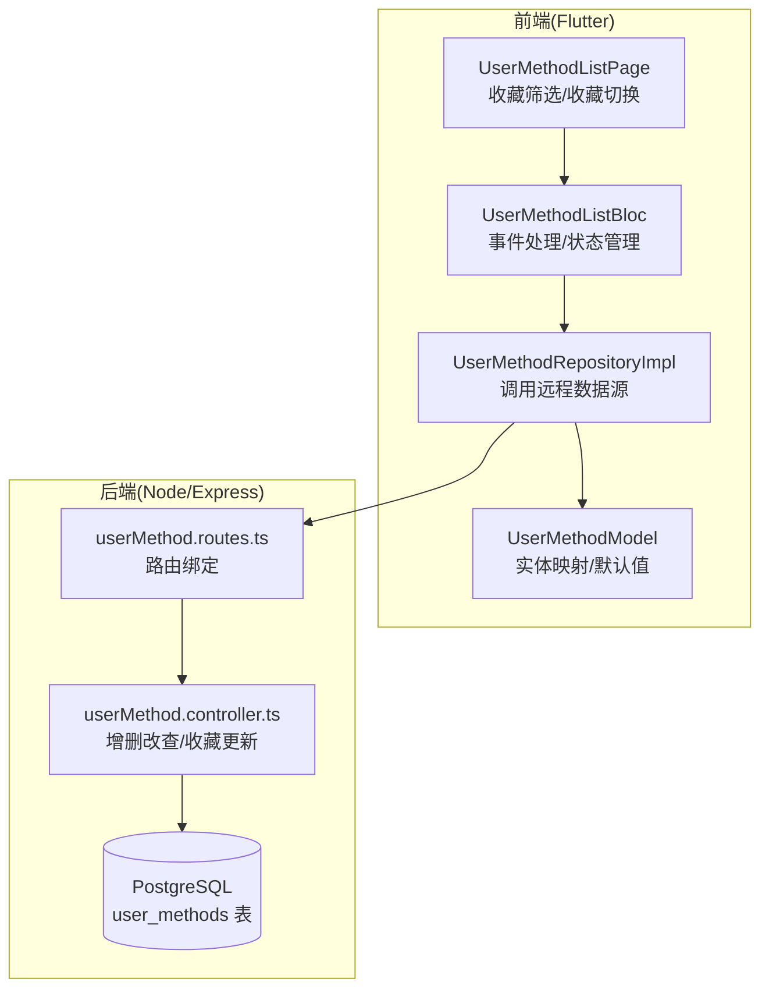
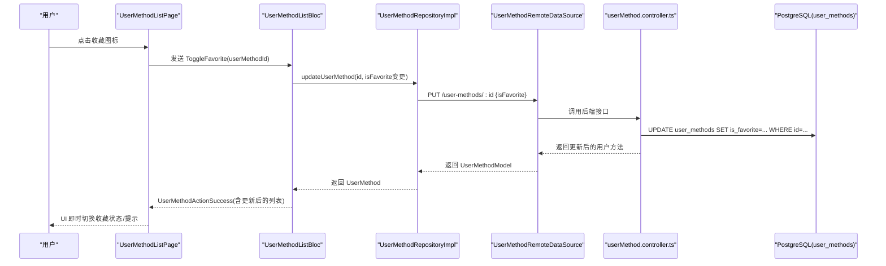
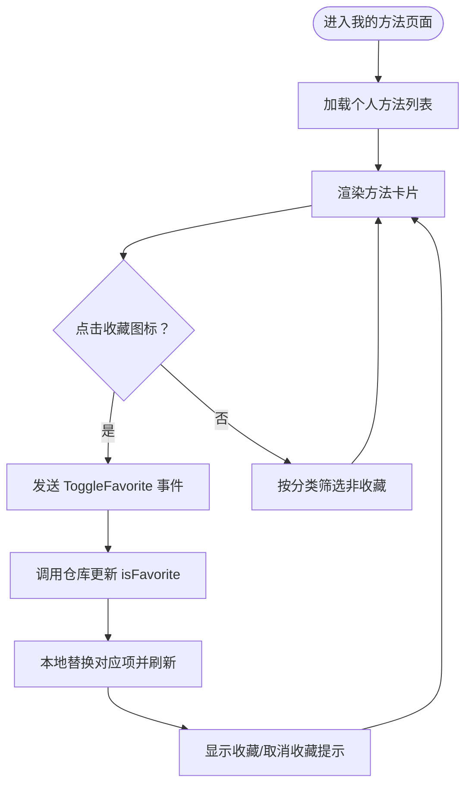
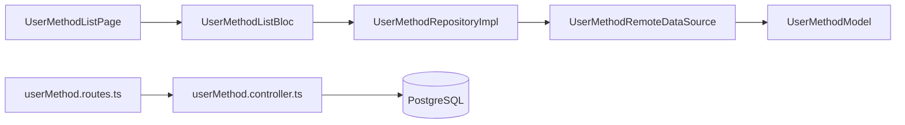

# 收藏功能实现机制

<cite>
**本文引用的文件**
- [init.sql](file://database/init.sql)
- [userMethod.controller.ts](file://backend/src/controllers/userMethod.controller.ts)
- [userMethod.routes.ts](file://backend/src/routes/userMethod.routes.ts)
- [user_method_model.dart](file://flutter_app/lib/data/models/user_method_model.dart)
- [user_method.dart](file://flutter_app/lib/domain/entities/user_method.dart)
- [user_method_repository_impl.dart](file://flutter_app/lib/data/repositories/user_method_repository_impl.dart)
- [user_method_list_page.dart](file://flutter_app/lib/presentation/user_methods/pages/user_method_list_page.dart)
- [user_method_list_bloc.dart](file://flutter_app/lib/presentation/user_methods/bloc/user_method_list_bloc.dart)
- [user_method_list_event.dart](file://flutter_app/lib/presentation/user_methods/bloc/user_method_list_event.dart)
- [user_method_list_state.dart](file://flutter_app/lib/presentation/user_methods/bloc/user_method_list_state.dart)
- [method_detail_bloc.dart](file://flutter_app/lib/presentation/methods/bloc/method_detail_bloc.dart)
- [user_method_remote_data_source.dart](file://flutter_app/lib/data/datasources/remote/user_method_remote_data_source.dart)
</cite>

## 目录
1. [简介](#简介)
2. [项目结构](#项目结构)
3. [核心组件](#核心组件)
4. [架构总览](#架构总览)
5. [详细组件分析](#详细组件分析)
6. [依赖关系分析](#依赖关系分析)
7. [性能考量](#性能考量)
8. [故障排查指南](#故障排查指南)
9. [结论](#结论)

## 简介
本文件围绕“收藏”功能展开，重点阐述 is_favorite 布尔字段在用户收藏机制中的核心作用，解释其 DEFAULT FALSE 的初始化策略如何确保新添加的方法默认不被标记为收藏；结合前端“我的方法”页面的实现逻辑，说明该字段如何驱动 UI 层的收藏状态展示与交互响应；并分析该设计如何支持用户快速筛选和访问收藏的心理调节方法，从而提升用户体验。

## 项目结构
- 后端采用 Express + PostgreSQL，用户方法收藏能力由 user_methods 表的 is_favorite 字段承载，并通过 userMethod 控制器提供增删改查接口。
- 前端 Flutter 使用 BLoC 管理状态，UserMethodListPage 展示用户方法列表，支持收藏筛选与收藏切换；UserMethodModel 与 UserMethod 实体负责数据模型与序列化，远程数据源通过 HTTP 调用后端接口完成收藏状态更新。

图表来源
- [user_method_list_page.dart](file://flutter_app/lib/presentation/user_methods/pages/user_method_list_page.dart#L1-L120)
- [user_method_list_bloc.dart](file://flutter_app/lib/presentation/user_methods/bloc/user_method_list_bloc.dart#L1-L120)
- [user_method_repository_impl.dart](file://flutter_app/lib/data/repositories/user_method_repository_impl.dart#L1-L84)
- [user_method_model.dart](file://flutter_app/lib/data/models/user_method_model.dart#L1-L89)
- [userMethod.routes.ts](file://backend/src/routes/userMethod.routes.ts#L1-L23)
- [userMethod.controller.ts](file://backend/src/controllers/userMethod.controller.ts#L82-L131)
- [init.sql](file://database/init.sql#L43-L61)

章节来源
- [user_method_list_page.dart](file://flutter_app/lib/presentation/user_methods/pages/user_method_list_page.dart#L1-L120)
- [user_method_list_bloc.dart](file://flutter_app/lib/presentation/user_methods/bloc/user_method_list_bloc.dart#L1-L120)
- [user_method_repository_impl.dart](file://flutter_app/lib/data/repositories/user_method_repository_impl.dart#L1-L84)
- [user_method_model.dart](file://flutter_app/lib/data/models/user_method_model.dart#L1-L89)
- [userMethod.routes.ts](file://backend/src/routes/userMethod.routes.ts#L1-L23)
- [userMethod.controller.ts](file://backend/src/controllers/userMethod.controller.ts#L82-L131)
- [init.sql](file://database/init.sql#L43-L61)

## 核心组件
- 数据库层
  - user_methods 表包含 is_favorite 字段，默认值为 FALSE，确保新添加的方法不会被误认为收藏。
- 后端控制器
  - updateUserMethod 接口支持更新 is_favorite 字段，配合参数校验与权限控制。
- 前端实体与模型
  - UserMethod 实体包含 isFavorite 字段；UserMethodModel.fromJson 对 isFavorite 提供空值兜底为 false，保证解析安全。
- 前端页面与状态
  - UserMethodListPage 支持“收藏”筛选（客户端过滤）与收藏切换（发送 isFavorite 变更），BLoC 在本地即时更新 UI 并回写服务端。

章节来源
- [init.sql](file://database/init.sql#L43-L61)
- [userMethod.controller.ts](file://backend/src/controllers/userMethod.controller.ts#L82-L131)
- [user_method_model.dart](file://flutter_app/lib/data/models/user_method_model.dart#L1-L89)
- [user_method.dart](file://flutter_app/lib/domain/entities/user_method.dart#L1-L59)
- [user_method_list_page.dart](file://flutter_app/lib/presentation/user_methods/pages/user_method_list_page.dart#L138-L193)
- [user_method_list_page.dart](file://flutter_app/lib/presentation/user_methods/pages/user_method_list_page.dart#L195-L245)

## 架构总览
收藏功能贯穿“前端交互 -> BLoC 状态 -> 远程数据源 -> 后端控制器 -> 数据库”的完整链路。其中 is_favorite 的默认值与双向同步是关键。

图表来源
- [user_method_list_page.dart](file://flutter_app/lib/presentation/user_methods/pages/user_method_list_page.dart#L231-L243)
- [user_method_list_bloc.dart](file://flutter_app/lib/presentation/user_methods/bloc/user_method_list_bloc.dart#L83-L122)
- [user_method_repository_impl.dart](file://flutter_app/lib/data/repositories/user_method_repository_impl.dart#L48-L68)
- [user_method_remote_data_source.dart](file://flutter_app/lib/data/datasources/remote/user_method_remote_data_source.dart#L42-L60)
- [userMethod.controller.ts](file://backend/src/controllers/userMethod.controller.ts#L82-L131)
- [init.sql](file://database/init.sql#L43-L61)

## 详细组件分析

### 数据库层：is_favorite 默认值策略
- user_methods 表中 is_favorite 字段使用 DEFAULT FALSE，确保：
  - 新添加的方法不会被误认为收藏；
  - 避免历史数据缺失导致的异常行为；
  - 为前端“收藏筛选”提供稳定的数据基础。
- 该默认值在数据库层面形成强约束，任何新增记录都会继承该默认值，无需后端额外赋值。

章节来源
- [init.sql](file://database/init.sql#L43-L61)

### 后端控制器：收藏状态更新
- updateUserMethod 接口支持按需更新多个字段，其中 is_favorite 作为可选参数参与更新。
- 参数校验与权限控制：
  - 若未传入任何可更新字段，返回错误；
  - 仅允许当前用户更新自己的记录；
  - 返回更新后的整条记录，便于前端即时刷新 UI。
- 该接口为前端收藏切换提供原子性更新能力。

章节来源
- [userMethod.controller.ts](file://backend/src/controllers/userMethod.controller.ts#L82-L131)

### 前端实体与模型：空值兜底与类型一致性
- UserMethodModel.fromJson 对 isFavorite 提供空值兜底为 false，避免后端未返回该字段或网络异常导致的解析失败。
- UserMethod 实体明确 isFavorite 为必填布尔属性，保证 UI 层与业务层一致。

章节来源
- [user_method_model.dart](file://flutter_app/lib/data/models/user_method_model.dart#L1-L89)
- [user_method.dart](file://flutter_app/lib/domain/entities/user_method.dart#L1-L59)

### 前端页面：收藏筛选与收藏切换
- 收藏筛选（客户端过滤）：
  - 当用户点击“收藏”筛选标签时，页面将 methods 中 isFavorite 为 true 的项过滤出来，实现快速聚焦收藏方法。
- 收藏切换（交互响应）：
  - 点击收藏图标时，页面向 BLoC 发出 ToggleFavorite 事件；
  - BLoC 调用仓库更新 isFavorite，并在本地替换对应项后发出 UserMethodActionSuccess；
  - 页面收到成功状态后即时更新 UI 并显示提示文案。

图表来源
- [user_method_list_page.dart](file://flutter_app/lib/presentation/user_methods/pages/user_method_list_page.dart#L138-L193)
- [user_method_list_page.dart](file://flutter_app/lib/presentation/user_methods/pages/user_method_list_page.dart#L195-L245)
- [user_method_list_bloc.dart](file://flutter_app/lib/presentation/user_methods/bloc/user_method_list_bloc.dart#L83-L122)

章节来源
- [user_method_list_page.dart](file://flutter_app/lib/presentation/user_methods/pages/user_method_list_page.dart#L138-L193)
- [user_method_list_page.dart](file://flutter_app/lib/presentation/user_methods/pages/user_method_list_page.dart#L195-L245)
- [user_method_list_bloc.dart](file://flutter_app/lib/presentation/user_methods/bloc/user_method_list_bloc.dart#L83-L122)

### 前端状态管理：BLoC 的即时反馈
- UserMethodListBloc 在收到 ToggleFavorite 后：
  - 读取当前列表状态；
  - 调用仓库更新 isFavorite；
  - 成功后本地替换对应项并发出 UserMethodActionSuccess；
  - 立即回到 UserMethodListLoaded，使 UI 即时反映最新收藏状态。
- 该机制避免了等待网络响应才刷新 UI 的延迟，显著提升交互体验。

章节来源
- [user_method_list_bloc.dart](file://flutter_app/lib/presentation/user_methods/bloc/user_method_list_bloc.dart#L83-L122)
- [user_method_list_state.dart](file://flutter_app/lib/presentation/user_methods/bloc/user_method_list_state.dart#L60-L72)

### 远程数据源与方法详情页联动
- UserMethodRemoteDataSource 在 updateUserMethod 时将 isFavorite 作为请求体字段发送；
- MethodDetailBloc 在“添加到个人库”后，详情页可直接进入“已添加”状态，收藏切换与详情页操作协同工作。

章节来源
- [user_method_remote_data_source.dart](file://flutter_app/lib/data/datasources/remote/user_method_remote_data_source.dart#L42-L60)
- [method_detail_bloc.dart](file://flutter_app/lib/presentation/methods/bloc/method_detail_bloc.dart#L1-L141)

## 依赖关系分析
- 前端依赖链
  - UserMethodListPage 依赖 UserMethodListBloc；
  - UserMethodListBloc 依赖 UserMethodRepositoryImpl；
  - UserMethodRepositoryImpl 依赖 UserMethodRemoteDataSource；
  - UserMethodRemoteDataSource 依赖 DioClient 与 UserMethodModel。
- 后端依赖链
  - userMethod.routes.ts 依赖 userMethod.controller.ts；
  - userMethod.controller.ts 依赖数据库连接池与错误处理中间件。

图表来源
- [user_method_list_page.dart](file://flutter_app/lib/presentation/user_methods/pages/user_method_list_page.dart#L1-L120)
- [user_method_list_bloc.dart](file://flutter_app/lib/presentation/user_methods/bloc/user_method_list_bloc.dart#L1-L120)
- [user_method_repository_impl.dart](file://flutter_app/lib/data/repositories/user_method_repository_impl.dart#L1-L84)
- [user_method_remote_data_source.dart](file://flutter_app/lib/data/datasources/remote/user_method_remote_data_source.dart#L1-L85)
- [user_method_model.dart](file://flutter_app/lib/data/models/user_method_model.dart#L1-L89)
- [userMethod.routes.ts](file://backend/src/routes/userMethod.routes.ts#L1-L23)
- [userMethod.controller.ts](file://backend/src/controllers/userMethod.controller.ts#L1-L162)

章节来源
- [user_method_list_page.dart](file://flutter_app/lib/presentation/user_methods/pages/user_method_list_page.dart#L1-L120)
- [user_method_list_bloc.dart](file://flutter_app/lib/presentation/user_methods/bloc/user_method_list_bloc.dart#L1-L120)
- [user_method_repository_impl.dart](file://flutter_app/lib/data/repositories/user_method_repository_impl.dart#L1-L84)
- [user_method_remote_data_source.dart](file://flutter_app/lib/data/datasources/remote/user_method_remote_data_source.dart#L1-L85)
- [user_method_model.dart](file://flutter_app/lib/data/models/user_method_model.dart#L1-L89)
- [userMethod.routes.ts](file://backend/src/routes/userMethod.routes.ts#L1-L23)
- [userMethod.controller.ts](file://backend/src/controllers/userMethod.controller.ts#L1-L162)

## 性能考量
- 客户端筛选（收藏）在内存中进行，复杂度 O(n)，适合中等规模列表；若方法数量增长，可考虑服务端分页与筛选条件传递。
- 前端本地更新 UI 的策略减少网络往返，提升交互流畅度；但需注意与服务端状态的一致性维护。
- 数据库层为 user_methods 表建立了索引，有助于排序与筛选性能（如按 selected_at 排序、按 user_id 查询）。

章节来源
- [init.sql](file://database/init.sql#L58-L61)
- [user_method_list_page.dart](file://flutter_app/lib/presentation/user_methods/pages/user_method_list_page.dart#L92-L96)

## 故障排查指南
- 收藏切换无效
  - 检查前端是否正确发送 ToggleFavorite 事件与 isFavorite 变更；
  - 确认 BLoC 是否收到 UserMethodActionSuccess 并更新了本地列表；
  - 如 UI 未刷新，检查页面监听器与状态发射逻辑。
- 服务端更新失败
  - 检查 updateUserMethod 请求体是否包含 is_favorite；
  - 确认用户身份与权限校验通过；
  - 查看后端错误码与日志定位问题。
- 数据库默认值异常
  - 确认 user_methods 表 is_favorite 默认值为 FALSE；
  - 若历史数据存在空值，可在迁移脚本中补全默认值。

章节来源
- [user_method_list_bloc.dart](file://flutter_app/lib/presentation/user_methods/bloc/user_method_list_bloc.dart#L83-L122)
- [user_method_remote_data_source.dart](file://flutter_app/lib/data/datasources/remote/user_method_remote_data_source.dart#L42-L60)
- [userMethod.controller.ts](file://backend/src/controllers/userMethod.controller.ts#L82-L131)
- [init.sql](file://database/init.sql#L43-L61)

## 结论
- is_favorite 的 DEFAULT FALSE 设计确保新添加的方法不会被误标为收藏，为后续收藏筛选与交互提供了可靠的数据基础。
- 前端通过“收藏筛选 + 收藏切换”的组合，实现了快速聚焦与即时反馈，显著提升了用户访问收藏方法的效率与体验。
- 后端接口对 is_favorite 的原子更新保障了数据一致性，配合前端本地状态管理，形成高效稳定的收藏闭环。