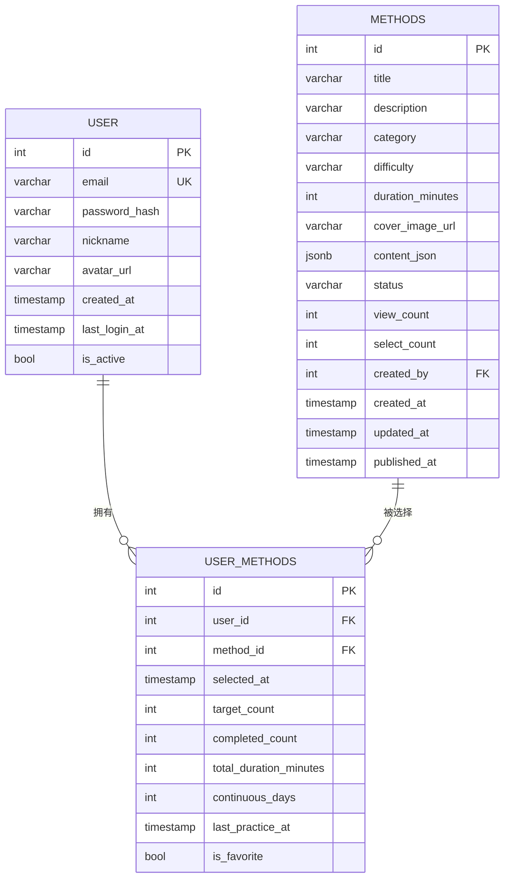
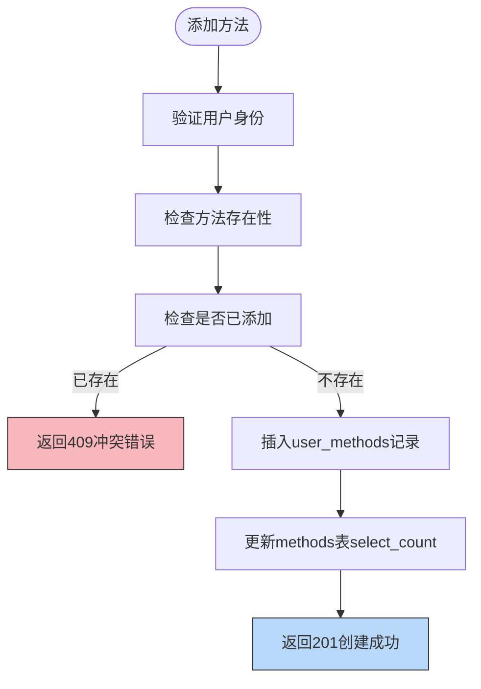
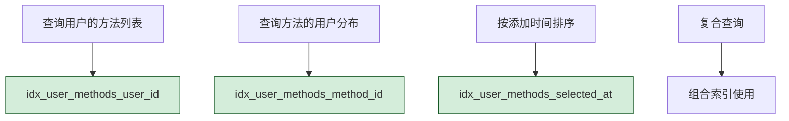
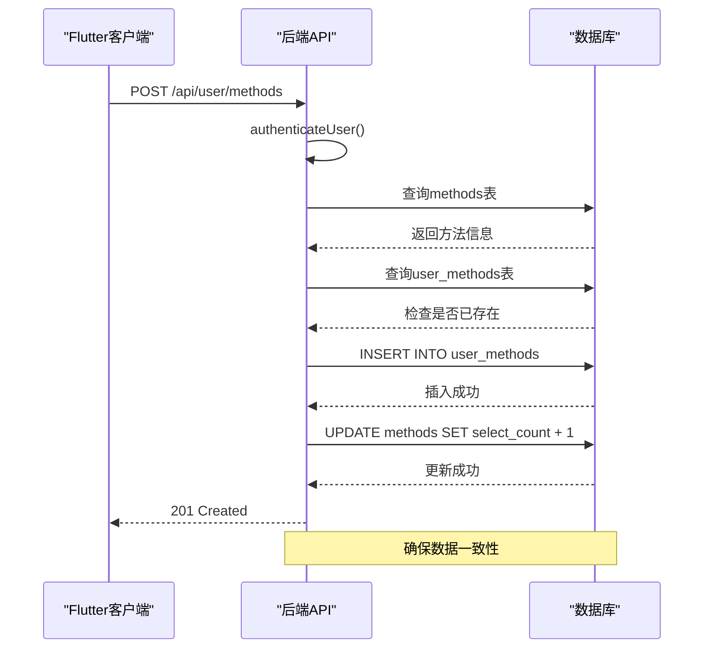
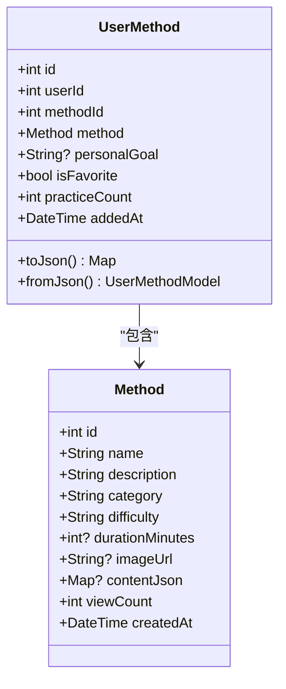
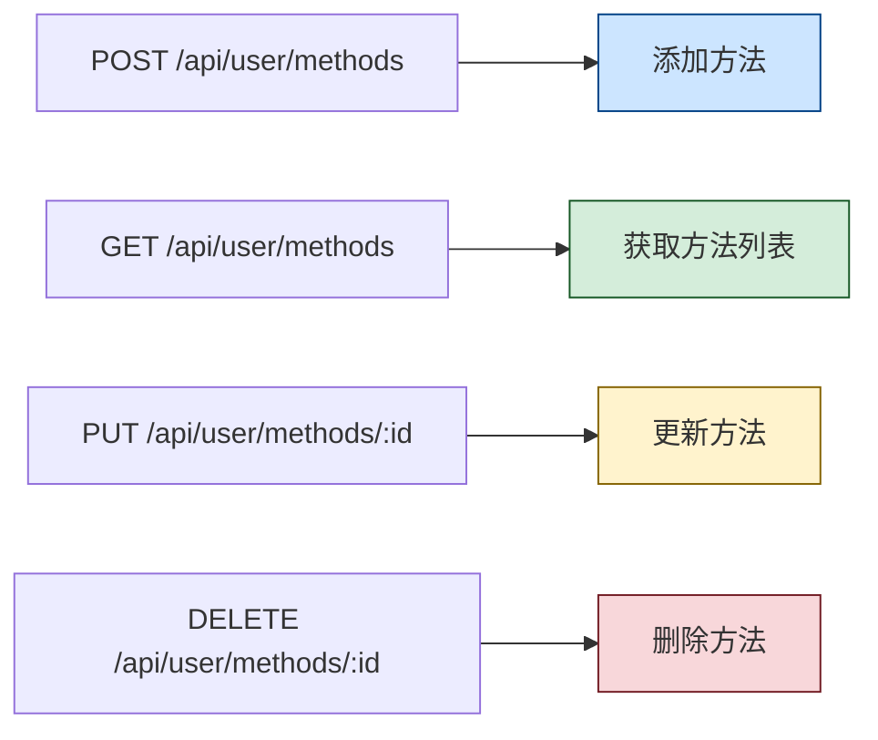

# 用户方法关联表设计

<cite>
**本文档引用文件**   
- [init.sql](file://database/init.sql#L43-L59)
- [userMethod.controller.ts](file://backend/src/controllers/userMethod.controller.ts#L6-L162)
- [userMethod.routes.ts](file://backend/src/routes/userMethod.routes.ts#L7-L20)
- [index.ts](file://backend/src/types/index.ts#L38-L49)
- [user_method_model.dart](file://flutter_app/lib/data/models/user_method_model.dart#L5-L44)
- [user_method.dart](file://flutter_app/lib/domain/entities/user_method.dart#L7-L58)
- [user_method_repository_impl.dart](file://flutter_app/lib/data/repositories/user_method_repository_impl.dart#L9-L84)
- [user_method_remote_data_source.dart](file://flutter_app/lib/data/datasources/remote/user_method_remote_data_source.dart#L7-L86)
</cite>

## 目录
1. [引言](#引言)
2. [表结构设计](#表结构设计)
3. [核心字段语义分析](#核心字段语义分析)
4. [约束机制详解](#约束机制详解)
5. [索引优化策略](#索引优化策略)
6. [系统集成与业务流程](#系统集成与业务流程)
7. [数据模型映射](#数据模型映射)
8. [API接口设计](#api接口设计)
9. [核心地位与业务价值](#核心地位与业务价值)
10. [结论](#结论)

## 引言
用户方法关联表（user_methods）是心理自助应用系统中的核心数据结构，作为用户与心理调节方法之间的多对多关系桥梁，支撑着用户个性化方法库的构建。该表不仅记录了用户选择的方法，还存储了用户的练习目标、收藏状态等个性化信息，是实现个性化心理服务的关键。

## 表结构设计

**图表来源**
- [init.sql](file://database/init.sql#L43-L56)

**本节来源**
- [init.sql](file://database/init.sql#L43-L56)

## 核心字段语义分析

用户方法关联表包含多个关键业务字段，每个字段都承载着特定的业务语义：

- **user_id**: 用户外键，指向users表的id字段，标识该记录所属的用户
- **method_id**: 方法外键，指向methods表的id字段，标识用户选择的心理调节方法
- **selected_at**: 时间戳字段，记录用户添加该方法到个人库的时间，默认值为当前时间
- **target_count**: 整数字段，表示用户设定的练习目标次数，初始值为0
- **completed_count**: 整数字段，记录用户已完成的练习次数
- **total_duration_minutes**: 整数字段，累计用户练习该方法的总时长（分钟）
- **continuous_days**: 整数字段，记录用户连续练习该方法的天数
- **last_practice_at**: 时间戳字段，记录用户最后一次练习该方法的时间
- **is_favorite**: 布尔字段，表示用户是否将该方法标记为收藏，用于快速访问

**本节来源**
- [init.sql](file://database/init.sql#L46-L54)
- [index.ts](file://backend/src/types/index.ts#L38-L49)

## 约束机制详解

**图表来源**
- [userMethod.controller.ts](file://backend/src/controllers/userMethod.controller.ts#L7-L56)

**本节来源**
- [init.sql](file://database/init.sql#L55)
- [userMethod.controller.ts](file://backend/src/controllers/userMethod.controller.ts#L29-L37)

用户方法关联表通过多重约束机制确保数据的完整性和一致性：

### 外键约束
表中定义了两个外键约束：
- `user_id` 引用 `users(id)`，并设置 `ON DELETE CASCADE`，当用户被删除时，其所有方法关联记录也会被级联删除
- `method_id` 引用 `methods(id)`，同样设置 `ON DELETE CASCADE`，当方法被删除时，所有用户对该方法的关联记录也会被删除

### 唯一性约束
`UNIQUE(user_id, method_id)` 约束确保了同一用户不能重复添加同一方法，这是防止数据冗余的关键机制。在应用层面，`addUserMethod` 控制器也实现了双重检查，先查询是否已存在相同记录，若存在则抛出409冲突错误。

## 索引优化策略

**图表来源**
- [init.sql](file://database/init.sql#L57-L59)

**本节来源**
- [init.sql](file://database/init.sql#L57-L59)
- [userMethod.controller.ts](file://backend/src/controllers/userMethod.controller.ts#L66-L74)

为优化查询性能，用户方法关联表创建了三个关键索引：

- **idx_user_methods_user_id**: 在 `user_id` 字段上的索引，用于快速查询特定用户的所有方法。当用户访问其个人方法库时，此索引能显著提升查询效率
- **idx_user_methods_method_id**: 在 `method_id` 字段上的索引，用于快速查询选择特定方法的所有用户。此索引支持方法热度统计等分析功能
- **idx_user_methods_selected_at**: 在 `selected_at` 字段上的索引，用于按添加时间排序的查询。结合 `user_id` 索引，可高效实现"最近添加"等排序需求

## 系统集成与业务流程

**图表来源**
- [userMethod.controller.ts](file://backend/src/controllers/userMethod.controller.ts#L7-L56)
- [userMethod.routes.ts](file://backend/src/routes/userMethod.routes.ts#L11)

**本节来源**
- [userMethod.controller.ts](file://backend/src/controllers/userMethod.controller.ts#L7-L56)
- [userMethod.routes.ts](file://backend/src/routes/userMethod.routes.ts#L11-L20)

用户方法关联表深度集成于系统业务流程中，其操作遵循严格的认证和验证流程：

1. **认证保护**: 所有对user_methods表的操作都通过 `authenticateUser` 中间件进行保护，确保只有认证用户才能访问
2. **方法验证**: 在添加方法前，系统会验证目标方法是否存在且状态为"published"
3. **重复检查**: 实现双重检查机制，既依赖数据库唯一约束，也在应用层进行存在性查询
4. **数据联动**: 添加或删除方法时，会同步更新methods表的 `select_count` 字段，保持数据一致性

## 数据模型映射

**图表来源**
- [user_method.dart](file://flutter_app/lib/domain/entities/user_method.dart#L7-L58)
- [user_method_model.dart](file://flutter_app/lib/data/models/user_method_model.dart#L5-L44)

**本节来源**
- [user_method.dart](file://flutter_app/lib/domain/entities/user_method.dart#L7-L58)
- [user_method_model.dart](file://flutter_app/lib/data/models/user_method_model.dart#L5-L44)
- [method_model.dart](file://flutter_app/lib/data/models/method_model.dart#L4-L18)

在Flutter前端应用中，用户方法关联表的数据结构被映射为领域实体和数据模型：

- **UserMethod实体**: 领域层的不可变实体，遵循Equatable模式，用于状态管理和比较
- **UserMethodModel**: 数据层模型，继承自UserMethod，实现了JSON序列化和反序列化
- **Method关联**: UserMethodModel包含完整的MethodModel对象，避免了额外的API调用

## API接口设计

**图表来源**
- [userMethod.routes.ts](file://backend/src/routes/userMethod.routes.ts#L11-L20)

**本节来源**
- [userMethod.routes.ts](file://backend/src/routes/userMethod.routes.ts#L11-L20)
- [userMethod.controller.ts](file://backend/src/controllers/userMethod.controller.ts#L7-L162)

后端为用户方法关联表提供了完整的RESTful API接口：

- **POST /api/user/methods**: 添加方法到个人库，接收 `method_id` 和可选的 `target_count`
- **GET /api/user/methods**: 获取用户的方法列表，返回包含方法详情的完整信息
- **PUT /api/user/methods/:id**: 更新个人方法，支持更新 `target_count` 和 `is_favorite` 等字段
- **DELETE /api/user/methods/:id**: 从个人库中删除方法

所有接口均受认证保护，确保数据安全。

## 核心地位与业务价值

用户方法关联表在系统中具有核心地位，主要体现在：

1. **个性化服务基础**: 作为用户个性化方法库的底层支撑，记录了每个用户的独特选择和偏好
2. **数据聚合中心**: 连接用户、方法和练习记录三大核心实体，是数据分析的关键枢纽
3. **业务逻辑核心**: 支撑收藏、目标设定、连续练习统计等核心功能
4. **性能优化关键**: 通过合理索引设计，支持高效的个性化内容检索
5. **数据一致性保障**: 通过外键和唯一性约束，确保了数据的完整性和一致性

该表的设计充分考虑了可扩展性，未来可轻松添加更多个性化字段，如提醒设置、学习进度等，为系统功能演进提供了坚实基础。

## 结论
用户方法关联表通过精心设计的字段结构、严格的约束机制和优化的索引策略，成功实现了用户与心理调节方法之间的多对多关系管理。其不仅确保了数据的完整性和一致性，还为个性化心理服务提供了坚实的数据基础。表结构与业务逻辑的紧密配合，以及前后端的完整实现，展现了系统设计的成熟度和专业性。