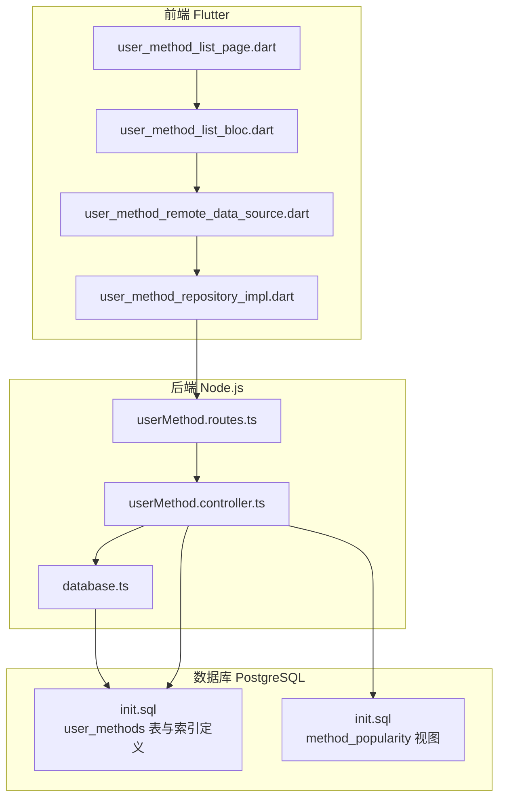
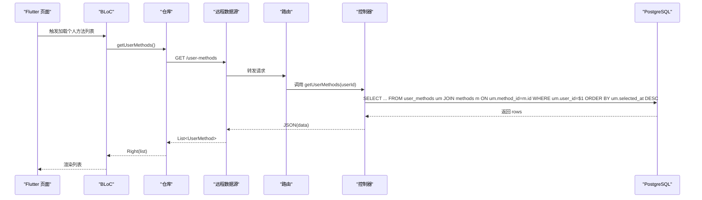
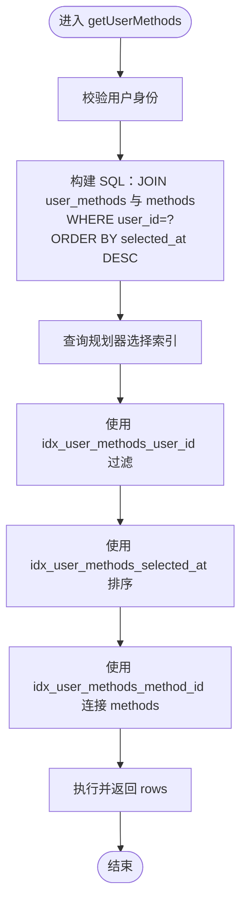
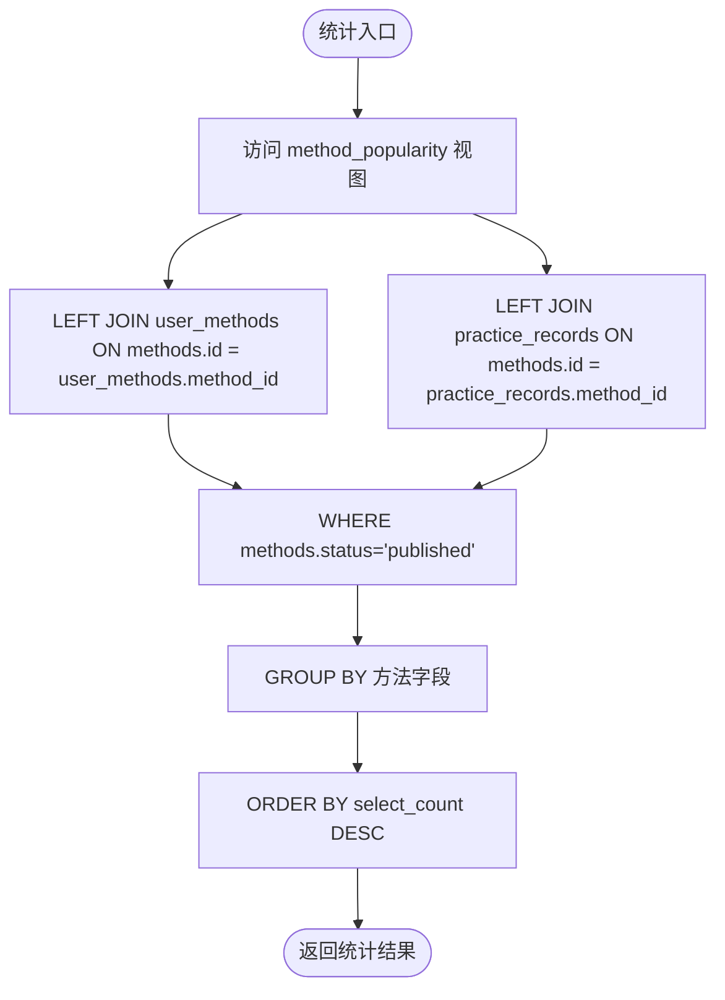
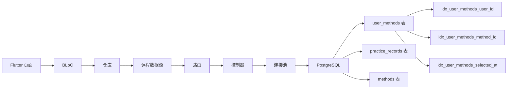

# 索引策略与查询性能

<cite>
**本文引用的文件**
- [database/init.sql](file://database/init.sql)
- [backend/src/controllers/userMethod.controller.ts](file://backend/src/controllers/userMethod.controller.ts)
- [backend/src/routes/userMethod.routes.ts](file://backend/src/routes/userMethod.routes.ts)
- [backend/src/config/database.ts](file://backend/src/config/database.ts)
- [flutter_app/lib/data/datasources/remote/user_method_remote_data_source.dart](file://flutter_app/lib/data/datasources/remote/user_method_remote_data_source.dart)
- [flutter_app/lib/data/repositories/user_method_repository_impl.dart](file://flutter_app/lib/data/repositories/user_method_repository_impl.dart)
- [flutter_app/lib/presentation/user_methods/pages/user_method_list_page.dart](file://flutter_app/lib/presentation/user_methods/pages/user_method_list_page.dart)
- [flutter_app/lib/presentation/user_methods/bloc/user_method_list_bloc.dart](file://flutter_app/lib/presentation/user_methods/bloc/user_method_list_bloc.dart)
- [backend/src/controllers/practice.controller.ts](file://backend/src/controllers/practice.controller.ts)
- [database/init.sql](file://database/init.sql)
</cite>

## 目录
1. [简介](#简介)
2. [项目结构](#项目结构)
3. [核心组件](#核心组件)
4. [架构总览](#架构总览)
5. [详细组件分析](#详细组件分析)
6. [依赖关系分析](#依赖关系分析)
7. [性能考量](#性能考量)
8. [故障排查指南](#故障排查指南)
9. [结论](#结论)

## 简介
本文件聚焦于数据库表 user_methods 的三个关键索引：idx_user_methods_user_id、idx_user_methods_method_id 和 idx_user_methods_selected_at。我们将解释这些索引在高频查询场景中的优化目标，以及它们如何通过减少扫描行数、降低排序成本、加速连接与过滤来提升响应速度。同时，结合实际查询语句与后端控制器逻辑，说明数据库查询规划器如何有效利用这些索引，从而在“用户方法列表加载”和“方法使用统计”等场景中获得显著性能收益。

## 项目结构
为便于定位与分析，以下图示展示与本文相关的核心文件与职责分工：

图表来源
- [backend/src/routes/userMethod.routes.ts](file://backend/src/routes/userMethod.routes.ts#L1-L23)
- [backend/src/controllers/userMethod.controller.ts](file://backend/src/controllers/userMethod.controller.ts#L58-L80)
- [backend/src/config/database.ts](file://backend/src/config/database.ts#L1-L46)
- [database/init.sql](file://database/init.sql#L43-L61)
- [database/init.sql](file://database/init.sql#L316-L346)

章节来源
- [backend/src/routes/userMethod.routes.ts](file://backend/src/routes/userMethod.routes.ts#L1-L23)
- [backend/src/controllers/userMethod.controller.ts](file://backend/src/controllers/userMethod.controller.ts#L58-L80)
- [backend/src/config/database.ts](file://backend/src/config/database.ts#L1-L46)
- [database/init.sql](file://database/init.sql#L43-L61)
- [database/init.sql](file://database/init.sql#L316-L346)

## 核心组件
- user_methods 表与索引
  - user_id 上的索引 idx_user_methods_user_id：用于按用户快速过滤。
  - method_id 上的索引 idx_user_methods_method_id：用于按方法快速过滤。
  - selected_at 上的索引 idx_user_methods_selected_at：用于按选择时间排序与范围查询。
- 用户方法列表查询
  - 控制器通过 user_id 过滤并按 selected_at 降序返回结果，典型查询路径见“详细组件分析”。

章节来源
- [database/init.sql](file://database/init.sql#L43-L61)
- [backend/src/controllers/userMethod.controller.ts](file://backend/src/controllers/userMethod.controller.ts#L58-L80)

## 架构总览
下图展示了从移动端到后端再到数据库的完整调用链路，并标注了与索引优化直接相关的查询点。

图表来源
- [flutter_app/lib/presentation/user_methods/pages/user_method_list_page.dart](file://flutter_app/lib/presentation/user_methods/pages/user_method_list_page.dart#L28-L102)
- [flutter_app/lib/presentation/user_methods/bloc/user_method_list_bloc.dart](file://flutter_app/lib/presentation/user_methods/bloc/user_method_list_bloc.dart#L1-L60)
- [flutter_app/lib/data/repositories/user_method_repository_impl.dart](file://flutter_app/lib/data/repositories/user_method_repository_impl.dart#L1-L40)
- [flutter_app/lib/data/datasources/remote/user_method_remote_data_source.dart](file://flutter_app/lib/data/datasources/remote/user_method_remote_data_source.dart#L12-L21)
- [backend/src/routes/userMethod.routes.ts](file://backend/src/routes/userMethod.routes.ts#L1-L23)
- [backend/src/controllers/userMethod.controller.ts](file://backend/src/controllers/userMethod.controller.ts#L58-L80)
- [database/init.sql](file://database/init.sql#L43-L61)

## 详细组件分析

### 用户方法列表加载（高频场景）
- 查询语义
  - 输入：当前登录用户的 id。
  - 过滤条件：user_id = 用户id。
  - 排序：按 selected_at 降序。
  - 关联：与 methods 表连接以返回方法元信息。
- 索引优化目标
  - 使用 idx_user_methods_user_id 在 WHERE 子句中进行高效过滤，避免全表扫描。
  - 使用 idx_user_methods_selected_at 支持 ORDER BY 无额外排序开销，或在范围查询中减少排序成本。
  - 使用 idx_user_methods_method_id 为后续可能的按方法维度筛选提供基础（例如在扩展功能中支持按方法过滤）。
- 查询规划器行为
  - WHERE 条件命中 user_id 索引，可形成索引扫描或索引唯一扫描。
  - ORDER BY 由 selected_at 索引支撑，避免临时排序文件。
  - JOIN 通过 method_id 索引可减少连接成本。
- 性能收益
  - 显著减少扫描行数与 I/O。
  - 降低 CPU 排序与内存临时排序成本。
  - 在用户方法数量增长时仍保持稳定响应时间。

图表来源
- [backend/src/controllers/userMethod.controller.ts](file://backend/src/controllers/userMethod.controller.ts#L58-L80)
- [database/init.sql](file://database/init.sql#L43-L61)

章节来源
- [backend/src/controllers/userMethod.controller.ts](file://backend/src/controllers/userMethod.controller.ts#L58-L80)
- [database/init.sql](file://database/init.sql#L43-L61)

### 方法使用统计（高频场景）
- 视图定义
  - method_popularity 视图聚合了方法的选择次数、唯一用户数、练习次数与平均有效性等指标。
  - 该视图在统计场景中频繁访问 user_methods 与 practice_records，对索引的合理使用至关重要。
- 索引优化目标
  - user_methods.method_id 与 methods.id 的连接可通过 idx_user_methods_method_id 与方法主键索引高效完成。
  - practice_records.user_id 与 practice_records.method_id 的组合索引可加速按用户与方法的统计查询。
- 性能收益
  - 降低连接与分组的成本，缩短统计报表生成时间。
  - 在高并发场景下，索引可减少锁竞争与阻塞。

图表来源
- [database/init.sql](file://database/init.sql#L316-L346)
- [database/init.sql](file://database/init.sql#L63-L79)

章节来源
- [database/init.sql](file://database/init.sql#L316-L346)
- [database/init.sql](file://database/init.sql#L63-L79)

### 方法练习分布与连续天数统计（辅助场景）
- 练习分布查询会按用户与方法进行分组统计，涉及 user_methods 与 practice_records 的连接。
- 连接与分组的性能受 user_methods.method_id 与 practice_records.method_id 索引影响。
- 最长连续天数查询可利用 user_methods.user_id 索引快速定位用户记录。

章节来源
- [backend/src/controllers/practice.controller.ts](file://backend/src/controllers/practice.controller.ts#L223-L260)
- [database/init.sql](file://database/init.sql#L43-L61)
- [database/init.sql](file://database/init.sql#L63-L79)

## 依赖关系分析
- 前端到后端
  - 页面触发 BLoC，BLoC 调用仓库，仓库通过远程数据源发起 HTTP 请求。
- 后端到数据库
  - 路由层将请求转发至控制器；控制器通过连接池执行 SQL；数据库包含 user_methods 表与相关索引。
- 数据库层面
  - user_methods 表的三个索引分别服务于过滤、排序与连接；method_popularity 视图依赖 user_methods 与 practice_records 的高效连接。

图表来源
- [flutter_app/lib/presentation/user_methods/pages/user_method_list_page.dart](file://flutter_app/lib/presentation/user_methods/pages/user_method_list_page.dart#L28-L102)
- [flutter_app/lib/presentation/user_methods/bloc/user_method_list_bloc.dart](file://flutter_app/lib/presentation/user_methods/bloc/user_method_list_bloc.dart#L1-L60)
- [flutter_app/lib/data/repositories/user_method_repository_impl.dart](file://flutter_app/lib/data/repositories/user_method_repository_impl.dart#L1-L40)
- [flutter_app/lib/data/datasources/remote/user_method_remote_data_source.dart](file://flutter_app/lib/data/datasources/remote/user_method_remote_data_source.dart#L12-L21)
- [backend/src/routes/userMethod.routes.ts](file://backend/src/routes/userMethod.routes.ts#L1-L23)
- [backend/src/controllers/userMethod.controller.ts](file://backend/src/controllers/userMethod.controller.ts#L58-L80)
- [backend/src/config/database.ts](file://backend/src/config/database.ts#L1-L46)
- [database/init.sql](file://database/init.sql#L43-L61)
- [database/init.sql](file://database/init.sql#L63-L79)

章节来源
- [backend/src/config/database.ts](file://backend/src/config/database.ts#L1-L46)
- [database/init.sql](file://database/init.sql#L43-L61)
- [database/init.sql](file://database/init.sql#L63-L79)

## 性能考量
- 索引选择性
  - user_id 与 method_id 均具备较高选择性，适合建立单列索引。
  - selected_at 作为时间戳，适合建立索引以支持排序与范围查询。
- 组合索引建议
  - 若未来出现按 user_id + method_id 的复合过滤需求，可考虑创建组合索引以进一步减少连接成本。
- 统计视图与索引
  - method_popularity 视图的统计查询受益于 user_methods.method_id 与 practice_records.method_id 的索引，建议定期更新统计表或视图的统计信息以帮助规划器做出更优决策。
- 连接池与并发
  - 合理的连接池参数有助于在高并发场景下减少等待时间，配合索引可进一步提升吞吐量。

[本节为通用性能讨论，不直接分析具体文件]

## 故障排查指南
- 列表加载缓慢
  - 检查是否正确使用 user_id 过滤与 selected_at 排序。
  - 确认 idx_user_methods_user_id 与 idx_user_methods_selected_at 是否存在且未被破坏。
- 统计报表延迟
  - 检查 method_popularity 视图的执行计划，确认连接与分组是否命中索引。
  - 关注 user_methods.method_id 与 practice_records.method_id 的索引使用情况。
- 数据库连接问题
  - 检查连接池配置与连接状态，确保连接可用。

章节来源
- [backend/src/config/database.ts](file://backend/src/config/database.ts#L1-L46)
- [database/init.sql](file://database/init.sql#L43-L61)
- [database/init.sql](file://database/init.sql#L316-L346)

## 结论
- idx_user_methods_user_id、idx_user_methods_method_id 与 idx_user_methods_selected_at 三者协同，分别针对过滤、连接与排序提供了关键性能保障。
- 在“用户方法列表加载”这一高频场景中，这三个索引共同作用，使查询规划器能够以最小代价完成过滤、连接与排序，从而显著降低响应时间。
- 在“方法使用统计”等聚合场景中，索引同样发挥重要作用，确保视图与统计查询的稳定性与可扩展性。
- 建议持续监控查询执行计划，结合业务增长趋势适时调整索引策略与统计信息更新频率，以维持长期稳定的性能表现。