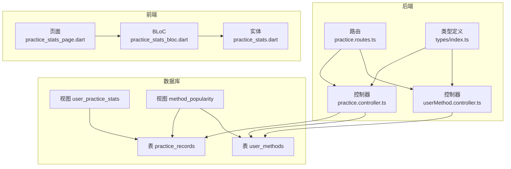
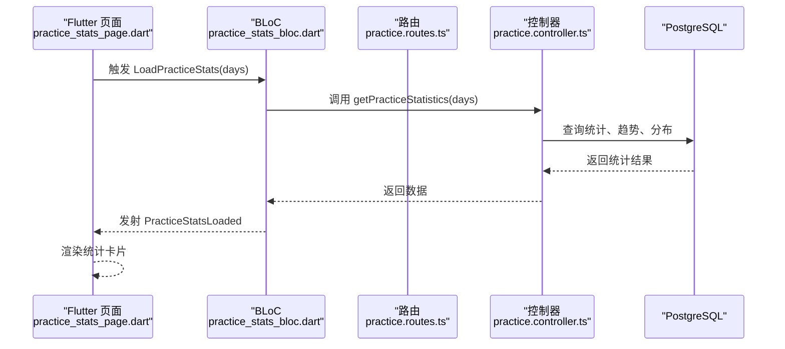
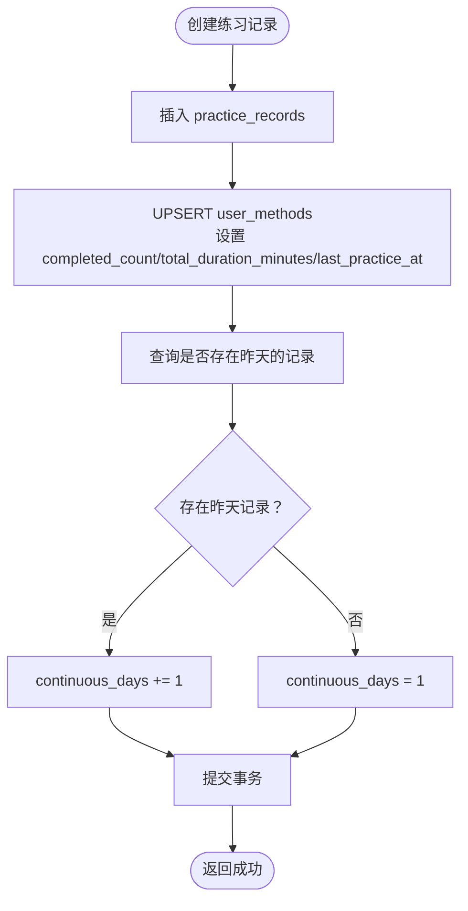
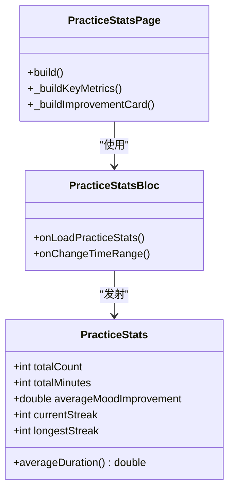
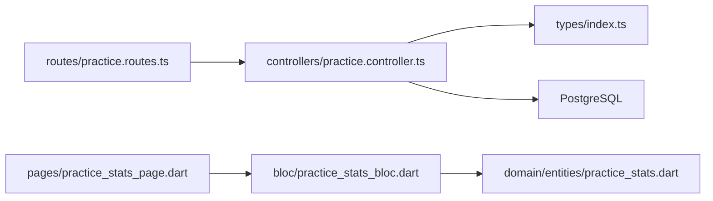

# 练习数据统计与追踪

<cite>
**本文引用的文件**
- [database/init.sql](file://database/init.sql)
- [backend/src/controllers/practice.controller.ts](file://backend/src/controllers/practice.controller.ts)
- [backend/src/controllers/userMethod.controller.ts](file://backend/src/controllers/userMethod.controller.ts)
- [backend/src/routes/practice.routes.ts](file://backend/src/routes/practice.routes.ts)
- [backend/src/types/index.ts](file://backend/src/types/index.ts)
- [flutter_app/lib/presentation/practice/bloc/practice_stats_bloc.dart](file://flutter_app/lib/presentation/practice/bloc/practice_stats_bloc.dart)
- [flutter_app/lib/presentation/practice/pages/practice_stats_page.dart](file://flutter_app/lib/presentation/practice/pages/practice_stats_page.dart)
- [flutter_app/lib/domain/entities/practice_stats.dart](file://flutter_app/lib/domain/entities/practice_stats.dart)
</cite>

## 目录
1. [引言](#引言)
2. [项目结构](#项目结构)
3. [核心组件](#核心组件)
4. [架构总览](#架构总览)
5. [详细组件分析](#详细组件分析)
6. [依赖关系分析](#依赖关系分析)
7. [性能考量](#性能考量)
8. [故障排查指南](#故障排查指南)
9. [结论](#结论)
10. [附录](#附录)

## 引言
本文件围绕数据库表 user_methods 的聚合字段在“练习数据分析”中的作用展开，重点解释以下字段的更新机制：
- completed_count：完成次数
- total_duration_minutes：总时长（分钟）
- continuous_days：连续练习天数
- last_practice_at：最后一次练习时间

同时说明 last_practice_at 如何用于计算连续练习天数，并讨论这些数据如何支撑个性化推荐策略（如优先推荐练习次数少或连续天数中断的方法）。最后结合 Flutter 应用中的 practice_stats_bloc 与 practice_stats_page.dart，展示统计信息在前端的可视化呈现方式。

## 项目结构
该仓库包含后端（Node.js + Express + PostgreSQL）、Flutter 前端、数据库初始化脚本与文档。与本主题直接相关的模块如下：
- 后端控制器与路由：负责创建练习记录、读取统计、维护 user_methods 聚合字段
- 数据库初始化脚本：定义 user_methods 表及视图
- Flutter BLoC 与页面：负责加载并展示统计结果

图表来源
- [backend/src/routes/practice.routes.ts](file://backend/src/routes/practice.routes.ts#L1-L20)
- [backend/src/controllers/practice.controller.ts](file://backend/src/controllers/practice.controller.ts#L1-L99)
- [backend/src/controllers/userMethod.controller.ts](file://backend/src/controllers/userMethod.controller.ts#L1-L162)
- [backend/src/types/index.ts](file://backend/src/types/index.ts#L37-L63)
- [database/init.sql](file://database/init.sql#L43-L80)
- [flutter_app/lib/presentation/practice/pages/practice_stats_page.dart](file://flutter_app/lib/presentation/practice/pages/practice_stats_page.dart#L1-L329)
- [flutter_app/lib/presentation/practice/bloc/practice_stats_bloc.dart](file://flutter_app/lib/presentation/practice/bloc/practice_stats_bloc.dart#L1-L56)
- [flutter_app/lib/domain/entities/practice_stats.dart](file://flutter_app/lib/domain/entities/practice_stats.dart#L1-L47)

章节来源
- [backend/src/routes/practice.routes.ts](file://backend/src/routes/practice.routes.ts#L1-L20)
- [backend/src/controllers/practice.controller.ts](file://backend/src/controllers/practice.controller.ts#L1-L99)
- [database/init.sql](file://database/init.sql#L43-L80)

## 核心组件
- user_methods 表：存储用户与方法的关联及其聚合统计（完成次数、总时长、连续天数、最近练习时间等）
- practice_records 表：记录每次练习的日期、时长、前后心理状态等
- 练习控制器：在创建练习记录时，原子性地更新 user_methods 的聚合字段
- 统计接口：提供按时间窗口聚合的总体统计、趋势与分布
- Flutter BLoC 页面：加载并渲染统计卡片

章节来源
- [database/init.sql](file://database/init.sql#L43-L80)
- [backend/src/controllers/practice.controller.ts](file://backend/src/controllers/practice.controller.ts#L1-L99)
- [flutter_app/lib/presentation/practice/bloc/practice_stats_bloc.dart](file://flutter_app/lib/presentation/practice/bloc/practice_stats_bloc.dart#L1-L56)
- [flutter_app/lib/presentation/practice/pages/practice_stats_page.dart](file://flutter_app/lib/presentation/practice/pages/practice_stats_page.dart#L1-L329)

## 架构总览
后端通过路由将请求转发至控制器；控制器在数据库事务内执行多步写操作，确保一致性。前端通过 BLoC 发起请求，页面根据状态渲染统计卡片。

图表来源
- [flutter_app/lib/presentation/practice/pages/practice_stats_page.dart](file://flutter_app/lib/presentation/practice/pages/practice_stats_page.dart#L1-L329)
- [flutter_app/lib/presentation/practice/bloc/practice_stats_bloc.dart](file://flutter_app/lib/presentation/practice/bloc/practice_stats_bloc.dart#L1-L56)
- [backend/src/routes/practice.routes.ts](file://backend/src/routes/practice.routes.ts#L1-L20)
- [backend/src/controllers/practice.controller.ts](file://backend/src/controllers/practice.controller.ts#L174-L261)

## 详细组件分析

### user_methods 聚合字段的更新机制
- 触发时机：每次用户完成一次练习记录（practice_records）时，后端在事务中同步更新 user_methods 的聚合字段
- 更新内容：
  - completed_count：自增 1
  - total_duration_minutes：累加本次时长
  - last_practice_at：更新为当前时间
  - continuous_days：基于“是否存在昨天的记录”决定自增或重置为 1
- 事务保证：使用 BEGIN/COMMIT/ROLLBACK，确保多步写入的一致性

图表来源
- [backend/src/controllers/practice.controller.ts](file://backend/src/controllers/practice.controller.ts#L34-L99)

章节来源
- [backend/src/controllers/practice.controller.ts](file://backend/src/controllers/practice.controller.ts#L34-L99)

### last_practice_at 与连续练习天数的计算
- last_practice_at 字段用于标记某用户在某方法上的最近一次练习时间
- 计算连续天数的规则：
  - 若存在“昨天”的练习记录，则 continuous_days 自增 1
  - 若不存在“昨天”的记录，则 continuous_days 重置为 1
- 该规则确保连续天数只在“连续”情况下递增，中断即重置，符合常见的健身/打卡场景

章节来源
- [backend/src/controllers/practice.controller.ts](file://backend/src/controllers/practice.controller.ts#L60-L84)

### 练习统计接口与数据来源
- 接口路径：/api/practice/statistics
- 支持按周/月/年的时间窗口过滤
- 返回字段：
  - total_practices：总练习次数
  - total_duration：总时长（分钟）
  - practice_days：练习天数（去重）
  - avg_mood_improvement：平均心情改善
  - max_continuous_days：最长连续天数（来自 user_methods）
  - mood_trend：按日期的平均前后心理状态趋势
  - method_distribution：按方法的练习次数与总时长分布

章节来源
- [backend/src/routes/practice.routes.ts](file://backend/src/routes/practice.routes.ts#L1-L20)
- [backend/src/controllers/practice.controller.ts](file://backend/src/controllers/practice.controller.ts#L174-L261)

### Flutter 端实践：统计卡片的可视化
- 页面入口：PracticeStatsPage 在构建时创建 BLoC，并发起加载事件
- BLoC：PracticeStatsBloc 处理 LoadPracticeStats/ChangeTimeRange 事件，调用仓库获取统计
- 实体：PracticeStats 封装了 totalCount、totalMinutes、averageMoodImprovement、currentStreak、longestStreak 等字段
- 页面渲染：根据状态显示加载、错误或统计卡片，包含总次数、总时长、平均心情改善等指标

图表来源
- [flutter_app/lib/domain/entities/practice_stats.dart](file://flutter_app/lib/domain/entities/practice_stats.dart#L1-L47)
- [flutter_app/lib/presentation/practice/bloc/practice_stats_bloc.dart](file://flutter_app/lib/presentation/practice/bloc/practice_stats_bloc.dart#L1-L56)
- [flutter_app/lib/presentation/practice/pages/practice_stats_page.dart](file://flutter_app/lib/presentation/practice/pages/practice_stats_page.dart#L1-L329)

章节来源
- [flutter_app/lib/domain/entities/practice_stats.dart](file://flutter_app/lib/domain/entities/practice_stats.dart#L1-L47)
- [flutter_app/lib/presentation/practice/bloc/practice_stats_bloc.dart](file://flutter_app/lib/presentation/practice/bloc/practice_stats_bloc.dart#L1-L56)
- [flutter_app/lib/presentation/practice/pages/practice_stats_page.dart](file://flutter_app/lib/presentation/practice/pages/practice_stats_page.dart#L1-L329)

### 数据库表与视图概览
- user_methods：用户-方法关联表，包含聚合字段
- practice_records：练习记录表，按日期分组可统计天数与趋势
- 视图 user_practice_stats：按用户汇总练习次数、总时长、练习天数与平均心情改善
- 视图 method_popularity：按方法维度统计选择人数、练习次数与有效性

章节来源
- [database/init.sql](file://database/init.sql#L43-L80)
- [database/init.sql](file://database/init.sql#L316-L346)

## 依赖关系分析
- 后端依赖链：
  - 路由依赖认证中间件，再调用控制器
  - 控制器依赖数据库连接池与类型定义
  - 控制器写入 practice_records 与 user_methods，读取视图辅助统计
- 前端依赖链：
  - 页面依赖 BLoC
  - BLoC 依赖仓库接口
  - 仓库实现依赖远程数据源与网络客户端

图表来源
- [backend/src/routes/practice.routes.ts](file://backend/src/routes/practice.routes.ts#L1-L20)
- [backend/src/controllers/practice.controller.ts](file://backend/src/controllers/practice.controller.ts#L1-L99)
- [backend/src/types/index.ts](file://backend/src/types/index.ts#L37-L63)
- [flutter_app/lib/presentation/practice/pages/practice_stats_page.dart](file://flutter_app/lib/presentation/practice/pages/practice_stats_page.dart#L1-L329)
- [flutter_app/lib/presentation/practice/bloc/practice_stats_bloc.dart](file://flutter_app/lib/presentation/practice/bloc/practice_stats_bloc.dart#L1-L56)
- [flutter_app/lib/domain/entities/practice_stats.dart](file://flutter_app/lib/domain/entities/practice_stats.dart#L1-L47)

章节来源
- [backend/src/routes/practice.routes.ts](file://backend/src/routes/practice.routes.ts#L1-L20)
- [backend/src/controllers/practice.controller.ts](file://backend/src/controllers/practice.controller.ts#L1-L99)
- [flutter_app/lib/presentation/practice/pages/practice_stats_page.dart](file://flutter_app/lib/presentation/practice/pages/practice_stats_page.dart#L1-L329)

## 性能考量
- 事务写入：在创建练习记录时，将插入记录与更新聚合字段放在同一事务中，避免并发导致的数据不一致
- 索引优化：对 practice_records 的 user_id+date、user_id+method_id、created_at 等建立索引，有利于统计查询与历史检索
- 视图使用：通过视图简化统计聚合逻辑，减少重复 SQL
- 前端缓存：BLoC 可以缓存最近一次的统计结果，减少重复请求

[本节为通用性能建议，无需特定文件来源]

## 故障排查指南
- 创建练习记录失败
  - 检查认证头与参数校验（method_id、duration_minutes、mood 范围）
  - 查看事务回滚日志，确认是否因冲突或约束失败
- 聚合字段未更新
  - 确认 user_methods 的 UPSERT 是否执行（completed_count、total_duration_minutes、last_practice_at）
  - 检查连续天数逻辑：是否存在昨天记录决定自增或重置
- 统计接口异常
  - 核对时间窗口参数（week/month/year）
  - 检查视图依赖的表结构与索引是否完整

章节来源
- [backend/src/controllers/practice.controller.ts](file://backend/src/controllers/practice.controller.ts#L1-L99)
- [backend/src/controllers/userMethod.controller.ts](file://backend/src/controllers/userMethod.controller.ts#L1-L162)
- [database/init.sql](file://database/init.sql#L43-L80)

## 结论
- user_methods 的聚合字段在每次用户完成练习记录时被原子性更新，确保数据一致性
- last_practice_at 与“是否存在昨天记录”的判断共同构成连续天数的计算逻辑
- 后端统计接口提供多维聚合与趋势，前端通过 BLoC 与页面进行可视化展示
- 这些数据可用于个性化推荐：优先向“练习次数较少”或“连续天数中断”的用户推荐相应方法，以提升参与度与坚持率

[本节为总结性内容，无需特定文件来源]

## 附录
- 字段定义与用途
  - completed_count：累计某方法的完成次数
  - total_duration_minutes：累计某方法的总时长
  - continuous_days：连续练习天数（基于 last_practice_at 与昨天记录判定）
  - last_practice_at：最近一次练习时间
- 推荐策略思路
  - 对于“练习次数少”的用户：优先推荐低门槛、易坚持的方法
  - 对于“连续天数中断”的用户：优先推荐短时长、可快速完成的方法，帮助重建习惯

[本节为概念性内容，无需特定文件来源]