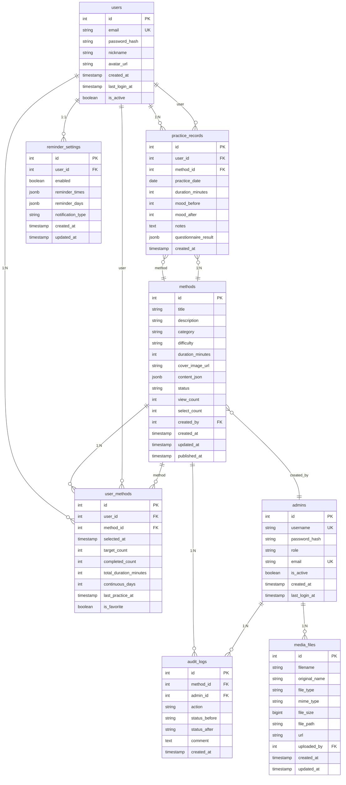

# 实体关系模型

<cite>
**本文档引用的文件**  
- [init.sql](file://database/init.sql#L1-L349)
- [userMethod.controller.ts](file://backend/src/controllers/userMethod.controller.ts#L1-L162)
- [practice.controller.ts](file://backend/src/controllers/practice.controller.ts#L1-L261)
- [method.controller.ts](file://backend/src/controllers/method.controller.ts#L1-L153)
- [types/index.ts](file://backend/src/types/index.ts#L1-L126)
- [user_model.dart](file://flutter_app/lib/data/models/user_model.dart#L1-L44)
- [method_model.dart](file://flutter_app/lib/data/models/method_model.dart#L1-L54)
- [practice_record_model.dart](file://flutter_app/lib/data/models/practice_record_model.dart#L1-L93)
- [user_method_model.dart](file://flutter_app/lib/data/models/user_method_model.dart#L1-L89)
</cite>

## 目录
1. [引言](#引言)
2. [核心实体关系图](#核心实体关系图)
3. [实体关系详细说明](#实体关系详细说明)
4. [外键约束与数据完整性](#外键约束与数据完整性)
5. [业务场景支持分析](#业务场景支持分析)
6. [结论](#结论)

## 引言
nian项目是一个全平台心理自助应用系统，其数据库设计围绕用户、心理自助方法、练习记录等核心概念构建。本文档旨在全面解析系统的实体关系模型，重点阐述users、methods、practice_records和user_methods四个核心实体之间的关联方式。通过详细的实体关系图（ERD）和业务逻辑分析，展示系统如何通过精心设计的数据结构支持个性化推荐、练习历史追踪和内容审核等关键功能。

**Section sources**
- [init.sql](file://database/init.sql#L1-L349)
- [types/index.ts](file://backend/src/types/index.ts#L1-L126)

## 核心实体关系图

**Diagram sources**
- [init.sql](file://database/init.sql#L5-L143)
- [types/index.ts](file://backend/src/types/index.ts#L4-L49)

## 实体关系详细说明
nian项目的实体关系模型设计精巧，通过一对多和多对多关系的组合，实现了灵活而强大的数据关联。核心实体users、methods、practice_records和user_methods构成了系统的主要数据骨架。

用户（users）与练习记录（practice_records）之间存在典型的一对多关系。每个用户可以拥有多个练习记录，这通过practice_records表中的user_id外键实现。这种设计支持了练习历史追踪功能，系统可以轻松查询特定用户的所有练习记录，并进行统计分析。同样，心理自助方法（methods）与练习记录之间也是一对多关系，每个方法可以被多个用户练习，产生多条记录。

用户与方法之间的关系更为复杂，通过关联表user_methods实现了多对多关系。一个用户可以收藏多个方法，一个方法也可以被多个用户收藏。user_methods表不仅作为连接表，还存储了丰富的用户个性化数据，如target_count（目标练习次数）、completed_count（已完成次数）、is_favorite（是否收藏）等。这种设计使得系统能够跟踪用户对每个方法的使用情况，为个性化推荐提供数据支持。

在user_methods表中，user_id和method_id字段都设置了ON DELETE CASCADE约束，这意味着当用户或方法被删除时，相关的关联记录也会被自动删除，保证了数据的一致性。而practice_records表同样采用了ON DELETE CASCADE，确保用户删除时其所有练习记录也被清除。

**Section sources**
- [init.sql](file://database/init.sql#L43-L56)
- [init.sql](file://database/init.sql#L62-L74)
- [userMethod.controller.ts](file://backend/src/controllers/userMethod.controller.ts#L7-L162)
- [practice.controller.ts](file://backend/src/controllers/practice.controller.ts#L7-L261)

## 外键约束与数据完整性
nian项目的数据库设计高度重视数据完整性，通过精心设计的外键约束来维护数据的一致性和准确性。外键约束不仅定义了实体间的关联，还通过ON DELETE行为控制了级联操作，防止出现孤立的记录。

在user_methods表中，user_id和method_id字段都设置了ON DELETE CASCADE约束。这意味着当一个用户被删除时，该用户的所有方法收藏记录将被自动删除；同样，当一个方法被删除时，所有用户对该方法的收藏记录也将被清除。这种设计确保了数据的完整性，避免了"悬挂"的关联记录。例如，在practice.controller.ts的createPracticeRecord函数中，当用户记录一次练习时，系统会同时更新user_methods表中的completed_count和total_duration_minutes字段，这种事务性操作保证了数据的一致性。

相比之下，audit_logs（审核记录）表采用了ON DELETE SET NULL策略。当一个方法被删除时，相关的审核记录不会被删除，而是将method_id设置为NULL。这种设计保留了审核历史，即使原始方法已不存在，管理员仍然可以查看该方法的审核过程。同样，media_files（媒体文件）表中的uploaded_by字段也使用了ON DELETE SET NULL，确保文件上传记录不会因上传者账户删除而丢失。

这些外键约束的选择体现了不同的业务需求：对于用户生成的内容（如收藏、练习记录），采用级联删除是合理的，因为这些内容与用户账户紧密绑定；而对于系统操作记录（如审核、文件上传），保留历史记录更为重要，因此采用SET NULL策略。

**Section sources**
- [init.sql](file://database/init.sql#L46-L47)
- [init.sql](file://database/init.sql#L65-L66)
- [init.sql](file://database/init.sql#L112-L113)
- [init.sql](file://database/init.sql#L135)
- [practice.controller.ts](file://backend/src/controllers/practice.controller.ts#L34-L87)

## 业务场景支持分析
nian项目的实体关系模型设计直接支持了三大核心业务场景：个性化推荐、练习历史追踪和内容审核流程。这些场景的实现依赖于精心设计的实体关系和数据完整性约束。

在个性化推荐方面，user_methods表起到了关键作用。通过分析用户收藏的方法（user_methods），系统可以识别用户的兴趣偏好。在method.controller.ts的getRecommendedMethods函数中，推荐算法首先查找用户已收藏方法的分类，然后推荐同一分类下的其他热门方法。select_count字段记录了每个方法被收藏的次数，作为方法受欢迎程度的指标，用于排序推荐结果。这种基于协同过滤的简单推荐算法，充分利用了user_methods表的多对多关系特性。

练习历史追踪功能依赖于users与practice_records之间的一对多关系。通过practice_records表，系统可以精确记录每次练习的详细信息，包括练习时长、练习前后的情绪评分等。在practice.controller.ts的getPracticeStatistics函数中，系统通过聚合查询计算用户的总练习次数、总时长、情绪改善情况等统计指标。user_methods表中的continuous_days字段更是支持了连续打卡功能，系统通过检查前一天是否有练习记录来更新连续天数，激励用户坚持练习。

内容审核流程由methods、admins和audit_logs三个实体共同支持。当管理员创建一个新方法时，其created_by字段记录了创建者信息。当方法提交审核时，系统在audit_logs表中创建一条记录，记录审核动作、状态变化和评论。在admin.controller.ts的approveMethod和rejectMethod函数中，审核操作不仅更新方法的状态，还记录了审核日志。这种设计实现了完整的审核追溯功能，确保了内容发布的合规性和可审计性。

**Section sources**
- [method.controller.ts](file://backend/src/controllers/method.controller.ts#L100-L136)
- [practice.controller.ts](file://backend/src/controllers/practice.controller.ts#L174-L261)
- [admin.controller.ts](file://backend/src/controllers/admin.controller.ts#L298-L387)
- [init.sql](file://database/init.sql#L109-L123)

## 结论
nian项目的实体关系模型设计体现了良好的数据库设计原则，通过合理的实体划分和关系定义，构建了一个既灵活又稳定的系统基础。users、methods、practice_records和user_methods四个核心实体通过一对多和多对多关系的组合，形成了一个有机的数据网络，有效支持了应用的核心功能。

外键约束和ON DELETE行为的精心选择，确保了数据的完整性和一致性。ON DELETE CASCADE用于用户生成的内容，保证了数据的干净删除；ON DELETE SET NULL用于系统操作记录，保留了重要的历史信息。这种差异化的约束策略，体现了对不同业务场景的深刻理解。

实体关系模型不仅满足了当前的功能需求，还具备良好的扩展性。例如，通过user_methods表的丰富字段设计，系统可以轻松添加新的用户行为跟踪功能；通过audit_logs表的通用设计，可以扩展支持更多类型的审核操作。这种前瞻性的设计，为系统的长期发展奠定了坚实的基础。