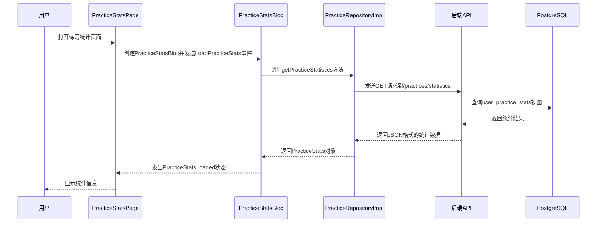

# 实体视图

<cite>
**本文档引用文件**   
- [init.sql](file://database/init.sql#L316-L345)
- [practice.controller.ts](file://backend/src/controllers/practice.controller.ts#L174-L260)
- [method.controller.ts](file://backend/src/controllers/method.controller.ts#L6-L153)
- [practice_stats_page.dart](file://flutter_app/lib/presentation/practice/pages/practice_stats_page.dart#L1-L329)
- [practice_stats_bloc.dart](file://flutter_app/lib/presentation/practice/bloc/practice_stats_bloc.dart#L1-L56)
- [practice_remote_data_source.dart](file://flutter_app/lib/data/datasources/remote/practice_remote_data_source.dart#L60-L84)
</cite>

## 目录
1. [引言](#引言)
2. [数据库视图定义](#数据库视图定义)
3. [user_practice_stats视图详解](#user_practice_stats视图详解)
4. [method_popularity视图详解](#method_popularity视图详解)
5. [性能优化与一致性保障](#性能优化与一致性保障)
6. [前端数据展示实现](#前端数据展示实现)
7. [总结](#总结)

## 引言
nian项目是一个全平台心理自助应用系统，旨在为用户提供个性化的心理自助方法和进度追踪功能。在该系统中，数据库视图扮演着至关重要的角色，特别是在处理复杂的数据聚合和统计分析方面。本文档将全面介绍nian项目中定义的两个核心数据库视图：`user_practice_stats` 和 `method_popularity`。这两个视图不仅简化了复杂查询，还支持前端高效地展示用户练习统计和方法热度信息。通过深入分析这些视图的结构、功能及其在系统中的应用，我们可以更好地理解它们如何优化性能、确保数据一致性和实时性，并为用户提供有价值的洞察。

## 数据库视图定义
在nian项目的数据库初始化脚本中，定义了两个关键的数据库视图：`user_practice_stats` 和 `method_popularity`。这些视图位于 `database/init.sql` 文件中，分别从第316行到第327行和第329行到第345行。视图的创建使用了 `CREATE OR REPLACE VIEW` 语句，确保每次数据库初始化时都能正确更新视图定义。

`user_practice_stats` 视图用于聚合用户的练习统计数据，包括总练习次数、总时长、练习天数和情绪改善平均值。它通过 `LEFT JOIN` 操作将 `users` 表与 `practice_records` 表连接起来，从而计算每个用户的练习统计信息。这种设计避免了在应用层进行复杂的聚合计算，提高了查询效率。

`method_popularity` 视图则用于计算心理自助方法的热度指数和有效性评估。它通过 `LEFT JOIN` 操作将 `methods` 表与 `user_methods` 和 `practice_records` 表连接起来，统计每个方法的浏览次数、选择次数、唯一用户数、总练习次数以及平均情绪改善效果。该视图还通过 `WHERE` 子句过滤出状态为“published”的方法，确保只统计已发布的有效方法。

这两个视图的设计充分考虑了性能优化和数据一致性，使得前端能够快速获取所需的统计信息，而无需在应用层执行复杂的SQL查询。

**Section sources**
- [init.sql](file://database/init.sql#L316-L345)

## user_practice_stats视图详解
`user_practice_stats` 视图是nian项目中用于聚合用户练习统计数据的核心视图。该视图通过 `LEFT JOIN` 操作将 `users` 表与 `practice_records` 表连接起来，从而计算每个用户的练习统计信息。具体来说，视图包含以下字段：

- `user_id`: 用户的唯一标识符。
- `email`: 用户的电子邮件地址。
- `total_practices`: 用户的总练习次数，通过 `COUNT(DISTINCT pr.id)` 计算得出。
- `total_duration`: 用户的总练习时长（分钟），通过 `COALESCE(SUM(pr.duration_minutes), 0)` 计算得出。
- `practice_days`: 用户的练习天数，通过 `COUNT(DISTINCT pr.practice_date)` 计算得出。
- `avg_mood_improvement`: 用户的情绪改善平均值，通过 `COALESCE(AVG(pr.mood_after - pr.mood_before), 0)` 计算得出。

视图的查询逻辑如下：
```sql
SELECT 
    u.id AS user_id,
    u.email,
    COUNT(DISTINCT pr.id) AS total_practices,
    COALESCE(SUM(pr.duration_minutes), 0) AS total_duration,
    COUNT(DISTINCT pr.practice_date) AS practice_days,
    COALESCE(AVG(pr.mood_after - pr.mood_before), 0) AS avg_mood_improvement
FROM users u
LEFT JOIN practice_records pr ON u.id = pr.user_id
GROUP BY u.id, u.email;
```

通过这种方式，`user_practice_stats` 视图能够高效地提供每个用户的练习统计信息，而无需在应用层进行复杂的聚合计算。这不仅提高了查询性能，还确保了统计结果的一致性和实时性。

**Section sources**
- [init.sql](file://database/init.sql#L316-L327)

## method_popularity视图详解
`method_popularity` 视图是nian项目中用于计算心理自助方法热度指数和有效性评估的核心视图。该视图通过 `LEFT JOIN` 操作将 `methods` 表与 `user_methods` 和 `practice_records` 表连接起来，统计每个方法的热度和效果。具体来说，视图包含以下字段：

- `id`: 方法的唯一标识符。
- `title`: 方法的标题。
- `category`: 方法的分类。
- `view_count`: 方法的浏览次数。
- `select_count`: 方法的选择次数。
- `unique_users`: 使用该方法的唯一用户数，通过 `COUNT(DISTINCT um.user_id)` 计算得出。
- `total_practices`: 该方法的总练习次数，通过 `COUNT(DISTINCT pr.id)` 计算得出。
- `avg_effectiveness`: 方法的平均有效性，通过 `COALESCE(AVG(pr.mood_after - pr.mood_before), 0)` 计算得出。

视图的查询逻辑如下：
```sql
SELECT 
    m.id,
    m.title,
    m.category,
    m.view_count,
    m.select_count,
    COUNT(DISTINCT um.user_id) AS unique_users,
    COUNT(DISTINCT pr.id) AS total_practices,
    COALESCE(AVG(pr.mood_after - pr.mood_before), 0) AS avg_effectiveness
FROM methods m
LEFT JOIN user_methods um ON m.id = um.method_id
LEFT JOIN practice_records pr ON m.id = pr.method_id
WHERE m.status = 'published'
GROUP BY m.id, m.title, m.category, m.view_count, m.select_count
ORDER BY m.select_count DESC;
```

通过这种方式，`method_popularity` 视图能够高效地提供每个方法的热度和效果统计信息，而无需在应用层进行复杂的聚合计算。这不仅提高了查询性能，还确保了统计结果的一致性和实时性。

**Section sources**
- [init.sql](file://database/init.sql#L329-L345)

## 性能优化与一致性保障
在nian项目中，`user_practice_stats` 和 `method_popularity` 视图在性能优化和数据一致性方面发挥了重要作用。首先，通过将复杂的聚合计算移至数据库层，这些视图显著减少了应用层的计算负担。例如，在获取用户练习统计时，前端只需调用一个简单的API接口，即可获得所有必要的统计信息，而无需在应用层执行多个查询和聚合操作。

其次，这些视图确保了统计结果的一致性和实时性。由于视图直接从数据库中读取数据，任何对基础表的更新都会立即反映在视图中。这意味着用户在记录新的练习后，其统计信息会立即更新，无需等待后台任务或缓存刷新。此外，视图的使用还避免了因应用层逻辑错误导致的数据不一致问题。

为了进一步优化性能，nian项目还在相关表上创建了适当的索引。例如，在 `practice_records` 表上创建了 `idx_practice_records_user_id_date` 索引，以加速按用户和日期范围的查询。这些索引与视图结合使用，确保了即使在大量数据的情况下，查询性能也能保持高效。

**Section sources**
- [init.sql](file://database/init.sql#L316-L345)
- [practice.controller.ts](file://backend/src/controllers/practice.controller.ts#L174-L260)

## 前端数据展示实现
在nian项目的前端实现中，`user_practice_stats` 和 `method_popularity` 视图的数据被广泛用于展示用户练习统计和方法热度信息。以 `PracticeStatsPage` 为例，该页面通过 `PracticeStatsBloc` 获取用户的练习统计信息，并将其展示在界面上。

`PracticeStatsBloc` 通过 `PracticeRepositoryImpl` 调用后端的 `/practices/statistics` 接口，获取用户的练习统计信息。后端控制器 `getPracticeStatistics` 在处理该请求时，会执行一系列SQL查询，其中包括对 `user_practice_stats` 视图的查询。这些查询结果被封装成 `PracticeStats` 对象，返回给前端。

前端页面通过 `BlocBuilder` 监听 `PracticeStatsBloc` 的状态变化，并根据不同的状态（如加载中、加载成功、加载失败）显示相应的UI组件。例如，在加载成功状态下，页面会显示关键指标卡片、改善度卡片和频次说明，帮助用户了解自己的练习情况。



**Diagram sources**
- [practice_stats_page.dart](file://flutter_app/lib/presentation/practice/pages/practice_stats_page.dart#L1-L329)
- [practice_stats_bloc.dart](file://flutter_app/lib/presentation/practice/bloc/practice_stats_bloc.dart#L1-L56)
- [practice_remote_data_source.dart](file://flutter_app/lib/data/datasources/remote/practice_remote_data_source.dart#L60-L84)
- [practice.controller.ts](file://backend/src/controllers/practice.controller.ts#L174-L260)
- [init.sql](file://database/init.sql#L316-L327)

## 总结
综上所述，`user_practice_stats` 和 `method_popularity` 视图在nian项目中起到了至关重要的作用。它们不仅简化了复杂查询，还支持前端高效地展示用户练习统计和方法热度信息。通过将复杂的聚合计算移至数据库层，这些视图显著提高了查询性能，确保了统计结果的一致性和实时性。此外，适当的索引和高效的查询逻辑进一步优化了系统性能。未来，可以考虑引入缓存机制，进一步提升高并发场景下的响应速度。