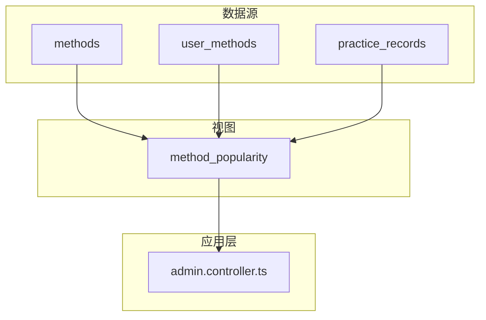
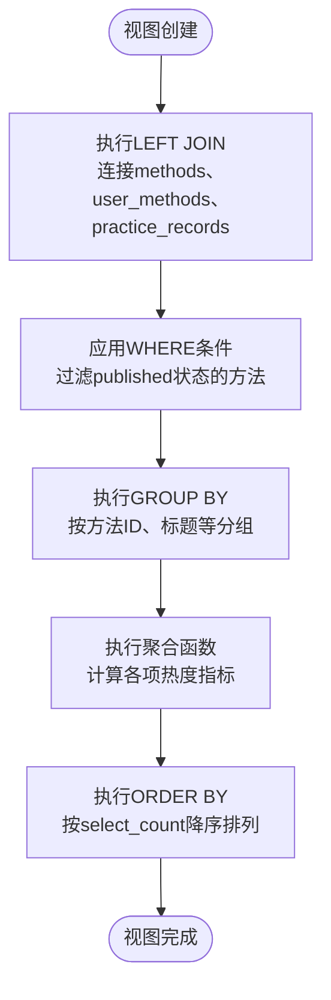
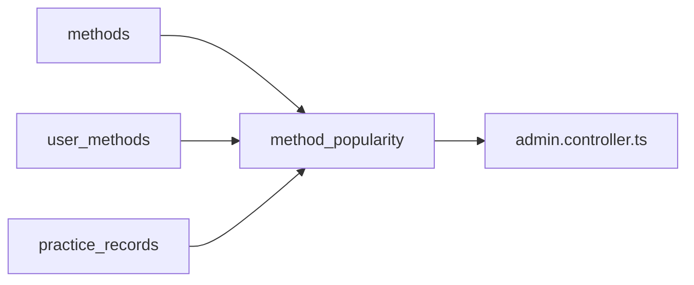

# 方法热度统计视图

<cite>
**本文档引用文件**   
- [init.sql](file://database/init.sql#L329-L345)
- [admin.controller.ts](file://backend/src/controllers/admin.controller.ts#L437-L467)
</cite>

## 目录
1. [方法热度统计视图](#方法热度统计视图)
2. [核心组件](#核心组件)
3. [架构概述](#架构概述)
4. [详细组件分析](#详细组件分析)
5. [依赖分析](#依赖分析)
6. [性能考虑](#性能考虑)
7. [故障排除指南](#故障排除指南)
8. [结论](#结论)

## 方法热度统计视图

`method_popularity`视图是系统中用于分析和展示已发布心理自助方法热度的核心数据视图。该视图通过整合`methods`、`user_methods`和`practice_records`三张表的数据，为管理后台提供全面的方法热度指标，包括浏览量、被选择次数、唯一使用用户数、总练习次数和平均有效性。这些指标对于内容推荐算法和方法优化决策具有重要价值。

## 核心组件

`method_popularity`视图的设计核心在于通过LEFT JOIN连接三个关键数据表：`methods`（方法表）、`user_methods`（用户方法关联表）和`practice_records`（练习记录表）。视图通过WHERE条件过滤仅包含`status = 'published'`的方法，确保统计结果的准确性和相关性。其中，`avg_effectiveness`字段通过计算`mood_after`与`mood_before`的差值平均来量化方法的实际效果，为评估方法的有效性提供了客观数据支持。视图的`ORDER BY m.select_count DESC`子句设计旨在按被选择次数降序排列，便于快速识别最受欢迎的方法。

**Section sources**
- [init.sql](file://database/init.sql#L329-L345)

## 架构概述

**Diagram sources **
- [init.sql](file://database/init.sql#L329-L345)
- [admin.controller.ts](file://backend/src/controllers/admin.controller.ts#L437-L467)

## 详细组件分析

### 视图设计与实现分析

`method_popularity`视图的设计体现了数据聚合和统计分析的最佳实践。通过LEFT JOIN连接三张表，视图能够全面收集方法的使用情况。`COUNT(DISTINCT um.user_id)`计算唯一使用用户数，`COUNT(DISTINCT pr.id)`计算总练习次数，而`COALESCE(AVG(pr.mood_after - pr.mood_before), 0)`则巧妙地处理了可能的空值情况，确保平均有效性指标的可靠性。

**Diagram sources **
- [init.sql](file://database/init.sql#L329-L345)

## 依赖分析

**Diagram sources **
- [init.sql](file://database/init.sql#L329-L345)
- [admin.controller.ts](file://backend/src/controllers/admin.controller.ts#L437-L467)

**Section sources**
- [init.sql](file://database/init.sql#L329-L345)
- [admin.controller.ts](file://backend/src/controllers/admin.controller.ts#L437-L467)

## 性能考虑

为了优化`method_popularity`视图的查询性能，建议在相关联的外键字段上建立索引。数据库中已存在`idx_methods_status`、`idx_user_methods_method_id`和`idx_practice_records_method_id`等索引，这些索引有助于加速JOIN操作和WHERE条件过滤。然而，考虑到视图的ORDER BY子句基于`select_count`字段，建议在`methods.select_count`字段上创建索引，以进一步提升排序性能。此外，由于视图涉及多个表的连接和聚合操作，对于大数据量场景，可以考虑定期物化视图或使用缓存机制来提高查询效率。

## 故障排除指南

当`method_popularity`视图返回结果异常时，应首先检查`methods`表中相关方法的`status`字段是否正确设置为`published`。其次，验证`user_methods`和`practice_records`表中是否存在对应的方法ID数据。如果`avg_effectiveness`字段值异常，需要检查`practice_records`表中的`mood_before`和`mood_after`字段数据是否完整且在有效范围内（1-10）。对于性能问题，应使用EXPLAIN ANALYZE命令分析查询执行计划，确认索引是否被有效利用。

**Section sources**
- [init.sql](file://database/init.sql#L329-L345)

## 结论

`method_popularity`视图通过精心设计的SQL查询，成功整合了多张表的数据，为心理自助应用提供了关键的热度分析功能。视图不仅准确计算了方法的各项热度指标，还通过合理的排序设计，为管理后台的内容推荐和方法优化提供了有力的数据支持。未来可通过增加索引、优化查询计划和引入缓存策略等方式进一步提升视图的性能表现。