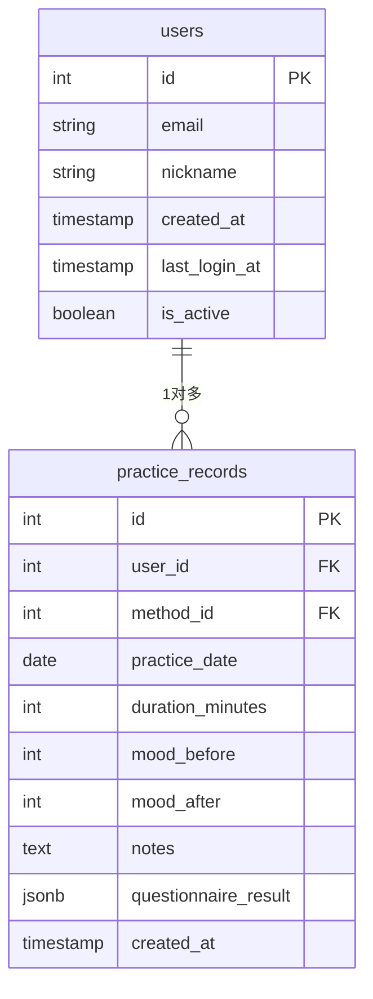
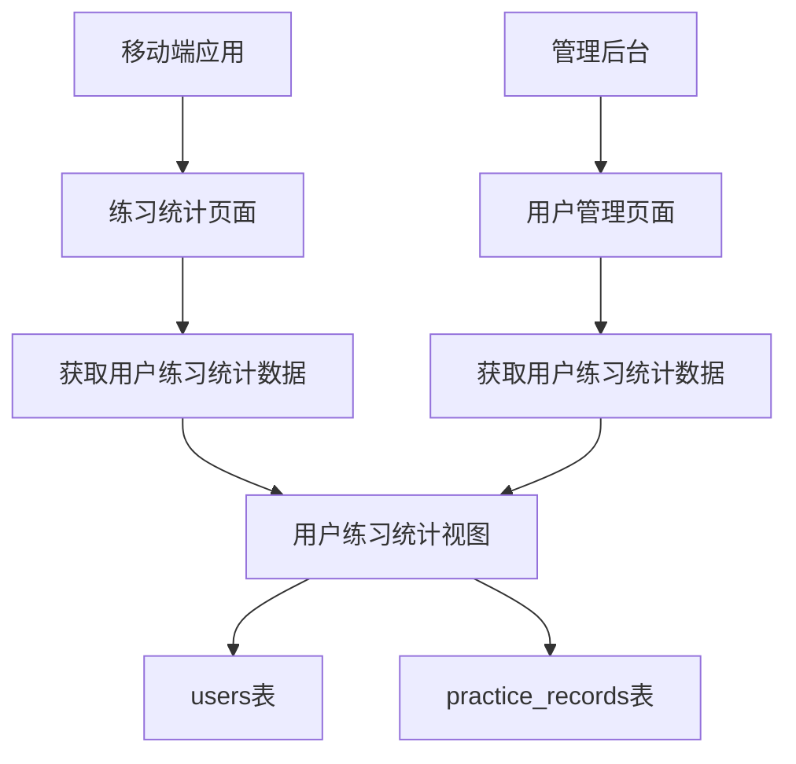
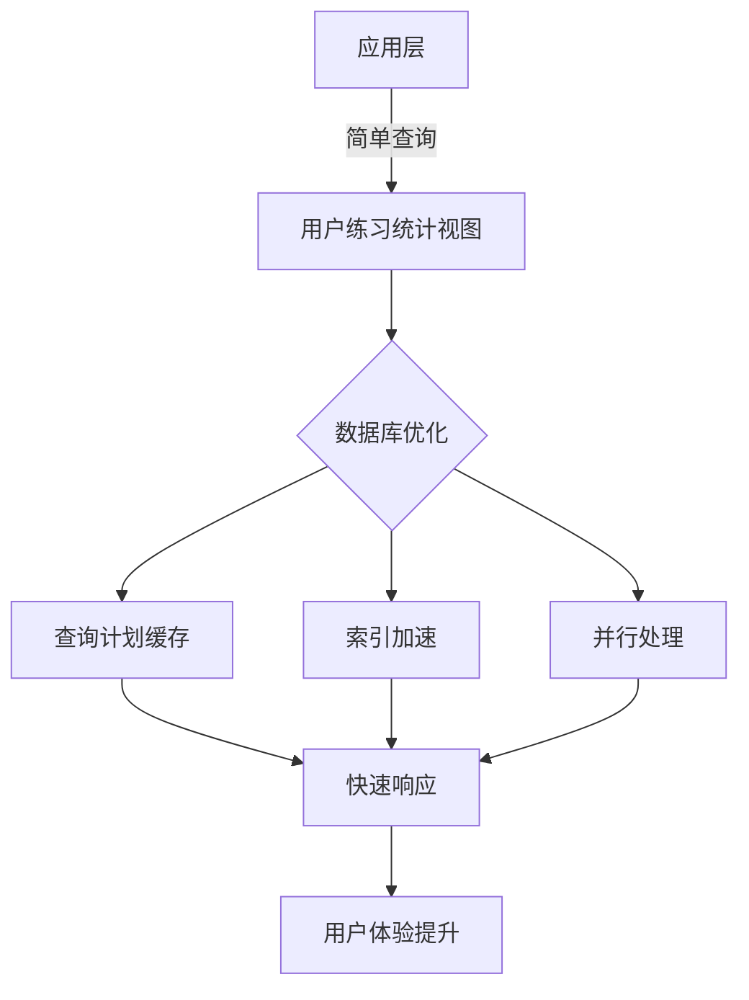

# 用户练习统计视图

<cite>
**本文档引用的文件**  
- [init.sql](file://database/init.sql#L316-L327)
- [practice.controller.ts](file://backend/src/controllers/practice.controller.ts#L174-L260)
- [practice_stats_bloc.dart](file://flutter_app/lib/presentation/practice/bloc/practice_stats_bloc.dart#L6-L55)
- [practice_stats_page.dart](file://flutter_app/lib/presentation/practice/pages/practice_stats_page.dart#L1-L329)
- [UserManagement.tsx](file://home/user/nian/admin-web/src/pages/UserManagement.tsx#L31-L456)
</cite>

## 目录
1. [用户练习统计视图概述](#用户练习统计视图概述)
2. [视图实现机制](#视图实现机制)
3. [应用场景分析](#应用场景分析)
4. [空值处理策略](#空值处理策略)
5. [聚合机制说明](#聚合机制说明)
6. [查询示例](#查询示例)
7. [性能优化优势](#性能优化优势)

## 用户练习统计视图概述

用户练习统计视图（user_practice_stats）是系统中的核心统计组件，通过数据库视图技术实现了用户练习数据的高效聚合。该视图为移动端个人统计页面和管理后台的用户行为分析功能提供了统一的数据支持，避免了在应用层进行复杂的数据计算，显著提升了系统的性能和可维护性。

**Section sources**
- [init.sql](file://database/init.sql#L316-L327)

## 视图实现机制

用户练习统计视图通过LEFT JOIN将users表与practice_records表关联，实现了对每个用户的练习数据的全面聚合。视图的实现采用了标准的SQL聚合函数和连接操作，确保了数据的准确性和完整性。

视图的核心实现包括四个关键统计指标：
- **总练习次数**：使用COUNT(DISTINCT pr.id)计算每个用户的唯一练习记录数量
- **总时长**：通过SUM(pr.duration_minutes)累加所有练习记录的时长
- **练习天数**：利用COUNT(DISTINCT pr.practice_date)统计用户在不同日期的练习天数
- **平均情绪改善值**：计算mood_after与mood_before差值的平均值，反映练习对用户情绪的改善效果

视图采用LEFT JOIN而非INNER JOIN，确保了即使没有练习记录的用户也能在统计结果中出现，其统计值将显示为默认值，这符合系统对用户数据完整性的要求。



**Diagram sources**
- [init.sql](file://database/init.sql#L5-L14)
- [init.sql](file://database/init.sql#L62-L74)

**Section sources**
- [init.sql](file://database/init.sql#L316-L327)

## 应用场景分析

用户练习统计视图在系统中支持两个主要应用场景：移动端的个人统计页面和管理后台的用户行为分析功能。

在移动端应用中，练习统计页面（practice_stats_page.dart）通过BLoC模式与后端API交互，获取用户的练习统计数据。前端组件提供了时间范围选择器，允许用户查看近7天、近30天、近90天或全部历史的练习数据。统计数据显示在直观的卡片布局中，包括总练习次数、总练习时长和平均心情改善等关键指标。

在管理后台，用户管理页面（UserManagement.tsx）利用类似的统计机制，为管理员提供用户行为分析功能。管理员可以查看所有用户的统计概览，并深入查看单个用户的详细信息，包括其方法库、练习记录和统计指标。这种设计使得管理员能够全面了解用户的行为模式和参与度。



**Diagram sources**
- [practice_stats_page.dart](file://flutter_app/lib/presentation/practice/pages/practice_stats_page.dart#L1-L329)
- [UserManagement.tsx](file://home/user/nian/admin-web/src/pages/UserManagement.tsx#L31-L456)

**Section sources**
- [practice_stats_page.dart](file://flutter_app/lib/presentation/practice/pages/practice_stats_page.dart#L1-L329)
- [UserManagement.tsx](file://home/user/nian/admin-web/src/pages/UserManagement.tsx#L31-L456)

## 空值处理策略

用户练习统计视图中使用COALESCE函数处理空值，这是确保数据完整性和用户体验的关键策略。当用户没有练习记录时，相关统计字段可能会产生NULL值，这在前端显示和数据分析中都会造成问题。

视图中对SUM和AVG聚合函数的结果使用COALESCE函数，将NULL值转换为0：
- COALESCE(SUM(pr.duration_minutes), 0)：当用户没有任何练习记录时，总时长返回0而非NULL
- COALESCE(AVG(pr.mood_after - pr.mood_before), 0)：当没有情绪评分数据时，平均情绪改善值返回0

这种处理策略确保了所有用户的统计结果都是完整和可用的，避免了前端需要额外处理NULL值的复杂性。同时，返回0比返回NULL更具语义意义，表明用户确实没有相关数据而非数据缺失。

**Section sources**
- [init.sql](file://database/init.sql#L322-L324)

## 聚合机制说明

用户练习统计视图通过GROUP BY子句确保统计结果按用户唯一聚合，这是实现准确统计的关键机制。GROUP BY子句以users表的id和email字段为基础，确保每个用户在结果集中只出现一次。

这种聚合机制具有以下优势：
- **数据唯一性**：确保每个用户的统计结果不会重复出现
- **性能优化**：数据库引擎可以高效地执行分组聚合操作
- **数据完整性**：结合LEFT JOIN，确保所有用户都被包含在统计结果中

视图的设计考虑到了大规模数据处理的需求，通过在practice_records表上创建复合索引idx_practice_records_user_id_date（user_id, practice_date），显著提升了JOIN和GROUP BY操作的性能。

**Section sources**
- [init.sql](file://database/init.sql#L327)
- [init.sql](file://database/init.sql#L75)

## 查询示例

以下是获取特定用户练习统计数据的实际查询示例：

```sql
-- 获取特定用户的练习统计数据
SELECT * FROM user_practice_stats WHERE user_id = 123;

-- 获取情绪改善值最高的前10名用户
SELECT user_id, email, avg_mood_improvement 
FROM user_practice_stats 
ORDER BY avg_mood_improvement DESC 
LIMIT 10;

-- 获取练习天数超过30天的活跃用户
SELECT user_id, email, practice_days 
FROM user_practice_stats 
WHERE practice_days > 30 
ORDER BY practice_days DESC;
```

在应用层，后端控制器提供了更灵活的统计API，支持按时间范围过滤的统计查询：

```typescript
// 后端API示例
export const getPracticeStatistics = async (req: AuthRequest, res: Response) => {
  const userId = req.user?.id;
  const period = req.query.period || 'month';
  
  // 根据时间段构建日期过滤条件
  let dateFilter = '';
  switch (period) {
    case 'week':
      dateFilter = "AND practice_date >= CURRENT_DATE - INTERVAL '7 days'";
      break;
    case 'month':
      dateFilter = "AND practice_date >= CURRENT_DATE - INTERVAL '30 days'";
      break;
    case 'year':
      dateFilter = "AND practice_date >= CURRENT_DATE - INTERVAL '365 days'";
      break;
  }
  
  // 执行统计查询
  const totalStats = await pool.query(
    `SELECT 
       COUNT(*) as total_practices,
       COALESCE(SUM(duration_minutes), 0) as total_duration,
       COUNT(DISTINCT practice_date) as practice_days,
       COALESCE(AVG(mood_after - mood_before), 0) as avg_mood_improvement
     FROM practice_records
     WHERE user_id = $1 ${dateFilter}`,
    [userId]
  );
};
```

**Section sources**
- [init.sql](file://database/init.sql#L316-L327)
- [practice.controller.ts](file://backend/src/controllers/practice.controller.ts#L174-L260)

## 性能优化优势

用户练习统计视图在性能优化方面具有显著优势，特别是在处理大规模练习记录时的查询效率提升。视图的性能优势主要体现在以下几个方面：

首先，通过将复杂的聚合计算下推到数据库层，避免了在应用层进行数据计算的开销。应用层只需执行简单的SELECT查询即可获取完整的统计结果，减少了网络传输的数据量和应用服务器的计算负担。

其次，视图利用了数据库的查询优化器和索引机制。practice_records表上的复合索引idx_practice_records_user_id_date（user_id, practice_date）使得JOIN和过滤操作非常高效，即使在数百万条练习记录的情况下也能保持良好的查询性能。

再者，视图的预计算特性意味着统计结果的生成是一次性的，后续的查询都是直接读取预计算结果，这比每次查询都重新计算要快得多。对于频繁访问的统计页面，这种性能优势尤为明显。

最后，视图的使用简化了应用代码，使得统计逻辑集中在数据库层，提高了代码的可维护性和一致性。当需要修改统计逻辑时，只需更新视图定义，而不需要修改多个应用层的代码。



**Diagram sources**
- [init.sql](file://database/init.sql#L316-L327)

**Section sources**
- [init.sql](file://database/init.sql#L316-L327)
- [practice.controller.ts](file://backend/src/controllers/practice.controller.ts#L174-L260)