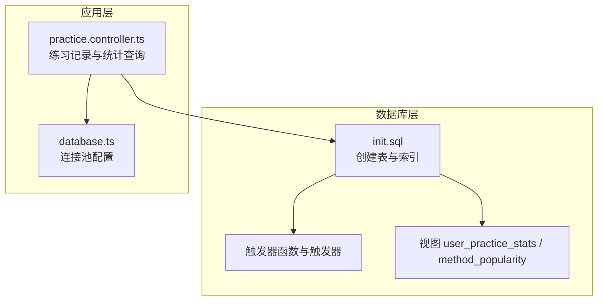
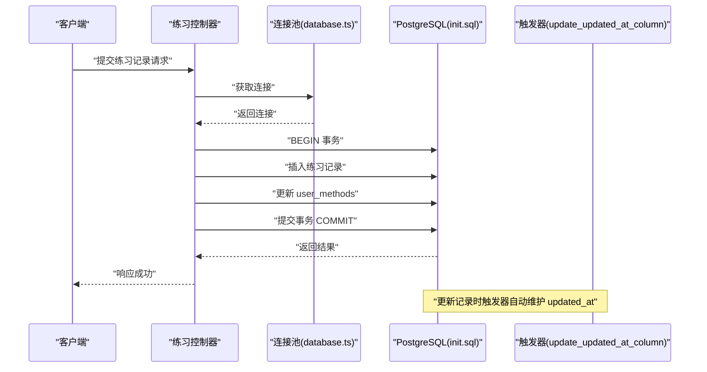
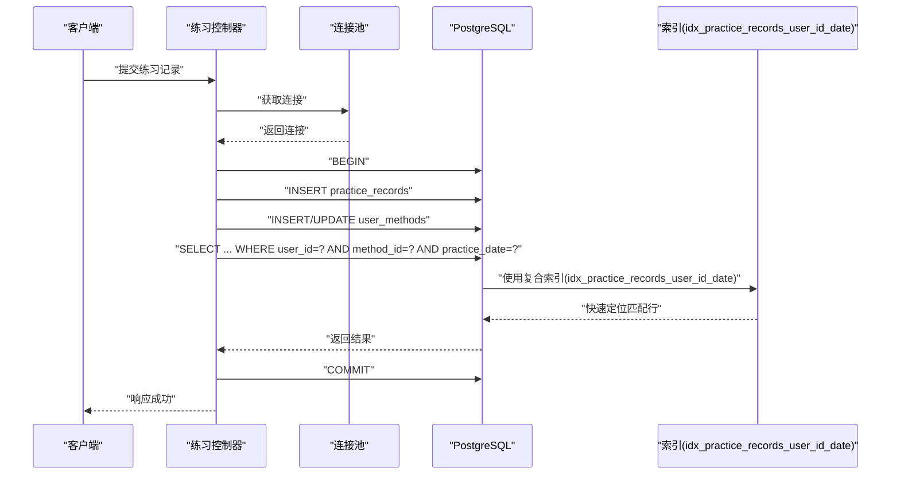
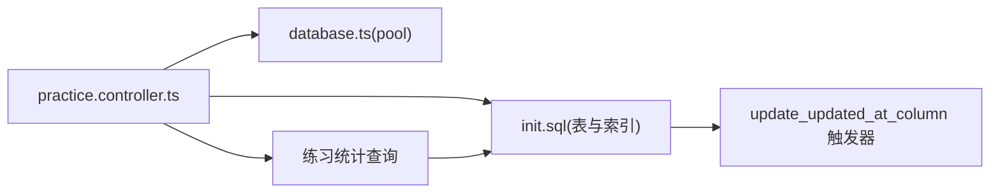

# 性能优化策略

<cite>
**本文引用的文件**
- [init.sql](file://database/init.sql)
- [database.ts](file://backend/src/config/database.ts)
- [practice.controller.ts](file://backend/src/controllers/practice.controller.ts)
- [QUALITY_REPORT.md](file://docs/QUALITY_REPORT.md)
</cite>

## 目录
1. [简介](#简介)
2. [项目结构](#项目结构)
3. [核心组件](#核心组件)
4. [架构总览](#架构总览)
5. [详细组件分析](#详细组件分析)
6. [依赖关系分析](#依赖关系分析)
7. [性能考量](#性能考量)
8. [故障排查指南](#故障排查指南)
9. [结论](#结论)

## 简介
本文件聚焦于 nian 项目的数据库性能优化措施，围绕以下目标展开：
- 深入解析 init.sql 中创建的索引（如 idx_methods_category、idx_practice_records_user_id_date）对查询效率的提升作用
- 解释复合索引在多条件查询中的优势，以及索引选择性对性能的影响
- 结合 database.ts 的连接池配置（max=20, idleTimeoutMillis=30000），说明连接管理对高并发场景的支持能力
- 讨论触发器 update_updated_at_column 在维护数据一致性方面的价值，并评估其对写入性能的潜在影响

## 项目结构
后端数据库初始化与连接配置位于以下位置：
- 数据库初始化脚本：database/init.sql
- PostgreSQL 连接池配置：backend/src/config/database.ts
- 练习相关控制器（演示查询与事务）：backend/src/controllers/practice.controller.ts
- 质量报告（包含索引清单与性能建议）：docs/QUALITY_REPORT.md

图表来源
- [init.sql](file://database/init.sql#L1-L349)
- [database.ts](file://backend/src/config/database.ts#L1-L47)
- [practice.controller.ts](file://backend/src/controllers/practice.controller.ts#L1-L261)

章节来源
- [init.sql](file://database/init.sql#L1-L349)
- [database.ts](file://backend/src/config/database.ts#L1-L47)
- [practice.controller.ts](file://backend/src/controllers/practice.controller.ts#L1-L261)
- [QUALITY_REPORT.md](file://docs/QUALITY_REPORT.md#L180-L234)

## 核心组件
- 数据库初始化与索引
  - init.sql 中创建了大量单列与复合索引，覆盖用户、方法、练习记录、提醒设置、审核日志、媒体文件等表，用于加速常见查询路径
- 连接池配置
  - database.ts 使用 pg 的连接池，默认最大连接数为 20，空闲超时 30 秒，连接超时 2 秒，支持高并发场景下的连接复用与回收
- 触发器与自动时间戳
  - init.sql 定义了 update_updated_at_column 函数及针对 methods 与 reminder_settings 的触发器，确保更新时自动维护 updated_at 字段
- 控制器中的查询与事务
  - practice.controller.ts 展示了典型的多条件查询、分页、联表统计与事务处理流程，体现索引与连接池在真实业务中的协同效果

章节来源
- [init.sql](file://database/init.sql#L1-L349)
- [database.ts](file://backend/src/config/database.ts#L1-L47)
- [practice.controller.ts](file://backend/src/controllers/practice.controller.ts#L1-L261)
- [QUALITY_REPORT.md](file://docs/QUALITY_REPORT.md#L180-L234)

## 架构总览
下图展示了数据库初始化、连接池、控制器调用与查询执行的整体关系。

图表来源
- [database.ts](file://backend/src/config/database.ts#L1-L47)
- [practice.controller.ts](file://backend/src/controllers/practice.controller.ts#L1-L261)
- [init.sql](file://database/init.sql#L301-L316)

## 详细组件分析

### 索引设计与查询效率
init.sql 中创建的索引覆盖了高频查询场景，包括：
- users 表：idx_users_email、idx_users_created_at
- methods 表：idx_methods_category、idx_methods_status、idx_methods_difficulty、idx_methods_created_at
- user_methods 表：idx_user_methods_user_id、idx_user_methods_method_id、idx_user_methods_selected_at
- practice_records 表：idx_practice_records_user_id_date（复合索引）、idx_practice_records_user_id_method_id（复合索引）、idx_practice_records_created_at
- reminder_settings 表：idx_reminder_settings_user_id
- admins 表：idx_admins_username、idx_admins_email
- audit_logs 表：idx_audit_logs_method_id、idx_audit_logs_admin_id、idx_audit_logs_created_at
- media_files 表：idx_media_files_file_type、idx_media_files_uploaded_by、idx_media_files_created_at

这些索引的作用：
- 加速单列过滤（如按邮箱登录、按分类筛选方法、按创建时间排序）
- 支持复合查询（如按用户+日期、用户+方法的联合过滤）
- 降低全表扫描概率，显著缩短查询计划生成与执行时间

复合索引的优势（以 idx_practice_records_user_id_date 为例）：
- 当查询同时包含 user_id 与 practice_date 条件时，数据库可直接利用索引进行高效查找，避免额外排序或临时表
- 对于“按用户维度分页查看某日练习”的典型场景，复合索引能极大减少 IO 与 CPU 开销

索引选择性对性能的影响：
- 高选择性的列（如唯一邮箱、状态枚举）更适合建立索引，能显著缩小匹配范围
- 低选择性列（如布尔字段）建立索引收益有限，需结合实际查询模式评估

章节来源
- [init.sql](file://database/init.sql#L1-L349)
- [QUALITY_REPORT.md](file://docs/QUALITY_REPORT.md#L180-L234)

### 连接池配置与高并发支持
database.ts 的连接池参数：
- max: 20
- idleTimeoutMillis: 30000
- connectionTimeoutMillis: 2000

这些配置的意义：
- 最大连接数 20：在高并发场景下，允许最多 20 个并发连接复用，避免频繁创建/销毁连接带来的开销
- 空闲超时 30 秒：长时间空闲的连接会被回收，释放数据库资源，防止连接泄漏
- 连接超时 2 秒：快速检测连接失败，避免请求长时间阻塞

结合控制器中的事务与查询：
- practice.controller.ts 展示了 BEGIN/COMMIT 事务与多条查询的组合，配合连接池可在高并发下保持稳定吞吐
- 通过连接池复用，减少连接建立成本，提升整体响应速度

章节来源
- [database.ts](file://backend/src/config/database.ts#L1-L47)
- [practice.controller.ts](file://backend/src/controllers/practice.controller.ts#L1-L261)

### 触发器 update_updated_at_column 的价值与影响
触发器定义与启用：
- init.sql 定义了 update_updated_at_column 函数，每次 UPDATE 时自动更新 updated_at 字段
- 为 methods 与 reminder_settings 表分别创建了触发器，确保数据变更时间的一致性

价值：
- 自动维护 updated_at，避免遗漏更新导致的时间戳不一致
- 便于审计与排序（如按最近更新时间展示）

对写入性能的潜在影响：
- 触发器会在每次 UPDATE 上增加少量开销（函数调用与赋值），但通常远小于全表扫描或回表的成本
- 对于高写入场景，建议仅在必要表上启用，且确保 updated_at 列上有合适索引（如按更新时间排序的查询）

章节来源
- [init.sql](file://database/init.sql#L301-L316)
- [practice.controller.ts](file://backend/src/controllers/practice.controller.ts#L1-L261)

### 查询流程与索引使用示意
以下序列图展示了控制器中“记录一次练习”的典型流程，以及索引在查询中的作用。

图表来源
- [practice.controller.ts](file://backend/src/controllers/practice.controller.ts#L1-L261)
- [init.sql](file://database/init.sql#L62-L79)

## 依赖关系分析
- 控制器依赖连接池：通过 pool.connect()/release() 管理连接生命周期
- 查询依赖索引：多条件查询与排序依赖索引以避免全表扫描
- 触发器依赖表结构：methods 与 reminder_settings 的 updated_at 字段由触发器自动维护

图表来源
- [practice.controller.ts](file://backend/src/controllers/practice.controller.ts#L1-L261)
- [database.ts](file://backend/src/config/database.ts#L1-L47)
- [init.sql](file://database/init.sql#L1-L349)

章节来源
- [practice.controller.ts](file://backend/src/controllers/practice.controller.ts#L1-L261)
- [database.ts](file://backend/src/config/database.ts#L1-L47)
- [init.sql](file://database/init.sql#L1-L349)

## 性能考量
- 索引选择性与覆盖
  - 高选择性列（如邮箱、状态）优先建立索引；低选择性列（如布尔）需结合查询模式评估
  - 复合索引顺序应与查询条件匹配（如 user_id 在前，date 在后）
- 连接池规模
  - max=20 适合中高并发场景；若出现排队等待，可考虑扩容或优化查询/事务粒度
  - idleTimeoutMillis=30s 有助于资源回收；在突发流量后能及时释放空闲连接
- 触发器开销
  - 触发器对写入有轻微开销，但换取了数据一致性；建议仅在关键表启用
- 查询优化建议
  - 使用 LIMIT/OFFSET 分页，避免一次性返回大量数据
  - 尽可能使用覆盖索引，减少回表
  - 对热点查询引入缓存（如 Redis），降低数据库压力

章节来源
- [init.sql](file://database/init.sql#L1-L349)
- [database.ts](file://backend/src/config/database.ts#L1-L47)
- [practice.controller.ts](file://backend/src/controllers/practice.controller.ts#L1-L261)
- [QUALITY_REPORT.md](file://docs/QUALITY_REPORT.md#L206-L234)

## 故障排查指南
- 查询变慢
  - 检查是否命中预期索引（可通过 EXPLAIN/EXPLAIN ANALYZE 观察执行计划）
  - 确认查询条件与索引列顺序一致（尤其是复合索引）
- 连接池耗尽
  - 查看连接池状态与超时配置，适当提高 max 或缩短 idleTimeoutMillis
  - 检查是否存在长事务未提交导致连接占用
- 写入延迟
  - 触发器会带来额外开销，确认是否在必要表启用
  - 评估批量写入场景，考虑批量提交与索引维护策略
- 数据一致性问题
  - 确认触发器是否正确绑定到目标表
  - 检查 updated_at 是否被显式更新覆盖

章节来源
- [database.ts](file://backend/src/config/database.ts#L1-L47)
- [init.sql](file://database/init.sql#L301-L316)
- [practice.controller.ts](file://backend/src/controllers/practice.controller.ts#L1-L261)

## 结论
- 索引设计覆盖了高频查询路径，特别是复合索引在多条件查询中显著提升了性能
- 连接池配置（max=20, idleTimeoutMillis=30000）为高并发场景提供了稳定的连接复用与回收机制
- 触发器 update_updated_at_column 在维护数据一致性方面具有重要价值，对写入性能影响可控
- 建议持续监控执行计划与连接池使用情况，结合业务增长迭代优化索引与连接池参数