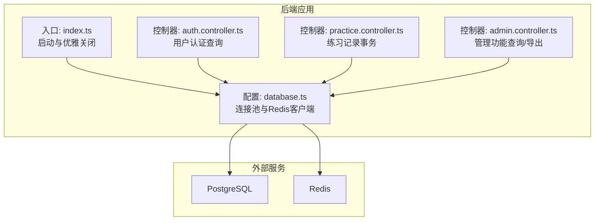
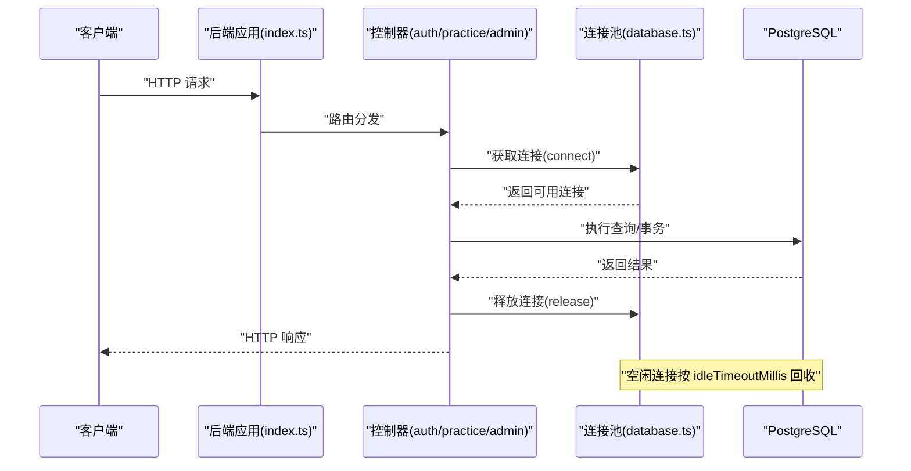
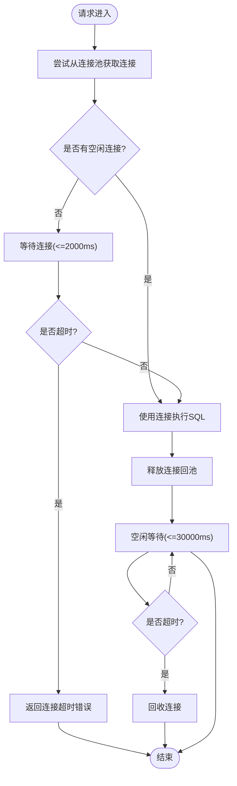
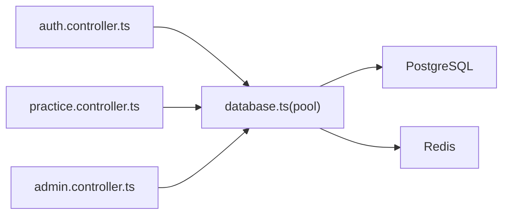

# 数据库连接池管理

<cite>
**本文引用的文件**
- [backend/src/config/database.ts](file://backend/src/config/database.ts)
- [backend/src/index.ts](file://backend/src/index.ts)
- [.env.example](file://.env.example)
- [backend/src/controllers/admin.controller.ts](file://backend/src/controllers/admin.controller.ts)
- [backend/src/controllers/auth.controller.ts](file://backend/src/controllers/auth.controller.ts)
- [backend/src/controllers/practice.controller.ts](file://backend/src/controllers/practice.controller.ts)
- [docs/QUALITY_REPORT.md](file://docs/QUALITY_REPORT.md)
</cite>

## 目录
1. [引言](#引言)
2. [项目结构](#项目结构)
3. [核心组件](#核心组件)
4. [架构总览](#架构总览)
5. [详细组件分析](#详细组件分析)
6. [依赖关系分析](#依赖关系分析)
7. [性能考量](#性能考量)
8. [故障排查指南](#故障排查指南)
9. [结论](#结论)
10. [附录](#附录)

## 引言
本文件围绕后端数据库连接池配置进行深入分析，重点解释 backend/src/config/database.ts 中的 PostgreSQL 连接池参数（max=20、idleTimeoutMillis=30000、connectionTimeoutMillis=2000）对系统性能的影响。我们将从连接池工作机制、高并发下的资源复用、参数权衡与调优建议、以及监控方法等方面展开，帮助读者在保证系统稳定性的同时实现可扩展的高性能表现。

## 项目结构
后端通过一个全局的 PostgreSQL 连接池对外提供数据库访问能力，应用启动时初始化连接池并进行健康检查；各控制器按需从连接池获取连接执行查询或事务，使用完毕后释放回池。关键文件如下：
- 连接池定义与初始化：backend/src/config/database.ts
- 应用启动与优雅关闭：backend/src/index.ts
- 控制器示例（查询/事务）：backend/src/controllers/*.controller.ts
- 环境变量示例：.env.example
- 性能与优化建议文档：docs/QUALITY_REPORT.md

图表来源
- [backend/src/index.ts](file://backend/src/index.ts#L1-L85)
- [backend/src/config/database.ts](file://backend/src/config/database.ts#L1-L47)
- [backend/src/controllers/auth.controller.ts](file://backend/src/controllers/auth.controller.ts#L1-L150)
- [backend/src/controllers/practice.controller.ts](file://backend/src/controllers/practice.controller.ts#L1-L120)
- [backend/src/controllers/admin.controller.ts](file://backend/src/controllers/admin.controller.ts#L1-L120)

章节来源
- [backend/src/index.ts](file://backend/src/index.ts#L1-L85)
- [backend/src/config/database.ts](file://backend/src/config/database.ts#L1-L47)

## 核心组件
- PostgreSQL 连接池：在 database.ts 中创建，包含 max、idleTimeoutMillis、connectionTimeoutMillis 等关键参数。
- Redis 客户端：同样在 database.ts 中创建，用于缓存等场景。
- 初始化与关闭：index.ts 在启动时初始化数据库连接，进程退出时优雅关闭连接池。

章节来源
- [backend/src/config/database.ts](file://backend/src/config/database.ts#L1-L47)
- [backend/src/index.ts](file://backend/src/index.ts#L1-L85)

## 架构总览
下图展示了请求在高并发场景下的典型流程：控制器从连接池获取连接执行 SQL，完成后释放回池；连接池根据空闲超时与连接超时策略回收或等待新请求。

图表来源
- [backend/src/index.ts](file://backend/src/index.ts#L1-L85)
- [backend/src/config/database.ts](file://backend/src/config/database.ts#L1-L47)
- [backend/src/controllers/auth.controller.ts](file://backend/src/controllers/auth.controller.ts#L1-L150)
- [backend/src/controllers/practice.controller.ts](file://backend/src/controllers/practice.controller.ts#L1-L120)
- [backend/src/controllers/admin.controller.ts](file://backend/src/controllers/admin.controller.ts#L1-L120)

## 详细组件分析

### 连接池参数解析与影响
- max=20：连接池的最大连接数。在高并发场景下，若同时有超过 20 个请求需要数据库访问且均未释放连接，后续请求将阻塞直至有空闲连接可用。该值直接影响数据库的并发连接上限与资源占用。
- idleTimeoutMillis=30000：空闲连接的最长存活时间。超过该时间的空闲连接会被连接池回收，避免长时间占用数据库资源，降低数据库侧的连接数峰值。
- connectionTimeoutMillis=2000：获取连接的超时时间。当池中无可用连接时，请求等待连接的时间上限为 2 秒。超时将导致请求失败，需结合业务重试与降级策略。

图表来源
- [backend/src/config/database.ts](file://backend/src/config/database.ts#L1-L47)

章节来源
- [backend/src/config/database.ts](file://backend/src/config/database.ts#L1-L47)

### 高并发下的资源复用机制
- 复用路径：控制器在执行数据库操作前后通过连接池获取与释放连接，避免频繁建立/销毁 TCP 连接，显著降低数据库握手与上下文切换开销。
- 事务与批量：部分控制器采用单连接事务（如练习记录），在事务期间独占连接，结束后释放，确保一致性与原子性。
- 典型使用点：
  - 查询类：控制器通过 pool.query 执行只读或写入查询。
  - 事务类：控制器通过 pool.connect 获取连接，显式 BEGIN/COMMIT/ROLLBACK，结束后 release。

章节来源
- [backend/src/controllers/auth.controller.ts](file://backend/src/controllers/auth.controller.ts#L1-L150)
- [backend/src/controllers/practice.controller.ts](file://backend/src/controllers/practice.controller.ts#L1-L120)
- [backend/src/controllers/admin.controller.ts](file://backend/src/controllers/admin.controller.ts#L1-L120)

### 最大连接数设置的权衡
- 过高风险：
  - 数据库连接数飙升，CPU/内存/文件描述符压力增大，可能触发数据库层面的连接限制或 OOM。
  - 连接池与数据库之间产生大量上下文切换，反而降低吞吐。
- 过低风险：
  - 并发高峰时出现连接等待与超时，影响用户体验与接口 SLA。
  - 业务线程阻塞，整体延迟上升。
- 建议策略：
  - 以数据库最大连接数为上限参考，结合应用并发模型与平均请求时长估算峰值并发连接需求。
  - 优先优化查询与索引，减少单次请求的数据库占用时间，从而降低峰值并发连接需求。

章节来源
- [backend/src/config/database.ts](file://backend/src/config/database.ts#L1-L47)

### 结合系统预期并发量的调优建议
- 评估方式：
  - 估算 QPS 与并发连接数：并发连接 ≈ QPS × 平均请求时长（秒）。结合 idleTimeoutMillis 与 connectionTimeoutMillis，合理设定 max。
  - 压力测试：在预生产环境模拟峰值流量，观察连接池命中率、等待时间与超时比例。
- 参数调整方向：
  - 若等待超时频繁：适当提高 max 或优化慢查询。
  - 若空闲连接过多：降低 max 或缩短 idleTimeoutMillis，减少数据库侧连接数。
  - 若连接获取超时：检查 max 是否过小或是否存在长事务阻塞。

章节来源
- [docs/QUALITY_REPORT.md](file://docs/QUALITY_REPORT.md#L205-L234)

### 监控连接使用情况的方法
- 连接池指标（建议采集）：
  - 已分配连接数、空闲连接数、等待获取连接的请求数、连接超时次数。
  - 数据库侧连接数、活跃连接数、慢查询数量。
- 采集与展示：
  - 在应用层输出连接池统计日志（如每分钟统计）。
  - 将关键指标上报到监控系统（如 Prometheus/Grafana），设置告警阈值。
- 关键观测点：
  - 连接池等待队列长度与等待时间分布。
  - 连接超时占比与错误类型（连接超时 vs 查询超时）。
  - 数据库连接数与负载（CPU/内存/IO）的关系。

章节来源
- [docs/QUALITY_REPORT.md](file://docs/QUALITY_REPORT.md#L205-L234)

## 依赖关系分析
- 组件耦合：
  - 控制器依赖连接池模块，但不直接关心底层实现细节，耦合度较低。
  - 连接池与数据库驱动、环境变量解耦，便于替换与迁移。
- 外部依赖：
  - PostgreSQL 驱动（pg）、Redis 客户端（redis）。
  - 环境变量提供主机、端口、用户名、密码等配置，避免硬编码。

图表来源
- [backend/src/controllers/auth.controller.ts](file://backend/src/controllers/auth.controller.ts#L1-L150)
- [backend/src/controllers/practice.controller.ts](file://backend/src/controllers/practice.controller.ts#L1-L120)
- [backend/src/controllers/admin.controller.ts](file://backend/src/controllers/admin.controller.ts#L1-L120)
- [backend/src/config/database.ts](file://backend/src/config/database.ts#L1-L47)

章节来源
- [backend/src/controllers/auth.controller.ts](file://backend/src/controllers/auth.controller.ts#L1-L150)
- [backend/src/controllers/practice.controller.ts](file://backend/src/controllers/practice.controller.ts#L1-L120)
- [backend/src/controllers/admin.controller.ts](file://backend/src/controllers/admin.controller.ts#L1-L120)
- [backend/src/config/database.ts](file://backend/src/config/database.ts#L1-L47)

## 性能考量
- 连接池命中率：通过减少连接创建/销毁，提升吞吐与降低延迟。
- 空闲回收：idleTimeoutMillis 有助于在低峰期释放数据库连接，避免资源浪费。
- 超时控制：connectionTimeoutMillis 保障请求不会无限等待，配合重试与熔断策略提升稳定性。
- 事务与锁：长事务会占用连接，建议拆分事务、减少锁持有时间，避免阻塞其他请求。
- 索引与查询优化：减少单次查询耗时，降低并发连接峰值需求。

章节来源
- [backend/src/config/database.ts](file://backend/src/config/database.ts#L1-L47)
- [backend/src/controllers/practice.controller.ts](file://backend/src/controllers/practice.controller.ts#L1-L120)

## 故障排查指南
- 连接超时（connectionTimeoutMillis=2000）：
  - 现象：请求在短时间内无法获取连接而失败。
  - 排查：检查 max 是否过小、是否存在长事务、慢查询是否导致连接被占用。
- 空闲连接过多（idleTimeoutMillis=30000）：
  - 现象：数据库侧连接数偏高。
  - 排查：适当降低 max 或缩短 idleTimeoutMillis，确认业务是否有多余的长生命周期连接。
- 事务异常：
  - 现象：事务提交/回滚失败或长时间占用连接。
  - 排查：检查事务边界、异常处理逻辑，确保 finally 中释放连接。
- 启动与关闭：
  - 确保启动时初始化数据库连接成功，优雅关闭时调用 pool.end() 释放连接。

章节来源
- [backend/src/config/database.ts](file://backend/src/config/database.ts#L1-L47)
- [backend/src/index.ts](file://backend/src/index.ts#L1-L85)
- [backend/src/controllers/practice.controller.ts](file://backend/src/controllers/practice.controller.ts#L1-L120)

## 结论
- 当前配置（max=20、idleTimeoutMillis=30000、connectionTimeoutMillis=2000）在一般规模应用中提供了较为稳健的平衡：既避免了数据库连接数过度膨胀，又能在短时并发下提供一定缓冲。
- 调优的关键在于结合实际业务并发与数据库承载能力，动态调整 max，并持续优化查询与事务设计，减少连接占用时间。
- 建议建立完善的监控体系，关注连接池与数据库侧指标，及时发现并解决问题，确保系统在高并发下的稳定性与可扩展性。

## 附录
- 环境变量参考：数据库主机、端口、名称、用户、密码等均来自环境变量，便于在不同环境中灵活配置。
- 文档建议：可在质量报告中补充连接池与数据库性能指标的现状与目标，形成闭环的性能治理流程。

章节来源
- [.env.example](file://.env.example#L1-L60)
- [docs/QUALITY_REPORT.md](file://docs/QUALITY_REPORT.md#L205-L234)