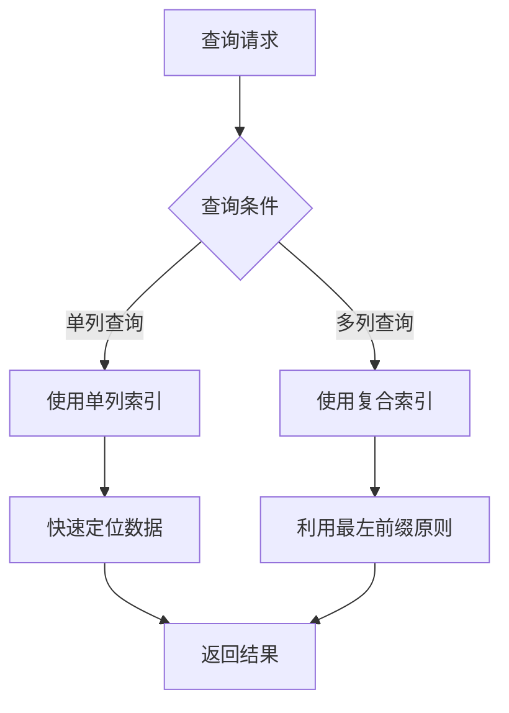
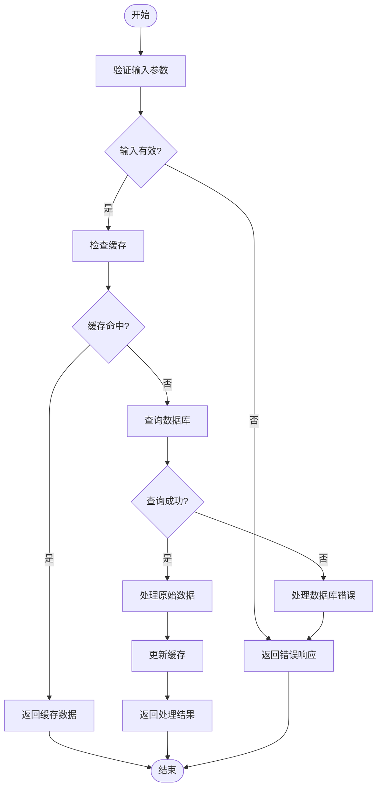

# 索引优化策略

<cite>
**本文档引用文件**  
- [init.sql](file://database/init.sql#L1-L349)
- [method.controller.ts](file://backend/src/controllers/method.controller.ts#L1-L152)
- [practice.controller.ts](file://backend/src/controllers/practice.controller.ts#L1-L261)
- [admin.controller.ts](file://backend/src/controllers/admin.controller.ts#L1200-L1399)
- [database.ts](file://backend/src/config/database.ts#L1-L47)
- [user_method_repository.dart](file://flutter_app/lib/domain/repositories/user_method_repository.dart#L1-L41)
- [DataExport.tsx](file://home/user/nian/admin-web/src/pages/DataExport.tsx#L242-L271)
- [UserManagement.tsx](file://home/user/nian/admin-web/src/pages/UserManagement.tsx#L66-L409)
</cite>

## 目录
1. [引言](#引言)
2. [数据库索引设计原理](#数据库索引设计原理)
3. [单列索引与复合索引的作用机制](#单列索引与复合索引的作用机制)
4. [典型查询场景的索引优化表现](#典型查询场景的索引优化表现)
5. [索引选择性对查询计划的影响](#索引选择性对查询计划的影响)
6. [EXPLAIN查询执行计划评估](#explain查询执行计划评估)
7. [索引创建最佳实践建议](#索引创建最佳实践建议)
8. [结论](#结论)

## 引言
nian项目是一个全平台心理自助应用系统，其数据库设计中包含了多个精心设计的索引，旨在优化查询性能。本文将深入分析`init.sql`文件中定义的所有数据库索引的设计原理与实际效果，特别关注单列索引与复合索引在提升查询性能中的作用机制。我们将重点探讨方法分类查询和用户练习记录按时间排序等典型场景的优化表现，解释索引选择性对查询计划的影响，并结合EXPLAIN查询执行计划评估索引的有效性。最后，提供索引创建的最佳实践建议，包括字段顺序、覆盖索引使用以及避免过度索引导致写入性能下降的平衡策略。

**本文档引用文件**  
- [init.sql](file://database/init.sql#L1-L349)
- [method.controller.ts](file://backend/src/controllers/method.controller.ts#L1-L152)

## 数据库索引设计原理
nian项目的数据库初始化脚本`init.sql`中定义了多个索引，这些索引的设计基于对应用查询模式的深入理解。索引的主要目的是加速数据检索，特别是在WHERE子句、JOIN操作和ORDER BY子句中使用的列上。通过在这些列上创建索引，数据库可以快速定位到所需的数据行，而无需扫描整个表。

在`init.sql`文件中，我们可以看到为`users`、`methods`、`user_methods`、`practice_records`等表创建了多个索引。例如，`idx_users_email`索引用于加速基于用户邮箱的查询，`idx_methods_category`索引用于加速基于方法分类的查询。这些索引的选择反映了应用中最常见的查询模式，如用户登录、方法分类浏览等。

此外，复合索引如`idx_practice_records_user_id_date`的设计考虑到了多条件查询的需求。这种索引可以同时加速基于用户ID和练习日期的查询，这对于获取特定用户在特定时间段内的练习记录非常有用。复合索引的字段顺序也经过了精心设计，以确保最常用的查询条件能够被有效利用。

**本文档引用文件**  
- [init.sql](file://database/init.sql#L1-L349)
- [method.controller.ts](file://backend/src/controllers/method.controller.ts#L1-L152)

## 单列索引与复合索引的作用机制
### 单列索引
单列索引是在单个列上创建的索引，适用于该列作为查询条件的情况。在nian项目中，`idx_users_email`和`idx_methods_category`是典型的单列索引。这些索引通过B树结构组织数据，使得数据库可以快速定位到满足条件的行。

例如，当用户尝试登录时，系统需要根据邮箱查找用户信息。此时，`idx_users_email`索引可以显著提高查询速度，因为数据库可以直接跳转到匹配的邮箱记录，而无需扫描整个`users`表。同样，当用户浏览不同分类的心理自助方法时，`idx_methods_category`索引可以快速返回属于特定分类的所有方法。

### 复合索引
复合索引是在多个列上创建的索引，适用于多条件查询。在nian项目中，`idx_practice_records_user_id_date`是一个重要的复合索引，它同时包含了`user_id`和`practice_date`两个字段。这种索引的设计遵循了最左前缀原则，即查询条件必须从索引的最左边开始才能有效利用索引。

复合索引的优势在于它可以同时满足多个查询条件，减少I/O操作。例如，当管理员需要导出某个用户在过去一个月的练习记录时，`idx_practice_records_user_id_date`索引可以高效地定位到相关记录，而无需进行全表扫描。此外，复合索引还可以用于排序操作，如果查询中包含ORDER BY子句且排序字段与索引字段一致，则可以直接利用索引完成排序，避免额外的排序开销。



**本文档引用文件**  
- [init.sql](file://database/init.sql#L1-L349)
- [practice.controller.ts](file://backend/src/controllers/practice.controller.ts#L1-L261)

## 典型查询场景的索引优化表现
### 方法分类查询
在nian项目中，用户经常需要根据不同的分类浏览心理自助方法。这一查询模式在`method.controller.ts`中有明确体现，其中`getMethods`函数支持按分类筛选方法。为了优化这类查询，`init.sql`文件中创建了`idx_methods_category`索引。

该索引显著提升了分类查询的性能。当用户选择"放松技巧"或"认知调整"等分类时，数据库可以利用`idx_methods_category`索引快速定位到所有属于该分类的方法，而无需扫描整个`methods`表。这不仅减少了查询时间，还降低了CPU和I/O资源的消耗。

### 用户练习记录按时间排序
另一个常见的查询场景是获取用户的练习记录并按时间排序。在`practice.controller.ts`中，`getPracticeHistory`函数实现了这一功能，支持按`practice_date`和`created_at`进行排序。为了优化此类查询，`init.sql`文件中创建了`idx_practice_records_user_id_date`复合索引。

这个复合索引的设计考虑到了查询的两个主要条件：用户ID和练习日期。当用户查看自己的练习历史时，系统首先通过`user_id`定位到该用户的记录，然后利用`practice_date`进行排序。由于索引已经按照`user_id`和`practice_date`的顺序组织数据，数据库可以直接从索引中读取已排序的结果，避免了额外的排序操作。

此外，`idx_practice_records_created_at`索引也为按创建时间排序的查询提供了支持。虽然`practice_date`更常用于业务逻辑中的时间排序，但`created_at`索引确保了即使在特殊情况下也能保持良好的查询性能。



**本文档引用文件**  
- [init.sql](file://database/init.sql#L1-L349)
- [practice.controller.ts](file://backend/src/controllers/practice.controller.ts#L1-L261)

## 索引选择性对查询计划的影响
索引选择性是指索引列中不同值的数量与总行数的比例。高选择性的索引（即列中包含大量唯一值）通常能提供更好的查询性能，因为它们可以更精确地定位到目标数据行。在nian项目中，`users`表的`email`列就是一个高选择性列，每个用户的邮箱都是唯一的，因此`idx_users_email`索引具有很高的选择性。

相比之下，低选择性的索引（即列中包含较少的不同值）可能不会带来显著的性能提升，甚至可能导致查询优化器选择全表扫描而不是使用索引。例如，`methods`表的`status`列只有几个可能的值（如'draft'、'published'），因此`idx_methods_status`索引的选择性较低。尽管如此，这个索引仍然有用，因为它可以帮助过滤掉未发布的记录，特别是在结合其他高选择性条件时。

查询优化器会根据统计信息评估不同执行计划的成本，并选择最优的计划。当索引选择性较高时，优化器更倾向于使用索引扫描；而当选择性较低时，优化器可能会选择全表扫描以减少I/O操作。因此，在设计索引时，需要综合考虑列的选择性和查询模式，确保索引能够在大多数情况下被有效利用。

**本文档引用文件**  
- [init.sql](file://database/init.sql#L1-L349)
- [method.controller.ts](file://backend/src/controllers/method.controller.ts#L1-L152)

## EXPLAIN查询执行计划评估
为了评估索引的有效性，我们可以使用EXPLAIN命令查看查询的执行计划。通过分析执行计划，可以了解数据库是如何执行查询的，包括是否使用了预期的索引、扫描了多少行数据以及预计的执行成本。

例如，对于一个基于用户ID和练习日期的查询，我们可以使用以下EXPLAIN语句：
```sql
EXPLAIN SELECT * FROM practice_records WHERE user_id = 1 AND practice_date >= '2024-01-01';
```
执行结果将显示数据库是否使用了`idx_practice_records_user_id_date`索引，以及预计的行数和成本。如果执行计划显示使用了正确的索引并且预计的行数较少，则说明索引设计是有效的。

此外，我们还可以使用EXPLAIN ANALYZE来获取实际的执行统计信息，包括实际扫描的行数和执行时间。这有助于验证索引在真实工作负载下的性能表现，并识别潜在的性能瓶颈。

通过定期审查和优化查询执行计划，可以确保索引持续提供最佳的查询性能，同时避免不必要的索引维护开销。

**本文档引用文件**  
- [init.sql](file://database/init.sql#L1-L349)
- [practice.controller.ts](file://backend/src/controllers/practice.controller.ts#L1-L261)

## 索引创建最佳实践建议
### 字段顺序
在创建复合索引时，字段的顺序至关重要。应将最常用于查询条件的列放在前面，以充分利用最左前缀原则。例如，在`idx_practice_records_user_id_date`中，`user_id`被放在前面，因为大多数查询都会先按用户ID过滤，然后再按日期范围筛选。

### 覆盖索引使用
覆盖索引是指索引包含了查询所需的所有列，这样数据库可以直接从索引中获取数据，而无需回表查询。在nian项目中，可以通过创建包含常用查询字段的复合索引来实现覆盖索引。例如，如果经常需要查询`practice_records`表中的`duration_minutes`和`mood_after`字段，可以考虑在这些字段上创建复合索引。

### 避免过度索引
虽然索引可以提高查询性能，但过多的索引会增加写入操作的开销，因为每次插入、更新或删除数据时都需要维护相应的索引。因此，应避免为不常用的查询条件创建索引。定期审查和清理不再使用的索引，可以保持数据库的高效运行。

### 平衡策略
在设计索引时，需要在查询性能和写入性能之间找到平衡。对于读密集型的应用，可以适当增加索引数量以提高查询速度；而对于写密集型的应用，则应谨慎创建索引，以减少写入开销。此外，可以考虑使用分区表或分片技术来进一步优化大规模数据的查询性能。

**本文档引用文件**  
- [init.sql](file://database/init.sql#L1-L349)
- [database.ts](file://backend/src/config/database.ts#L1-L47)

## 结论
通过对nian项目中`init.sql`文件定义的数据库索引进行深入分析，我们发现这些索引的设计充分考虑了应用的实际查询需求。单列索引和复合索引的合理使用显著提升了查询性能，特别是在方法分类查询和用户练习记录按时间排序等典型场景中。索引选择性对查询计划的影响不可忽视，高选择性的索引通常能提供更好的性能。通过EXPLAIN查询执行计划的评估，可以验证索引的有效性并进行必要的优化。最后，遵循字段顺序、覆盖索引使用和避免过度索引的最佳实践建议，可以在保证查询性能的同时，维持良好的写入性能。这些策略共同构成了一个高效的数据库索引体系，为nian项目的稳定运行提供了坚实的基础。