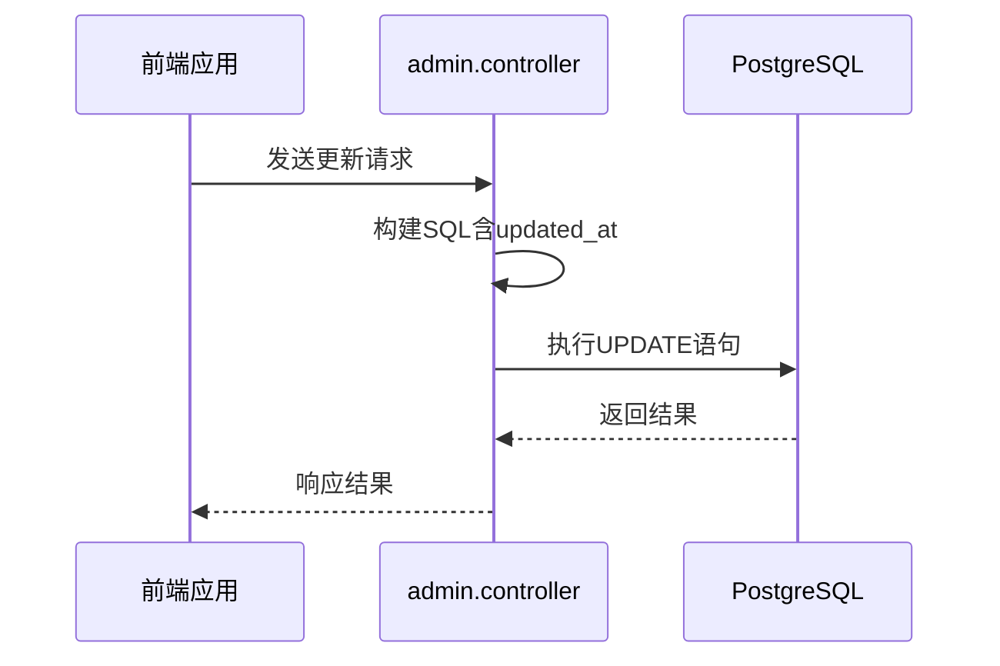
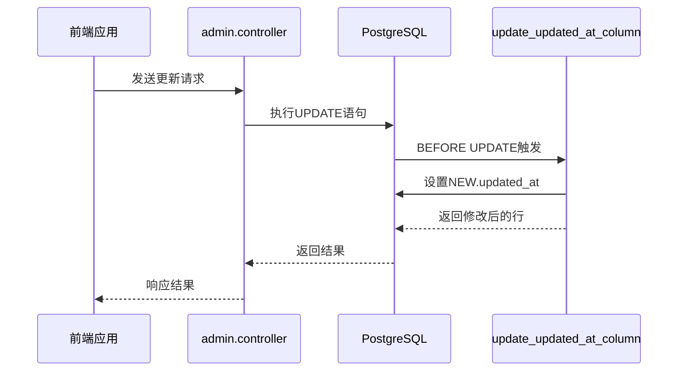

# 触发器与数据一致性

<cite>
**本文档引用文件**   
- [init.sql](file://database/init.sql#L301-L315)
- [database.ts](file://backend/src/config/database.ts)
- [admin.controller.ts](file://backend/src/controllers/admin.controller.ts#L166-L245)
- [userMethod.controller.ts](file://backend/src/controllers/userMethod.controller.ts#L83-L131)
- [practice.controller.ts](file://backend/src/controllers/practice.controller.ts#L34-L66)
</cite>

## 目录
1. [引言](#引言)
2. [触发器实现逻辑与业务价值](#触发器实现逻辑与业务价值)
3. [性能影响评估](#性能影响评估)
4. [替代方案对比](#替代方案对比)
5. [使用规范与最佳实践](#使用规范与最佳实践)
6. [结论](#结论)

## 触发器实现逻辑与业务价值

`update_updated_at_column` 触发器在 `init.sql` 文件中定义，其核心功能是自动维护数据库表中记录的最后修改时间戳。该触发器通过 PostgreSQL 的触发器机制，在数据更新操作发生前自动执行，确保 `updated_at` 字段始终反映最新的修改时间。

触发器的实现逻辑如下：首先定义一个名为 `update_updated_at_column` 的函数，该函数将 `NEW.updated_at` 设置为当前时间 `NOW()`，然后返回修改后的行数据。随后创建两个触发器：`update_methods_updated_at` 和 `update_reminder_settings_updated_at`，分别应用于 `methods` 和 `reminder_settings` 表，确保在对这些表进行更新操作时自动调用该函数。

这种设计具有重要的业务价值：它保证了审计信息的准确性和一致性，无需依赖应用层代码来维护时间戳。无论通过何种途径更新数据（如管理后台、API 调用或直接数据库操作），`updated_at` 字段都能正确反映最后修改时间，为数据分析、用户行为追踪和系统监控提供了可靠的基础。

**Section sources**
- [init.sql](file://database/init.sql#L301-L315)

## 性能影响评估

触发器对数据库写入性能的影响主要体现在高频更新场景下。由于触发器在每次更新操作时都需要执行额外的函数调用，这会增加单次写入操作的开销。对于 `methods` 和 `reminder_settings` 这样的核心表，如果出现大量并发更新请求，可能会导致数据库负载升高。

然而，该触发器的性能开销相对较小，因为它只执行简单的赋值操作，不涉及复杂的查询或计算。此外，数据库连接池配置中设置了最大连接数为 20，连接超时时间为 2 秒，这在一定程度上缓解了高并发带来的压力。在实际应用中，`methods` 表的更新频率通常较低（主要由管理员操作），而 `reminder_settings` 表虽然可能有更多用户级更新，但总体规模有限。

为了进一步降低性能影响，建议监控数据库的写入延迟和 CPU 使用率，特别是在系统高峰期。可以通过 PostgreSQL 的性能监控工具分析触发器的执行时间和资源消耗，确保其不会成为系统瓶颈。

**Section sources**
- [init.sql](file://database/init.sql#L301-L315)
- [database.ts](file://backend/src/config/database.ts)

## 替代方案对比

### 应用层处理方案

一种常见的替代方案是在应用层处理 `updated_at` 字段的更新。例如，在 `admin.controller.ts` 的 `updateMethod` 函数中，可以在构建 SQL 更新语句时显式包含 `updated_at = NOW()`。这种方法的优点是逻辑集中、易于调试和测试，且不受特定数据库功能限制，便于数据库迁移。

**Diagram sources**
- [admin.controller.ts](file://backend/src/controllers/admin.controller.ts#L166-L245)

### 触发器方案

当前采用的触发器方案将时间戳更新逻辑下沉到数据库层，具有更高的可靠性和一致性保证。即使应用层代码遗漏了时间戳更新，数据库仍能确保字段的正确性。此外，这种方案减少了应用层的代码复杂度，使业务逻辑更加简洁。

**Diagram sources**
- [init.sql](file://database/init.sql#L301-L315)

### 对比总结

| 方案 | 优点 | 缺点 |
|------|------|------|
| 应用层处理 | 逻辑集中，易于调试和测试 | 依赖应用代码，可能遗漏更新 |
| 数据库触发器 | 高可靠性，强一致性保证 | 增加数据库负载，调试复杂 |

**Section sources**
- [init.sql](file://database/init.sql#L301-L315)
- [admin.controller.ts](file://backend/src/controllers/admin.controller.ts#L166-L245)

## 使用规范与最佳实践

### 性能监控

建议建立定期的数据库性能监控机制，重点关注写入延迟、CPU 使用率和触发器执行时间。可以利用 PostgreSQL 的 `pg_stat_user_tables` 和 `pg_stat_user_functions` 视图来跟踪相关指标。

### 错误处理

虽然该触发器本身逻辑简单，不易出错，但仍需确保数据库函数的健壮性。建议在部署前进行充分的测试，验证触发器在各种边界条件下的行为。

### 版本控制策略

数据库模式变更应纳入版本控制系统，`init.sql` 文件的修改需经过严格的代码审查。建议采用迁移脚本的方式管理数据库变更，而不是直接修改初始化脚本，以确保生产环境的平稳升级。

### 适用场景

触发器适用于需要强一致性和高可靠性的场景，如审计日志、状态变更追踪等。对于高频更新的表，应谨慎使用触发器，或考虑采用异步处理机制来降低对主业务流程的影响。

**Section sources**
- [init.sql](file://database/init.sql#L301-L315)
- [database.ts](file://backend/src/config/database.ts)

## 结论

`update_updated_at_column` 触发器在维护数据一致性方面发挥了重要作用，通过自动化时间戳更新确保了审计信息的准确性。尽管在高频更新场景下可能带来一定的性能开销，但其带来的数据可靠性优势远大于潜在的性能影响。建议继续使用触发器方案，同时加强性能监控，确保系统整体稳定性和响应性。