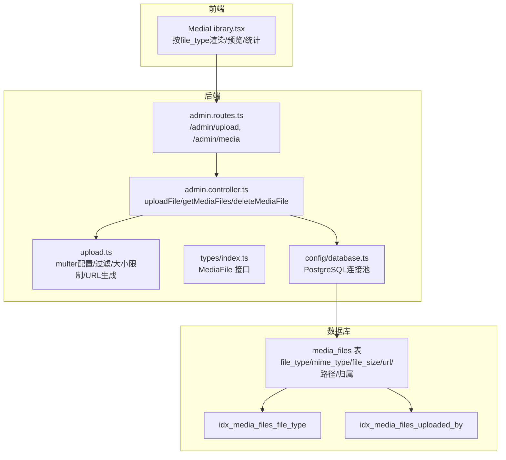
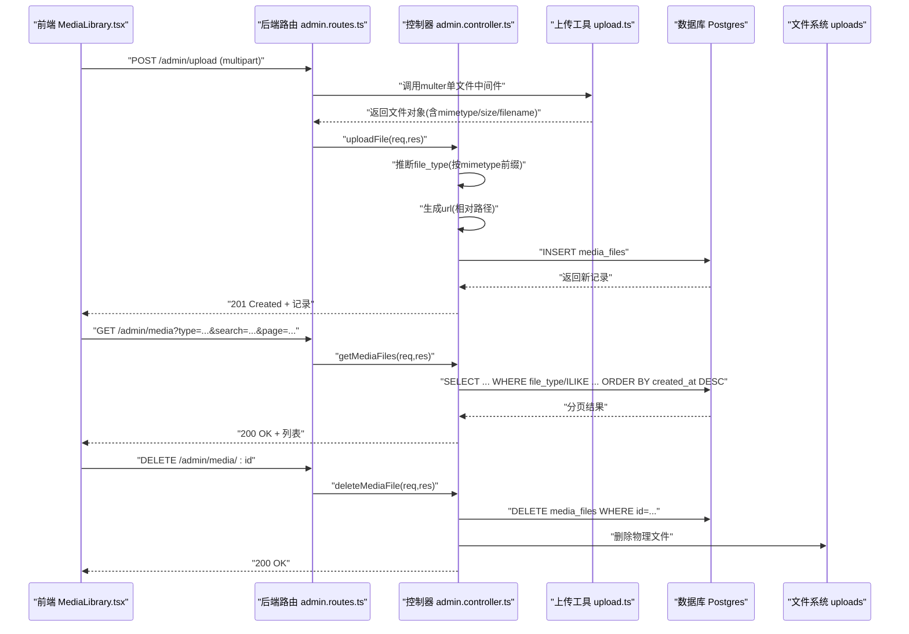
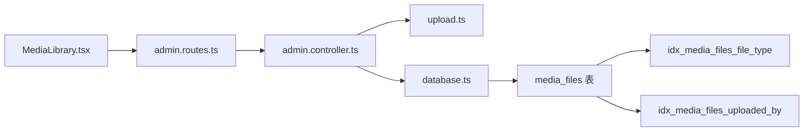

# 媒体文件表 (media_files)

<cite>
**本文引用的文件**
- [init.sql](file://database/init.sql)
- [upload.ts](file://backend/src/utils/upload.ts)
- [index.ts](file://backend/src/types/index.ts)
- [admin.controller.ts](file://backend/src/controllers/admin.controller.ts)
- [admin.routes.ts](file://backend/src/routes/admin.routes.ts)
- [MediaLibrary.tsx](file://home/user/nian/admin-web/src/pages/MediaLibrary.tsx)
- [database.ts](file://backend/src/config/database.ts)
</cite>

## 目录
1. [简介](#简介)
2. [项目结构](#项目结构)
3. [核心组件](#核心组件)
4. [架构总览](#架构总览)
5. [详细组件分析](#详细组件分析)
6. [依赖关系分析](#依赖关系分析)
7. [性能考量](#性能考量)
8. [故障排查指南](#故障排查指南)
9. [结论](#结论)
10. [附录](#附录)

## 简介
本文件系统化梳理“媒体文件表（media_files）”的存储与管理机制，围绕数据库初始化脚本与后端类型定义展开，重点说明：
- file_type 枚举（image、audio、video）在前端资源渲染中的指导作用
- file_size 与 mime_type 字段在文件验证与安全防护中的重要性
- file_path 与 url 字段如何支撑静态资源服务与 CDN 加速
- uploaded_by 外键关联在内容归属追踪中的应用
- 结合 upload.ts 的实现，描述文件上传、存储路径生成与数据库记录插入的完整流程
- idx_media_files_file_type 索引对媒体库分类查询的优化效果
- 大文件存储的最佳实践与性能考量

## 项目结构
媒体文件表涉及的关键文件与模块如下：
- 数据库层：init.sql 定义 media_files 表及索引
- 后端类型：index.ts 中的 MediaFile 接口
- 上传工具：upload.ts 提供文件过滤、大小限制、路径生成、URL 生成等能力
- 控制器与路由：admin.controller.ts 与 admin.routes.ts 实现上传、查询、删除等业务
- 前端展示：admin-web 的 MediaLibrary.tsx 使用 file_type 渲染资源预览

图表来源
- [init.sql](file://database/init.sql#L125-L143)
- [admin.routes.ts](file://backend/src/routes/admin.routes.ts#L51-L54)
- [admin.controller.ts](file://backend/src/controllers/admin.controller.ts#L472-L513)
- [upload.ts](file://backend/src/utils/upload.ts#L27-L106)
- [index.ts](file://backend/src/types/index.ts#L112-L126)
- [database.ts](file://backend/src/config/database.ts#L1-L47)
- [MediaLibrary.tsx](file://home/user/nian/admin-web/src/pages/MediaLibrary.tsx#L199-L235)

章节来源
- [init.sql](file://database/init.sql#L125-L143)
- [admin.routes.ts](file://backend/src/routes/admin.routes.ts#L51-L54)
- [admin.controller.ts](file://backend/src/controllers/admin.controller.ts#L472-L513)
- [upload.ts](file://backend/src/utils/upload.ts#L27-L106)
- [index.ts](file://backend/src/types/index.ts#L112-L126)
- [database.ts](file://backend/src/config/database.ts#L1-L47)
- [MediaLibrary.tsx](file://home/user/nian/admin-web/src/pages/MediaLibrary.tsx#L199-L235)

## 核心组件
- 媒体文件表（media_files）
  - 字段要点：filename、original_name、file_type（枚举）、mime_type、file_size、file_path、url、uploaded_by、created_at、updated_at
  - 索引：file_type、uploaded_by、created_at
- 后端类型（MediaFile）
  - 与数据库字段一一对应，明确 file_type 的取值范围
- 上传工具（upload.ts）
  - 文件类型过滤（image/audio/video）
  - 文件大小限制策略（按类型区分）
  - 存储路径生成（按年/月分目录）
  - URL 生成（相对路径转换）
- 控制器（admin.controller.ts）
  - 上传：校验管理员身份、推断 file_type、生成 url、写入数据库
  - 列表：按 file_type 与关键词搜索分页查询
  - 删除：删除数据库记录并清理物理文件
- 前端（MediaLibrary.tsx）
  - 按 file_type 渲染图标与预览（图片/音频/视频）
  - 统计各类型数量，支持筛选与分页

章节来源
- [init.sql](file://database/init.sql#L125-L143)
- [index.ts](file://backend/src/types/index.ts#L112-L126)
- [upload.ts](file://backend/src/utils/upload.ts#L27-L106)
- [admin.controller.ts](file://backend/src/controllers/admin.controller.ts#L472-L513)
- [MediaLibrary.tsx](file://home/user/nian/admin-web/src/pages/MediaLibrary.tsx#L199-L235)

## 架构总览
媒体文件管理的端到端流程如下：

图表来源
- [admin.routes.ts](file://backend/src/routes/admin.routes.ts#L51-L54)
- [admin.controller.ts](file://backend/src/controllers/admin.controller.ts#L472-L513)
- [admin.controller.ts](file://backend/src/controllers/admin.controller.ts#L516-L1053)
- [admin.controller.ts](file://backend/src/controllers/admin.controller.ts#L1055-L1084)
- [upload.ts](file://backend/src/utils/upload.ts#L27-L106)
- [database.ts](file://backend/src/config/database.ts#L1-L47)

## 详细组件分析

### 数据库表：media_files
- 字段语义
  - file_type：枚举约束仅允许 image、audio、video，用于前端渲染与分类检索
  - mime_type：MIME 类型，用于浏览器正确解码与渲染
  - file_size：字节数，用于前端显示与后端大小校验
  - file_path：物理存储路径，用于删除时定位真实文件
  - url：对外访问路径（相对 API 基础路径），用于静态资源服务与 CDN 加速
  - uploaded_by：外键关联管理员，用于内容归属追踪
- 索引
  - idx_media_files_file_type：加速按类型分类查询
  - idx_media_files_uploaded_by：加速按上传者查询
  - idx_media_files_created_at：加速按时间排序与分页

章节来源
- [init.sql](file://database/init.sql#L125-L143)

### 后端类型：MediaFile 接口
- 与数据库字段一致，明确 file_type 的取值集合，便于前后端契约一致
- 为控制器返回与前端消费提供强类型保障

章节来源
- [index.ts](file://backend/src/types/index.ts#L112-L126)

### 上传工具：upload.ts
- 文件类型过滤
  - 仅允许 image/jpeg、image/jpg、image/png、image/gif、image/webp、audio/mpeg、audio/mp3、audio/wav、audio/m4a、audio/x-m4a、video/mp4、video/webm、video/quicktime
- 文件大小限制
  - 图片：5MB；音频：20MB；视频：100MB；默认：5MB
  - 同时受 multer 全局最大 100MB 限制
- 存储路径生成
  - 采用“年/月”两级目录，避免单目录文件过多
- URL 生成
  - 将绝对路径转换为相对 API 的 URL，便于静态资源服务与 CDN 加速
- 删除文件
  - 提供删除物理文件的能力，配合控制器删除流程

章节来源
- [upload.ts](file://backend/src/utils/upload.ts#L27-L106)

### 控制器：上传、查询与删除
- 上传
  - 校验管理员身份与文件存在性
  - 依据 mimetype 推断 file_type
  - 生成 url 并写入 media_files，返回新记录
- 查询
  - 支持 type=all|image|audio|video、关键词搜索（filename/原名）、分页
  - 返回带 uploaded_by_name 的聚合结果（左联 admins）
- 删除
  - 先删数据库记录，再删物理文件，确保一致性

章节来源
- [admin.controller.ts](file://backend/src/controllers/admin.controller.ts#L472-L513)
- [admin.controller.ts](file://backend/src/controllers/admin.controller.ts#L516-L1053)
- [admin.controller.ts](file://backend/src/controllers/admin.controller.ts#L1055-L1084)

### 前端：MediaLibrary.tsx
- 渲染逻辑
  - 按 file_type 渲染不同图标
  - 预览：图片使用 Image，音频使用 audio，视频使用 video
  - 复制 URL：拼接 API 基础地址与相对 url
- 功能
  - 分页与筛选（type/search）
  - 统计各类型数量
  - 删除确认与刷新

章节来源
- [MediaLibrary.tsx](file://home/user/nian/admin-web/src/pages/MediaLibrary.tsx#L199-L235)
- [MediaLibrary.tsx](file://home/user/nian/admin-web/src/pages/MediaLibrary.tsx#L70-L197)

### 路由：/admin/upload、/admin/media
- /admin/upload
  - 使用 upload.single('file') 中间件，绑定 upload.ts 的 multer 实例
- /admin/media
  - GET：分页查询媒体文件
  - DELETE：删除媒体文件

章节来源
- [admin.routes.ts](file://backend/src/routes/admin.routes.ts#L51-L54)

## 依赖关系分析
- 控制器依赖
  - upload.ts：文件过滤、大小限制、URL 生成
  - database.ts：PostgreSQL 连接池，执行查询与写入
- 前端依赖
  - 后端接口：/admin/upload、/admin/media
  - MediaFile 接口：与后端返回结构保持一致
- 数据库依赖
  - media_files 表与索引
  - admins 表（用于 uploaded_by_name 聚合）

图表来源
- [admin.routes.ts](file://backend/src/routes/admin.routes.ts#L51-L54)
- [admin.controller.ts](file://backend/src/controllers/admin.controller.ts#L472-L513)
- [upload.ts](file://backend/src/utils/upload.ts#L27-L106)
- [database.ts](file://backend/src/config/database.ts#L1-L47)
- [init.sql](file://database/init.sql#L125-L143)

## 性能考量
- 索引优化
  - idx_media_files_file_type：按类型筛选与统计（如前端媒体库按类型分页）显著提升查询效率
  - idx_media_files_uploaded_by：按管理员维度检索媒体归属
  - idx_media_files_created_at：按时间倒序分页查询
- 存储组织
  - 年/月目录分层，降低单目录文件数量，提升文件系统性能
- 大文件处理
  - 上传限制与前端分片/断点续传建议（当前实现为一次性上传）
  - 建议结合 CDN 与对象存储（S3/OSS）替代本地磁盘，提升并发与可用性
- 查询优化
  - 列表查询使用参数化条件与 LIMIT/OFFSET，避免全表扫描
  - 通过 LEFT JOIN admins 获取上传者名称，减少二次查询

章节来源
- [init.sql](file://database/init.sql#L125-L143)
- [upload.ts](file://backend/src/utils/upload.ts#L27-L106)
- [admin.controller.ts](file://backend/src/controllers/admin.controller.ts#L516-L1053)

## 故障排查指南
- 上传失败（无效类型）
  - 现象：返回 INVALID_FILE_TYPE 或 VALIDATION_ERROR
  - 排查：确认文件 MIME 类型是否在允许列表内
  - 参考：[upload.ts](file://backend/src/utils/upload.ts#L27-L41)
- 上传失败（文件过大）
  - 现象：返回 FILE_TOO_LARGE
  - 排查：确认文件类型对应的大小限制，必要时拆分或压缩
  - 参考：[upload.ts](file://backend/src/utils/upload.ts#L43-L53)
- 上传成功但预览异常
  - 现象：图片/音频/视频无法渲染
  - 排查：检查 mime_type 是否与 file_type 匹配；确认 url 是否可访问
  - 参考：[admin.controller.ts](file://backend/src/controllers/admin.controller.ts#L496-L500)
- 删除失败
  - 现象：数据库记录删除但物理文件残留
  - 排查：确认 file_path 是否有效；检查文件系统权限
  - 参考：[admin.controller.ts](file://backend/src/controllers/admin.controller.ts#L1055-L1084)
- 查询无结果或性能差
  - 现象：按类型筛选或分页较慢
  - 排查：确认索引是否存在；检查查询条件是否命中索引
  - 参考：[init.sql](file://database/init.sql#L140-L143)

章节来源
- [upload.ts](file://backend/src/utils/upload.ts#L27-L53)
- [admin.controller.ts](file://backend/src/controllers/admin.controller.ts#L472-L513)
- [admin.controller.ts](file://backend/src/controllers/admin.controller.ts#L1055-L1084)
- [init.sql](file://database/init.sql#L140-L143)

## 结论
- media_files 表通过 file_type、mime_type、file_size、file_path、url、uploaded_by 等字段，构建了完整的媒体资产生命周期管理模型
- 前端根据 file_type 指导渲染与预览，确保用户体验与资源适配
- 后端在上传阶段完成类型与大小校验，并将记录持久化，配合索引实现高效查询
- 建议后续引入 CDN 与对象存储以支撑大文件与高并发场景

## 附录

### 字段与用途对照
- file_type：枚举 image/audio/video，前端据此选择渲染方式
- mime_type：浏览器解码与播放依据
- file_size：前端显示与后端校验
- file_path：删除物理文件的定位依据
- url：静态资源服务与 CDN 加速入口
- uploaded_by：管理员归属追踪

章节来源
- [init.sql](file://database/init.sql#L125-L143)
- [index.ts](file://backend/src/types/index.ts#L112-L126)
- [MediaLibrary.tsx](file://home/user/nian/admin-web/src/pages/MediaLibrary.tsx#L199-L235)