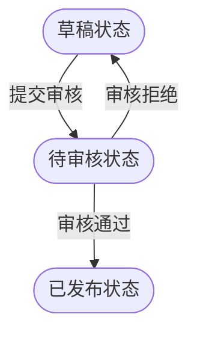
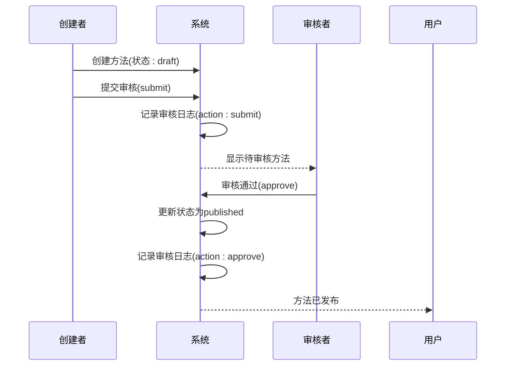

# 审核记录表 (audit_logs)

<cite>
**本文档引用的文件**  
- [init.sql](file://database/init.sql#L109-L124)
- [admin.controller.ts](file://backend/src/controllers/admin.controller.ts#L266-L387)
- [admin.routes.ts](file://backend/src/routes/admin.routes.ts#L42-L45)
- [MethodApproval.tsx](file://home/user/nian/admin-web/src/pages/MethodApproval.tsx)
- [api.ts](file://home/user/nian/admin-web/src/services/api.ts#L49-L60)
</cite>

## 目录
1. [审核记录表结构](#审核记录表结构)
2. [审核状态转换机制](#审核状态转换机制)
3. [状态变更追踪](#状态变更追踪)
4. [审核反馈与评论](#审核反馈与评论)
5. [操作溯源与外键关联](#操作溯源与外键关联)
6. [内容发布工作流协同](#内容发布工作流协同)
7. [审计日志性能优化](#审计日志性能优化)
8. [合规性设计](#合规性设计)

## 审核记录表结构

审核记录表（audit_logs）是系统审计追踪功能的核心组件，用于记录心理自助方法内容审核过程中的所有关键操作。该表通过结构化的方式保存审核操作的完整信息，包括操作类型、状态变更、审核意见和操作者信息。

**表结构说明：**
- `id`: 主键，自增标识符
- `method_id`: 外键，关联methods表，使用ON DELETE SET NULL约束
- `admin_id`: 外键，关联admins表，使用ON DELETE SET NULL约束
- `action`: 操作类型，枚举值包括'submit'、'approve'、'reject'
- `status_before`: 操作前的状态
- `status_after`: 操作后的状态
- `comment`: 审核评论或反馈
- `created_at`: 操作时间戳，默认为当前时间

**Section sources**
- [init.sql](file://database/init.sql#L109-L124)

## 审核状态转换机制

审核记录表中的action字段记录了内容审核流程中的三种核心操作：提交（submit）、批准（approve）和拒绝（reject）。这些操作构成了内容发布工作流的关键状态转换。

**提交操作（submit）：**
当内容创建者完成心理自助方法的编辑后，通过提交操作将方法状态从"草稿"（draft）变更为"待审核"（pending）。这一操作触发了审核流程的开始，系统会记录相应的审核日志，包括操作类型、状态变更和操作者信息。

**批准操作（approve）：**
超级管理员在审核方法内容后，若认为内容符合发布标准，可通过批准操作将方法状态从"待审核"（pending）变更为"已发布"（published）。此操作不仅更新了方法的状态，还会设置published_at时间戳，标志着内容正式对外可用。

**拒绝操作（reject）：**
当审核发现内容存在问题时，超级管理员可执行拒绝操作，将方法状态从"待审核"（pending）重新变回"草稿"（draft）。与批准操作不同，拒绝操作要求必须提供详细的拒绝原因，确保内容创建者能够了解问题所在并进行相应修改。

**Diagram sources**
- [admin.controller.ts](file://backend/src/controllers/admin.controller.ts#L266-L387)
- [admin.routes.ts](file://backend/src/routes/admin.routes.ts#L42-L45)

**Section sources**
- [admin.controller.ts](file://backend/src/controllers/admin.controller.ts#L266-L387)

## 状态变更追踪

审核记录表通过status_before和status_after字段实现了对方法状态变更的完整轨迹记录。这种设计提供了精确的状态变更审计能力，确保了审核过程的透明性和可追溯性。

**状态变更记录机制：**
- `status_before`: 记录操作执行前的方法状态，为审核决策提供上下文
- `status_after`: 记录操作执行后的目标状态，明确状态转换的结果
- 两个字段的组合形成了状态转换的完整视图，如从'draft'到'pending'，或从'pending'到'published'

这种设计的优势在于：
1. **完整性**：完整记录了状态转换的起点和终点
2. **可追溯性**：可以重建任何方法的完整状态变更历史
3. **验证性**：便于验证状态转换是否符合业务规则
4. **调试性**：在出现问题时，可以快速定位状态变更过程中的异常点

**Section sources**
- [init.sql](file://database/init.sql#L115-L116)
- [admin.controller.ts](file://backend/src/controllers/admin.controller.ts#L286-L379)

## 审核反馈与评论

comment字段在审核流程中扮演着关键的沟通角色，为审核决策提供了详细的反馈和解释。该字段的设计体现了系统对审核质量的重视，确保了审核过程不仅是简单的状态变更，更是有价值的内容指导。

**评论字段的应用场景：**
- **拒绝反馈**：当执行reject操作时，comment字段为必填项，要求审核者详细说明拒绝原因，帮助内容创建者理解问题并进行改进
- **批准意见**：在approve操作中，comment字段为可选项，允许审核者提供优化建议或特别说明
- **一般反馈**：可用于记录审核过程中的任何观察、建议或注意事项

在前端管理界面中，评论字段通过文本区域（TextArea）实现，根据操作类型动态调整提示信息：批准操作时提示"审核意见（可选）"，拒绝操作时提示"请输入拒绝原因（必填）"，这种用户体验设计确保了审核反馈的质量。

**Section sources**
- [admin.controller.ts](file://backend/src/controllers/admin.controller.ts#L302-L303)
- [MethodApproval.tsx](file://home/user/nian/admin-web/src/pages/MethodApproval.tsx#L174)

## 操作溯源与外键关联

审核记录表通过admin_id外键与管理员表（admins）建立关联，实现了操作的完全溯源。这一设计确保了所有审核操作都可以追溯到具体的执行者，增强了系统的安全性和问责性。

**外键关联特性：**
- `admin_id`: 引用admins表的id字段，标识执行审核操作的管理员
- ON DELETE SET NULL: 当管理员账号被删除时，相关审核记录中的admin_id将被设置为NULL，而非删除整个记录
- 这种设计既保护了审计历史的完整性，又实现了操作者的可追溯性

通过这种关联，系统可以：
1. 查询特定管理员的所有审核操作
2. 统计各管理员的审核工作量
3. 在需要时追溯特定审核决策的责任人
4. 生成管理员审核绩效报告

**Section sources**
- [init.sql](file://database/init.sql#L113)
- [admin.controller.ts](file://backend/src/controllers/admin.controller.ts#L268-L379)

## 内容发布工作流协同

审核记录表与方法表（methods）的status字段紧密协同，共同支持内容发布工作流的完整实现。这种协同工作模式确保了内容从创建到发布的整个生命周期都受到严格的控制和记录。

**工作流协同机制：**
1. **创建阶段**：新创建的方法初始状态为'draft'（草稿）
2. **提交阶段**：通过submit操作，状态变更为'pending'（待审核），同时创建审核日志
3. **审核阶段**：超级管理员评估内容质量，决定approve或reject
4. **发布阶段**：approve操作将状态变更为'published'（已发布），方法对用户可见
5. **迭代阶段**：reject操作将状态返回'draft'，创建者修改后可重新提交

这种工作流设计实现了内容质量的分层控制，确保只有经过审核的内容才能发布，同时保留了完整的审核历史，为内容治理提供了坚实的基础。

**Diagram sources**
- [admin.controller.ts](file://backend/src/controllers/admin.controller.ts#L266-L387)
- [init.sql](file://database/init.sql#L29)

**Section sources**
- [init.sql](file://database/init.sql#L29)
- [admin.controller.ts](file://backend/src/controllers/admin.controller.ts#L266-L387)

## 审计日志性能优化

idx_audit_logs_created_at索引针对审计日志的按时间查询进行了专门的性能优化。这一索引设计对于审计功能的高效运行至关重要，特别是在处理大量审核记录时。

**索引优化效果：**
- **时间范围查询加速**：支持高效的按时间段查询，如"过去一周的审核记录"
- **最新记录获取**：快速获取最近的审核操作，用于实时监控和通知
- **分页查询优化**：提高分页查询的性能，确保管理界面的响应速度
- **统计分析支持**：为审核工作量统计、趋势分析等提供性能保障

在实际应用中，该索引使得管理员能够快速浏览和筛选审核历史，无论是查看特定时间段的审核活动，还是监控最近的审核操作，都能获得流畅的用户体验。

**Section sources**
- [init.sql](file://database/init.sql#L123)

## 合规性设计

ON DELETE SET NULL约束在管理员离职后保留审计历史的设计，体现了系统对数据合规性和完整性的高度重视。这一设计解决了常见的审计完整性问题，确保了组织治理的连续性。

**合规性设计优势：**
1. **审计完整性**：即使操作者离职，其历史操作记录仍然完整保留
2. **责任追溯**：在需要时仍可追溯历史决策的责任人
3. **法规遵从**：满足数据保留和审计追踪的合规要求
4. **历史连续性**：保持组织知识和决策历史的连续性

这种设计平衡了数据隐私和审计需求：当管理员离职时，其个人账户可以被安全删除，但与其相关的业务操作历史仍然保留，仅将操作者引用设置为NULL。这既保护了离职员工的隐私，又维护了组织的审计完整性。

**Section sources**
- [init.sql](file://database/init.sql#L112-L113)