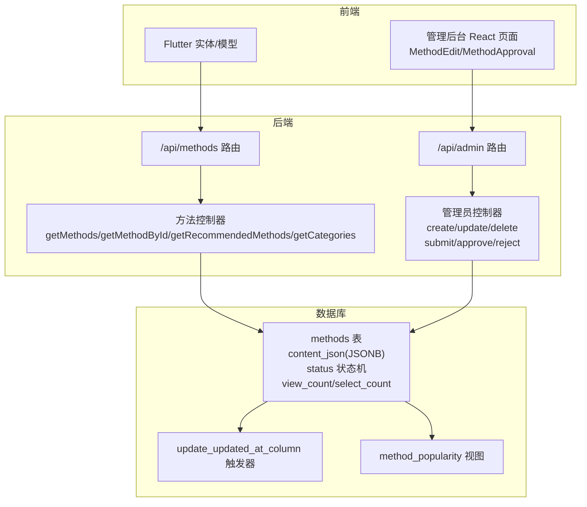
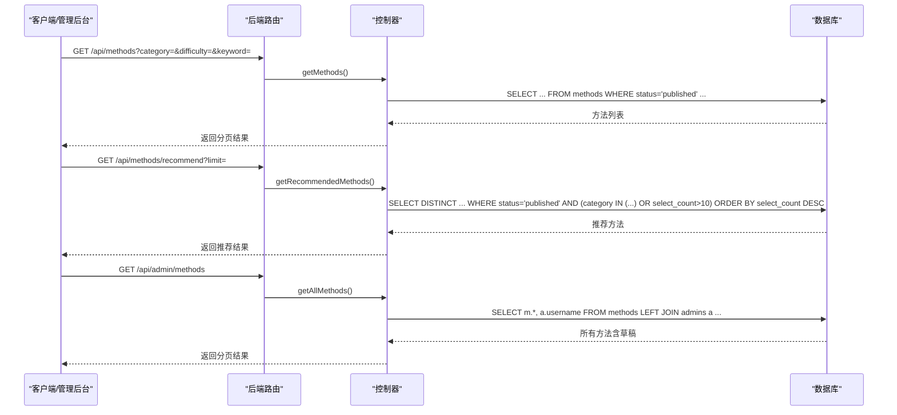
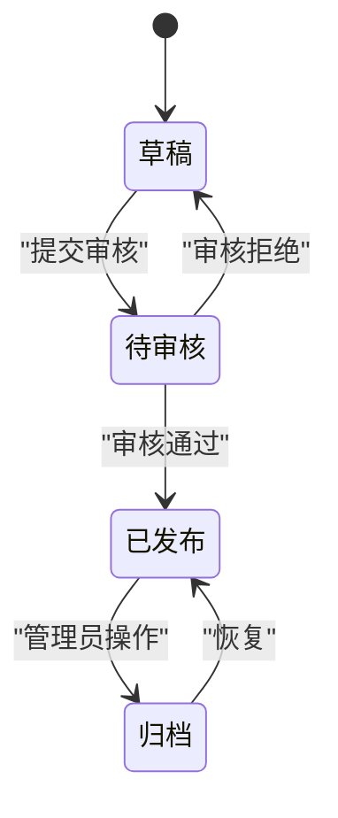
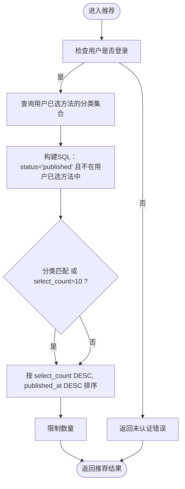
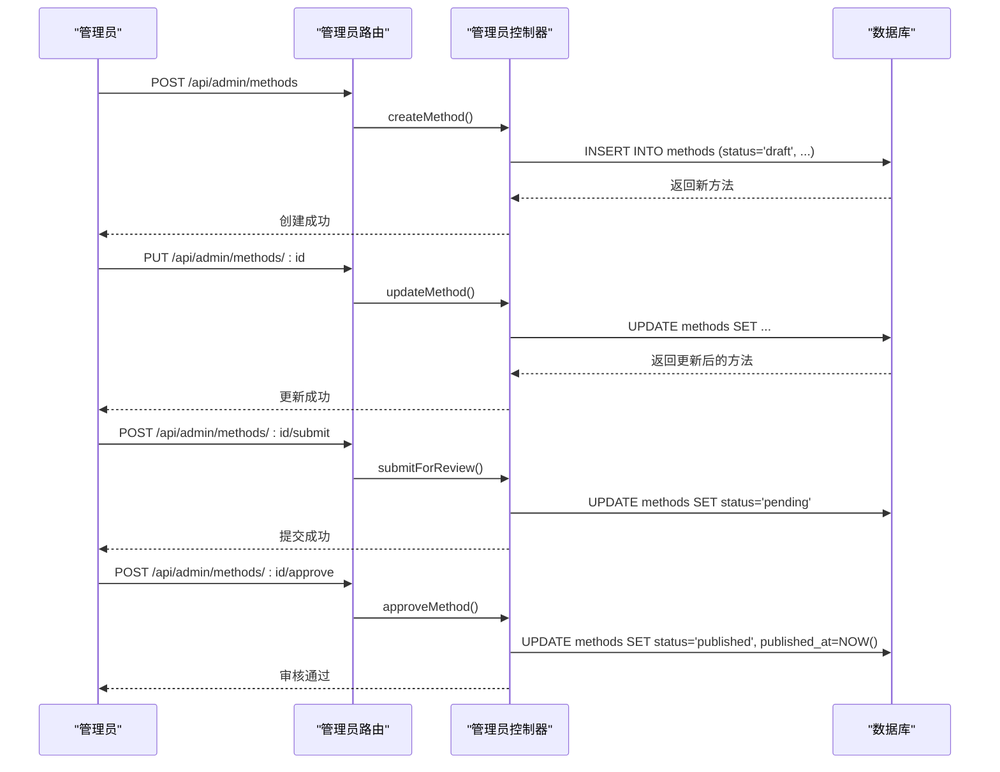
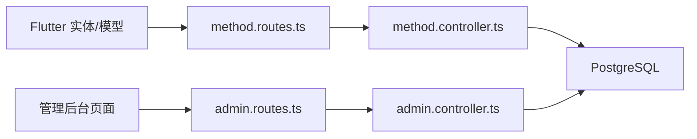

# 心理自助方法表 (methods)

<cite>
**本文引用的文件**
- [init.sql](file://database/init.sql)
- [index.ts](file://backend/src/types/index.ts)
- [method.controller.ts](file://backend/src/controllers/method.controller.ts)
- [admin.controller.ts](file://backend/src/controllers/admin.controller.ts)
- [method.routes.ts](file://backend/src/routes/method.routes.ts)
- [admin.routes.ts](file://backend/src/routes/admin.routes.ts)
- [method.dart](file://flutter_app/lib/domain/entities/method.dart)
- [method_model.dart](file://flutter_app/lib/data/models/method_model.dart)
- [MethodApproval.tsx](file://home/user/nian/admin-web/src/pages/MethodApproval.tsx)
- [MethodEdit.tsx](file://home/user/nian/admin-web/src/pages/MethodEdit.tsx)
</cite>

## 目录
1. [简介](#简介)
2. [项目结构](#项目结构)
3. [核心组件](#核心组件)
4. [架构总览](#架构总览)
5. [详细组件分析](#详细组件分析)
6. [依赖关系分析](#依赖关系分析)
7. [性能考量](#性能考量)
8. [故障排查指南](#故障排查指南)
9. [结论](#结论)
10. [附录](#附录)

## 简介
本文件围绕“心理自助方法表”（methods）进行深入文档化，结合数据库表结构与后端控制器逻辑，系统性说明：
- content_json 字段如何承载富文本内容与练习章节
- status 状态机在内容生命周期管理中的应用
- view_count 与 select_count 在推荐算法中的权重作用
- category 与 difficulty 在方法分类筛选中的实现
- 方法创建、审核与发布的完整业务流程
- update_updated_at_column 触发器如何自动维护数据一致性
- 管理后台如何通过管理页面更新方法内容

## 项目结构
- 数据库层：methods 表定义、索引、触发器、视图
- 后端层：方法控制器与路由、管理员控制器与路由
- 前端层：Flutter 应用中的实体与模型；管理后台 React 页面
- 管理后台：方法创建/编辑、审核页面

图表来源
- [init.sql](file://database/init.sql#L19-L60)
- [method.controller.ts](file://backend/src/controllers/method.controller.ts#L1-L153)
- [admin.controller.ts](file://backend/src/controllers/admin.controller.ts#L129-L387)
- [method.routes.ts](file://backend/src/routes/method.routes.ts#L1-L20)
- [admin.routes.ts](file://backend/src/routes/admin.routes.ts#L1-L69)
- [method.dart](file://flutter_app/lib/domain/entities/method.dart#L1-L77)
- [method_model.dart](file://flutter_app/lib/data/models/method_model.dart#L1-L54)
- [MethodEdit.tsx](file://home/user/nian/admin-web/src/pages/MethodEdit.tsx#L1-L190)
- [MethodApproval.tsx](file://home/user/nian/admin-web/src/pages/MethodApproval.tsx#L1-L180)

章节来源
- [init.sql](file://database/init.sql#L19-L60)
- [method.controller.ts](file://backend/src/controllers/method.controller.ts#L1-L153)
- [admin.controller.ts](file://backend/src/controllers/admin.controller.ts#L129-L387)
- [method.routes.ts](file://backend/src/routes/method.routes.ts#L1-L20)
- [admin.routes.ts](file://backend/src/routes/admin.routes.ts#L1-L69)
- [method.dart](file://flutter_app/lib/domain/entities/method.dart#L1-L77)
- [method_model.dart](file://flutter_app/lib/data/models/method_model.dart#L1-L54)
- [MethodEdit.tsx](file://home/user/nian/admin-web/src/pages/MethodEdit.tsx#L1-L190)
- [MethodApproval.tsx](file://home/user/nian/admin-web/src/pages/MethodApproval.tsx#L1-L180)

## 核心组件
- 数据库表 methods：包含标题、描述、分类、难度、时长、封面、富文本内容、状态、计数、作者、时间戳等字段
- content_json：采用 JSONB 存储富文本内容与练习章节，支持章节、练习、问卷等结构
- 状态机 status：draft → pending → published/archived
- 推荐算法：select_count 为主要权重，辅以分类匹配与 published_at
- 分类筛选：category 与 difficulty 支持前端搜索与筛选
- 触发器 update_updated_at_column：自动维护 updated_at

章节来源
- [init.sql](file://database/init.sql#L19-L60)
- [index.ts](file://backend/src/types/index.ts#L18-L35)
- [method.controller.ts](file://backend/src/controllers/method.controller.ts#L1-L153)

## 架构总览
后端通过 Express 路由分发请求至控制器，控制器访问数据库执行 SQL 查询与更新；Flutter 前端调用后端 API 获取方法列表、详情与推荐；管理后台通过管理员路由对方法进行创建、更新、提交审核、审批与拒绝。

图表来源
- [method.routes.ts](file://backend/src/routes/method.routes.ts#L1-L20)
- [admin.routes.ts](file://backend/src/routes/admin.routes.ts#L31-L46)
- [method.controller.ts](file://backend/src/controllers/method.controller.ts#L1-L153)
- [admin.controller.ts](file://backend/src/controllers/admin.controller.ts#L68-L127)

## 详细组件分析

### 数据库表结构与字段语义
- 关键字段
  - title/description：方法标题与描述
  - category/difficulty：分类与难度等级
  - duration_minutes：建议时长（分钟）
  - cover_image_url：封面图 URL
  - content_json：富文本内容（JSONB），支持章节、练习、问卷等结构
  - status：方法状态（draft/pending/published/archived）
  - view_count/select_count：浏览量与选择量（用于推荐与统计）
  - created_by：创建者（管理员）
  - created_at/updated_at/published_at：时间戳
- 索引
  - methods.status/category/difficulty/created_at：加速筛选与排序
- 视图
  - method_popularity：聚合 view_count/select_count、用户数、练习次数与效果，按 select_count 排序

章节来源
- [init.sql](file://database/init.sql#L19-L60)
- [init.sql](file://database/init.sql#L301-L312)
- [init.sql](file://database/init.sql#L316-L346)

### content_json 的富文本与练习章节设计
- 结构要点
  - chapters：章节数组，每章包含标题、顺序与内容条目（如文本）
  - exercises/questionnaires：练习与问卷结构，支持引导式练习与评分题
- 示例结构
  - 章节：包含多个内容条目（文本/图片/音频等）
  - 练习：包含步骤与类型
  - 问卷：包含问题与选项
- Flutter 端映射
  - 前端实体与模型将 content_json 映射为 Map<String, dynamic>，便于渲染

章节来源
- [init.sql](file://database/init.sql#L150-L299)
- [method.dart](file://flutter_app/lib/domain/entities/method.dart#L1-L77)
- [method_model.dart](file://flutter_app/lib/data/models/method_model.dart#L1-L54)

### 状态机与生命周期管理（status）
- 状态流转
  - draft：草稿（默认）
  - pending：提交审核
  - published：已发布
  - archived：归档（可扩展）
- 生命周期流程
  - 创建：管理员创建方法，默认状态为 draft
  - 提交审核：将状态从 draft 更新为 pending
  - 审核通过：将状态从 pending 更新为 published，并写入 published_at
  - 审核拒绝：将状态从 pending 回退为 draft
  - 列表查询：前端仅显示 status='published' 的方法
- 审核日志
  - 审核动作记录在 audit_logs 表，包含方法、管理员、动作、前后状态与评论

图表来源
- [admin.controller.ts](file://backend/src/controllers/admin.controller.ts#L266-L387)
- [init.sql](file://database/init.sql#L110-L124)

章节来源
- [admin.controller.ts](file://backend/src/controllers/admin.controller.ts#L266-L387)
- [init.sql](file://database/init.sql#L110-L124)

### 推荐算法与权重（view_count 与 select_count）
- 推荐策略
  - 基于用户已选方法的分类进行相似推荐
  - 若未选过某分类，则优先推荐 select_count 较高的方法
  - 最终按 select_count 降序、published_at 降序排序
- 权重说明
  - select_count：主要权重，反映受欢迎程度与使用频率
  - view_count：用于统计视图（method_popularity），辅助分析但不直接参与排序
- 前端调用
  - 需要用户认证后调用 /api/methods/recommend

图表来源
- [method.controller.ts](file://backend/src/controllers/method.controller.ts#L100-L136)
- [init.sql](file://database/init.sql#L330-L346)

章节来源
- [method.controller.ts](file://backend/src/controllers/method.controller.ts#L100-L136)
- [init.sql](file://database/init.sql#L330-L346)

### 分类筛选与难度过滤（category 与 difficulty）
- 列表筛选
  - getMethods 支持 category、difficulty、keyword（标题/描述模糊匹配）
  - 仅返回 status='published' 的方法
- 分类列表
  - getCategories 返回分类去重与计数，按计数降序
- 前端使用
  - Flutter 端根据分类与难度进行筛选与展示

章节来源
- [method.controller.ts](file://backend/src/controllers/method.controller.ts#L1-L73)
- [method.controller.ts](file://backend/src/controllers/method.controller.ts#L138-L152)

### 方法创建、审核与发布的完整流程
- 创建方法
  - 管理员登录后，POST /api/admin/methods 创建，初始状态为 draft
- 更新方法
  - PUT /api/admin/methods/:id 更新标题、描述、分类、难度、时长、封面、content_json 等
- 提交审核
  - POST /api/admin/methods/:id/submit 将状态从 draft 更新为 pending
- 审核通过
  - POST /api/admin/methods/:id/approve 将状态从 pending 更新为 published，并写入 published_at
- 审核拒绝
  - POST /api/admin/methods/:id/reject 将状态从 pending 回退为 draft，并记录审核日志

图表来源
- [admin.routes.ts](file://backend/src/routes/admin.routes.ts#L36-L46)
- [admin.controller.ts](file://backend/src/controllers/admin.controller.ts#L129-L387)

章节来源
- [admin.routes.ts](file://backend/src/routes/admin.routes.ts#L36-L46)
- [admin.controller.ts](file://backend/src/controllers/admin.controller.ts#L129-L387)

### 管理后台更新方法内容的操作示例
- 管理后台页面
  - MethodEdit：支持新建与编辑方法，表单包含标题、分类、难度、时长、描述、content_json（JSON）、状态
  - MethodApproval：列出待审核方法，支持通过/拒绝，拒绝需填写原因
- 操作流程
  - 新建：填写表单，点击保存，调用后端创建接口
  - 编辑：加载已有方法，解析 JSON，保存更新
  - 提交审核：将状态从草稿改为待审核
  - 审核：超级管理员通过或拒绝

章节来源
- [MethodEdit.tsx](file://home/user/nian/admin-web/src/pages/MethodEdit.tsx#L1-L190)
- [MethodApproval.tsx](file://home/user/nian/admin-web/src/pages/MethodApproval.tsx#L1-L180)
- [admin.controller.ts](file://backend/src/controllers/admin.controller.ts#L129-L387)

### update_updated_at_column 触发器与数据一致性
- 触发器逻辑
  - 在更新 methods 表时，自动将 updated_at 设置为当前时间
- 作用
  - 保证每次更新都同步更新时间戳，便于审计与排序
- 相关表
  - 同时为 reminder_settings 表也设置了相同触发器

章节来源
- [init.sql](file://database/init.sql#L301-L312)

## 依赖关系分析
- 控制器依赖
  - 方法控制器依赖数据库连接池执行 SQL 查询与更新
  - 管理员控制器负责方法的 CRUD 与审核流程
- 路由依赖
  - 方法路由提供公开接口（列表、详情、推荐、分类）
  - 管理员路由提供后台管理接口（含鉴权）
- 前端依赖
  - Flutter 实体/模型映射后端返回的字段
  - 管理后台页面调用后端 API 完成方法管理

图表来源
- [method.routes.ts](file://backend/src/routes/method.routes.ts#L1-L20)
- [admin.routes.ts](file://backend/src/routes/admin.routes.ts#L1-L69)
- [method.controller.ts](file://backend/src/controllers/method.controller.ts#L1-L153)
- [admin.controller.ts](file://backend/src/controllers/admin.controller.ts#L129-L387)
- [method.dart](file://flutter_app/lib/domain/entities/method.dart#L1-L77)
- [method_model.dart](file://flutter_app/lib/data/models/method_model.dart#L1-L54)

章节来源
- [method.routes.ts](file://backend/src/routes/method.routes.ts#L1-L20)
- [admin.routes.ts](file://backend/src/routes/admin.routes.ts#L1-L69)
- [method.controller.ts](file://backend/src/controllers/method.controller.ts#L1-L153)
- [admin.controller.ts](file://backend/src/controllers/admin.controller.ts#L129-L387)
- [method.dart](file://flutter_app/lib/domain/entities/method.dart#L1-L77)
- [method_model.dart](file://flutter_app/lib/data/models/method_model.dart#L1-L54)

## 性能考量
- 索引优化
  - methods.status/category/difficulty/created_at 上建立索引，提升筛选与排序效率
- 查询优化
  - 列表查询仅取必要字段，避免 SELECT *
  - 推荐查询使用 DISTINCT 并限制数量，减少结果集大小
- JSONB 使用
  - content_json 采用 JSONB，便于灵活扩展结构，但应避免过度嵌套与冗余字段
- 视图聚合
  - method_popularity 聚合多表数据，适合统计报表场景，但会增加写入开销

章节来源
- [init.sql](file://database/init.sql#L38-L42)
- [init.sql](file://database/init.sql#L330-L346)
- [method.controller.ts](file://backend/src/controllers/method.controller.ts#L1-L153)

## 故障排查指南
- 常见错误与处理
  - 未认证：推荐接口需要用户登录，否则返回未认证错误
  - 方法不存在：更新/删除/审核接口若找不到方法，返回未找到错误
  - 权限不足：审核通过/拒绝仅超级管理员可操作
  - 参数校验：创建/更新接口要求必填字段，JSON 内容需合法
- 审核流程问题
  - 提交审核失败：方法状态非 draft
  - 审核通过失败：方法状态非 pending
  - 审核拒绝失败：方法状态非 pending 或缺少拒绝原因
- 数据一致性
  - 确认触发器已启用，确保 updated_at 自动更新
  - 审核日志表记录了完整的状态变更轨迹，可用于审计

章节来源
- [method.controller.ts](file://backend/src/controllers/method.controller.ts#L100-L152)
- [admin.controller.ts](file://backend/src/controllers/admin.controller.ts#L266-L387)
- [init.sql](file://database/init.sql#L301-L312)

## 结论
- methods 表通过 JSONB 存储富文本内容，支持章节、练习与问卷等结构，满足心理自助方法的多样化呈现需求
- 状态机清晰地划分了草稿、审核与发布阶段，配合审核日志保障内容治理
- 推荐算法以 select_count 为主、分类匹配与发布时间为辅，兼顾流行度与新鲜度
- 分类与难度字段为前端筛选提供了基础能力
- 管理后台通过创建、编辑、提交审核、审批与拒绝的完整流程，实现了高效的内容运营

## 附录
- 字段对照与类型
  - Methods 类型定义与字段含义参见后端类型定义
  - Flutter 实体/模型映射关系参见实体与模型文件
- API 路由速览
  - 方法公开接口：列表、详情、推荐、分类
  - 管理员接口：方法 CRUD、提交审核、审核通过/拒绝、统计与导出

章节来源
- [index.ts](file://backend/src/types/index.ts#L18-L35)
- [method.dart](file://flutter_app/lib/domain/entities/method.dart#L1-L77)
- [method_model.dart](file://flutter_app/lib/data/models/method_model.dart#L1-L54)
- [method.routes.ts](file://backend/src/routes/method.routes.ts#L1-L20)
- [admin.routes.ts](file://backend/src/routes/admin.routes.ts#L31-L46)