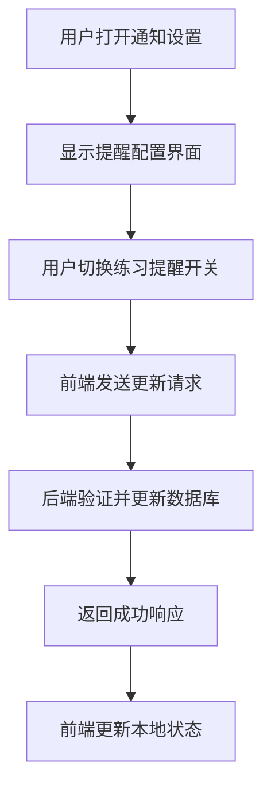
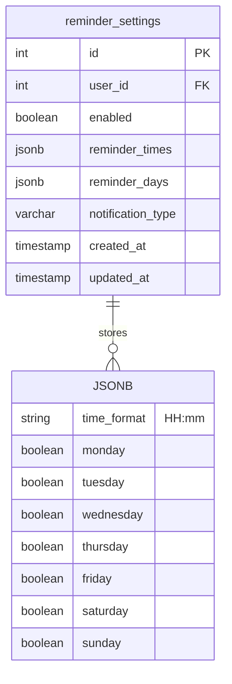
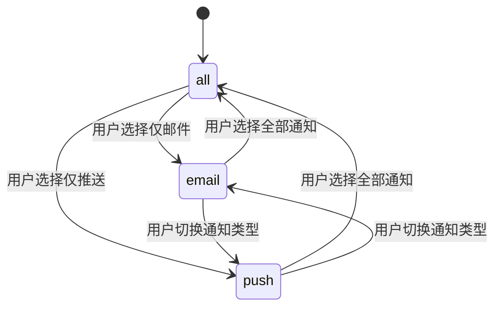
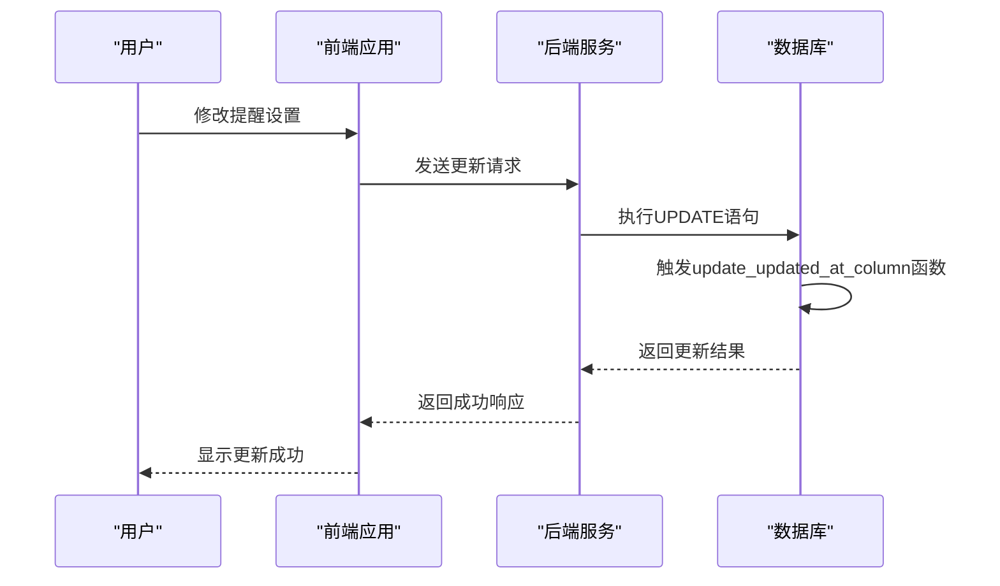
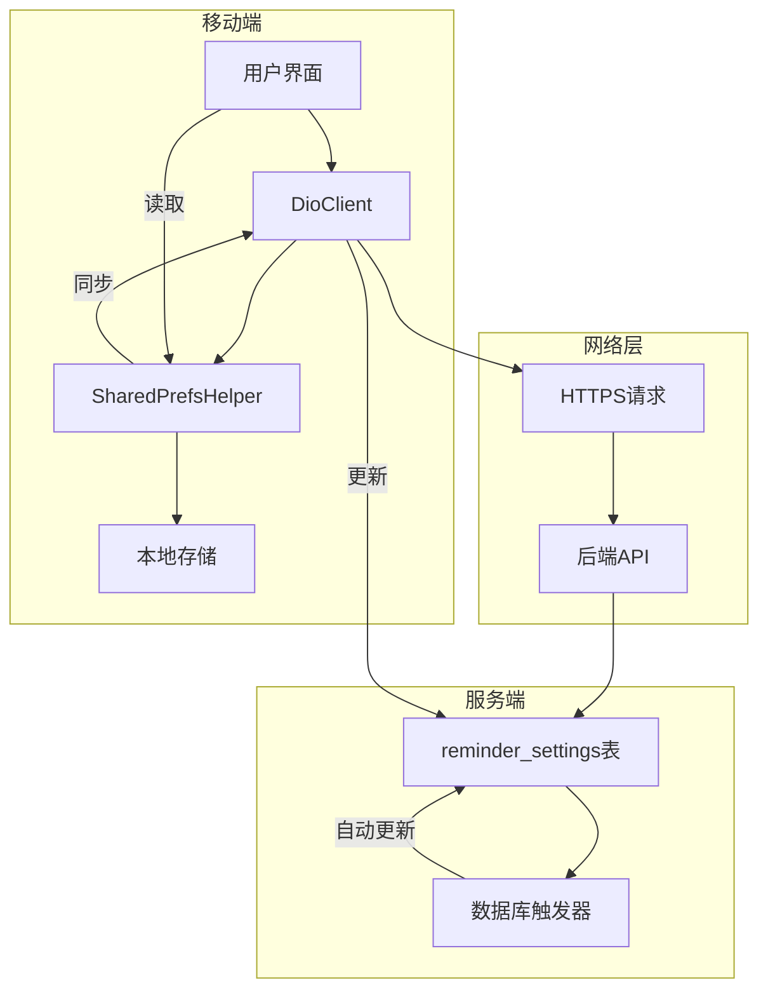
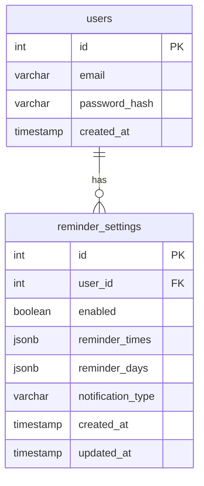

# 提醒设置表 (reminder_settings)

<cite>
**本文档引用文件**  
- [init.sql](file://database/init.sql#L80-L93)
- [index.ts](file://backend/src/types/index.ts#L4-L126)
- [profile_page.dart](file://flutter_app/lib/presentation/profile/pages/profile_page.dart#L450-L487)
- [shared_prefs_helper.dart](file://flutter_app/lib/core/storage/shared_prefs_helper.dart#L1-L305)
- [dio_client.dart](file://flutter_app/lib/core/network/dio_client.dart#L1-L262)
</cite>

## 目录
1. [简介](#简介)
2. [表结构与字段说明](#表结构与字段说明)
3. [用户交互设计](#用户交互设计)
4. [JSONB字段存储机制](#jsonb字段存储机制)
5. [通知类型扩展设计](#通知类型扩展设计)
6. [数据变更追踪机制](#数据变更追踪机制)
7. [移动端集成与跨平台同步](#移动端集成与跨平台同步)
8. [唯一性约束与数据完整性](#唯一性约束与数据完整性)

## 简介
提醒设置表（reminder_settings）是心理自助应用系统中的核心配置表之一，用于存储用户的个性化提醒偏好。该表通过灵活的JSONB字段设计支持复杂的提醒计划配置，并结合布尔开关和枚举类型字段实现精细化的通知控制。系统通过数据库触发器自动维护数据更新时间戳，确保数据变更可追踪。每个用户仅允许存在一条提醒配置记录，保障了数据的一致性和完整性。

## 表结构与字段说明
提醒设置表包含以下关键字段：

- **user_id**: 用户ID，外键引用users表，具有唯一约束，确保每个用户仅有一条配置记录
- **enabled**: 布尔类型，表示提醒功能是否启用，默认为TRUE
- **reminder_times**: JSONB类型，存储用户设置的提醒时间点
- **reminder_days**: JSONB类型，存储用户设置的提醒日期安排
- **notification_type**: 字符串类型，存储通知类型偏好，默认值为'all'
- **created_at**: 时间戳，记录配置创建时间
- **updated_at**: 时间戳，记录配置最后更新时间

**Section sources**
- [init.sql](file://database/init.sql#L80-L93)

## 用户交互设计
在移动端应用中，用户可以通过个人资料页面的"通知设置"功能访问提醒配置界面。界面采用开关列表（SwitchListTile）形式展示不同类型的提醒选项，包括"练习提醒"、"新方法推送"和"系统通知"。用户可以通过简单的开关操作启用或禁用各类通知，系统会将这些偏好同步到后端数据库。

**Diagram sources**
- [profile_page.dart](file://flutter_app/lib/presentation/profile/pages/profile_page.dart#L450-L487)

**Section sources**
- [profile_page.dart](file://flutter_app/lib/presentation/profile/pages/profile_page.dart#L450-L487)

## JSONB字段存储机制
`reminder_times`和`reminder_days`字段采用PostgreSQL的JSONB数据类型，提供了灵活的非结构化数据存储能力。这种设计允许用户自定义复杂的提醒计划，而无需预先定义固定的表结构。

`reminder_times`字段存储一个包含多个时间点的数组，每个时间点以"HH:mm"格式表示。`reminder_days`字段存储一个对象，包含一周七天的布尔值，表示每天是否启用提醒。JSONB类型的索引支持使得查询特定时间或日期的提醒配置具有良好的性能表现。

**Diagram sources**
- [init.sql](file://database/init.sql#L85-L86)

**Section sources**
- [init.sql](file://database/init.sql#L85-L86)

## 通知类型扩展设计
`notification_type`字段采用可扩展的设计，支持多种通知渠道的组合。当前支持的值包括：
- **all**: 接收所有类型的通知
- **email**: 仅接收邮件通知
- **push**: 仅接收推送通知

这种设计为未来扩展更多通知类型（如短信、微信等）提供了便利。通过简单的字符串枚举，系统可以根据用户的偏好路由通知到不同的通道，实现了通知策略的灵活配置。

**Diagram sources**
- [init.sql](file://database/init.sql#L87)

**Section sources**
- [init.sql](file://database/init.sql#L87)

## 数据变更追踪机制
系统通过数据库触发器实现`updated_at`字段的自动更新。`update_updated_at_column`函数定义了一个PL/pgSQL函数，当任何对提醒设置表的UPDATE操作发生时，该函数会自动将`updated_at`字段设置为当前时间戳。

`CREATE TRIGGER update_reminder_settings_updated_at BEFORE UPDATE ON reminder_settings`语句创建了触发器，确保每次更新操作都会调用上述函数。这种机制无需在应用层代码中手动维护更新时间，减少了出错的可能性，并保证了数据变更历史的准确性。

**Diagram sources**
- [init.sql](file://database/init.sql#L301-L314)

**Section sources**
- [init.sql](file://database/init.sql#L301-L314)

## 移动端集成与跨平台同步
在Flutter移动端应用中，提醒设置通过Dio网络客户端与后端API进行交互。`DioClient`类封装了HTTP请求的配置和拦截器，确保请求的安全性和一致性。`_AuthInterceptor`拦截器自动在请求头中添加JWT认证令牌，保证了接口调用的安全性。

应用使用`SharedPrefsHelper`类在本地存储用户的部分设置偏好，如通知启用状态等。当设备离线时，用户仍然可以修改本地设置，待网络恢复后通过同步机制将变更上传至服务器，实现了跨平台的数据同步和离线可用性。

**Diagram sources**
- [dio_client.dart](file://flutter_app/lib/core/network/dio_client.dart#L1-L262)
- [shared_prefs_helper.dart](file://flutter_app/lib/core/storage/shared_prefs_helper.dart#L1-L305)

**Section sources**
- [dio_client.dart](file://flutter_app/lib/core/network/dio_client.dart#L1-L262)
- [shared_prefs_helper.dart](file://flutter_app/lib/core/storage/shared_prefs_helper.dart#L1-L305)

## 唯一性约束与数据完整性
`user_id`字段上的UNIQUE约束确保了每个用户在提醒设置表中只能有一条记录。这一设计符合业务逻辑需求，因为提醒设置是用户级别的全局配置，不应存在多个配置实例。

外键约束`REFERENCES users(id) ON DELETE CASCADE`确保了数据的引用完整性。当用户账户被删除时，其对应的提醒设置也会被级联删除，避免了孤儿记录的产生。这种设计简化了数据清理逻辑，维护了数据库的整体一致性。

**Diagram sources**
- [init.sql](file://database/init.sql#L83)

**Section sources**
- [init.sql](file://database/init.sql#L83)