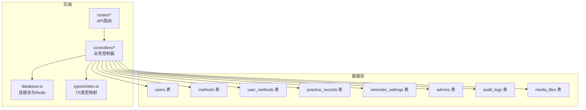
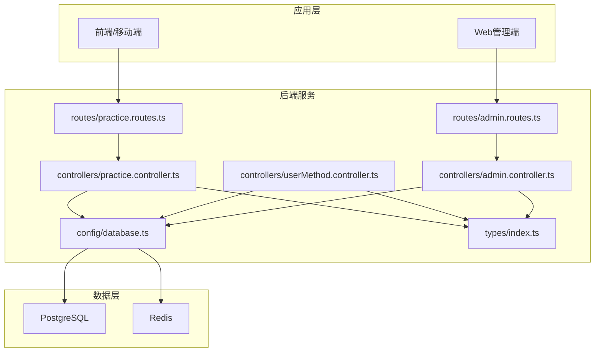
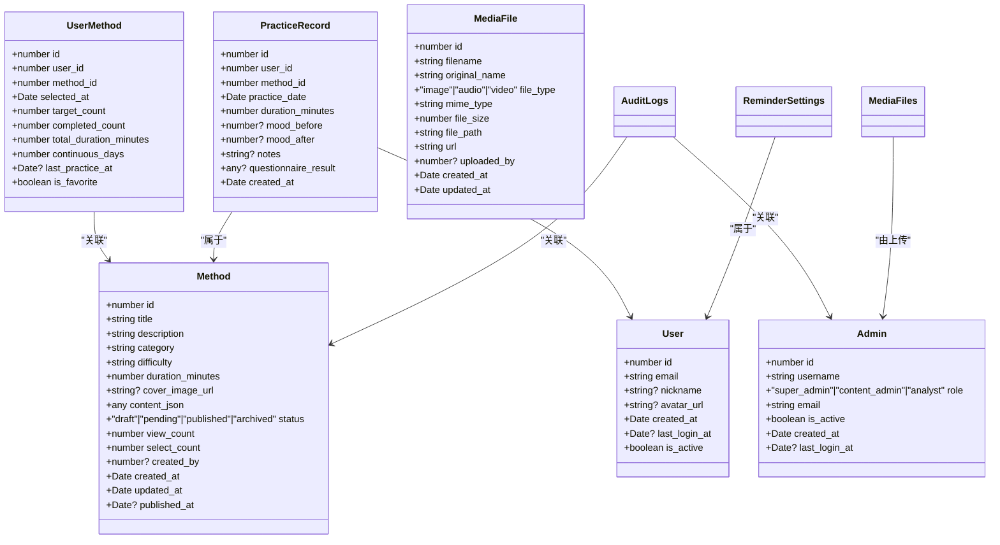
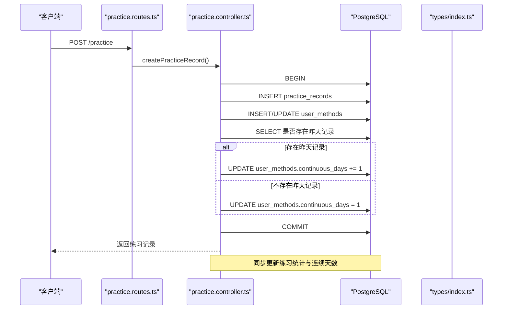
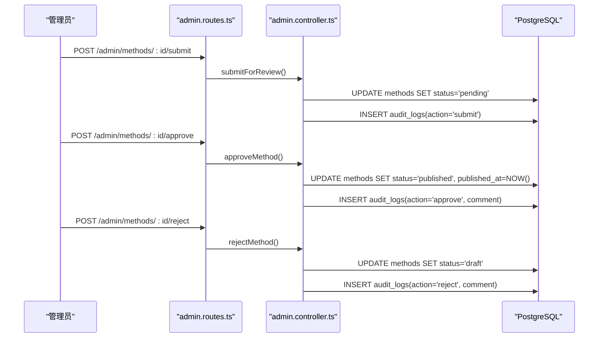
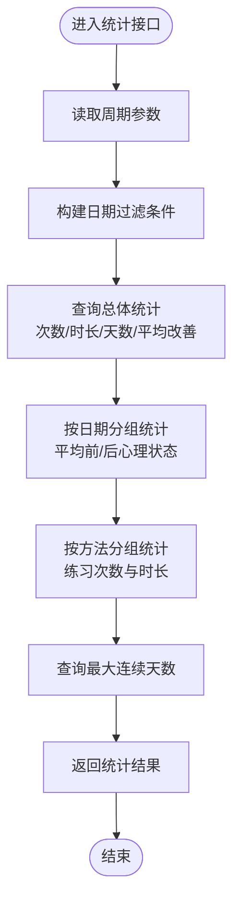
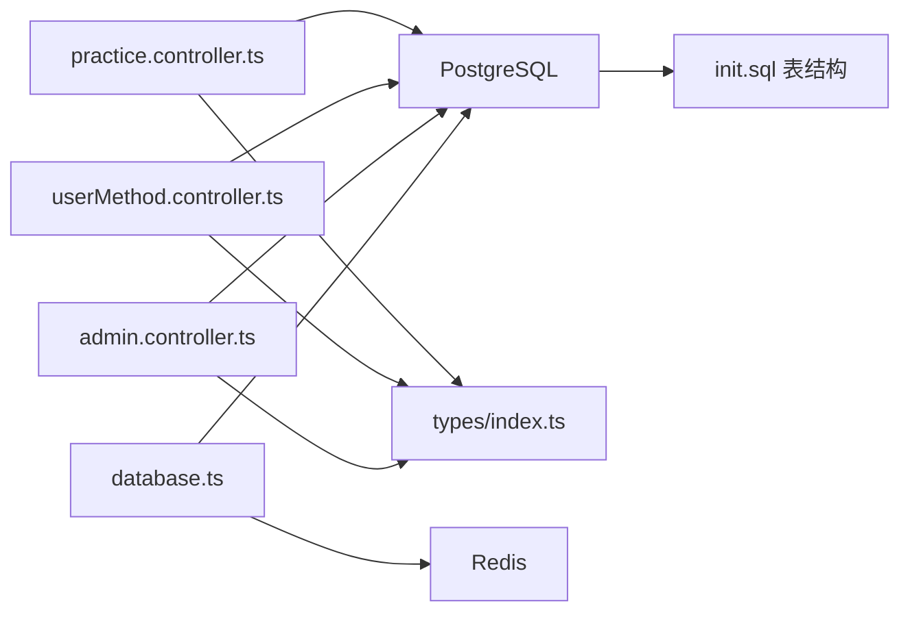

# 数据库概览

<cite>
**本文引用的文件**
- [init.sql](file://database/init.sql)
- [database.ts](file://backend/src/config/database.ts)
- [index.ts](file://backend/src/types/index.ts)
- [practice.controller.ts](file://backend/src/controllers/practice.controller.ts)
- [userMethod.controller.ts](file://backend/src/controllers/userMethod.controller.ts)
- [admin.controller.ts](file://backend/src/controllers/admin.controller.ts)
- [practice.routes.ts](file://backend/src/routes/practice.routes.ts)
- [admin.routes.ts](file://backend/src/routes/admin.routes.ts)
</cite>

## 目录
1. [简介](#简介)
2. [项目结构](#项目结构)
3. [核心组件](#核心组件)
4. [架构总览](#架构总览)
5. [详细组件分析](#详细组件分析)
6. [依赖分析](#依赖分析)
7. [性能考虑](#性能考虑)
8. [故障排查指南](#故障排查指南)
9. [结论](#结论)
10. [附录](#附录)

## 简介
本文件面向nian项目数据库的全面概览，围绕init.sql脚本中定义的核心表展开，系统性说明users、methods、practice_records、user_methods、reminder_settings、admins、audit_logs与media_files等表的设计目的与业务意义；结合后端连接池配置，解释PostgreSQL与Redis在系统中的角色分工；通过types/index.ts中的TypeScript接口映射数据库实体；提供ER图以可视化表间关系，并概述数据流在用户练习、内容审核与统计分析中的流转路径。

## 项目结构
数据库初始化脚本位于database/init.sql，后端通过backend/src/config/database.ts配置PostgreSQL连接池与Redis客户端；TypeScript类型定义位于backend/src/types/index.ts；控制器与路由分别在backend/src/controllers与backend/src/routes目录中，用于实现业务逻辑与API交互。



图表来源
- [init.sql](file://database/init.sql#L1-L143)
- [database.ts](file://backend/src/config/database.ts#L1-L47)
- [index.ts](file://backend/src/types/index.ts#L1-L126)
- [practice.routes.ts](file://backend/src/routes/practice.routes.ts#L1-L20)
- [admin.routes.ts](file://backend/src/routes/admin.routes.ts#L1-L98)

章节来源
- [init.sql](file://database/init.sql#L1-L143)
- [database.ts](file://backend/src/config/database.ts#L1-L47)
- [index.ts](file://backend/src/types/index.ts#L1-L126)
- [practice.routes.ts](file://backend/src/routes/practice.routes.ts#L1-L20)
- [admin.routes.ts](file://backend/src/routes/admin.routes.ts#L1-L98)

## 核心组件
本节对init.sql中定义的8个核心表进行职责与业务意义说明，并指出其索引与约束设计意图。

- users（用户表）
  - 职责：存储注册用户的基本信息与登录状态，支持唯一邮箱索引以保证账户唯一性。
  - 关键字段：id、email、password_hash、nickname、avatar_url、created_at、last_login_at、is_active。
  - 索引：idx_users_email、idx_users_created_at。
  - 业务意义：作为系统身份认证与个人练习数据的根实体，支撑用户画像与行为追踪。

- methods（心理自助方法表）
  - 职责：存储方法元数据、分类、难度、封面、内容JSON、状态与计数指标，支持按状态、类别、难度、创建时间检索。
  - 关键字段：id、title、description、category、difficulty、duration_minutes、cover_image_url、content_json、status、view_count、select_count、created_by、created_at、updated_at、published_at。
  - 索引：idx_methods_status、idx_methods_category、idx_methods_difficulty、idx_methods_created_at。
  - 触发器：update_updated_at_column自动维护updated_at。
  - 业务意义：承载内容资产，支持发布、草稿、待审等生命周期管理。

- user_methods（用户-方法关联表）
  - 职责：记录用户选择的方法、目标次数、完成次数、累计时长、连续天数、收藏标记与最近练习时间。
  - 关键字段：id、user_id、method_id、selected_at、target_count、completed_count、total_duration_minutes、continuous_days、last_practice_at、is_favorite。
  - 约束：UNIQUE(user_id, method_id)，外键级联删除。
  - 索引：idx_user_methods_user_id、idx_user_methods_method_id、idx_user_methods_selected_at。
  - 业务意义：实现“我的方法库”，支撑个性化学习计划与习惯养成。

- practice_records（练习记录表）
  - 职责：记录用户的单次练习详情，包含日期、时长、前后心理状态评分、问卷结果与备注。
  - 关键字段：id、user_id、method_id、practice_date、duration_minutes、mood_before、mood_after、notes、questionnaire_result、created_at。
  - 约束：mood评分范围校验。
  - 索引：idx_practice_records_user_id_date、idx_practice_records_user_id_method_id、idx_practice_records_created_at。
  - 业务意义：形成用户练习轨迹，支持统计分析与趋势洞察。

- reminder_settings（提醒设置表）
  - 职责：为用户配置提醒开关、提醒时刻集合、提醒星期集合与通知类型。
  - 关键字段：id、user_id（UNIQUE）、enabled、reminder_times、reminder_days、notification_type、created_at、updated_at。
  - 索引：idx_reminder_settings_user_id。
  - 业务意义：保障用户持续练习的外部驱动机制。

- admins（管理员表）
  - 职责：存储管理员账号、角色与登录状态，支持唯一用户名与邮箱。
  - 关键字段：id、username、password_hash、role、email、is_active、created_at、last_login_at。
  - 索引：idx_admins_username、idx_admins_email。
  - 业务意义：支撑内容审核、数据导出与用户管理等后台能力。

- audit_logs（审核记录表）
  - 职责：记录方法状态变更的审核动作、前后状态与评论，支持按方法与管理员维度查询。
  - 关键字段：id、method_id、admin_id、action、status_before、status_after、comment、created_at。
  - 索引：idx_audit_logs_method_id、idx_audit_logs_admin_id、idx_audit_logs_created_at。
  - 业务意义：确保内容变更的可追溯性与合规审计。

- media_files（媒体文件表）
  - 职责：记录上传的媒体资源（图片/音频/视频）元数据与访问地址，支持按类型与上传者检索。
  - 关键字段：id、filename、original_name、file_type、mime_type、file_size、file_path、url、uploaded_by、created_at、updated_at。
  - 索引：idx_media_files_file_type、idx_media_files_uploaded_by、idx_media_files_created_at。
  - 业务意义：为方法内容提供多媒体素材支撑。

章节来源
- [init.sql](file://database/init.sql#L1-L143)

## 架构总览
PostgreSQL承担持久化存储与复杂查询任务，Redis负责会话与缓存场景（如令牌、限流、临时状态）。后端控制器通过连接池执行SQL，配合TypeScript类型定义进行强类型数据交互。



图表来源
- [practice.routes.ts](file://backend/src/routes/practice.routes.ts#L1-L20)
- [admin.routes.ts](file://backend/src/routes/admin.routes.ts#L1-L98)
- [practice.controller.ts](file://backend/src/controllers/practice.controller.ts#L1-L261)
- [userMethod.controller.ts](file://backend/src/controllers/userMethod.controller.ts#L1-L162)
- [admin.controller.ts](file://backend/src/controllers/admin.controller.ts#L1-L800)
- [database.ts](file://backend/src/config/database.ts#L1-L47)
- [index.ts](file://backend/src/types/index.ts#L1-L126)

## 详细组件分析

### ER关系图
```mermaid
erDiagram
USERS {
int id PK
varchar email UK
varchar password_hash
varchar nickname
varchar avatar_url
timestamp created_at
timestamp last_login_at
boolean is_active
}
METHODS {
int id PK
varchar title
varchar description
varchar category
varchar difficulty
int duration_minutes
varchar cover_image_url
jsonb content_json
varchar status
int view_count
int select_count
int created_by FK
timestamp created_at
timestamp updated_at
timestamp published_at
}
USER_METHODS {
int id PK
int user_id FK
int method_id FK
timestamp selected_at
int target_count
int completed_count
int total_duration_minutes
int continuous_days
timestamp last_practice_at
boolean is_favorite
}
PRACTICE_RECORDS {
int id PK
int user_id FK
int method_id FK
date practice_date
int duration_minutes
int mood_before
int mood_after
text notes
jsonb questionnaire_result
timestamp created_at
}
REMINDER_SETTINGS {
int id PK
int user_id UK FK
boolean enabled
jsonb reminder_times
jsonb reminder_days
varchar notification_type
timestamp created_at
timestamp updated_at
}
ADMINS {
int id PK
varchar username UK
varchar password_hash
varchar role
varchar email UK
boolean is_active
timestamp created_at
timestamp last_login_at
}
AUDIT_LOGS {
int id PK
int method_id FK
int admin_id FK
varchar action
varchar status_before
varchar status_after
text comment
timestamp created_at
}
MEDIA_FILES {
int id PK
varchar filename
varchar original_name
varchar file_type
varchar mime_type
bigint file_size
varchar file_path
varchar url
int uploaded_by FK
timestamp created_at
timestamp updated_at
}
USERS ||--o{ USER_METHODS : "拥有"
METHODS ||--o{ USER_METHODS : "被选择"
USERS ||--o{ PRACTICE_RECORDS : "练习"
METHODS ||--o{ PRACTICE_RECORDS : "被练习"
USERS ||--o{ REMINDER_SETTINGS : "设置"
ADMINS ||--o{ AUDIT_LOGS : "操作"
METHODS ||--o{ AUDIT_LOGS : "被审核"
ADMINS ||--o{ MEDIA_FILES : "上传"
```

图表来源
- [init.sql](file://database/init.sql#L1-L143)

### 类型映射关系（TypeScript接口与数据库实体）
- users ↔ User / UserWithPassword
- methods ↔ Method
- user_methods ↔ UserMethod
- practice_records ↔ PracticeRecord
- admins ↔ Admin / AdminWithPassword
- media_files ↔ MediaFile



图表来源
- [index.ts](file://backend/src/types/index.ts#L1-L126)
- [init.sql](file://database/init.sql#L1-L143)

章节来源
- [index.ts](file://backend/src/types/index.ts#L1-L126)
- [init.sql](file://database/init.sql#L1-L143)

### 用户练习流程（序列图）
该流程展示用户提交一次练习时，后端如何写入练习记录并同步更新用户方法统计与连续天数逻辑。



图表来源
- [practice.routes.ts](file://backend/src/routes/practice.routes.ts#L1-L20)
- [practice.controller.ts](file://backend/src/controllers/practice.controller.ts#L1-L120)
- [index.ts](file://backend/src/types/index.ts#L1-L126)

章节来源
- [practice.controller.ts](file://backend/src/controllers/practice.controller.ts#L1-L120)
- [practice.routes.ts](file://backend/src/routes/practice.routes.ts#L1-L20)

### 内容审核流程（序列图）
管理员对方法进行提交、审核通过与拒绝的完整流程，同时记录审计日志。



图表来源
- [admin.routes.ts](file://backend/src/routes/admin.routes.ts#L1-L98)
- [admin.controller.ts](file://backend/src/controllers/admin.controller.ts#L266-L387)
- [init.sql](file://database/init.sql#L110-L124)

章节来源
- [admin.controller.ts](file://backend/src/controllers/admin.controller.ts#L266-L387)
- [admin.routes.ts](file://backend/src/routes/admin.routes.ts#L1-L98)

### 统计分析流程（流程图）
以练习统计为例，展示按时间段聚合总体统计、心理状态趋势、方法分布与最大连续天数的计算过程。



图表来源
- [practice.controller.ts](file://backend/src/controllers/practice.controller.ts#L174-L261)

章节来源
- [practice.controller.ts](file://backend/src/controllers/practice.controller.ts#L174-L261)

## 依赖分析
- 控制器对数据库的依赖
  - practice.controller.ts：直接使用pool连接PostgreSQL，执行事务与多表更新，体现用户练习与个人方法统计的耦合。
  - userMethod.controller.ts：与methods、user_methods联动，维护选择计数与个人方法状态。
  - admin.controller.ts：覆盖方法管理、审核、统计、媒体上传与导出，依赖较多表且涉及复杂条件查询。
- 类型系统对数据库的映射
  - types/index.ts中的接口与init.sql字段一一对应，确保后端强类型安全与API契约清晰。
- 连接池与缓存
  - database.ts提供PostgreSQL连接池与Redis客户端，统一初始化与优雅关闭，避免资源泄漏。



图表来源
- [practice.controller.ts](file://backend/src/controllers/practice.controller.ts#L1-L261)
- [userMethod.controller.ts](file://backend/src/controllers/userMethod.controller.ts#L1-L162)
- [admin.controller.ts](file://backend/src/controllers/admin.controller.ts#L1-L800)
- [init.sql](file://database/init.sql#L1-L143)
- [index.ts](file://backend/src/types/index.ts#L1-L126)
- [database.ts](file://backend/src/config/database.ts#L1-L47)

章节来源
- [practice.controller.ts](file://backend/src/controllers/practice.controller.ts#L1-L261)
- [userMethod.controller.ts](file://backend/src/controllers/userMethod.controller.ts#L1-L162)
- [admin.controller.ts](file://backend/src/controllers/admin.controller.ts#L1-L800)
- [index.ts](file://backend/src/types/index.ts#L1-L126)
- [database.ts](file://backend/src/config/database.ts#L1-L47)

## 性能考虑
- 索引策略
  - users、methods、user_methods、practice_records、reminder_settings、admins、audit_logs、media_files均设置了关键列索引，有助于高频查询（按状态、类别、时间、用户等）。
- 触发器与自动更新
  - methods与reminder_settings的updated_at自动更新，减少应用层冗余代码。
- 视图优化
  - init.sql中提供了用户练习统计与方法热度统计视图，便于报表与分析场景直接查询。
- 连接池配置
  - database.ts中配置了连接池上限、空闲超时与连接超时，建议根据并发与QPS调优max、idleTimeoutMillis、connectionTimeoutMillis。
- 缓存与Redis
  - Redis可用于热点数据缓存、会话存储与限流，建议结合业务场景规划键空间与过期策略。

[本节为通用指导，无需列出具体文件来源]

## 故障排查指南
- 认证失败
  - practice.routes.ts要求用户认证，若出现401，请检查前端携带的用户令牌与后端鉴权中间件。
- 参数校验错误
  - practice.controller.ts对mood评分范围进行校验，若出现400，请确认mood_before与mood_after在1~10范围内。
- 事务回滚
  - createPracticeRecord在异常时会回滚事务，若出现数据不一致，请检查user_methods冲突处理与连续天数逻辑。
- 权限不足
  - admin.controller.ts中审核通过/拒绝仅允许super_admin，若出现403，请确认管理员角色。
- 导出与媒体
  - admin.controller.ts的导出与媒体管理依赖文件系统路径，若下载失败，请检查文件路径与权限。

章节来源
- [practice.routes.ts](file://backend/src/routes/practice.routes.ts#L1-L20)
- [practice.controller.ts](file://backend/src/controllers/practice.controller.ts#L1-L120)
- [admin.controller.ts](file://backend/src/controllers/admin.controller.ts#L298-L387)

## 结论
nian项目的数据库以init.sql为核心，围绕用户、方法、练习、提醒、审核与媒体六大维度构建了完整的心理自助体系。PostgreSQL承担主数据存储与复杂查询，Redis提供会话与缓存能力；TypeScript类型系统确保前后端契约一致。通过ER图与流程图，可以清晰把握数据流向与业务闭环，为后续扩展与优化奠定基础。

[本节为总结性内容，无需列出具体文件来源]

## 附录
- 示例数据
  - init.sql包含默认管理员与若干示例方法，便于快速验证系统功能。
- 视图说明
  - init.sql中提供了用户练习统计与方法热度统计视图，建议在报表与分析模块直接使用。

章节来源
- [init.sql](file://database/init.sql#L144-L349)