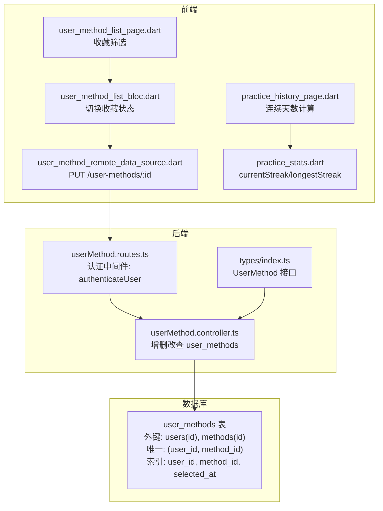
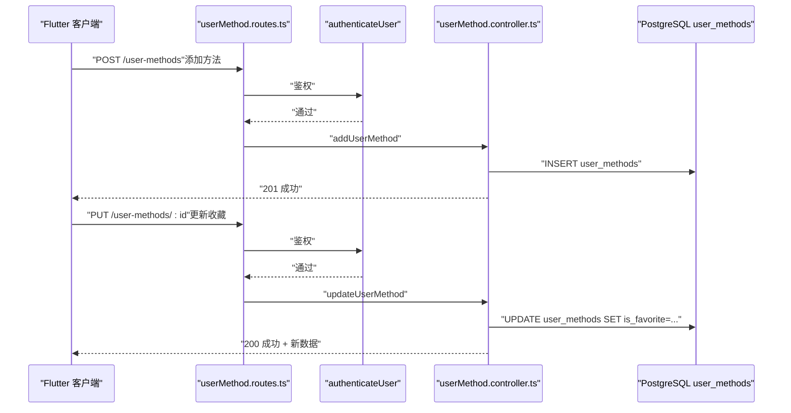
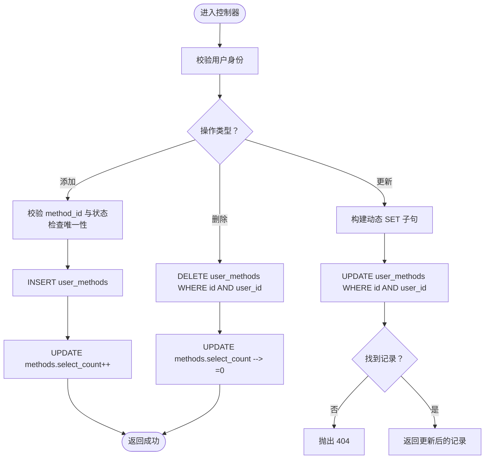
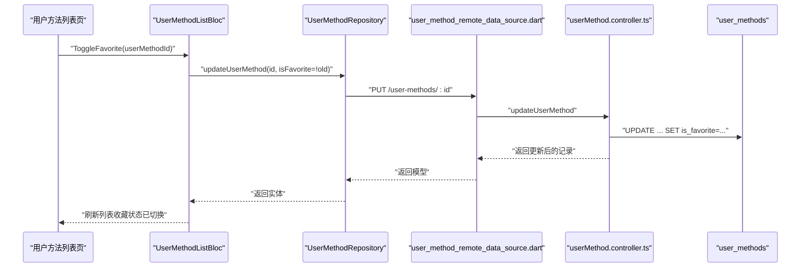
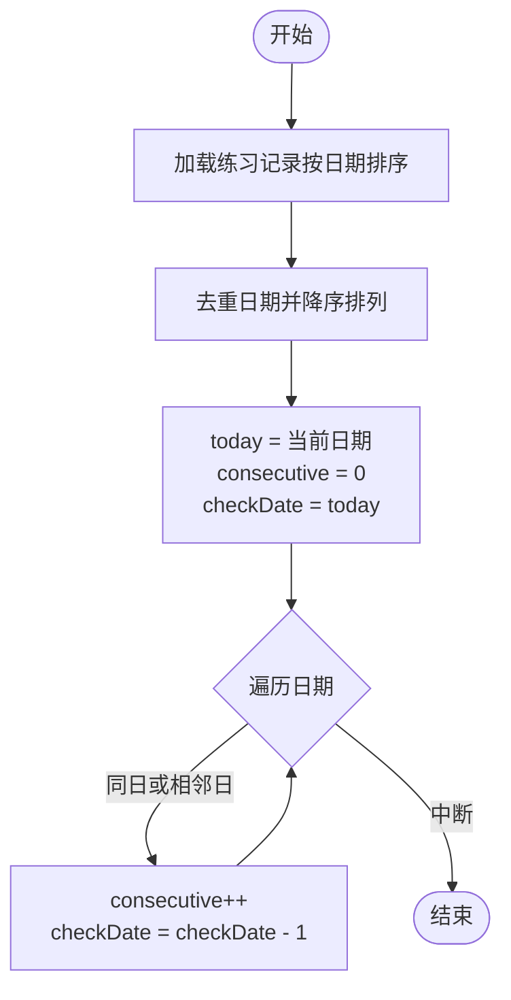
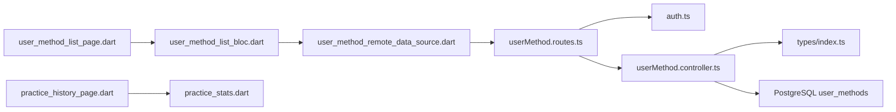
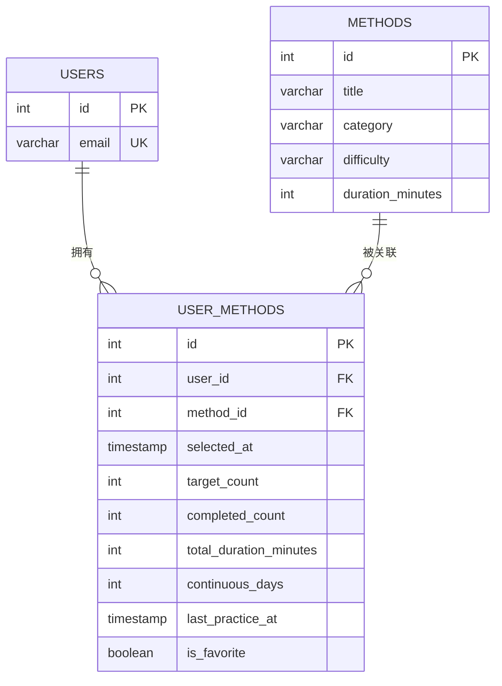

# 用户方法关联表 (user_methods)

<cite>
**本文引用的文件**
- [init.sql](file://database/init.sql)
- [index.ts](file://backend/src/types/index.ts)
- [userMethod.controller.ts](file://backend/src/controllers/userMethod.controller.ts)
- [userMethod.routes.ts](file://backend/src/routes/userMethod.routes.ts)
- [auth.ts](file://backend/src/middleware/auth.ts)
- [user_method.dart](file://flutter_app/lib/domain/entities/user_method.dart)
- [user_method_model.dart](file://flutter_app/lib/data/models/user_method_model.dart)
- [user_method_remote_data_source.dart](file://flutter_app/lib/data/datasources/remote/user_method_remote_data_source.dart)
- [user_method_list_page.dart](file://flutter_app/lib/presentation/user_methods/pages/user_method_list_page.dart)
- [user_method_list_bloc.dart](file://flutter_app/lib/presentation/user_methods/bloc/user_method_list_bloc.dart)
- [practice_history_page.dart](file://flutter_app/lib/presentation/practice/pages/practice_history_page.dart)
- [practice_stats.dart](file://flutter_app/lib/domain/entities/practice_stats.dart)
</cite>

## 目录
1. [简介](#简介)
2. [项目结构](#项目结构)
3. [核心组件](#核心组件)
4. [架构总览](#架构总览)
5. [详细组件分析](#详细组件分析)
6. [依赖关系分析](#依赖关系分析)
7. [性能考量](#性能考量)
8. [故障排查指南](#故障排查指南)
9. [结论](#结论)
10. [附录](#附录)

## 简介
本文件围绕“用户方法关联表”（user_methods）进行系统化设计与应用说明，结合数据库初始化脚本中的表结构定义与后端控制器实现，解释外键约束如何保障数据完整性；阐述 selected_at、target_count、completed_count 在个性化目标追踪中的业务含义；深入分析 continuous_days 字段在成就系统与用户粘性分析中的计算逻辑；说明 is_favorite 标志在用户偏好排序中的作用；并结合 userMethod.controller.ts 的实现，描述用户收藏方法与更新练习进度的 API 交互流程。最后讨论复合索引 idx_user_methods_user_id_method_id 对查询性能的优化效果，并给出基于该表的个性化推荐算法思路示例。

## 项目结构
- 数据库层：通过 init.sql 定义 user_methods 表及外键约束、唯一约束与索引。
- 后端层：通过 userMethod.controller.ts 提供添加、查询、更新、删除用户方法的 API；通过 userMethod.routes.ts 将路由与认证中间件绑定；通过 types/index.ts 定义 UserMethod 接口。
- 前端层：Flutter 应用通过 user_method_remote_data_source.dart 调用后端 API；通过 user_method_list_page.dart 和 user_method_list_bloc.dart 实现收藏筛选与状态切换；通过 practice_history_page.dart 中的连续天数计算逻辑体现 continuous_days 的使用场景。

图表来源
- [init.sql](file://database/init.sql#L43-L61)
- [userMethod.routes.ts](file://backend/src/routes/userMethod.routes.ts#L1-L23)
- [userMethod.controller.ts](file://backend/src/controllers/userMethod.controller.ts#L1-L162)
- [index.ts](file://backend/src/types/index.ts#L37-L49)
- [user_method_remote_data_source.dart](file://flutter_app/lib/data/datasources/remote/user_method_remote_data_source.dart#L42-L85)
- [user_method_list_page.dart](file://flutter_app/lib/presentation/user_methods/pages/user_method_list_page.dart#L73-L193)
- [user_method_list_bloc.dart](file://flutter_app/lib/presentation/user_methods/bloc/user_method_list_bloc.dart#L75-L122)
- [practice_history_page.dart](file://flutter_app/lib/presentation/practice/pages/practice_history_page.dart#L280-L324)
- [practice_stats.dart](file://flutter_app/lib/domain/entities/practice_stats.dart#L1-L46)

章节来源
- [init.sql](file://database/init.sql#L43-L61)
- [userMethod.routes.ts](file://backend/src/routes/userMethod.routes.ts#L1-L23)
- [userMethod.controller.ts](file://backend/src/controllers/userMethod.controller.ts#L1-L162)
- [index.ts](file://backend/src/types/index.ts#L37-L49)

## 核心组件
- user_methods 表：存储用户与方法的关联关系，包含选择时间、目标次数、完成次数、累计时长、连续天数、最近练习时间、是否收藏等字段。
- UserMethod 接口：后端类型定义，用于控制器与数据库交互的数据契约。
- userMethod.controller.ts：提供添加方法到个人库、获取个人方法列表、更新用户方法（含收藏）、删除个人方法等 API。
- 前端模型与页面：UserMethodModel 与 UserMethod 实体用于展示与交互；收藏筛选与切换由 BLoC 与页面共同实现；连续天数计算在练习历史页面体现。

章节来源
- [init.sql](file://database/init.sql#L43-L61)
- [index.ts](file://backend/src/types/index.ts#L37-L49)
- [userMethod.controller.ts](file://backend/src/controllers/userMethod.controller.ts#L1-L162)
- [user_method.dart](file://flutter_app/lib/domain/entities/user_method.dart#L1-L59)
- [user_method_model.dart](file://flutter_app/lib/data/models/user_method_model.dart#L1-L89)

## 架构总览
用户方法关联表贯穿“认证—路由—控制器—数据库—前端”的完整链路。认证中间件确保只有登录用户可操作；路由层统一挂载认证；控制器负责业务校验与数据库操作；前端通过远程数据源调用后端接口，实现收藏、筛选与统计展示。

图表来源
- [userMethod.routes.ts](file://backend/src/routes/userMethod.routes.ts#L1-L23)
- [auth.ts](file://backend/src/middleware/auth.ts#L1-L33)
- [userMethod.controller.ts](file://backend/src/controllers/userMethod.controller.ts#L1-L162)

## 详细组件分析

### 1) 表结构与外键约束
- 外键约束
  - user_id 引用 users(id)，ON DELETE CASCADE：当用户被删除时，其关联的 user_methods 记录也会级联删除，避免悬挂记录。
  - method_id 引用 methods(id)，ON DELETE CASCADE：当方法被删除时，关联记录同样级联删除，保证数据一致性。
- 唯一约束
  - UNIQUE(user_id, method_id)：防止同一用户重复添加同一方法，确保每条记录的唯一性。
- 索引
  - idx_user_methods_user_id：加速按用户查询。
  - idx_user_methods_method_id：加速按方法查询。
  - idx_user_methods_selected_at：加速按添加时间排序与筛选。
- 字段语义
  - selected_at：记录用户添加方法的时间，用于排序与追踪。
  - target_count：用户设定的练习目标次数，用于个性化目标追踪。
  - completed_count：已完成次数，配合 target_count 用于进度可视化。
  - total_duration_minutes：累计练习时长，用于统计与推荐。
  - continuous_days：连续练习天数，用于成就系统与粘性分析。
  - last_practice_at：最近一次练习时间，辅助统计与提醒。
  - is_favorite：是否收藏，用于用户偏好排序与筛选。

章节来源
- [init.sql](file://database/init.sql#L43-L61)

### 2) 控制器与 API 交互流程
- 添加方法到个人库
  - 校验：需要已登录用户与有效 method_id；方法需处于已发布状态；检查是否已存在关联。
  - 操作：插入 user_methods 记录（默认 selected_at、target_count、completed_count 等字段取默认值），同时更新 methods 的 select_count。
- 获取个人方法列表
  - 查询 user_methods 并与 methods 进行 JOIN，按 selected_at 降序返回，便于展示最新添加的方法。
- 更新用户方法
  - 支持更新 target_count 与 is_favorite；通过动态拼接 SET 子句实现按需更新；严格校验用户身份与记录存在性。
- 删除个人方法
  - 校验用户身份与记录存在性；删除后回退 methods 的 select_count，确保计数正确。

图表来源
- [userMethod.controller.ts](file://backend/src/controllers/userMethod.controller.ts#L1-L162)

章节来源
- [userMethod.controller.ts](file://backend/src/controllers/userMethod.controller.ts#L1-L162)

### 3) 前端交互与收藏筛选
- 收藏切换
  - 页面通过 BLoC 监听收藏事件，调用远程数据源 PUT /user-methods/:id 更新 is_favorite。
  - 成功后立即刷新本地列表，实现即时反馈。
- 收藏筛选
  - 页面支持“收藏”筛选按钮，客户端侧过滤 isFavorite=true 的方法，提升交互体验。

图表来源
- [user_method_list_page.dart](file://flutter_app/lib/presentation/user_methods/pages/user_method_list_page.dart#L73-L193)
- [user_method_list_bloc.dart](file://flutter_app/lib/presentation/user_methods/bloc/user_method_list_bloc.dart#L75-L122)
- [user_method_remote_data_source.dart](file://flutter_app/lib/data/datasources/remote/user_method_remote_data_source.dart#L42-L85)
- [userMethod.controller.ts](file://backend/src/controllers/userMethod.controller.ts#L82-L131)

章节来源
- [user_method_list_page.dart](file://flutter_app/lib/presentation/user_methods/pages/user_method_list_page.dart#L73-L193)
- [user_method_list_bloc.dart](file://flutter_app/lib/presentation/user_methods/bloc/user_method_list_bloc.dart#L75-L122)
- [user_method_remote_data_source.dart](file://flutter_app/lib/data/datasources/remote/user_method_remote_data_source.dart#L42-L85)
- [userMethod.controller.ts](file://backend/src/controllers/userMethod.controller.ts#L82-L131)

### 4) 连续天数（continuous_days）与成就系统
- 字段来源：表中定义 continuous_days，默认 0，用于记录连续练习天数。
- 前端计算逻辑：练习历史页面实现了从练习记录中计算当前连续天数的算法，采用“从今天向前回溯”的方式，逐日比对是否存在练习记录，从而得到 currentStreak；最长连续天数可在统计实体中体现。
- 业务意义：
  - 成就系统：作为“连续打卡”类成就的判定依据。
  - 用户粘性分析：衡量用户坚持程度，辅助个性化推荐与激励策略。

图表来源
- [practice_history_page.dart](file://flutter_app/lib/presentation/practice/pages/practice_history_page.dart#L280-L324)
- [practice_stats.dart](file://flutter_app/lib/domain/entities/practice_stats.dart#L1-L46)

章节来源
- [practice_history_page.dart](file://flutter_app/lib/presentation/practice/pages/practice_history_page.dart#L280-L324)
- [practice_stats.dart](file://flutter_app/lib/domain/entities/practice_stats.dart#L1-L46)

### 5) is_favorite 标志与用户偏好排序
- 后端：updateUserMethod 支持更新 is_favorite 字段，严格校验用户身份与记录存在性。
- 前端：页面支持“收藏”筛选，客户端侧过滤，实现快速偏好排序与展示。
- 业务意义：收藏作为用户偏好的显式标记，可用于个性化推荐与界面排序。

章节来源
- [userMethod.controller.ts](file://backend/src/controllers/userMethod.controller.ts#L82-L131)
- [user_method_list_page.dart](file://flutter_app/lib/presentation/user_methods/pages/user_method_list_page.dart#L73-L193)

### 6) 复合索引与查询性能优化
- 现状索引
  - idx_user_methods_user_id：加速按用户查询。
  - idx_user_methods_method_id：加速按方法查询。
  - idx_user_methods_selected_at：加速按添加时间排序与筛选。
- 复合索引建议
  - idx_user_methods_user_id_method_id：可覆盖“按用户+方法”的唯一性查询与 JOIN 场景，减少隐式排序与临时表，提升查询效率。
- 优化效果
  - 降低 JOIN 与 WHERE 条件的扫描成本，缩短响应时间，尤其在高频查询与大表场景下收益显著。

章节来源
- [init.sql](file://database/init.sql#L58-L61)

### 7) 个性化推荐算法示例（基于 user_methods 数据）
以下为概念性推荐思路，不对应具体代码实现：
- 特征提取
  - 用户偏好：is_favorite 为真表示偏好；target_count 与 completed_count 的差值可反映“未达成目标”的倾向，可能提示需要更易入门的方法。
  - 练习行为：total_duration_minutes、continuous_days、last_practice_at 反映活跃度与持续性。
  - 方法属性：methods.category、difficulty、duration_minutes。
- 推荐策略
  - 协同过滤：寻找与当前用户相似的用户群体，推荐其收藏且未被当前用户添加的方法。
  - 内容过滤：根据用户偏好（is_favorite）与难度/时长偏好（target_count、duration_minutes）匹配。
  - 混合策略：结合“热门度”（select_count）与“用户偏好”加权评分，优先推荐高分且符合偏好的方法。
- 实施要点
  - 使用复合索引 idx_user_methods_user_id_method_id 优化 JOIN 与过滤。
  - 结合视图或物化视图缓存热门度与偏好统计，降低实时计算开销。

[本节为概念性说明，无需列出章节来源]

## 依赖关系分析
- 后端依赖
  - userMethod.routes.ts 依赖 authenticateUser 中间件，确保所有路由均需认证。
  - userMethod.controller.ts 依赖数据库连接池与错误处理中间件，执行 CRUD 操作并维护计数字段。
  - types/index.ts 定义 UserMethod 接口，约束前后端数据契约。
- 前端依赖
  - user_method_remote_data_source.dart 通过 Dio 客户端调用后端 API。
  - user_method_list_page.dart 与 user_method_list_bloc.dart 协作实现收藏筛选与状态切换。
  - practice_history_page.dart 与 practice_stats.dart 体现连续天数与统计实体的使用。

图表来源
- [userMethod.routes.ts](file://backend/src/routes/userMethod.routes.ts#L1-L23)
- [auth.ts](file://backend/src/middleware/auth.ts#L1-L33)
- [userMethod.controller.ts](file://backend/src/controllers/userMethod.controller.ts#L1-L162)
- [index.ts](file://backend/src/types/index.ts#L37-L49)
- [user_method_remote_data_source.dart](file://flutter_app/lib/data/datasources/remote/user_method_remote_data_source.dart#L42-L85)
- [user_method_list_page.dart](file://flutter_app/lib/presentation/user_methods/pages/user_method_list_page.dart#L73-L193)
- [user_method_list_bloc.dart](file://flutter_app/lib/presentation/user_methods/bloc/user_method_list_bloc.dart#L75-L122)
- [practice_history_page.dart](file://flutter_app/lib/presentation/practice/pages/practice_history_page.dart#L280-L324)
- [practice_stats.dart](file://flutter_app/lib/domain/entities/practice_stats.dart#L1-L46)

章节来源
- [userMethod.routes.ts](file://backend/src/routes/userMethod.routes.ts#L1-L23)
- [auth.ts](file://backend/src/middleware/auth.ts#L1-L33)
- [userMethod.controller.ts](file://backend/src/controllers/userMethod.controller.ts#L1-L162)
- [index.ts](file://backend/src/types/index.ts#L37-L49)
- [user_method_remote_data_source.dart](file://flutter_app/lib/data/datasources/remote/user_method_remote_data_source.dart#L42-L85)
- [user_method_list_page.dart](file://flutter_app/lib/presentation/user_methods/pages/user_method_list_page.dart#L73-L193)
- [user_method_list_bloc.dart](file://flutter_app/lib/presentation/user_methods/bloc/user_method_list_bloc.dart#L75-L122)
- [practice_history_page.dart](file://flutter_app/lib/presentation/practice/pages/practice_history_page.dart#L280-L324)
- [practice_stats.dart](file://flutter_app/lib/domain/entities/practice_stats.dart#L1-L46)

## 性能考量
- 索引策略
  - 已有单列索引：user_id、method_id、selected_at，满足常见查询场景。
  - 建议新增复合索引 idx_user_methods_user_id_method_id，以优化“按用户+方法”的唯一性查询与 JOIN。
- 查询优化
  - 控制器中按用户查询与 JOIN 方法信息的 SQL 已具备良好索引支撑；若用户方法数量增长，建议引入复合索引进一步提升性能。
- 缓存与异步
  - 可结合 Redis 缓存热门方法与用户偏好统计，减少数据库压力；对高频统计（如 select_count）可考虑物化视图或定时任务预计算。

[本节为通用性能建议，无需列出章节来源]

## 故障排查指南
- 认证失败
  - 现象：401 AUTH_FAILED。
  - 排查：确认请求头 Authorization 是否为 Bearer Token，Token 是否过期或非法。
- 参数校验失败
  - 现象：400 VALIDATION_ERROR。
  - 排查：确认请求体包含 method_id 或更新字段（如 target_count、is_favorite）。
- 资源不存在
  - 现象：404 NOT_FOUND。
  - 排查：确认 user_id 与记录 ID 匹配；确认方法存在且状态为已发布。
- 重复添加
  - 现象：409 DUPLICATE_ENTRY。
  - 排查：确认 UNIQUE(user_id, method_id) 约束，避免重复添加。
- 删除计数异常
  - 现象：方法 select_count 不一致。
  - 排查：确认删除后是否执行了 select_count--（且不小于 0）。

章节来源
- [userMethod.controller.ts](file://backend/src/controllers/userMethod.controller.ts#L1-L162)
- [auth.ts](file://backend/src/middleware/auth.ts#L1-L33)

## 结论
user_methods 表通过外键与唯一约束保障了用户与方法关联的完整性；selected_at、target_count、completed_count、total_duration_minutes、continuous_days、last_practice_at、is_favorite 等字段共同构成个性化目标追踪与成就系统的数据基础。后端控制器提供了完善的 CRUD 能力，前端通过收藏筛选与连续天数计算提升了用户体验。建议引入复合索引以进一步优化查询性能，并结合推荐算法实现更智能的个性化方法推荐。

[本节为总结性内容，无需列出章节来源]

## 附录
- 数据模型关系（简化）

图表来源
- [init.sql](file://database/init.sql#L43-L61)
- [index.ts](file://backend/src/types/index.ts#L37-L49)