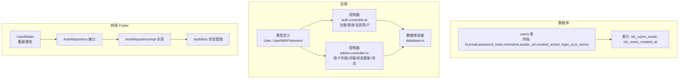
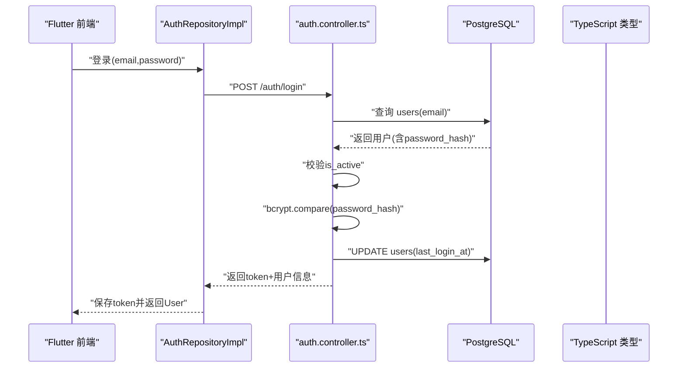
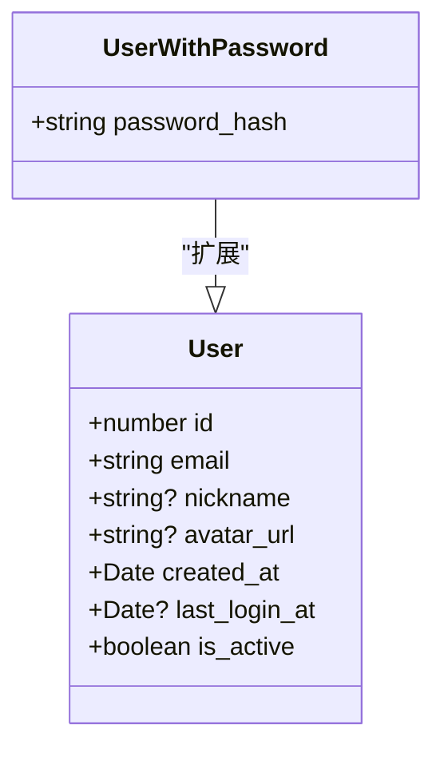
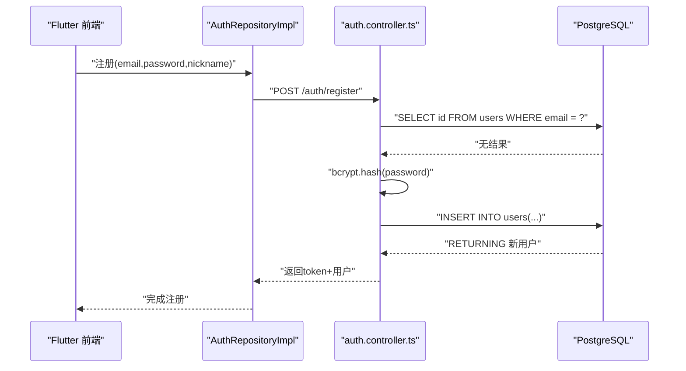
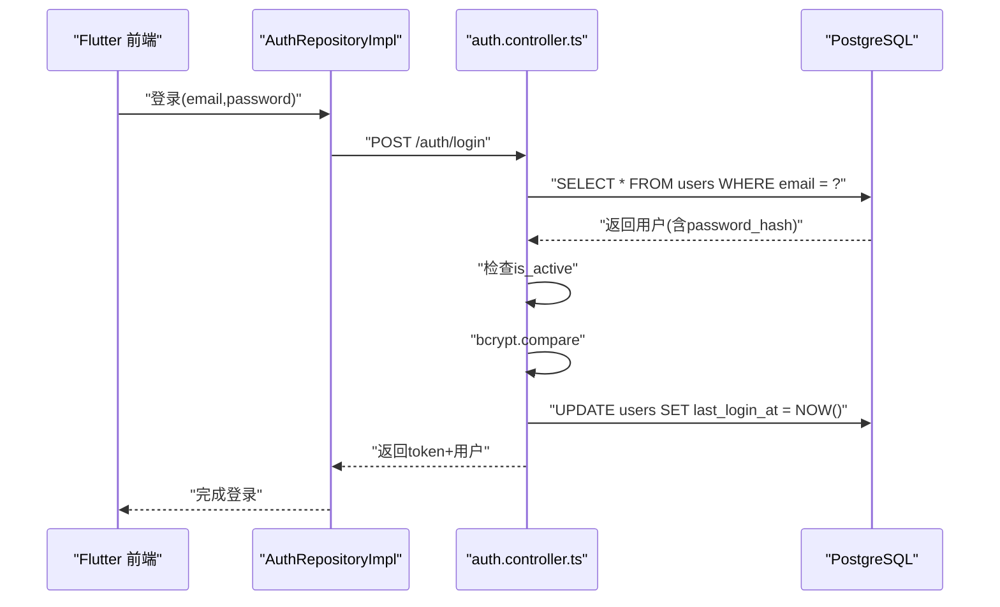
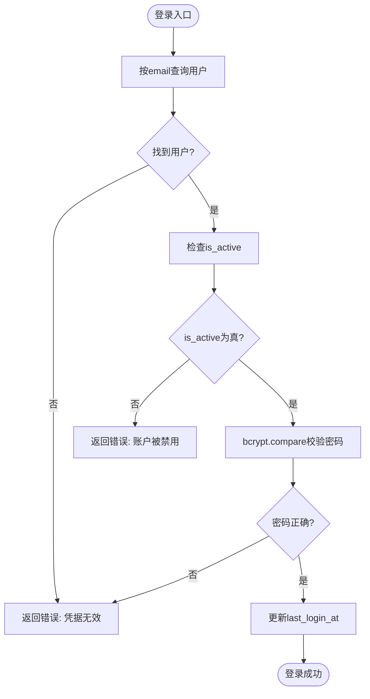
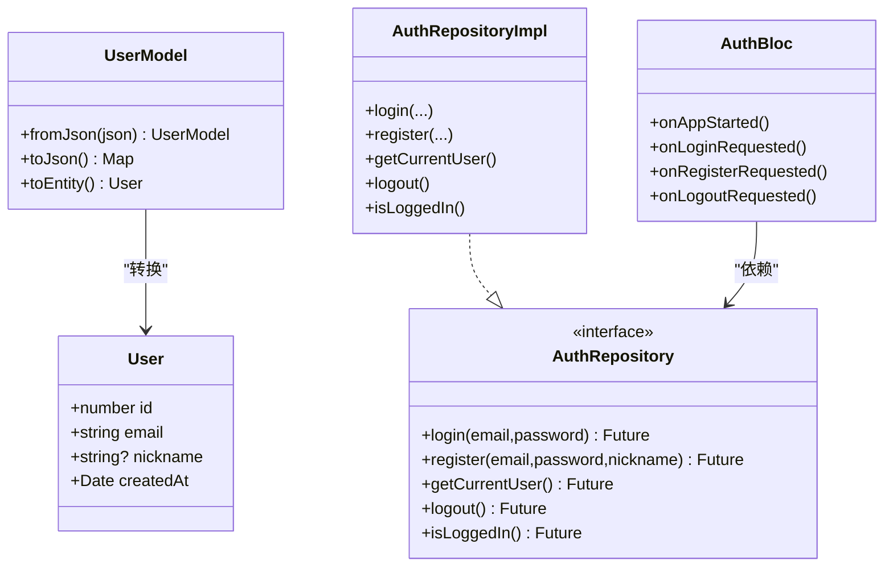
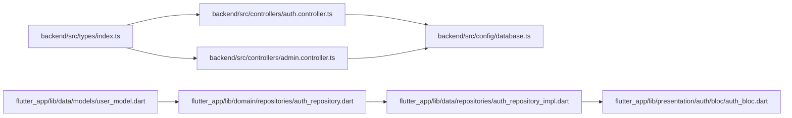

# 用户表 (users)

<cite>
**本文引用的文件**
- [init.sql](file://database/init.sql)
- [index.ts](file://backend/src/types/index.ts)
- [auth.controller.ts](file://backend/src/controllers/auth.controller.ts)
- [admin.controller.ts](file://backend/src/controllers/admin.controller.ts)
- [database.ts](file://backend/src/config/database.ts)
- [UserManagement.tsx](file://home/user/nian/admin-web/src/pages/UserManagement.tsx)
- [user_model.dart](file://flutter_app/lib/data/models/user_model.dart)
- [auth_repository.dart](file://flutter_app/lib/domain/repositories/auth_repository.dart)
- [auth_repository_impl.dart](file://flutter_app/lib/data/repositories/auth_repository_impl.dart)
- [auth_bloc.dart](file://flutter_app/lib/presentation/auth/bloc/auth_bloc.dart)
</cite>

## 目录
1. [简介](#简介)
2. [项目结构](#项目结构)
3. [核心组件](#核心组件)
4. [架构总览](#架构总览)
5. [详细组件分析](#详细组件分析)
6. [依赖分析](#依赖分析)
7. [性能考虑](#性能考虑)
8. [故障排查指南](#故障排查指南)
9. [结论](#结论)
10. [附录](#附录)

## 简介
本文件围绕 nian 项目中的用户表 users，系统性梳理其数据库结构、字段语义、约束与索引，以及与后端 TypeScript 类型系统的映射关系。同时，结合用户注册与登录的典型流程，说明 is_active 状态字段在账户激活/禁用场景的应用，last_login_at 在用户行为分析中的作用，并给出索引优化与数据安全策略建议。文档还提供从数据库到前端 Flutter 的端到端使用示例，帮助读者快速理解与落地。

## 项目结构
用户表 users 由数据库初始化脚本创建，后端控制器负责注册与登录逻辑，前端 Flutter 侧负责用户信息展示与交互。关键文件分布如下：
- 数据库层：users 表定义与索引
- 后端层：用户类型定义、注册/登录控制器、数据库连接配置
- 前端层：用户模型、认证仓库与 BLoC

图表来源
- [init.sql](file://database/init.sql#L1-L20)
- [index.ts](file://backend/src/types/index.ts#L1-L20)
- [auth.controller.ts](file://backend/src/controllers/auth.controller.ts#L1-L150)
- [admin.controller.ts](file://backend/src/controllers/admin.controller.ts#L1298-L1344)
- [database.ts](file://backend/src/config/database.ts#L1-L47)
- [user_model.dart](file://flutter_app/lib/data/models/user_model.dart#L1-L43)
- [auth_repository.dart](file://flutter_app/lib/domain/repositories/auth_repository.dart#L1-L45)
- [auth_repository_impl.dart](file://flutter_app/lib/data/repositories/auth_repository_impl.dart#L1-L113)
- [auth_bloc.dart](file://flutter_app/lib/presentation/auth/bloc/auth_bloc.dart#L1-L81)

章节来源
- [init.sql](file://database/init.sql#L1-L20)
- [index.ts](file://backend/src/types/index.ts#L1-L20)
- [auth.controller.ts](file://backend/src/controllers/auth.controller.ts#L1-L150)
- [admin.controller.ts](file://backend/src/controllers/admin.controller.ts#L1298-L1344)
- [database.ts](file://backend/src/config/database.ts#L1-L47)
- [user_model.dart](file://flutter_app/lib/data/models/user_model.dart#L1-L43)
- [auth_repository.dart](file://flutter_app/lib/domain/repositories/auth_repository.dart#L1-L45)
- [auth_repository_impl.dart](file://flutter_app/lib/data/repositories/auth_repository_impl.dart#L1-L113)
- [auth_bloc.dart](file://flutter_app/lib/presentation/auth/bloc/auth_bloc.dart#L1-L81)

## 核心组件
- users 表：包含用户标识、凭证、头像、创建时间、最近登录时间与激活状态等字段；提供 email 唯一性约束与常用索引。
- TypeScript 类型：User 与 UserWithPassword 映射数据库字段，便于后端严格类型检查与安全处理。
- 控制器：auth.controller.ts 实现注册与登录流程；admin.controller.ts 提供用户管理能力（列表、详情、状态更新、导出）。
- 前端模型：Flutter 侧 UserModel 将后端返回的用户数据转换为可渲染对象。

章节来源
- [init.sql](file://database/init.sql#L1-L20)
- [index.ts](file://backend/src/types/index.ts#L1-L20)
- [auth.controller.ts](file://backend/src/controllers/auth.controller.ts#L1-L150)
- [admin.controller.ts](file://backend/src/controllers/admin.controller.ts#L1298-L1344)
- [user_model.dart](file://flutter_app/lib/data/models/user_model.dart#L1-L43)

## 架构总览
用户表在系统中的位置与调用链如下：

图表来源
- [auth.controller.ts](file://backend/src/controllers/auth.controller.ts#L70-L125)
- [index.ts](file://backend/src/types/index.ts#L1-L20)
- [database.ts](file://backend/src/config/database.ts#L1-L47)

## 详细组件分析

### 字段定义与约束
- id：自增主键，唯一标识用户。
- email：长度上限 255，唯一且非空，作为登录凭据。
- password_hash：长度上限 255，非空，存储经 bcrypt 加密后的密码摘要。
- nickname：长度上限 50，可选。
- avatar_url：长度上限 255，可选，头像资源地址。
- created_at：默认当前时间，记录用户创建时间。
- last_login_at：可选，记录最近一次登录时间，登录成功后更新。
- is_active：布尔，默认 true，用于启用/禁用账户。

索引
- idx_users_email：加速 email 查询，支撑登录与去重校验。
- idx_users_created_at：辅助用户增长趋势与活跃度分析。

章节来源
- [init.sql](file://database/init.sql#L1-L20)
- [init.sql](file://database/init.sql#L16-L18)

### TypeScript 类型映射
- User：映射 users 表中的 id、email、nickname、avatar_url、created_at、last_login_at、is_active。
- UserWithPassword：在 User 基础上增加 password_hash，仅用于需要读取密码哈希的场景（如登录验证）。

图表来源
- [index.ts](file://backend/src/types/index.ts#L1-L20)

章节来源
- [index.ts](file://backend/src/types/index.ts#L1-L20)

### 注册流程（数据插入）
- 输入校验：邮箱格式、密码长度、必填项。
- 去重校验：按 email 查询是否存在。
- 密码加密：使用 bcrypt 生成 password_hash。
- 插入用户：向 users 表写入 email、password_hash、nickname（可选）、last_login_at（可选）。
- 返回：生成 token 并返回用户基本信息。

图表来源
- [auth.controller.ts](file://backend/src/controllers/auth.controller.ts#L8-L68)
- [index.ts](file://backend/src/types/index.ts#L1-L20)

章节来源
- [auth.controller.ts](file://backend/src/controllers/auth.controller.ts#L8-L68)

### 登录流程（查询模式）
- 输入校验：邮箱与密码必填。
- 查询用户：按 email 查询 users，返回包含 password_hash 的完整用户记录。
- 账户状态：检查 is_active，禁用账户拒绝登录。
- 密码验证：bcrypt.compare 对比密码哈希。
- 更新登录时间：登录成功后更新 last_login_at。
- 返回：生成 token 并返回用户信息。

图表来源
- [auth.controller.ts](file://backend/src/controllers/auth.controller.ts#L70-L125)
- [index.ts](file://backend/src/types/index.ts#L1-L20)

章节来源
- [auth.controller.ts](file://backend/src/controllers/auth.controller.ts#L70-L125)

### is_active 状态字段
- 场景应用：登录前检查 is_active，禁用账户直接拒绝；管理员可在后台切换 is_active 实现封禁/解封。
- 管理能力：后台控制器提供更新用户状态接口，支持批量导出与筛选。

图表来源
- [auth.controller.ts](file://backend/src/controllers/auth.controller.ts#L70-L125)
- [admin.controller.ts](file://backend/src/controllers/admin.controller.ts#L1326-L1344)

章节来源
- [auth.controller.ts](file://backend/src/controllers/auth.controller.ts#L70-L125)
- [admin.controller.ts](file://backend/src/controllers/admin.controller.ts#L1326-L1344)

### last_login_at 的行为分析作用
- 登录成功后更新 last_login_at，可用于：
  - 用户活跃度统计（如近7天登录用户数）
  - 用户增长趋势分析（按日期分组统计新增用户）
  - 安全审计（异常登录检测）

章节来源
- [auth.controller.ts](file://backend/src/controllers/auth.controller.ts#L102-L106)
- [admin.controller.ts](file://backend/src/controllers/admin.controller.ts#L390-L424)

### 前后端数据映射与展示
- 后端类型：User/ UserWithPassword 映射 users 表字段。
- 前端模型：UserModel 将后端返回的用户 JSON 序列化为 Flutter 可用对象。
- 认证仓库：AuthRepository 接口定义登录/注册/获取当前用户等契约；AuthRepositoryImpl 实现与远程数据源交互。
- 状态管理：AuthBloc 处理登录/注册/登出事件，驱动 UI 更新。

图表来源
- [index.ts](file://backend/src/types/index.ts#L1-L20)
- [user_model.dart](file://flutter_app/lib/data/models/user_model.dart#L1-L43)
- [auth_repository.dart](file://flutter_app/lib/domain/repositories/auth_repository.dart#L1-L45)
- [auth_repository_impl.dart](file://flutter_app/lib/data/repositories/auth_repository_impl.dart#L1-L113)
- [auth_bloc.dart](file://flutter_app/lib/presentation/auth/bloc/auth_bloc.dart#L1-L81)

章节来源
- [index.ts](file://backend/src/types/index.ts#L1-L20)
- [user_model.dart](file://flutter_app/lib/data/models/user_model.dart#L1-L43)
- [auth_repository.dart](file://flutter_app/lib/domain/repositories/auth_repository.dart#L1-L45)
- [auth_repository_impl.dart](file://flutter_app/lib/data/repositories/auth_repository_impl.dart#L1-L113)
- [auth_bloc.dart](file://flutter_app/lib/presentation/auth/bloc/auth_bloc.dart#L1-L81)

### 管理端用户管理页面
- 列表：支持搜索、状态筛选、排序与分页，调用后端接口获取用户数据。
- 详情：聚合用户方法数量、练习次数、总时长与平均情绪改善等指标。
- 状态更新：支持启用/禁用用户。
- 导出：按时间范围与状态导出用户数据。

章节来源
- [UserManagement.tsx](file://home/user/nian/admin-web/src/pages/UserManagement.tsx#L66-L102)
- [admin.controller.ts](file://backend/src/controllers/admin.controller.ts#L1298-L1344)
- [admin.controller.ts](file://backend/src/controllers/admin.controller.ts#L1298-L1324)
- [admin.controller.ts](file://backend/src/controllers/admin.controller.ts#L1264-L1295)
- [admin.controller.ts](file://backend/src/controllers/admin.controller.ts#L1089-L1122)

## 依赖分析
- 数据库依赖：auth.controller.ts 与 admin.controller.ts 通过数据库连接池访问 users 表。
- 类型依赖：index.ts 中的 User/ UserWithPassword 为控制器与数据库交互提供类型保障。
- 前端依赖：Flutter 侧通过 AuthRepository 接口与实现类解耦，避免直接依赖网络细节。

图表来源
- [index.ts](file://backend/src/types/index.ts#L1-L20)
- [auth.controller.ts](file://backend/src/controllers/auth.controller.ts#L1-L150)
- [admin.controller.ts](file://backend/src/controllers/admin.controller.ts#L1298-L1344)
- [database.ts](file://backend/src/config/database.ts#L1-L47)
- [user_model.dart](file://flutter_app/lib/data/models/user_model.dart#L1-L43)
- [auth_repository.dart](file://flutter_app/lib/domain/repositories/auth_repository.dart#L1-L45)
- [auth_repository_impl.dart](file://flutter_app/lib/data/repositories/auth_repository_impl.dart#L1-L113)
- [auth_bloc.dart](file://flutter_app/lib/presentation/auth/bloc/auth_bloc.dart#L1-L81)

章节来源
- [index.ts](file://backend/src/types/index.ts#L1-L20)
- [auth.controller.ts](file://backend/src/controllers/auth.controller.ts#L1-L150)
- [admin.controller.ts](file://backend/src/controllers/admin.controller.ts#L1298-L1344)
- [database.ts](file://backend/src/config/database.ts#L1-L47)
- [user_model.dart](file://flutter_app/lib/data/models/user_model.dart#L1-L43)
- [auth_repository.dart](file://flutter_app/lib/domain/repositories/auth_repository.dart#L1-L45)
- [auth_repository_impl.dart](file://flutter_app/lib/data/repositories/auth_repository_impl.dart#L1-L113)
- [auth_bloc.dart](file://flutter_app/lib/presentation/auth/bloc/auth_bloc.dart#L1-L81)

## 性能考虑
- 索引优化
  - idx_users_email：登录与去重校验的关键索引，显著降低 email 查询成本。
  - idx_users_created_at：支持用户增长趋势与活跃度分析的日期过滤。
- 登录路径优化
  - 使用 email 唯一索引进行精确查找，避免全表扫描。
  - 登录成功后更新 last_login_at，便于后续行为分析与审计。
- 建议
  - 若用户量持续增长，可考虑在高频查询字段上增加复合索引（如 email + is_active），进一步减少过滤成本。
  - 对导出与报表查询，尽量限定时间范围，避免大范围全表扫描。

章节来源
- [init.sql](file://database/init.sql#L16-L18)
- [auth.controller.ts](file://backend/src/controllers/auth.controller.ts#L70-L125)
- [admin.controller.ts](file://backend/src/controllers/admin.controller.ts#L1089-L1122)

## 故障排查指南
- 注册失败
  - 邮箱格式错误：检查邮箱正则校验。
  - 密码长度不足：确保密码长度满足最小要求。
  - 邮箱重复：检查 idx_users_email 唯一约束。
- 登录失败
  - 凭据无效：确认 email 是否存在，is_active 是否为真。
  - 密码错误：确认 bcrypt.compare 结果与数据库中 password_hash 一致。
- 用户被禁用
  - is_active 为假时拒绝登录，需在后台启用。
- 数据导出/统计异常
  - 确认时间范围参数与状态筛选条件拼接正确。
  - 检查 idx_users_created_at 是否生效，避免全表扫描导致超时。

章节来源
- [auth.controller.ts](file://backend/src/controllers/auth.controller.ts#L10-L68)
- [auth.controller.ts](file://backend/src/controllers/auth.controller.ts#L70-L125)
- [admin.controller.ts](file://backend/src/controllers/admin.controller.ts#L1298-L1344)
- [admin.controller.ts](file://backend/src/controllers/admin.controller.ts#L1089-L1122)

## 结论
users 表提供了完整的用户身份与行为基础数据结构，配合 TypeScript 类型系统与前后端协作，实现了从注册、登录到用户管理与数据分析的闭环。通过 email 唯一索引与 last_login_at 字段，系统在性能与可观测性方面具备良好基础。建议在高并发场景下进一步完善索引策略与查询限制，确保系统稳定与安全。

## 附录
- 数据安全策略
  - 密码存储：仅存储 password_hash，不落盘明文密码。
  - 敏感信息访问控制：User 类型不暴露 password_hash，仅在登录验证时临时使用 UserWithPassword。
  - 前端敏感信息：Flutter 侧不持久化明文密码，仅保存 token 与必要用户信息。
- 实际使用示例
  - 注册：前端提交邮箱、密码、昵称，后端执行校验、去重、加密与插入，返回 token 与用户信息。
  - 登录：前端提交邮箱、密码，后端按 email 查找用户，校验 is_active 与密码，成功后更新 last_login_at 并返回 token 与用户信息。
  - 管理：后台支持用户列表、详情、状态更新与导出，结合 last_login_at 与 created_at 进行行为分析。

章节来源
- [auth.controller.ts](file://backend/src/controllers/auth.controller.ts#L8-L68)
- [auth.controller.ts](file://backend/src/controllers/auth.controller.ts#L70-L125)
- [index.ts](file://backend/src/types/index.ts#L1-L20)
- [user_model.dart](file://flutter_app/lib/data/models/user_model.dart#L1-L43)
- [auth_repository.dart](file://flutter_app/lib/domain/repositories/auth_repository.dart#L1-L45)
- [auth_repository_impl.dart](file://flutter_app/lib/data/repositories/auth_repository_impl.dart#L1-L113)
- [auth_bloc.dart](file://flutter_app/lib/presentation/auth/bloc/auth_bloc.dart#L1-L81)