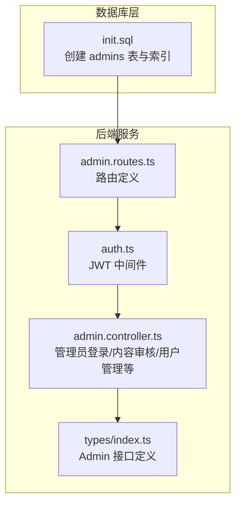
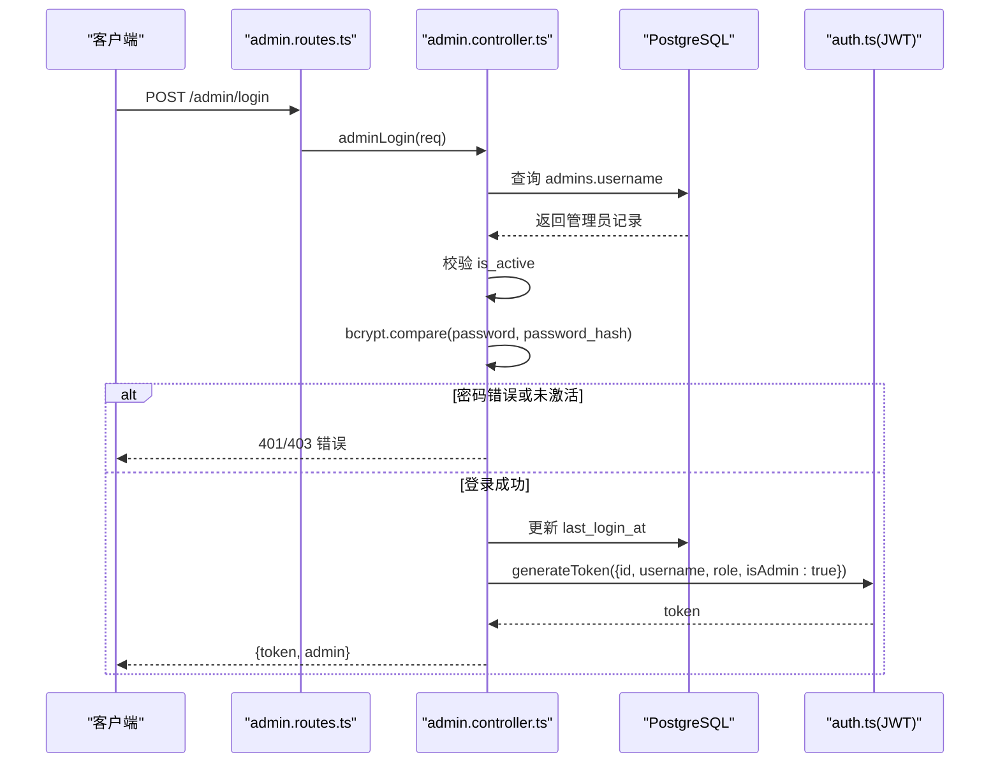
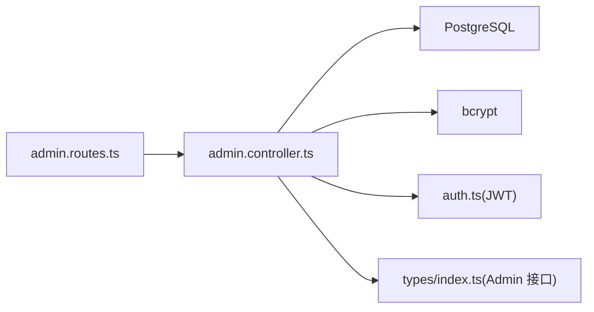

# 管理员表 (admins)

<cite>
**本文引用的文件**
- [init.sql](file://database/init.sql)
- [index.ts](file://backend/src/types/index.ts)
- [admin.controller.ts](file://backend/src/controllers/admin.controller.ts)
- [admin.routes.ts](file://backend/src/routes/admin.routes.ts)
- [auth.ts](file://backend/src/middleware/auth.ts)
</cite>

## 目录
1. [简介](#简介)
2. [项目结构](#项目结构)
3. [核心组件](#核心组件)
4. [架构总览](#架构总览)
5. [详细组件分析](#详细组件分析)
6. [依赖分析](#依赖分析)
7. [性能考虑](#性能考虑)
8. [故障排查指南](#故障排查指南)
9. [结论](#结论)

## 简介
本文件围绕管理员表（admins）的权限体系与安全管理进行系统化梳理，结合数据库初始化脚本与后端控制器实现，重点阐释：
- role 字段的枚举值（super_admin、content_admin、analyst）在权限控制中的层级关系与使用场景
- is_active 状态在管理员账号停用中的应用
- password_hash 的安全存储策略
- email 字段在系统通知中的用途
- 登录认证与用户管理功能的后端逻辑
- idx_admins_username 索引对登录性能的优化
- 初始化脚本中默认管理员插入语句在系统初始化中的作用及生产环境安全注意事项

## 项目结构
管理员相关的数据模型、路由与控制器均位于后端目录；数据库初始化脚本定义了 admins 表结构、索引与默认管理员数据。

图表来源
- [init.sql](file://database/init.sql#L94-L108)
- [admin.routes.ts](file://backend/src/routes/admin.routes.ts#L1-L69)
- [auth.ts](file://backend/src/middleware/auth.ts#L1-L87)
- [admin.controller.ts](file://backend/src/controllers/admin.controller.ts#L1-L120)
- [index.ts](file://backend/src/types/index.ts#L65-L78)

章节来源
- [init.sql](file://database/init.sql#L94-L108)
- [admin.routes.ts](file://backend/src/routes/admin.routes.ts#L1-L69)
- [auth.ts](file://backend/src/middleware/auth.ts#L1-L87)
- [admin.controller.ts](file://backend/src/controllers/admin.controller.ts#L1-L120)
- [index.ts](file://backend/src/types/index.ts#L65-L78)

## 核心组件
- 数据库表结构（admins）
  - 字段：id、username、password_hash、role、email、is_active、created_at、last_login_at
  - 约束：username 与 email 唯一；role 枚举限定；is_active 默认 TRUE
  - 索引：idx_admins_username、idx_admins_email
- 类型定义（Admin 接口）
  - 规范化 role 取值范围，确保前端与后端一致
- 登录与权限中间件
  - 管理员登录校验用户名、密码与 is_active 状态
  - JWT 生成与校验，区分普通用户与管理员身份
- 管理员控制器
  - 登录流程、内容审核（提交/审批/拒绝）、用户管理（查询、详情、状态变更）、数据导出、媒体文件管理等

章节来源
- [init.sql](file://database/init.sql#L94-L108)
- [index.ts](file://backend/src/types/index.ts#L65-L78)
- [auth.ts](file://backend/src/middleware/auth.ts#L1-L87)
- [admin.controller.ts](file://backend/src/controllers/admin.controller.ts#L1-L120)

## 架构总览
管理员登录与权限控制的整体流程如下：

图表来源
- [admin.routes.ts](file://backend/src/routes/admin.routes.ts#L30-L33)
- [admin.controller.ts](file://backend/src/controllers/admin.controller.ts#L1-L66)
- [auth.ts](file://backend/src/middleware/auth.ts#L80-L87)

章节来源
- [admin.routes.ts](file://backend/src/routes/admin.routes.ts#L30-L33)
- [admin.controller.ts](file://backend/src/controllers/admin.controller.ts#L1-L66)
- [auth.ts](file://backend/src/middleware/auth.ts#L80-L87)

## 详细组件分析

### 1) 数据模型与索引（admins）
- 表结构要点
  - username 唯一且用于登录入口
  - password_hash 存储经哈希后的密码
  - role 使用枚举约束，限制为 super_admin、content_admin、analyst
  - email 唯一，便于系统通知与审计
  - is_active 控制账号启用/停用
  - last_login_at 记录最近登录时间
- 索引
  - idx_admins_username：加速登录查询
  - idx_admins_email：加速通知与审计场景

章节来源
- [init.sql](file://database/init.sql#L94-L108)

### 2) 登录认证与权限中间件
- 登录流程
  - 校验请求参数
  - 按 username 查询管理员
  - 校验 is_active
  - 使用 bcrypt 验证密码
  - 成功后更新 last_login_at 并签发 JWT
- 权限中间件
  - 管理员中间件要求携带 Bearer token，且解码载荷中包含 isAdmin=true
  - 解码后将 admin 信息注入请求对象，供后续控制器使用

章节来源
- [admin.controller.ts](file://backend/src/controllers/admin.controller.ts#L1-L66)
- [auth.ts](file://backend/src/middleware/auth.ts#L35-L77)
- [auth.ts](file://backend/src/middleware/auth.ts#L80-L87)

### 3) role 枚举与权限层级
- 枚举值
  - super_admin：超级管理员，拥有最高权限
  - content_admin：内容管理员，负责内容审核
  - analyst：分析师，负责统计与报表
- 实际使用
  - 审核通过/拒绝接口仅允许 super_admin 执行
  - 其他管理功能对不同角色开放程度由业务路由与控制器逻辑决定（本仓库未提供额外细分）

章节来源
- [init.sql](file://database/init.sql#L96-L100)
- [admin.controller.ts](file://backend/src/controllers/admin.controller.ts#L298-L340)
- [admin.controller.ts](file://backend/src/controllers/admin.controller.ts#L342-L387)

### 4) is_active 状态与账号停用
- 登录前检查 is_active，若为 false 则拒绝访问
- 用户管理模块支持更新用户（非管理员）的 is_active 状态，用于封禁/解封
- 对于管理员账号，建议通过数据库层面或专门的管理员管理界面进行停用处理，避免直接修改 is_active 导致权限绕过

章节来源
- [admin.controller.ts](file://backend/src/controllers/admin.controller.ts#L26-L31)
- [admin.controller.ts](file://backend/src/controllers/admin.controller.ts#L846-L864)

### 5) password_hash 安全存储策略
- 存储：仅存储 bcrypt 哈希值，不保留明文密码
- 验证：登录时使用 bcrypt.compare 将输入密码与哈希比对
- 最佳实践
  - 生产环境务必使用强密钥与合理成本因子
  - 定期轮换密钥与强制重置弱密码
  - 限制登录尝试次数，启用二次验证（建议）

章节来源
- [admin.controller.ts](file://backend/src/controllers/admin.controller.ts#L32-L37)

### 6) email 字段与系统通知
- 数据库层：email 唯一，便于审计与通知
- 实际使用：在管理员登录成功后返回 admin.email，可用于前端展示与后续通知场景（如审计日志、邮件提醒等）
- 建议：在需要发送系统通知时，统一通过后端服务调用邮件/短信服务，避免直接暴露敏感邮箱

章节来源
- [init.sql](file://database/init.sql#L98-L100)
- [admin.controller.ts](file://backend/src/controllers/admin.controller.ts#L52-L66)

### 7) 管理员登录与用户管理后端逻辑
- 登录
  - 参数校验、按 username 查询、is_active 校验、密码比对、更新 last_login_at、签发 JWT
- 用户管理
  - 获取用户列表（支持搜索、状态过滤、排序分页）
  - 获取用户详情（聚合练习与方法统计）
  - 更新用户状态（封禁/解封）
  - 获取用户方法库与练习记录（支持时间范围与分页）

章节来源
- [admin.controller.ts](file://backend/src/controllers/admin.controller.ts#L1-L66)
- [admin.controller.ts](file://backend/src/controllers/admin.controller.ts#L751-L816)
- [admin.controller.ts](file://backend/src/controllers/admin.controller.ts#L818-L844)
- [admin.controller.ts](file://backend/src/controllers/admin.controller.ts#L846-L864)
- [admin.controller.ts](file://backend/src/controllers/admin.controller.ts#L866-L886)
- [admin.controller.ts](file://backend/src/controllers/admin.controller.ts#L888-L947)

### 8) idx_admins_username 索引与登录性能
- 作用：加速按 username 的登录查询
- 性能影响：在高并发登录场景下显著降低查询延迟
- 建议：保持 username 唯一性，避免重复键冲突导致的锁竞争

章节来源
- [init.sql](file://database/init.sql#L106-L107)

### 9) 初始化脚本中的默认管理员与生产安全
- 默认管理员插入
  - 在初始化脚本中插入一条默认管理员记录（示例密码已注释提示）
  - 使用 ON CONFLICT (username) DO NOTHING 避免重复导入
- 生产环境注意事项
  - 必须在部署后立即修改默认管理员密码
  - 不要将示例密码提交到版本控制
  - 严格限制该账号的访问范围与操作权限
  - 建议启用多因素认证与审计日志

章节来源
- [init.sql](file://database/init.sql#L144-L149)

## 依赖分析
- 路由依赖
  - admin.routes.ts 将 /admin/login 暴露为公开接口，其余路由通过 authenticateAdmin 中间件保护
- 控制器依赖
  - admin.controller.ts 依赖数据库连接池、bcrypt、JWT 工具与自定义错误类型
- 中间件依赖
  - authenticateAdmin 依赖 JWT 密钥与载荷结构
- 类型依赖
  - Admin 接口约束 role 取值，保证前后端一致性

图表来源
- [admin.routes.ts](file://backend/src/routes/admin.routes.ts#L1-L69)
- [admin.controller.ts](file://backend/src/controllers/admin.controller.ts#L1-L120)
- [auth.ts](file://backend/src/middleware/auth.ts#L1-L87)
- [index.ts](file://backend/src/types/index.ts#L65-L78)

章节来源
- [admin.routes.ts](file://backend/src/routes/admin.routes.ts#L1-L69)
- [admin.controller.ts](file://backend/src/controllers/admin.controller.ts#L1-L120)
- [auth.ts](file://backend/src/middleware/auth.ts#L1-L87)
- [index.ts](file://backend/src/types/index.ts#L65-L78)

## 性能考虑
- 登录性能
  - idx_admins_username 显著提升登录查询效率
  - 建议在高并发场景下配合连接池与缓存（如 Redis）短期缓存热点用户信息
- 数据库负载
  - 审核与统计接口涉及多表联结，建议在方法表与用户表上维护必要索引
- 安全与性能平衡
  - bcrypt 成本因子应权衡安全与性能
  - 合理设置 JWT 过期时间，避免频繁刷新

[本节为通用指导，无需列出具体文件来源]

## 故障排查指南
- 登录失败
  - 检查用户名是否存在与 is_active 是否为 true
  - 确认密码是否正确（bcrypt 比对）
  - 查看 JWT 密钥配置是否正确
- 权限不足
  - 确认管理员角色是否为 super_admin（审核通过/拒绝）
  - 检查中间件是否正确注入 admin 信息
- 数据异常
  - 审核状态更新失败：确认方法当前状态与操作权限
  - 用户状态更新失败：确认 is_active 参数存在且类型正确

章节来源
- [admin.controller.ts](file://backend/src/controllers/admin.controller.ts#L26-L37)
- [admin.controller.ts](file://backend/src/controllers/admin.controller.ts#L298-L340)
- [admin.controller.ts](file://backend/src/controllers/admin.controller.ts#L342-L387)
- [auth.ts](file://backend/src/middleware/auth.ts#L35-L77)

## 结论
- admins 表通过唯一索引、枚举约束与 is_active 字段构建了清晰的管理员身份与权限边界
- 登录流程采用 bcrypt 哈希与 JWT，兼顾安全性与易用性
- role 枚举明确了三类管理员的职责边界，其中 super_admin 拥有关键审核权限
- 初始化脚本提供了默认管理员，但生产环境必须立即更改密码并加强安全策略
- 建议持续完善权限矩阵、审计日志与安全监控，确保系统长期稳定运行