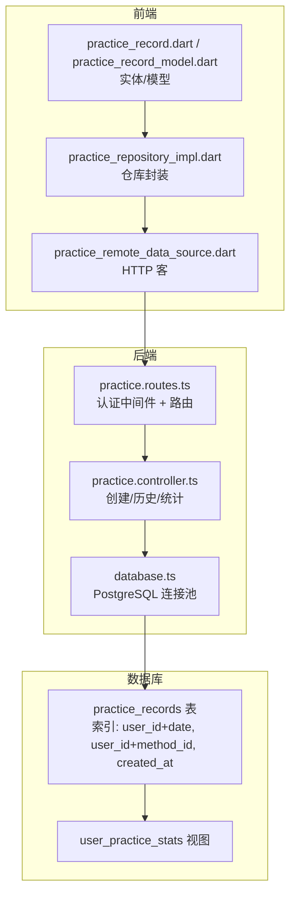
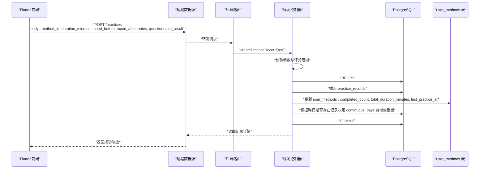

# 练习记录表 (practice_records)

<cite>
**本文引用的文件**
- [init.sql](file://database/init.sql)
- [index.ts](file://backend/src/types/index.ts)
- [practice.controller.ts](file://backend/src/controllers/practice.controller.ts)
- [practice.routes.ts](file://backend/src/routes/practice.routes.ts)
- [database.ts](file://backend/src/config/database.ts)
- [practice_record.dart](file://flutter_app/lib/domain/entities/practice_record.dart)
- [practice_record_model.dart](file://flutter_app/lib/data/models/practice_record_model.dart)
- [practice_remote_data_source.dart](file://flutter_app/lib/data/datasources/remote/practice_remote_data_source.dart)
- [practice_repository_impl.dart](file://flutter_app/lib/data/repositories/practice_repository_impl.dart)
</cite>

## 目录
1. [简介](#简介)
2. [项目结构](#项目结构)
3. [核心组件](#核心组件)
4. [架构总览](#架构总览)
5. [详细组件分析](#详细组件分析)
6. [依赖关系分析](#依赖关系分析)
7. [性能考虑](#性能考虑)
8. [故障排查指南](#故障排查指南)
9. [结论](#结论)
10. [附录](#附录)

## 简介
本文件系统化梳理“练习记录表”（practice_records）的结构设计与分析价值，围绕以下目标展开：
- 基于 init.sql 定义与后端 PracticeRecord 接口，说明 mood_before 和 mood_after 的 1-10 分制评分体系及其在情绪改善分析中的应用。
- 解释 questionnaire_result JSONB 字段如何存储动态问卷结果。
- 阐述 practice_date 与 duration_minutes 在用户练习习惯分析中的作用，以及 notes 字段支持用户自由反馈的设计考量。
- 结合 practice.controller.ts 的业务逻辑，展示练习记录创建与历史查询的 API 实现。
- 分析 idx_practice_records_user_id_date 复合索引对时间序列查询的性能优化，并说明 user_practice_stats 视图如何基于该表生成用户统计报告。

## 项目结构
练习记录表位于数据库层，其结构由 init.sql 定义；后端控制器负责业务处理与 API 路由；前端 Flutter 应用通过数据源与仓库封装调用后端接口，最终形成完整的“记录-查询-统计”闭环。

图表来源
- [init.sql](file://database/init.sql#L62-L79)
- [practice.routes.ts](file://backend/src/routes/practice.routes.ts#L1-L20)
- [practice.controller.ts](file://backend/src/controllers/practice.controller.ts#L1-L261)
- [database.ts](file://backend/src/config/database.ts#L1-L47)
- [practice_remote_data_source.dart](file://flutter_app/lib/data/datasources/remote/practice_remote_data_source.dart#L1-L101)
- [practice_repository_impl.dart](file://flutter_app/lib/data/repositories/practice_repository_impl.dart#L1-L83)
- [practice_record.dart](file://flutter_app/lib/domain/entities/practice_record.dart#L1-L67)
- [practice_record_model.dart](file://flutter_app/lib/data/models/practice_record_model.dart#L1-L93)

章节来源
- [init.sql](file://database/init.sql#L62-L79)
- [practice.routes.ts](file://backend/src/routes/practice.routes.ts#L1-L20)
- [practice.controller.ts](file://backend/src/controllers/practice.controller.ts#L1-L261)
- [database.ts](file://backend/src/config/database.ts#L1-L47)
- [practice_remote_data_source.dart](file://flutter_app/lib/data/datasources/remote/practice_remote_data_source.dart#L1-L101)
- [practice_repository_impl.dart](file://flutter_app/lib/data/repositories/practice_repository_impl.dart#L1-L83)
- [practice_record.dart](file://flutter_app/lib/domain/entities/practice_record.dart#L1-L67)
- [practice_record_model.dart](file://flutter_app/lib/data/models/practice_record_model.dart#L1-L93)

## 核心组件
- 数据库表结构：practice_records 包含用户、方法、练习日期、时长、前后情绪评分、问卷结果与备注等字段，并建立多类索引以支撑高频查询。
- 后端控制器：提供创建练习记录、查询练习历史、查询练习统计三大能力，包含参数校验、事务处理与错误处理。
- 前端数据流：通过远程数据源封装 HTTP 请求，仓库统一处理异常，实体/模型承载数据结构与派生属性。

章节来源
- [init.sql](file://database/init.sql#L62-L79)
- [index.ts](file://backend/src/types/index.ts#L51-L63)
- [practice.controller.ts](file://backend/src/controllers/practice.controller.ts#L1-L261)
- [practice_record.dart](file://flutter_app/lib/domain/entities/practice_record.dart#L1-L67)
- [practice_record_model.dart](file://flutter_app/lib/data/models/practice_record_model.dart#L1-L93)

## 架构总览
下面以序列图展示“创建练习记录”的端到端流程，涵盖认证、参数校验、数据库写入、关联表更新与事务提交。

图表来源
- [practice.routes.ts](file://backend/src/routes/practice.routes.ts#L1-L20)
- [practice.controller.ts](file://backend/src/controllers/practice.controller.ts#L1-L99)
- [practice_remote_data_source.dart](file://flutter_app/lib/data/datasources/remote/practice_remote_data_source.dart#L1-L36)

章节来源
- [practice.routes.ts](file://backend/src/routes/practice.routes.ts#L1-L20)
- [practice.controller.ts](file://backend/src/controllers/practice.controller.ts#L1-L99)
- [practice_remote_data_source.dart](file://flutter_app/lib/data/datasources/remote/practice_remote_data_source.dart#L1-L36)

## 详细组件分析

### 数据库表结构与字段语义
- 主键与外键
  - 主键 id；user_id 引用 users，method_id 引用 methods。
- 关键字段
  - practice_date：练习日期（用于时间序列分析与统计）。
  - duration_minutes：练习时长（分钟），用于累计时长与效率分析。
  - mood_before/mood_after：1-10 分制评分，用于量化情绪改善幅度。
  - questionnaire_result：JSONB，存储动态问卷结果，便于灵活扩展与查询。
  - notes：文本备注，支持用户自由反馈。
  - created_at：记录创建时间，辅助排序与审计。
- 索引
  - idx_practice_records_user_id_date(user_id, practice_date)：支撑按用户与日期范围的高效查询。
  - idx_practice_records_user_id_method_id(user_id, method_id)：支撑按用户与方法维度的统计。
  - idx_practice_records_created_at(created_at)：支撑按创建时间排序与分页。

章节来源
- [init.sql](file://database/init.sql#L62-L79)

### 后端 PracticeRecord 类型与接口
- 后端类型定义包含 id、user_id、method_id、practice_date、duration_minutes、mood_before、mood_after、notes、questionnaire_result、created_at 等字段，与数据库表一一对应。
- 前端实体/模型同样映射这些字段，便于跨端一致性。

章节来源
- [index.ts](file://backend/src/types/index.ts#L51-L63)
- [practice_record.dart](file://flutter_app/lib/domain/entities/practice_record.dart#L1-L67)
- [practice_record_model.dart](file://flutter_app/lib/data/models/practice_record_model.dart#L1-L93)

### 情绪评分体系与分析价值（mood_before/mood_after）
- 评分范围：1-10 分，数值越大代表情绪越好。
- 情绪改善度：后端统计使用 mood_after - mood_before，前端实体也提供派生属性用于展示。
- 分析价值：
  - 时序趋势：按日期聚合平均 mood_before 与 mood_after，观察长期改善趋势。
  - 方法对比：按方法分组统计平均改善度，评估不同练习方法的有效性。
  - 个体评估：计算用户总体平均改善度，作为自我反馈与激励指标。

章节来源
- [init.sql](file://database/init.sql#L62-L79)
- [practice.controller.ts](file://backend/src/controllers/practice.controller.ts#L197-L239)
- [practice_record.dart](file://flutter_app/lib/domain/entities/practice_record.dart#L47-L61)

### 动态问卷结果存储（questionnaire_result JSONB）
- 存储形式：JSONB，允许嵌套数组与对象，适合存储结构化的问卷题目与答案。
- 使用场景：记录每次练习后的主观反馈，支持后续统计与导出。
- 查询建议：可利用 JSONB 查询函数进行条件筛选与路径访问，但需注意索引策略与性能权衡。

章节来源
- [init.sql](file://database/init.sql#L62-L79)

### 练习日期与时长在习惯分析中的作用
- 练习日期（practice_date）：用于按日聚合、计算连续天数、周/月趋势与周期性模式。
- 练习时长（duration_minutes）：用于累计总时长、平均时长、强度分析与目标达成度评估。
- 前端统计页面常以“总次数、总时长、连续天数、平均改善度”等指标呈现，帮助用户建立与维持良好习惯。

章节来源
- [init.sql](file://database/init.sql#L62-L79)
- [practice.controller.ts](file://backend/src/controllers/practice.controller.ts#L197-L239)

### 备注字段（notes）与用户反馈设计
- 设计考量：提供自由文本输入，便于用户补充情境、触发因素、感受描述等，增强数据丰富度与可解释性。
- 使用建议：可在前端提供字数限制与保存提示，避免过长内容影响查询性能。

章节来源
- [init.sql](file://database/init.sql#L62-L79)

### API 实现：创建与历史查询
- 创建练习记录
  - 路由：POST /practices（已启用认证中间件）
  - 控制器：createPracticeRecord
    - 参数校验：method_id、duration_minutes 必填；mood_before/mood_after 范围校验（1-10）。
    - 事务：插入 practice_records 后，原子性更新 user_methods 的完成次数、总时长与最后练习时间；根据是否连续决定连续天数自增或重置。
  - 返回：201 成功，返回新记录。
- 查询练习历史
  - 路由：GET /practices（已启用认证中间件）
  - 控制器：getPracticeHistory
    - 支持按 method_id、start_date、end_date 过滤；分页参数 page、pageSize。
    - 返回：分页列表，包含方法标题等关联信息。
- 查询练习统计
  - 路由：GET /practices/statistics（已启用认证中间件）
  - 控制器：getPracticeStatistics
    - 支持按周/月/年过滤；返回总次数、总时长、练习天数、平均情绪改善度、最大连续天数、按日期的趋势与方法分布等。

章节来源
- [practice.routes.ts](file://backend/src/routes/practice.routes.ts#L1-L20)
- [practice.controller.ts](file://backend/src/controllers/practice.controller.ts#L1-L261)

### 复合索引与时间序列查询优化（idx_practice_records_user_id_date）
- 索引设计：(user_id, practice_date) 与 (user_id, method_id) 可显著提升按用户维度的时间序列与方法维度统计查询性能。
- 典型查询场景：
  - 按用户与日期范围查询历史记录。
  - 按用户与方法分组统计练习次数与时长。
  - 按用户与日期分组计算每日平均情绪评分与趋势。
- 性能建议：
  - 对高频过滤条件优先使用复合索引。
  - 避免在索引列上使用函数表达式，以免导致索引失效。
  - 对大结果集分页时，确保排序列与过滤列匹配索引顺序。

章节来源
- [init.sql](file://database/init.sql#L62-L79)
- [practice.controller.ts](file://backend/src/controllers/practice.controller.ts#L101-L172)
- [practice.controller.ts](file://backend/src/controllers/practice.controller.ts#L174-L261)

### user_practice_stats 视图与用户统计报告
- 视图构建：基于 users 与 practice_records 左连接，按用户分组统计：
  - total_practices：练习次数
  - total_duration：总时长
  - practice_days：练习天数
  - avg_mood_improvement：平均情绪改善度
- 用途：为管理员与运营提供用户维度的整体画像，辅助运营策略与产品优化。
- 注意事项：若用户无练习记录，上述聚合值将以 0 或空值呈现，需在前端与报表中做空值处理。

章节来源
- [init.sql](file://database/init.sql#L316-L328)

## 依赖关系分析
- 后端依赖链
  - practice.routes.ts 依赖 practice.controller.ts 与认证中间件。
  - practice.controller.ts 依赖 database.ts 的连接池，执行 SQL 查询与事务。
  - 数据库层依赖 init.sql 中的表结构与索引定义。
- 前端依赖链
  - practice_remote_data_source.dart 通过 DioClient 发起 HTTP 请求。
  - practice_repository_impl.dart 将数据源调用封装为 Either 结果，统一错误处理。
  - 前端实体/模型与后端类型保持一致，保证跨端一致性。

图表来源
- [practice.routes.ts](file://backend/src/routes/practice.routes.ts#L1-L20)
- [practice.controller.ts](file://backend/src/controllers/practice.controller.ts#L1-L261)
- [database.ts](file://backend/src/config/database.ts#L1-L47)
- [init.sql](file://database/init.sql#L62-L79)
- [init.sql](file://database/init.sql#L316-L328)

章节来源
- [practice.routes.ts](file://backend/src/routes/practice.routes.ts#L1-L20)
- [practice.controller.ts](file://backend/src/controllers/practice.controller.ts#L1-L261)
- [database.ts](file://backend/src/config/database.ts#L1-L47)
- [init.sql](file://database/init.sql#L62-L79)
- [init.sql](file://database/init.sql#L316-L328)

## 性能考虑
- 索引策略
  - 复合索引 idx_practice_records_user_id_date 与 idx_practice_records_user_id_method_id 是时间序列与方法维度统计的关键。
  - 对频繁排序与过滤的列（如 practice_date、method_id）保持与索引顺序一致，避免隐式排序开销。
- 事务与并发
  - 创建记录时采用事务，确保 practice_records 与 user_methods 的一致性；在高并发场景下注意锁竞争与死锁风险。
- 查询优化
  - 分页查询使用 LIMIT/OFFSET，建议配合主键或唯一索引列排序，减少扫描范围。
  - 对 JSONB 字段的查询尽量限定路径与条件，避免全表扫描。
- 缓存与降级
  - 对热点统计结果可引入 Redis 缓存，设置合理过期策略，降低数据库压力。

[本节为通用性能建议，不直接分析具体文件]

## 故障排查指南
- 认证失败
  - 现象：返回未认证错误。
  - 排查：确认路由已启用认证中间件，且请求头携带有效令牌。
- 参数校验失败
  - 现象：返回参数验证错误，如 method_id、duration_minutes 缺失或 mood_before/mood_after 超出范围。
  - 排查：检查前端传参与后端校验规则，确保评分在 1-10 范围内。
- 事务回滚
  - 现象：创建记录失败，数据库无副作用。
  - 排查：查看控制器事务逻辑与异常抛出点，定位具体失败步骤。
- 查询无结果
  - 现象：历史查询为空或统计为 0。
  - 排查：确认过滤条件（用户、方法、日期范围）是否正确；检查索引是否命中；确认数据是否已导入。

章节来源
- [practice.routes.ts](file://backend/src/routes/practice.routes.ts#L1-L20)
- [practice.controller.ts](file://backend/src/controllers/practice.controller.ts#L1-L99)
- [practice.controller.ts](file://backend/src/controllers/practice.controller.ts#L101-L172)
- [practice.controller.ts](file://backend/src/controllers/practice.controller.ts#L174-L261)

## 结论
练习记录表（practice_records）通过标准化的字段设计与完善的索引策略，为情绪改善分析、用户习惯追踪与方法效果评估提供了坚实的数据基础。后端控制器在创建与统计场景中实现了严谨的参数校验、事务保障与分页查询，前端通过数据源与仓库封装了清晰的调用链路。配合 user_practice_stats 视图，可快速生成用户维度的统计报告，支撑产品迭代与运营决策。

[本节为总结性内容，不直接分析具体文件]

## 附录
- 字段对照与含义
  - practice_date：练习日期（用于时间序列分析）
  - duration_minutes：练习时长（分钟）
  - mood_before/mood_after：1-10 分制情绪评分
  - questionnaire_result：动态问卷结果（JSONB）
  - notes：用户备注（文本）
  - created_at：记录创建时间
- 前端实体/模型字段映射
  - 前端实体/模型包含 id、userId、methodId、durationMinutes、moodBefore、moodAfter、notes、practicedAt 等字段，与后端类型保持一致。

章节来源
- [init.sql](file://database/init.sql#L62-L79)
- [index.ts](file://backend/src/types/index.ts#L51-L63)
- [practice_record.dart](file://flutter_app/lib/domain/entities/practice_record.dart#L1-L67)
- [practice_record_model.dart](file://flutter_app/lib/data/models/practice_record_model.dart#L1-L93)