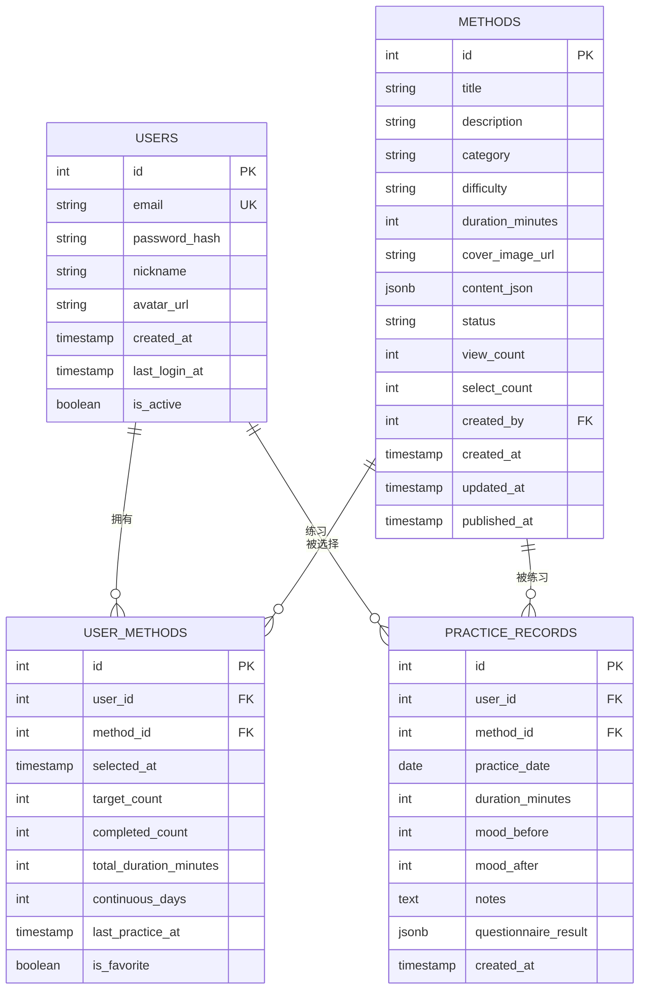

# 数据库设计

<cite>
**本文引用的文件**
- [init.sql](file://database/init.sql)
- [database.ts](file://backend/src/config/database.ts)
- [index.ts](file://backend/src/types/index.ts)
- [practice.controller.ts](file://backend/src/controllers/practice.controller.ts)
- [userMethod.controller.ts](file://backend/src/controllers/userMethod.controller.ts)
- [method.controller.ts](file://backend/src/controllers/method.controller.ts)
</cite>

## 目录
1. [简介](#简介)
2. [项目结构](#项目结构)
3. [核心组件](#核心组件)
4. [架构总览](#架构总览)
5. [详细组件分析](#详细组件分析)
6. [依赖分析](#依赖分析)
7. [性能考虑](#性能考虑)
8. [故障排查指南](#故障排查指南)
9. [结论](#结论)
10. [附录](#附录)

## 简介
本文件面向nian项目的数据库层，基于init.sql脚本全面梳理数据库表结构、字段定义、约束与索引策略；结合后端TypeScript类型系统，说明类型与数据库模式的映射关系；并通过数据库连接配置分析其对读写性能的影响；最后给出数据生命周期管理策略，包括练习记录的保留周期与用户数据的隐私保护措施。

## 项目结构
数据库初始化脚本位于database/init.sql，后端数据库连接配置位于backend/src/config/database.ts，类型定义位于backend/src/types/index.ts。业务控制器通过pool进行数据库访问，涉及users、methods、practice_records、user_methods等核心表。

图表来源
- [init.sql](file://database/init.sql#L1-L124)
- [database.ts](file://backend/src/config/database.ts#L1-L47)
- [index.ts](file://backend/src/types/index.ts#L1-L126)
- [practice.controller.ts](file://backend/src/controllers/practice.controller.ts#L1-L261)
- [userMethod.controller.ts](file://backend/src/controllers/userMethod.controller.ts#L1-L162)
- [method.controller.ts](file://backend/src/controllers/method.controller.ts#L1-L153)

章节来源
- [init.sql](file://database/init.sql#L1-L124)
- [database.ts](file://backend/src/config/database.ts#L1-L47)
- [index.ts](file://backend/src/types/index.ts#L1-L126)

## 核心组件
本节聚焦users、methods、practice_records、user_methods四张核心表的结构、约束与索引策略，并说明它们之间的关系。

- users表
  - 主键：id（自增序列）
  - 唯一性：email
  - 约束：非空字段包括email、password_hash；可选字段包括nickname、avatar_url；布尔字段is_active默认true；时间戳created_at默认当前时间，last_login_at可为空
  - 索引：idx_users_email、idx_users_created_at
  - 用途：存储用户基本信息与登录状态

- methods表
  - 主键：id（自增序列）
  - 外键：created_by引用users(id)
  - 约束：title、description、category、difficulty、duration_minutes、content_json均为非空；status默认draft；view_count、select_count默认0；created_at、updated_at默认当前时间；published_at可为空
  - 索引：idx_methods_status、idx_methods_category、idx_methods_difficulty、idx_methods_created_at
  - 触发器：update_methods_updated_at在更新时自动更新updated_at
  - 用途：存储心理自助方法元数据与内容（JSONB）

- user_methods表
  - 主键：id（自增序列）
  - 外键：user_id引用users(id)、method_id引用methods(id)，删除级联
  - 唯一性：(user_id, method_id)组合唯一
  - 约束：selected_at默认当前时间；target_count、completed_count、total_duration_minutes默认0；continuous_days默认0；last_practice_at可为空；is_favorite默认false
  - 索引：idx_user_methods_user_id、idx_user_methods_method_id、idx_user_methods_selected_at
  - 用途：记录用户与方法的关联、目标、完成度与连续打卡天数

- practice_records表
  - 主键：id（自增序列）
  - 外键：user_id引用users(id)、method_id引用methods(id)，删除级联
  - 约束：practice_date为必填；duration_minutes为必填；mood_before与mood_after范围检查1-10；notes可为空；questionnaire_result为JSONB；created_at默认当前时间
  - 索引：idx_practice_records_user_id_date、idx_practice_records_user_id_method_id、idx_practice_records_created_at
  - 用途：记录用户的每次练习详情与心理状态变化

- 关系说明
  - users与methods：一对多（用户创建方法），通过methods.created_by关联
  - users与user_methods：一对多（用户拥有多个方法）
  - methods与user_methods：一对多（方法被多个用户选择）
  - users与practice_records：一对多（用户有多条练习记录）
  - methods与practice_records：一对多（方法被多次练习）
  - user_methods与practice_records：间接一对多（通过user_id与method_id关联）

章节来源
- [init.sql](file://database/init.sql#L5-L143)
- [init.sql](file://database/init.sql#L301-L346)

## 架构总览
数据库层采用PostgreSQL作为主存储，配合Redis用于缓存与通知（由连接配置可见）。后端控制器通过pg连接池执行SQL操作，类型系统在TS层面确保API与数据库schema的一致性。

图表来源
- [database.ts](file://backend/src/config/database.ts#L1-L47)
- [init.sql](file://database/init.sql#L301-L346)

## 详细组件分析

### users表
- 字段与约束
  - id：主键，自增
  - email：唯一且非空
  - password_hash：非空
  - nickname、avatar_url：可空
  - created_at：默认当前时间
  - last_login_at：可空
  - is_active：布尔，默认true
- 索引策略
  - idx_users_email：加速登录与唯一性校验
  - idx_users_created_at：支持按注册时间排序与统计
- 使用场景
  - 登录认证、用户资料管理、活跃状态统计

章节来源
- [init.sql](file://database/init.sql#L5-L18)

### methods表
- 字段与约束
  - id：主键，自增
  - title、description、category、difficulty、duration_minutes、content_json：非空
  - cover_image_url：可空
  - status：枚举值（默认draft）
  - view_count、select_count：计数器，默认0
  - created_by：外键引用users(id)
  - created_at、updated_at、published_at：时间戳
- 索引策略
  - idx_methods_status：筛选发布状态
  - idx_methods_category：按类别检索
  - idx_methods_difficulty：按难度检索
  - idx_methods_created_at：按发布时间排序
- 触发器
  - update_methods_updated_at：更新时自动刷新updated_at
- 使用场景
  - 方法列表、详情、推荐、分类统计

章节来源
- [init.sql](file://database/init.sql#L20-L42)
- [init.sql](file://database/init.sql#L301-L315)

### user_methods表
- 字段与约束
  - id：主键，自增
  - user_id、method_id：外键，删除级联
  - 唯一性：(user_id, method_id)
  - selected_at：默认当前时间
  - target_count、completed_count、total_duration_minutes、continuous_days：计数器，默认0
  - last_practice_at：可空
  - is_favorite：布尔，默认false
- 索引策略
  - idx_user_methods_user_id、idx_user_methods_method_id：加速关联查询
  - idx_user_methods_selected_at：按加入时间排序
- 使用场景
  - 个人方法库、完成度统计、连续打卡逻辑

章节来源
- [init.sql](file://database/init.sql#L43-L61)

### practice_records表
- 字段与约束
  - id：主键，自增
  - user_id、method_id：外键，删除级联
  - practice_date：必填
  - duration_minutes：必填
  - mood_before、mood_after：范围检查1-10
  - notes：可空
  - questionnaire_result：JSONB
  - created_at：默认当前时间
- 索引策略
  - idx_practice_records_user_id_date：按用户+日期查询
  - idx_practice_records_user_id_method_id：按用户+方法查询
  - idx_practice_records_created_at：按创建时间排序
- 使用场景
  - 练习历史、统计分析、趋势计算

章节来源
- [init.sql](file://database/init.sql#L62-L79)

### 类型系统与数据库模式映射
- users
  - TS类型：User、UserWithPassword
  - 映射：id、email、nickname、avatar_url、created_at、last_login_at、is_active
- methods
  - TS类型：Method
  - 映射：id、title、description、category、difficulty、duration_minutes、cover_image_url、content_json、status、view_count、select_count、created_by、created_at、updated_at、published_at
- user_methods
  - TS类型：UserMethod
  - 映射：id、user_id、method_id、selected_at、target_count、completed_count、total_duration_minutes、continuous_days、last_practice_at、is_favorite
- practice_records
  - TS类型：PracticeRecord
  - 映射：id、user_id、method_id、practice_date、duration_minutes、mood_before、mood_after、notes、questionnaire_result、created_at
- admins、media_files、audit_logs等表在TS类型中也有对应接口，便于前后端一致的数据契约

章节来源
- [index.ts](file://backend/src/types/index.ts#L1-L126)

### ER图（实体关系）

图表来源
- [init.sql](file://database/init.sql#L5-L143)

### 练习记录流程（序列图）

图表来源
- [practice.controller.ts](file://backend/src/controllers/practice.controller.ts#L1-L99)

### 推荐方法流程（序列图）

图表来源
- [method.controller.ts](file://backend/src/controllers/method.controller.ts#L100-L136)

### 练习统计流程（流程图）

图表来源
- [practice.controller.ts](file://backend/src/controllers/practice.controller.ts#L174-L261)

## 依赖分析
- 控制器对数据库的依赖
  - practice.controller.ts：直接使用pg连接池执行事务与多表更新
  - userMethod.controller.ts：执行插入、查询、更新、删除用户方法
  - method.controller.ts：执行方法列表、详情、推荐、分类统计
- 类型系统对数据库的依赖
  - types/index.ts中的接口与数据库字段一一对应，保证API层数据契约一致性
- 连接池与外部依赖
  - database.ts：pg连接池配置决定并发能力与超时行为；Redis客户端用于缓存与通知

图表来源
- [practice.controller.ts](file://backend/src/controllers/practice.controller.ts#L1-L261)
- [userMethod.controller.ts](file://backend/src/controllers/userMethod.controller.ts#L1-L162)
- [method.controller.ts](file://backend/src/controllers/method.controller.ts#L1-L153)
- [database.ts](file://backend/src/config/database.ts#L1-L47)

章节来源
- [practice.controller.ts](file://backend/src/controllers/practice.controller.ts#L1-L261)
- [userMethod.controller.ts](file://backend/src/controllers/userMethod.controller.ts#L1-L162)
- [method.controller.ts](file://backend/src/controllers/method.controller.ts#L1-L153)
- [database.ts](file://backend/src/config/database.ts#L1-L47)

## 性能考虑
- 连接池参数对读写性能的影响
  - max：最大连接数，影响并发处理能力。数值越大，高并发场景吞吐越高，但需平衡数据库与系统资源
  - idleTimeoutMillis：空闲连接超时，避免长时间占用资源
  - connectionTimeoutMillis：连接获取超时，防止请求阻塞
  - 建议：根据QPS与峰值并发调优max；结合Redis缓存热点数据（如方法列表、用户统计）降低数据库压力
- 索引策略
  - users：email、created_at索引支持登录与注册统计
  - methods：status/category/difficulty/created_at索引支持筛选与排序
  - user_methods：user_id/method_id/selected_at索引支持个人库与统计
  - practice_records：user_id+date、user_id+method_id、created_at索引支持历史查询与趋势分析
- 视图与触发器
  - user_practice_stats、method_popularity视图用于统计聚合，减少复杂查询开销
  - update_updated_at_column触发器自动维护updated_at，避免遗漏更新导致的查询异常
- 缓存与异步
  - Redis可用于缓存热门方法、用户统计、会话信息，显著降低数据库读取压力

章节来源
- [database.ts](file://backend/src/config/database.ts#L1-L47)
- [init.sql](file://database/init.sql#L301-L346)

## 故障排查指南
- 常见错误与定位
  - 认证失败：检查users表email唯一性与密码哈希是否正确
  - 方法不存在：确认methods.status为published且id有效
  - 重复添加：user_methods唯一约束冲突，需先移除再添加
  - 心理状态评分越界：mood_before/mood_after范围检查1-10
- 事务与回滚
  - 练习记录流程包含BEGIN/COMMIT/ROLLBACK，若中间失败会回滚，确保数据一致性
- 日志与监控
  - 初始化连接日志输出成功/失败信息，便于快速定位连接问题
  - 建议在控制器层增加关键SQL执行耗时日志，辅助性能分析

章节来源
- [practice.controller.ts](file://backend/src/controllers/practice.controller.ts#L1-L99)
- [userMethod.controller.ts](file://backend/src/controllers/userMethod.controller.ts#L1-L162)
- [method.controller.ts](file://backend/src/controllers/method.controller.ts#L1-L153)
- [database.ts](file://backend/src/config/database.ts#L24-L47)

## 结论
本数据库设计围绕users、methods、user_methods、practice_records四张核心表构建，辅以索引、触发器与视图提升查询与统计效率。后端类型系统与数据库模式保持强一致，连接池配置直接影响读写性能。建议结合Redis缓存与合理的索引策略，在高并发场景下进一步优化响应时间与吞吐量。

## 附录

### 数据生命周期管理策略
- 练习记录保留周期
  - 建议：按月/季度清理历史记录，仅保留近一年的练习数据，以平衡分析需求与存储成本
  - 清理策略：定期归档旧记录至冷存储，保留必要字段用于统计
- 用户数据隐私保护
  - 最小化采集：仅收集必要字段，避免存储敏感信息
  - 匿名化：统计分析时使用聚合视图（如user_practice_stats、method_popularity），避免直接暴露个人明细
  - 访问控制：严格限制管理员与开发人员的数据库访问权限
  - 安全审计：启用审计日志（audit_logs）追踪敏感操作
- 存储与备份
  - 定期备份策略：增量+全量备份，异地存放
  - 监控与告警：监控磁盘空间、慢查询与连接池使用率

[本节为通用实践建议，不直接分析具体代码文件]