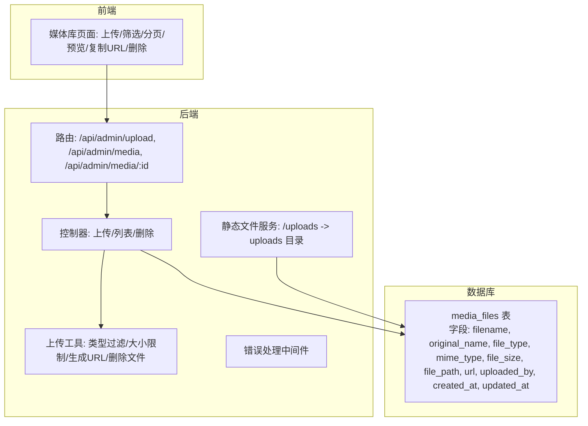
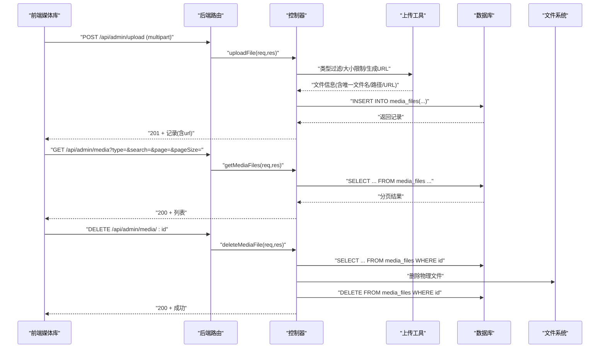
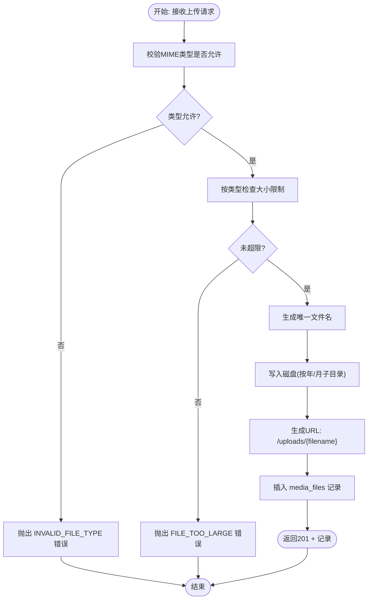
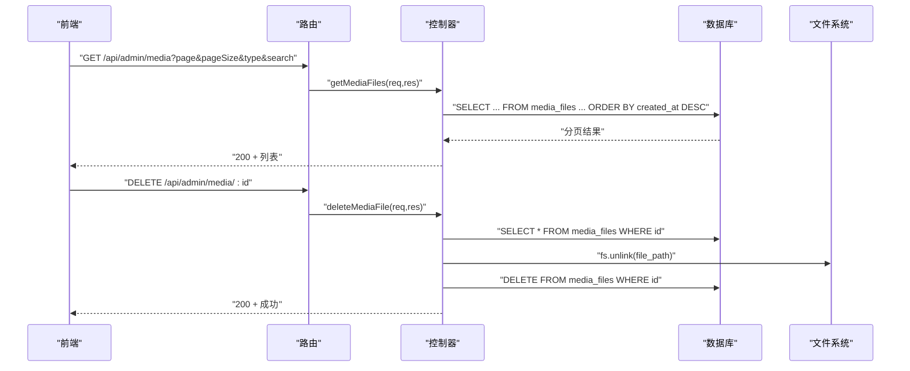
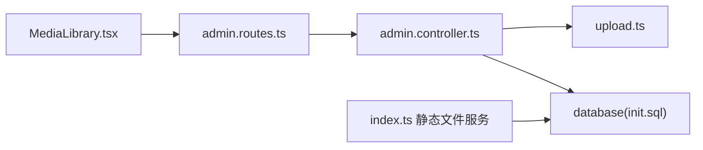

# 媒体文件表 (media_files)

<cite>
**本文引用的文件**
- [database/init.sql](file://database/init.sql)
- [backend/src/utils/upload.ts](file://backend/src/utils/upload.ts)
- [backend/src/controllers/admin.controller.ts](file://backend/src/controllers/admin.controller.ts)
- [backend/src/routes/admin.routes.ts](file://backend/src/routes/admin.routes.ts)
- [backend/src/middleware/errorHandler.ts](file://backend/src/middleware/errorHandler.ts)
- [backend/src/index.ts](file://backend/src/index.ts)
- [home/user/nian/admin-web/src/pages/MediaLibrary.tsx](file://home/user/nian/admin-web/src/pages/MediaLibrary.tsx)
</cite>

## 目录
1. [简介](#简介)
2. [项目结构](#项目结构)
3. [核心组件](#核心组件)
4. [架构总览](#架构总览)
5. [详细组件分析](#详细组件分析)
6. [依赖分析](#依赖分析)
7. [性能考虑](#性能考虑)
8. [故障排查指南](#故障排查指南)
9. [结论](#结论)

## 简介
本文件系统性介绍 media_files 表对多媒体资源的管理能力，覆盖字段技术规范（filename、original_name、file_type、mime_type、file_size、file_path、url），说明 file_type 的 CHECK 约束如何确保类型合法性，以及 url 字段提供直接访问路径的设计便利性；同时阐述 uploaded_by 外键与 admins 表的关联关系，并结合 ON DELETE SET NULL 策略说明上传者删除后的数据处理逻辑；最后总结该表在媒体资源生命周期管理中的基础支撑作用。

## 项目结构
媒体资源管理涉及数据库建模、后端上传与存储、静态文件服务、前端媒体库展示与交互等模块。关键位置如下：
- 数据库层：在初始化脚本中创建 media_files 表及索引，并定义 file_type 的枚举约束。
- 后端层：上传中间件与工具负责文件类型与大小校验、生成唯一文件名、计算 URL；控制器负责入库与查询；路由定义上传、列表、删除接口。
- 前端层：媒体库页面提供上传、筛选、分页、预览、复制 URL、删除等功能。
- 静态文件服务：后端通过 /uploads 暴露上传目录，使 url 字段可直接访问文件。

图表来源
- [database/init.sql](file://database/init.sql#L125-L143)
- [backend/src/routes/admin.routes.ts](file://backend/src/routes/admin.routes.ts#L51-L55)
- [backend/src/utils/upload.ts](file://backend/src/utils/upload.ts#L27-L106)
- [backend/src/controllers/admin.controller.ts](file://backend/src/controllers/admin.controller.ts#L951-L992)
- [backend/src/index.ts](file://backend/src/index.ts#L29-L31)

章节来源
- [database/init.sql](file://database/init.sql#L125-L143)
- [backend/src/routes/admin.routes.ts](file://backend/src/routes/admin.routes.ts#L51-L55)
- [backend/src/utils/upload.ts](file://backend/src/utils/upload.ts#L27-L106)
- [backend/src/controllers/admin.controller.ts](file://backend/src/controllers/admin.controller.ts#L951-L992)
- [backend/src/index.ts](file://backend/src/index.ts#L29-L31)

## 核心组件
- 表结构与约束
  - 字段：id、filename、original_name、file_type、mime_type、file_size、file_path、url、uploaded_by、created_at、updated_at。
  - file_type 的 CHECK 约束限定为 image、audio、video 三类，确保入库数据类型合法。
  - uploaded_by 外键指向 admins(id)，并设置 ON DELETE SET NULL，避免级联删除导致媒体资源孤立。
  - 为 file_type、uploaded_by、created_at 建立索引，提升查询效率。
- 上传与存储
  - 上传中间件对文件类型进行白名单过滤，按类型设定大小上限；生成唯一文件名并写入磁盘；生成可直接访问的 URL。
  - 控制器将文件元信息写入 media_files 表，返回标准响应。
- 静态文件服务
  - 后端将 uploads 目录映射为 /uploads，使 url 字段可直接作为公开访问地址。
- 前端媒体库
  - 支持按类型筛选、关键词搜索、分页浏览；提供预览（图片/音频/视频）与复制 URL；支持删除并同步清理物理文件。

章节来源
- [database/init.sql](file://database/init.sql#L125-L143)
- [backend/src/utils/upload.ts](file://backend/src/utils/upload.ts#L27-L106)
- [backend/src/controllers/admin.controller.ts](file://backend/src/controllers/admin.controller.ts#L951-L992)
- [backend/src/index.ts](file://backend/src/index.ts#L29-L31)
- [home/user/nian/admin-web/src/pages/MediaLibrary.tsx](file://home/user/nian/admin-web/src/pages/MediaLibrary.tsx#L1-L426)

## 架构总览
媒体资源从上传到访问的端到端流程如下：

图表来源
- [backend/src/routes/admin.routes.ts](file://backend/src/routes/admin.routes.ts#L51-L55)
- [backend/src/controllers/admin.controller.ts](file://backend/src/controllers/admin.controller.ts#L951-L992)
- [backend/src/controllers/admin.controller.ts](file://backend/src/controllers/admin.controller.ts#L516-L573)
- [backend/src/controllers/admin.controller.ts](file://backend/src/controllers/admin.controller.ts#L575-L604)
- [backend/src/utils/upload.ts](file://backend/src/utils/upload.ts#L27-L106)
- [backend/src/index.ts](file://backend/src/index.ts#L29-L31)

## 详细组件分析

### 表结构与字段规范
- 字段职责
  - filename：存储在服务器上的唯一文件名（由工具生成）。
  - original_name：原始文件名，便于展示与检索。
  - file_type：文件类型，受 CHECK 约束限定为 image、audio、video。
  - mime_type：MIME 类型，用于前端正确渲染（如 audio/video 标签）。
  - file_size：文件大小（字节），用于前端显示与容量统计。
  - file_path：文件在服务器上的绝对路径，用于删除物理文件。
  - url：对外可访问的 URL 路径，基于 /uploads 前缀，可直接在浏览器或嵌入标签中使用。
  - uploaded_by：上传者的管理员 ID，外键关联 admins 表，ON DELETE SET NULL。
  - created_at/updated_at：时间戳，updated_at 由触发器自动维护。
- 索引设计
  - file_type：按类型筛选与分类统计。
  - uploaded_by：按上传者聚合与审计。
  - created_at：按时间排序与分页。
- 约束与策略
  - file_type 的 CHECK 约束保证入库类型合法，防止脏数据进入。
  - uploaded_by ON DELETE SET NULL：当管理员被删除时，媒体记录仍保留，仅清空上传者标识，避免内容丢失。

章节来源
- [database/init.sql](file://database/init.sql#L125-L143)

### 上传流程与字段填充
- 类型判定与 URL 生成
  - 工具根据 MIME 类型判断 file_type，并生成 /uploads/{filename} 的 URL。
  - 生成唯一文件名，避免同名冲突。
- 入库字段映射
  - filename/original_name/mime_type/file_size/file_path/url 来自上传文件对象。
  - file_type 由工具推断，uploaded_by 来自已认证管理员 ID。
- 错误处理
  - 不支持的类型或超限文件会抛出 AppError，统一由错误处理中间件返回。

图表来源
- [backend/src/utils/upload.ts](file://backend/src/utils/upload.ts#L27-L106)
- [backend/src/controllers/admin.controller.ts](file://backend/src/controllers/admin.controller.ts#L951-L992)
- [backend/src/middleware/errorHandler.ts](file://backend/src/middleware/errorHandler.ts#L1-L48)

章节来源
- [backend/src/utils/upload.ts](file://backend/src/utils/upload.ts#L27-L106)
- [backend/src/controllers/admin.controller.ts](file://backend/src/controllers/admin.controller.ts#L951-L992)
- [backend/src/middleware/errorHandler.ts](file://backend/src/middleware/errorHandler.ts#L1-L48)

### 列表与删除流程
- 列表查询
  - 支持按 file_type、关键词（filename/original_name）筛选，分页排序。
  - 返回项包含 uploaded_by_name（通过 LEFT JOIN admins 获取）。
- 删除流程
  - 先查记录，再删除数据库记录，最后删除物理文件，确保一致性。
  - 前端删除后刷新统计与列表。

图表来源
- [backend/src/routes/admin.routes.ts](file://backend/src/routes/admin.routes.ts#L51-L55)
- [backend/src/controllers/admin.controller.ts](file://backend/src/controllers/admin.controller.ts#L516-L573)
- [backend/src/controllers/admin.controller.ts](file://backend/src/controllers/admin.controller.ts#L575-L604)

章节来源
- [backend/src/controllers/admin.controller.ts](file://backend/src/controllers/admin.controller.ts#L516-L573)
- [backend/src/controllers/admin.controller.ts](file://backend/src/controllers/admin.controller.ts#L575-L604)

### 外键与删除策略（ON DELETE SET NULL）
- 关系：media_files.uploaded_by 引用 admins.id。
- 策略：ON DELETE SET NULL。
- 影响：
  - 当管理员被删除时，其历史上传的媒体记录不会被级联删除，仅将 uploaded_by 置空。
  - 业务上仍可展示“未知上传者”的媒体，避免内容丢失与审计断档。
  - 若需彻底清理，可在后台执行离线任务或迁移策略。

章节来源
- [database/init.sql](file://database/init.sql#L125-L143)

### URL 设计与直接访问
- URL 生成规则：/uploads/{filename}，与后端静态文件服务映射一致。
- 使用场景：
  - 前端媒体库直接预览（img/audio/video 标签）。
  - 复制 URL 供内容编辑器或外部系统引用。
  - 无需额外鉴权即可访问（部署时建议配合反向代理与安全策略）。

章节来源
- [backend/src/utils/upload.ts](file://backend/src/utils/upload.ts#L95-L106)
- [backend/src/index.ts](file://backend/src/index.ts#L29-L31)
- [home/user/nian/admin-web/src/pages/MediaLibrary.tsx](file://home/user/nian/admin-web/src/pages/MediaLibrary.tsx#L180-L190)

## 依赖分析
- 组件耦合
  - 路由依赖控制器；控制器依赖上传工具与数据库连接池；上传工具依赖文件系统与错误处理。
  - 前端依赖后端 API，媒体库页面直接消费 /api/admin/media 与 /api/admin/upload。
- 外部依赖
  - PostgreSQL：存储媒体元数据与触发器。
  - Multer：文件上传中间件。
  - Express 静态文件服务：/uploads -> uploads 目录。
- 可能的循环依赖
  - 代码组织清晰，无明显循环导入；控制器与工具分层明确。

图表来源
- [backend/src/routes/admin.routes.ts](file://backend/src/routes/admin.routes.ts#L51-L55)
- [backend/src/controllers/admin.controller.ts](file://backend/src/controllers/admin.controller.ts#L951-L992)
- [backend/src/utils/upload.ts](file://backend/src/utils/upload.ts#L27-L106)
- [backend/src/index.ts](file://backend/src/index.ts#L29-L31)
- [home/user/nian/admin-web/src/pages/MediaLibrary.tsx](file://home/user/nian/admin-web/src/pages/MediaLibrary.tsx#L1-L426)

章节来源
- [backend/src/routes/admin.routes.ts](file://backend/src/routes/admin.routes.ts#L51-L55)
- [backend/src/controllers/admin.controller.ts](file://backend/src/controllers/admin.controller.ts#L951-L992)
- [backend/src/utils/upload.ts](file://backend/src/utils/upload.ts#L27-L106)
- [backend/src/index.ts](file://backend/src/index.ts#L29-L31)
- [home/user/nian/admin-web/src/pages/MediaLibrary.tsx](file://home/user/nian/admin-web/src/pages/MediaLibrary.tsx#L1-L426)

## 性能考虑
- 查询优化
  - 为 file_type、uploaded_by、created_at 建立索引，有利于筛选、分组与排序。
  - 列表接口采用 LIMIT/OFFSET 分页，建议结合 created_at 或 id 的复合索引进一步优化。
- 存储与 IO
  - 上传按年/月创建子目录，有助于分散磁盘压力与便于清理。
  - 大文件上传建议启用断点续传或压缩策略（前端/后端可扩展）。
- 并发与一致性
  - 删除流程先删数据库再删文件，若顺序颠倒可能导致“幽灵文件”；当前实现顺序合理。
  - 建议在高并发场景下增加事务包裹与幂等性校验。

## 故障排查指南
- 常见错误与定位
  - INVALID_FILE_TYPE：MIME 类型不在白名单内，检查前端上传前的类型校验与后端 fileFilter。
  - FILE_TOO_LARGE：文件大小超过类型限制，检查 getFileSizeLimit 与前端 beforeUpload。
  - NOT_FOUND：删除媒体时找不到记录，确认 id 是否正确或已被清理。
  - 401 未授权：缺少或过期的管理员令牌，检查前端本地存储与后端鉴权中间件。
- 日志与监控
  - 错误处理中间件会记录错误堆栈与请求路径，便于定位问题。
  - 建议在上传工具与控制器增加关键日志点（如文件路径、URL、异常原因）。
- 数据一致性
  - 删除后物理文件缺失：检查文件系统权限与路径拼接；必要时重试删除或手动清理。
  - 上传成功但 URL 无法访问：确认 /uploads 映射与 Nginx/反向代理配置。

章节来源
- [backend/src/utils/upload.ts](file://backend/src/utils/upload.ts#L27-L106)
- [backend/src/controllers/admin.controller.ts](file://backend/src/controllers/admin.controller.ts#L575-L604)
- [backend/src/middleware/errorHandler.ts](file://backend/src/middleware/errorHandler.ts#L1-L48)

## 结论
media_files 表通过严格的 file_type 约束、完善的索引设计与清晰的外键策略，构建了稳定可靠的媒体资源元数据管理基础。结合上传工具的类型与大小校验、URL 直接访问设计以及前后端一体化的媒体库界面，实现了从上传、存储、检索到删除的完整生命周期闭环。ON DELETE SET NULL 的策略在保障内容可用性的同时，也为后续审计与迁移提供了灵活性。建议在生产环境中配合安全策略与容量监控，持续优化性能与可靠性。