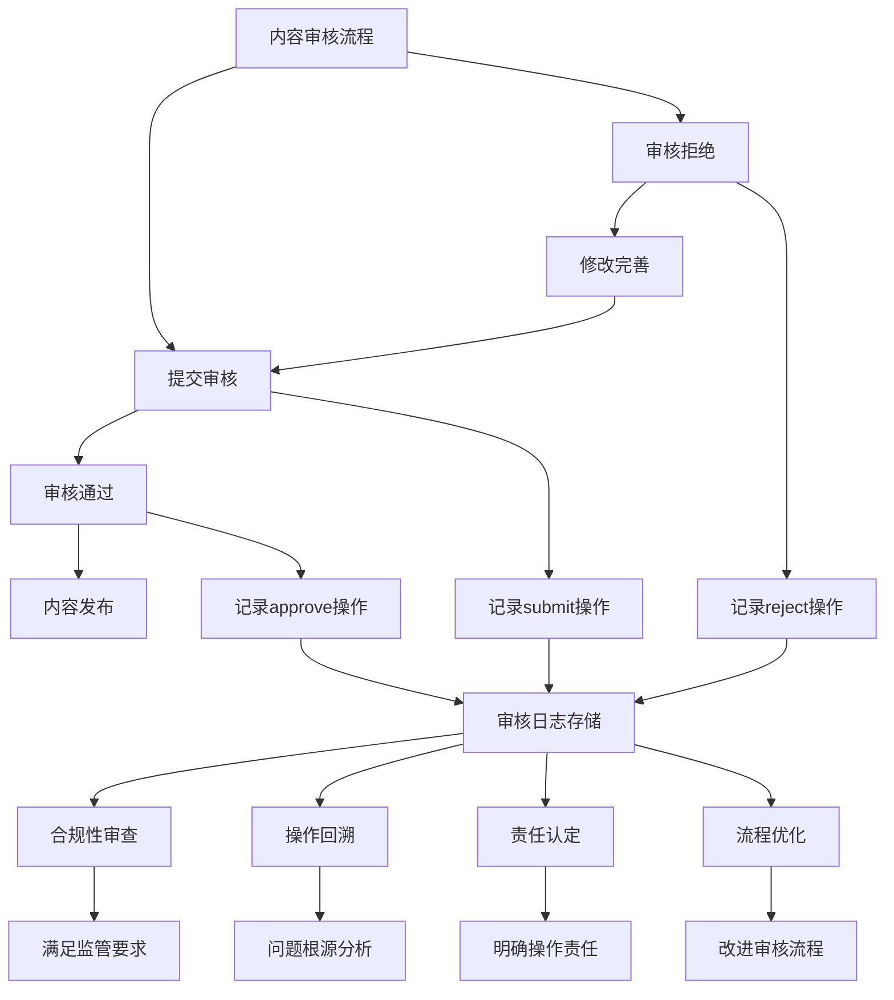

# 审核记录表 (audit_logs)

<cite>
**本文档引用文件**   
- [init.sql](file://database/init.sql#L109-L124)
- [admin.controller.ts](file://backend/src/controllers/admin.controller.ts#L266-L387)
- [admin.routes.ts](file://backend/src/routes/admin.routes.ts#L42-L45)
</cite>

## 目录
1. [引言](#引言)
2. [核心字段协同工作机制](#核心字段协同工作机制)
3. [外键策略与历史记录保留](#外键策略与历史记录保留)
4. [状态变更轨迹重构](#状态变更轨迹重构)
5. [索引优化与查询效率](#索引优化与查询效率)
6. [合规性审查与操作回溯价值](#合规性审查与操作回溯价值)

## 引言
审核记录表（audit_logs）是心理自助应用系统中内容审核流程的核心审计追踪组件。该表系统性地记录了心理自助方法从创建到发布的全生命周期中的关键操作，为内容管理提供了完整的操作历史和审计能力。通过精确记录每次审核操作的上下文信息，该表不仅支持操作回溯和责任认定，还为合规性审查提供了可靠的数据基础。

## 核心字段协同工作机制
审核记录表通过多个关键字段的协同工作，完整记录了内容审核过程中的操作细节和状态变化。

**audit_logs表字段说明**
| 字段名 | 类型 | 约束 | 说明 |
|--------|------|------|------|
| method_id | INT | REFERENCES methods(id) ON DELETE SET NULL | 关联的心理自助方法ID，外键删除时设为NULL以保留历史记录 |
| admin_id | INT | REFERENCES admins(id) ON DELETE SET NULL | 执行操作的管理员ID，外键删除时设为NULL以保留历史记录 |
| action | VARCHAR(20) | NOT NULL, CHECK IN ('submit', 'approve', 'reject') | 操作类型：提交审核、批准发布或拒绝修改 |
| status_before | VARCHAR(20) |  | 操作前的内容状态 |
| status_after | VARCHAR(20) |  | 操作后的内容状态 |
| comment | TEXT |  | 审核意见或拒绝原因 |
| created_at | TIMESTAMP | DEFAULT NOW() | 记录创建时间 |

**Section sources**
- [init.sql](file://database/init.sql#L110-L119)

## 外键策略与历史记录保留
审核记录表采用ON DELETE SET NULL外键策略，在保留历史记录方面具有显著优势。


**Diagram sources **
- [init.sql](file://database/init.sql#L112-L113)

当关联的心理自助方法或管理员被删除时，ON DELETE SET NULL策略确保审核日志记录不会被级联删除。这种设计保证了即使原始数据被移除，审核历史仍然完整保留，这对于长期审计和合规性要求至关重要。例如，即使某个管理员账号被注销，其过去执行的所有审核操作仍可在审计日志中追溯。

**Section sources**
- [init.sql](file://database/init.sql#L112-L113)

## 状态变更轨迹重构
通过action和status字段的组合，可以精确重构内容的状态变更轨迹。

```mermaid
stateDiagram-v2
[*] --> draft
draft --> pending : submit
pending --> published : approve
pending --> draft : reject
published --> [*]
note right of submit
method_id, admin_id,
action='submit',
status_before='draft',
status_after='pending'
end note
note right of approve
method_id, admin_id,
action='approve',
status_before='pending',
status_after='published',
comment='内容质量优秀'
end note
note left of reject
method_id, admin_id,
action='reject',
status_before='pending',
status_after='draft',
comment='需要补充实践步骤'
end note
```

**Diagram sources **
- [admin.controller.ts](file://backend/src/controllers/admin.controller.ts#L286-L288)
- [admin.controller.ts](file://backend/src/controllers/admin.controller.ts#L330-L332)
- [admin.controller.ts](file://backend/src/controllers/admin.controller.ts#L377-L379)

action字段记录操作类型（submit/approve/reject），而status_before和status_after字段记录操作前后的状态变化。这种设计使得系统能够重建任何心理自助方法的完整审核历史。例如，通过查询特定method_id的所有审核记录，可以清晰地看到该方法从草稿（draft）到待审核（pending）再到发布（published）的完整流程。

**Section sources**
- [admin.controller.ts](file://backend/src/controllers/admin.controller.ts#L285-L387)

## 索引优化与查询效率
idx_audit_logs_created_at索引显著提升了审核日志的查询效率。


**Diagram sources **
- [init.sql](file://database/init.sql#L123)
- [init.sql](file://database/init.sql#L121)
- [init.sql](file://database/init.sql#L122)

该表创建了三个关键索引：idx_audit_logs_method_id、idx_audit_logs_admin_id和idx_audit_logs_created_at。其中，按创建时间的索引对于按时间范围查询审核日志特别重要。在进行月度审核报告或特定时间段的合规性审查时，该索引能够大幅减少查询时间，确保系统在处理大量审核记录时仍能保持良好的响应性能。

**Section sources**
- [init.sql](file://database/init.sql#L121-L123)

## 合规性审查与操作回溯价值
审核记录表在合规性审查和操作回溯中具有关键价值。



**Diagram sources **
- [admin.controller.ts](file://backend/src/controllers/admin.controller.ts#L285-L387)
- [admin.routes.ts](file://backend/src/routes/admin.routes.ts#L42-L45)

该表为系统提供了完整的操作审计能力。在合规性审查中，可以提供所有内容变更的完整记录，证明内容发布流程的规范性和可追溯性。在操作回溯方面，当出现内容争议或质量问题时，可以通过审核日志追溯到具体的审核决策过程，包括决策人、决策时间和决策依据（comment字段）。这种透明的审计追踪机制不仅增强了系统的可信度，也为持续改进内容审核流程提供了数据支持。

**Section sources**
- [admin.controller.ts](file://backend/src/controllers/admin.controller.ts#L266-L387)
- [admin.routes.ts](file://backend/src/routes/admin.routes.ts#L42-L45)