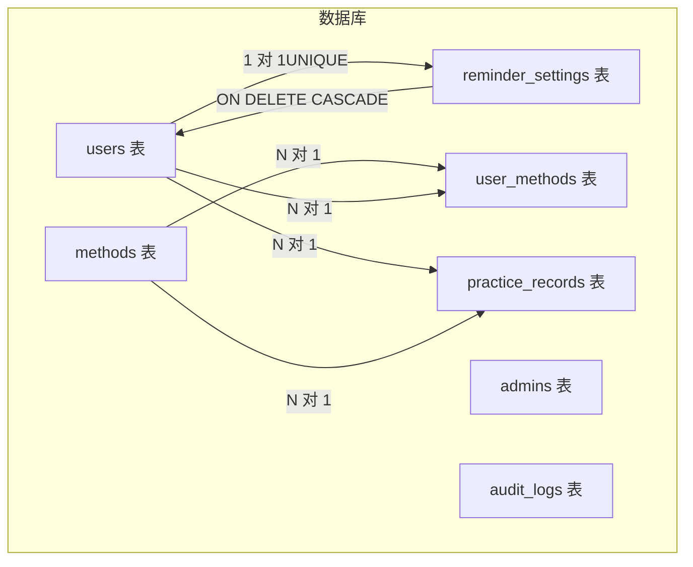
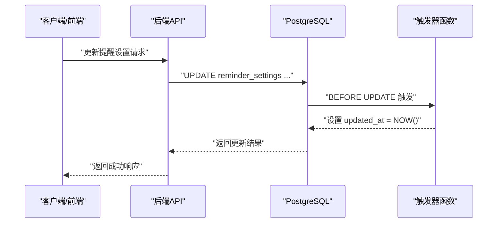
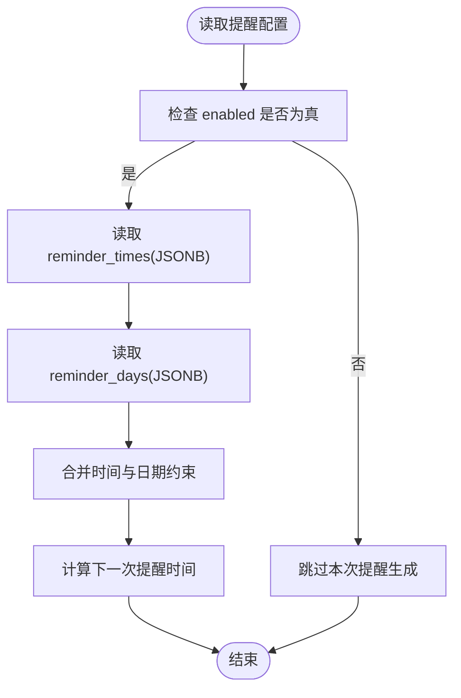
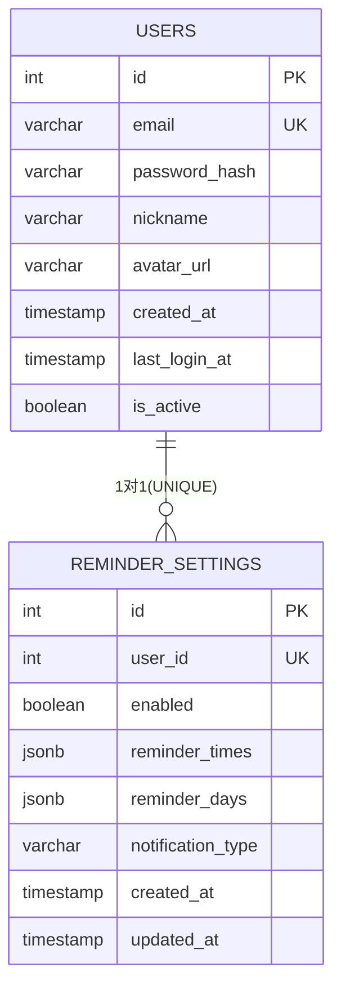
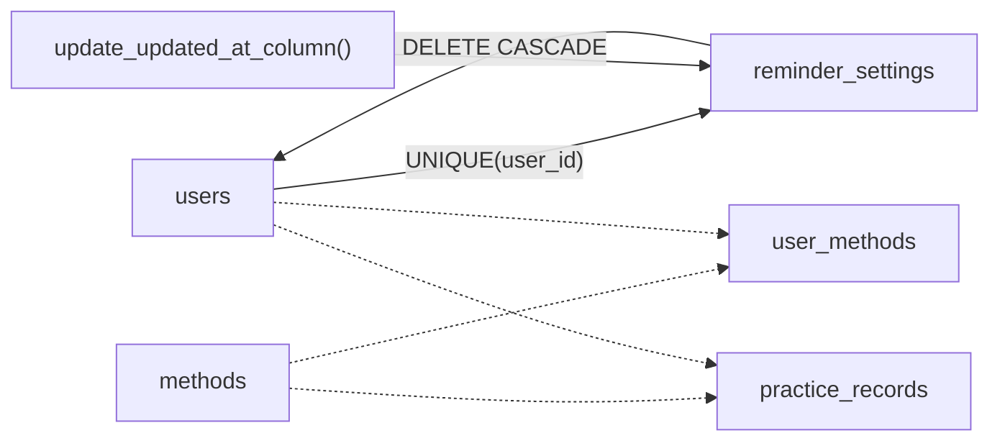

# 提醒设置表 (reminder_settings)

<cite>
**本文引用的文件**
- [init.sql](file://database/init.sql)
- [FINAL_REPORT.md](file://docs/FINAL_REPORT.md)
- [IMPLEMENTATION_STATUS.md](file://docs/IMPLEMENTATION_STATUS.md)
- [TEST_REPORT.md](file://docs/TEST_REPORT.md)
</cite>

## 目录
1. [简介](#简介)
2. [项目结构](#项目结构)
3. [核心组件](#核心组件)
4. [架构总览](#架构总览)
5. [详细组件分析](#详细组件分析)
6. [依赖关系分析](#依赖关系分析)
7. [性能考量](#性能考量)
8. [故障排查指南](#故障排查指南)
9. [结论](#结论)

## 简介
本节聚焦于提醒设置表（reminder_settings），说明其如何支撑用户的个性化提醒能力，包括：
- enabled 开关控制提醒是否启用
- reminder_times 与 reminder_days 使用 JSONB 存储复杂的时间配置，灵活表达“何时”和“哪几天”
- user_id 的 UNIQUE 约束确保每位用户仅有一条提醒设置记录
- ON DELETE CASCADE 外键策略保障用户删除时同步清理提醒设置
- update_reminder_settings_updated_at 触发器自动维护 updated_at 字段
- notification_type 字段预留未来通知类型的扩展空间

## 项目结构
reminder_settings 表位于数据库初始化脚本中，与 users、methods、user_methods、practice_records 等表共同构成应用的数据层基础。

图表来源
- [init.sql](file://database/init.sql#L80-L93)
- [init.sql](file://database/init.sql#L301-L315)

章节来源
- [init.sql](file://database/init.sql#L80-L93)
- [init.sql](file://database/init.sql#L301-L315)

## 核心组件
- 表结构与字段
  - id：自增主键
  - user_id：唯一且引用 users(id)，删除用户时级联删除提醒设置
  - enabled：布尔开关，默认开启
  - reminder_times：JSONB，存储提醒时刻集合（如多个时间段）
  - reminder_days：JSONB，存储提醒星期集合（如周一至周五）
  - notification_type：字符串，默认值为 all，预留扩展不同通知类型
  - created_at / updated_at：时间戳，触发器自动维护 updated_at

- 约束与索引
  - user_id 上的 UNIQUE 约束保证每用户仅一条提醒设置
  - idx_reminder_settings_user_id 索引提升按用户查询效率

- 触发器
  - update_reminder_settings_updated_at 在 UPDATE 时自动更新 updated_at

章节来源
- [init.sql](file://database/init.sql#L80-L93)
- [init.sql](file://database/init.sql#L301-L315)

## 架构总览
reminder_settings 作为用户个性化提醒的“配置中心”，与用户表形成一对一关系，通过外键约束与级联删除保障数据一致性；通过 JSONB 字段承载灵活的时间配置，满足多样化的提醒场景；触发器确保时间戳的准确性。

图表来源
- [init.sql](file://database/init.sql#L301-L315)

## 详细组件分析

### enabled 开关
- 作用：控制是否启用该用户的提醒功能
- 默认值：TRUE，表示默认启用
- 使用建议：
  - 前端展示时可直接读取 enabled 判断是否显示“开启/关闭”按钮
  - 后端在生成提醒任务时应首先检查 enabled，避免无效调度

章节来源
- [init.sql](file://database/init.sql#L80-L93)

### JSONB 字段：reminder_times 与 reminder_days
- 存储形式：JSONB，允许嵌套数组、对象等结构
- 典型用途：
  - reminder_times：可表达多个提醒时刻（例如 ["09:00", "18:30"]）
  - reminder_days：可表达每周的提醒日程（例如 ["monday", "wednesday", "friday"] 或数字 1,3,5）
- 灵活性优势：
  - 支持动态配置，无需预设固定长度的枚举
  - 可随业务演进扩展更多时间维度（如节假日例外、时段重叠等）

图表来源
- [init.sql](file://database/init.sql#L80-L93)

章节来源
- [init.sql](file://database/init.sql#L80-L93)

### user_id 的 UNIQUE 约束与外键策略
- UNIQUE 约束：确保每个用户仅对应一条 reminder_settings 记录，避免重复或歧义
- 外键策略：user_id 引用 users(id)，并设置 ON DELETE CASCADE
  - 当用户被删除时，reminder_settings 记录会自动级联删除
  - 保障数据一致性，防止孤儿记录产生

图表来源
- [init.sql](file://database/init.sql#L80-L93)

章节来源
- [init.sql](file://database/init.sql#L80-L93)

### updated_at 自动维护机制
- 触发器：update_reminder_settings_updated_at
- 行为：在 UPDATE 之前将 updated_at 设置为当前时间
- 价值：无需在应用层手动维护时间戳，降低出错概率，统一时间来源

章节来源
- [init.sql](file://database/init.sql#L301-L315)

### notification_type 字段的扩展性设计
- 当前默认值：all
- 设计意图：为未来引入不同通知类型预留空间（如仅练习提醒、仅系统公告、仅新方法推送等）
- 建议：
  - 在应用层对 notification_type 做白名单校验
  - 与前端通知设置 UI 解耦，便于迭代

章节来源
- [init.sql](file://database/init.sql#L80-L93)

## 依赖关系分析
- 与 users 的依赖：一对一关系，通过 UNIQUE 外键约束
- 与 practice_records 的间接关系：提醒通常与练习行为相关，但提醒设置本身不直接引用练习记录
- 触发器依赖：update_updated_at_column 函数被 reminder_settings 的触发器复用

图表来源
- [init.sql](file://database/init.sql#L80-L93)
- [init.sql](file://database/init.sql#L301-L315)

章节来源
- [init.sql](file://database/init.sql#L80-L93)
- [init.sql](file://database/init.sql#L301-L315)

## 性能考量
- JSONB 查询成本：JSONB 的灵活性带来查询复杂度上升，建议：
  - 在高频查询场景下，必要时考虑物化列或派生表
  - 对 reminder_times 与 reminder_days 的常见组合建立索引（如 gin 索引）以加速过滤
- 级联删除影响：用户删除时会级联删除提醒设置，需注意批量删除对性能的影响
- 触发器开销：触发器函数简单，开销较低；但在高并发 UPDATE 场景下仍需关注锁竞争

## 故障排查指南
- 重复设置提醒
  - 症状：插入时报 user_id 唯一约束冲突
  - 排查：确认是否已有该用户的提醒设置记录
  - 处理：改为 UPDATE 或删除旧记录后再 INSERT
- 更新时间未变更
  - 症状：updated_at 未随 UPDATE 变化
  - 排查：确认触发器是否生效
  - 处理：检查触发器函数与表绑定情况
- 删除用户后提醒设置未清理
  - 症状：用户被删除，但提醒设置仍存在
  - 排查：确认外键约束与级联策略
  - 处理：修正外键定义或重新绑定触发器

章节来源
- [init.sql](file://database/init.sql#L80-L93)
- [init.sql](file://database/init.sql#L301-L315)

## 结论
reminder_settings 表通过简洁而强大的设计，为用户提供灵活的个性化提醒能力：
- enabled 开关与 JSONB 时间配置组合，覆盖多样的提醒场景
- user_id 的 UNIQUE 约束与 ON DELETE CASCADE 外键策略，确保数据一致性
- 触发器自动维护 updated_at，简化应用层逻辑
- notification_type 为未来扩展预留空间

随着业务发展，可在保持现有约束与触发器的基础上，逐步完善提醒生成与调度逻辑，并根据查询热点优化索引与存储结构。