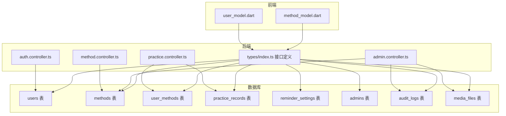
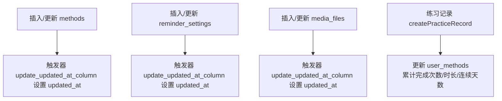

# 数据表结构

<cite>
**本文引用的文件**
- [init.sql](file://database/init.sql)
- [index.ts](file://backend/src/types/index.ts)
- [practice.controller.ts](file://backend/src/controllers/practice.controller.ts)
- [admin.controller.ts](file://backend/src/controllers/admin.controller.ts)
- [method.controller.ts](file://backend/src/controllers/method.controller.ts)
- [auth.controller.ts](file://backend/src/controllers/auth.controller.ts)
- [user_model.dart](file://flutter_app/lib/data/models/user_model.dart)
- [method_model.dart](file://flutter_app/lib/data/models/method_model.dart)
</cite>

## 目录
1. [简介](#简介)
2. [项目结构](#项目结构)
3. [核心组件](#核心组件)
4. [架构总览](#架构总览)
5. [详细组件分析](#详细组件分析)
6. [依赖关系分析](#依赖关系分析)
7. [性能考量](#性能考量)
8. [故障排查指南](#故障排查指南)
9. [结论](#结论)
10. [附录](#附录)

## 简介
本文件围绕 nian 项目的数据库层进行系统化梳理，聚焦以下数据表的字段定义、数据类型、约束条件与索引策略：
- users：用户基础信息与认证凭据
- methods：心理自助方法元数据与富文本内容
- practice_records：用户练习记录
- user_methods：用户与方法的关联与学习进度
- reminder_settings：用户提醒配置
- admins：后台管理员账户
- audit_logs：方法审核流程审计
- media_files：媒体资源文件

同时结合 init.sql 中的 CREATE TABLE 语句与后端 types/index.ts 的接口定义，明确各字段的技术规格与业务规则；并解释 content_json 使用 JSONB 的设计考量，以及 practice_date 使用 DATE 类型而非 TIMESTAMP 的合理性。

## 项目结构
数据库初始化脚本位于 database/init.sql，包含所有表的建表语句、索引与触发器；后端类型定义位于 backend/src/types/index.ts，前端 Flutter 模型位于 flutter_app/lib/data/models 下，分别用于约束数据结构与序列化/反序列化。



图表来源
- [init.sql](file://database/init.sql#L1-L143)
- [index.ts](file://backend/src/types/index.ts#L1-L126)
- [auth.controller.ts](file://backend/src/controllers/auth.controller.ts#L1-L150)
- [practice.controller.ts](file://backend/src/controllers/practice.controller.ts#L1-L261)
- [method.controller.ts](file://backend/src/controllers/method.controller.ts#L1-L153)
- [admin.controller.ts](file://backend/src/controllers/admin.controller.ts#L1-L1428)
- [user_model.dart](file://flutter_app/lib/data/models/user_model.dart#L1-L44)
- [method_model.dart](file://flutter_app/lib/data/models/method_model.dart#L1-L54)

章节来源
- [init.sql](file://database/init.sql#L1-L143)
- [index.ts](file://backend/src/types/index.ts#L1-L126)

## 核心组件
- users：用户身份与认证凭据，提供登录、注册、活跃状态等能力。
- methods：方法元数据与富文本内容，支持草稿、待审、发布等状态流转。
- practice_records：练习记录，承载每日练习、时长、前后心理状态评分、问卷结果等。
- user_methods：用户与方法的关联表，记录选择时间、目标次数、完成次数、总时长、连续天数、最近练习时间、收藏标记等。
- reminder_settings：用户提醒配置，包含启用开关、提醒时刻集合、提醒星期集合、通知类型等。
- admins：后台管理员账户，支持角色分级与登录审计。
- audit_logs：方法审核流程审计，记录提交、通过、拒绝等动作及前后状态。
- media_files：媒体资源文件，支持图片、音频、视频三类，记录上传者、MIME 类型、大小、路径与 URL。

章节来源
- [init.sql](file://database/init.sql#L1-L143)
- [index.ts](file://backend/src/types/index.ts#L1-L126)

## 架构总览
下图展示关键表之间的关系与典型查询/写入路径。

```mermaid
erDiagram
USERS {
int id PK
varchar email UK
varchar password_hash
varchar nickname
varchar avatar_url
timestamp created_at
timestamp last_login_at
boolean is_active
}
METHODS {
int id PK
varchar title
varchar description
varchar category
varchar difficulty
int duration_minutes
varchar cover_image_url
jsonb content_json
varchar status
int view_count
int select_count
int created_by FK
timestamp created_at
timestamp updated_at
timestamp published_at
}
USER_METHODS {
int id PK
int user_id FK
int method_id FK
timestamp selected_at
int target_count
int completed_count
int total_duration_minutes
int continuous_days
timestamp last_practice_at
boolean is_favorite
}
PRACTICE_RECORDS {
int id PK
int user_id FK
int method_id FK
date practice_date
int duration_minutes
int mood_before
int mood_after
text notes
jsonb questionnaire_result
timestamp created_at
}
REMINDER_SETTINGS {
int id PK
int user_id FK UK
boolean enabled
jsonb reminder_times
jsonb reminder_days
varchar notification_type
timestamp created_at
timestamp updated_at
}
ADMINS {
int id PK
varchar username UK
varchar password_hash
varchar role
varchar email UK
boolean is_active
timestamp created_at
timestamp last_login_at
}
AUDIT_LOGS {
int id PK
int method_id FK
int admin_id FK
varchar action
varchar status_before
varchar status_after
text comment
timestamp created_at
}
MEDIA_FILES {
int id PK
varchar filename
varchar original_name
varchar file_type
varchar mime_type
bigint file_size
varchar file_path
varchar url
int uploaded_by FK
timestamp created_at
timestamp updated_at
}
USERS ||--o{ USER_METHODS : "拥有"
USERS ||--o{ PRACTICE_RECORDS : "参与"
METHODS ||--o{ PRACTICE_RECORDS : "被练习"
USERS ||--o{ REMINDER_SETTINGS : "拥有"
ADMINS ||--o{ AUDIT_LOGS : "执行"
METHODS ||--o{ AUDIT_LOGS : "被审核"
ADMINS ||--o{ MEDIA_FILES : "上传"
```

图表来源
- [init.sql](file://database/init.sql#L1-L143)

## 详细组件分析

### users 表
- 字段与类型
  - id：整型自增主键
  - email：字符串，唯一且非空
  - password_hash：字符串，非空
  - nickname：字符串
  - avatar_url：字符串
  - created_at：时间戳，默认当前时间
  - last_login_at：时间戳
  - is_active：布尔，默认 true
- 约束与索引
  - 主键：id
  - 唯一约束：email
  - 索引：idx_users_email、idx_users_created_at
- 业务规则
  - 注册时校验邮箱格式与唯一性，密码经哈希存储
  - 登录时校验激活状态与密码
  - 登录成功后更新 last_login_at
- 技术规格对照
  - 后端类型：User、UserWithPassword
  - 前端模型：UserModel（包含 id、email、nickname、createdAt）

章节来源
- [init.sql](file://database/init.sql#L1-L18)
- [index.ts](file://backend/src/types/index.ts#L1-L20)
- [auth.controller.ts](file://backend/src/controllers/auth.controller.ts#L1-L150)
- [user_model.dart](file://flutter_app/lib/data/models/user_model.dart#L1-L44)

### methods 表
- 字段与类型
  - id：整型自增主键
  - title：字符串，非空
  - description：字符串，非空
  - category：字符串，非空
  - difficulty：字符串，非空
  - duration_minutes：整型，非空
  - cover_image_url：字符串
  - content_json：JSONB，非空
  - status：字符串，默认 draft
  - view_count：整型，默认 0
  - select_count：整型，默认 0
  - created_by：整型，外键引用 users(id)
  - created_at：时间戳，默认当前时间
  - updated_at：时间戳，默认当前时间（触发器自动更新）
  - published_at：时间戳
- 约束与索引
  - 主键：id
  - 外键：created_by 引用 users(id)
  - 索引：idx_methods_status、idx_methods_category、idx_methods_difficulty、idx_methods_created_at
  - 触发器：update_methods_updated_at 在更新时自动设置 updated_at
- 业务规则
  - 管理员创建方法时默认状态为 draft，提交审核后进入 pending，批准后变为 published 并设置 published_at
  - content_json 存储富文本结构，支持章节、练习、问卷等灵活内容
  - view_count 与 select_count 用于统计热度
- 技术规格对照
  - 后端类型：Method（包含 content_json 任意类型）
  - 前端模型：MethodModel（包含 contentJson）

章节来源
- [init.sql](file://database/init.sql#L19-L42)
- [index.ts](file://backend/src/types/index.ts#L18-L35)
- [admin.controller.ts](file://backend/src/controllers/admin.controller.ts#L129-L245)
- [method.controller.ts](file://backend/src/controllers/method.controller.ts#L1-L153)
- [method_model.dart](file://flutter_app/lib/data/models/method_model.dart#L1-L54)

### practice_records 表
- 字段与类型
  - id：整型自增主键
  - user_id：整型，非空，外键引用 users(id)，级联删除
  - method_id：整型，非空，外键引用 methods(id)，级联删除
  - practice_date：日期，非空
  - duration_minutes：整型，非空
  - mood_before：整型，检查约束 1~10
  - mood_after：整型，检查约束 1~10
  - notes：文本
  - questionnaire_result：JSONB
  - created_at：时间戳，默认当前时间
- 约束与索引
  - 主键：id
  - 外键：user_id 引用 users(id)、method_id 引用 methods(id)
  - 索引：idx_practice_records_user_id_date、idx_practice_records_user_id_method_id、idx_practice_records_created_at
- 业务规则
  - 每日同一用户对同一方法只能有一条记录（由业务逻辑保证），练习时会联动更新 user_methods
  - 支持按用户、方法、日期范围查询与分页
  - 支持导出练习记录
- 技术规格对照
  - 后端类型：PracticeRecord（包含 practice_date 与 questionnaire_result 任意类型）
  - 控制器：createPracticeRecord 将 practice_date 设为当日日期，更新 user_methods 并计算连续天数

章节来源
- [init.sql](file://database/init.sql#L62-L79)
- [index.ts](file://backend/src/types/index.ts#L51-L64)
- [practice.controller.ts](file://backend/src/controllers/practice.controller.ts#L1-L261)

### user_methods 表
- 字段与类型
  - id：整型自增主键
  - user_id：整型，非空，外键引用 users(id)，级联删除
  - method_id：整型，非空，外键引用 methods(id)，级联删除
  - selected_at：时间戳，默认当前时间
  - target_count：整型，默认 0
  - completed_count：整型，默认 0
  - total_duration_minutes：整型，默认 0
  - continuous_days：整型，默认 0
  - last_practice_at：时间戳
  - is_favorite：布尔，默认 false
  - 唯一约束：(user_id, method_id)
- 约束与索引
  - 主键：id
  - 外键：user_id 引用 users(id)、method_id 引用 methods(id)
  - 索引：idx_user_methods_user_id、idx_user_methods_method_id、idx_user_methods_selected_at
- 业务规则
  - 记录用户选择某方法的时间、完成次数、总时长、连续天数、最近练习时间与收藏状态
  - 练习时通过 upsert 更新累计值，并根据是否连续决定连续天数递增或重置
- 技术规格对照
  - 后端类型：UserMethod

章节来源
- [init.sql](file://database/init.sql#L43-L61)
- [index.ts](file://backend/src/types/index.ts#L37-L50)
- [practice.controller.ts](file://backend/src/controllers/practice.controller.ts#L1-L99)

### reminder_settings 表
- 字段与类型
  - id：整型自增主键
  - user_id：整型，唯一且非空，外键引用 users(id)，级联删除
  - enabled：布尔，默认 true
  - reminder_times：JSONB，非空
  - reminder_days：JSONB，非空
  - notification_type：字符串，默认 all
  - created_at：时间戳，默认当前时间
  - updated_at：时间戳，默认当前时间（触发器自动更新）
- 约束与索引
  - 主键：id
  - 外键：user_id 引用 users(id)
  - 索引：idx_reminder_settings_user_id
  - 触发器：update_reminder_settings_updated_at 在更新时自动设置 updated_at
- 业务规则
  - 每个用户仅有一个提醒设置，支持启用/禁用、设定提醒时刻与星期、通知类型
- 技术规格对照
  - 后端类型：未在 index.ts 中显式定义，但与用户一对一

章节来源
- [init.sql](file://database/init.sql#L80-L93)
- [index.ts](file://backend/src/types/index.ts#L1-L126)

### admins 表
- 字段与类型
  - id：整型自增主键
  - username：字符串，唯一且非空
  - password_hash：字符串，非空
  - role：字符串，非空，检查约束限定枚举值
  - email：字符串，唯一且非空
  - is_active：布尔，默认 true
  - created_at：时间戳，默认当前时间
  - last_login_at：时间戳
- 约束与索引
  - 主键：id
  - 唯一约束：username、email
  - 索引：idx_admins_username、idx_admins_email
- 业务规则
  - 支持不同角色的管理员登录与操作（如审批方法）
- 技术规格对照
  - 后端类型：Admin、AdminWithPassword

章节来源
- [init.sql](file://database/init.sql#L94-L108)
- [index.ts](file://backend/src/types/index.ts#L65-L80)
- [admin.controller.ts](file://backend/src/controllers/admin.controller.ts#L1-L80)

### audit_logs 表
- 字段与类型
  - id：整型自增主键
  - method_id：整型，可空，外键引用 methods(id)，删除时设为空
  - admin_id：整型，可空，外键引用 admins(id)，删除时设为空
  - action：字符串，非空，检查约束限定枚举值
  - status_before：字符串
  - status_after：字符串
  - comment：文本
  - created_at：时间戳，默认当前时间
- 约束与索引
  - 主键：id
  - 索引：idx_audit_logs_method_id、idx_audit_logs_admin_id、idx_audit_logs_created_at
- 业务规则
  - 记录方法提交、通过、拒绝等动作及其前后状态，支持评论
- 技术规格对照
  - 后端类型：未在 index.ts 中显式定义

章节来源
- [init.sql](file://database/init.sql#L110-L124)
- [index.ts](file://backend/src/types/index.ts#L1-L126)
- [admin.controller.ts](file://backend/src/controllers/admin.controller.ts#L266-L387)

### media_files 表
- 字段与类型
  - id：整型自增主键
  - filename：字符串，非空
  - original_name：字符串，非空
  - file_type：字符串，非空，检查约束限定枚举值
  - mime_type：字符串，非空
  - file_size：整型，非空
  - file_path：字符串，非空
  - url：字符串，非空
  - uploaded_by：整型，可空，外键引用 admins(id)，删除时设为空
  - created_at：时间戳，默认当前时间
  - updated_at：时间戳，默认当前时间（触发器自动更新）
- 约束与索引
  - 主键：id
  - 索引：idx_media_files_file_type、idx_media_files_uploaded_by、idx_media_files_created_at
  - 触发器：update_updated_at_column 在更新时自动设置 updated_at
- 业务规则
  - 管理员上传媒体文件，支持按类型与关键词检索
- 技术规格对照
  - 后端类型：MediaFile

章节来源
- [init.sql](file://database/init.sql#L125-L143)
- [index.ts](file://backend/src/types/index.ts#L112-L126)
- [admin.controller.ts](file://backend/src/controllers/admin.controller.ts#L470-L573)

## 依赖关系分析
- 表间依赖
  - methods.created_by 引用 users(id)
  - practice_records.user_id、method_id 分别引用 users(id)、methods(id)
  - user_methods.user_id、method_id 分别引用 users(id)、methods(id)
  - reminder_settings.user_id 引用 users(id)
  - audit_logs.method_id 引用 methods(id)、admin_id 引用 admins(id)
  - media_files.uploaded_by 引用 admins(id)
- 触发器与视图
  - update_updated_at_column 触发器用于 methods 与 reminder_settings 的 updated_at 自动更新
  - user_practice_stats、method_popularity 视图用于统计分析



图表来源
- [init.sql](file://database/init.sql#L301-L349)
- [practice.controller.ts](file://backend/src/controllers/practice.controller.ts#L1-L99)

章节来源
- [init.sql](file://database/init.sql#L301-L349)
- [practice.controller.ts](file://backend/src/controllers/practice.controller.ts#L1-L99)

## 性能考量
- 索引策略
  - users：email、created_at 索引，支持登录与按创建时间筛选
  - methods：status、category、difficulty、created_at 索引，支持方法列表与筛选
  - practice_records：复合索引 user_id+date、user_id+method_id、created_at，支持按用户/日期/方法查询与分页
  - user_methods：user_id、method_id、selected_at 索引，支持用户方法列表与排序
  - reminder_settings：user_id 索引，支持一对一查询
  - admins：username、email 索引，支持登录与检索
  - audit_logs：method_id、admin_id、created_at 索引，支持审核追踪
  - media_files：file_type、uploaded_by、created_at 索引，支持媒体检索与统计
- 触发器
  - 对多表的 updated_at 自动维护，避免遗漏更新导致的统计偏差
- 视图
  - user_practice_stats、method_popularity 提供聚合统计，减少复杂查询开销

[本节为通用性能建议，不直接分析具体文件]

## 故障排查指南
- 常见错误与定位
  - 邮箱重复：users.email 唯一约束冲突
  - 非法心理状态评分：practice_records.mood_before/mood_after 检查约束 1~10
  - 非法文件类型：admin 文件上传接口对 MIME 类型进行判定
  - 权限不足：方法审核仅超级管理员可批准/拒绝
- 建议排查步骤
  - 核对插入/更新参数是否满足约束
  - 检查触发器是否生效（updated_at 是否更新）
  - 使用索引覆盖的查询验证性能问题
  - 通过视图快速确认统计数据是否异常

章节来源
- [auth.controller.ts](file://backend/src/controllers/auth.controller.ts#L1-L150)
- [practice.controller.ts](file://backend/src/controllers/practice.controller.ts#L1-L261)
- [admin.controller.ts](file://backend/src/controllers/admin.controller.ts#L298-L387)

## 结论
本项目采用清晰的表结构设计与严格的约束保障数据一致性，配合丰富的索引与触发器实现高效查询与自动维护。content_json 使用 JSONB 使方法内容具备高度灵活性，满足未来扩展需求；practice_date 使用 DATE 类型契合“日维度”练习记录的业务场景，便于按日统计与趋势分析。前端模型与后端类型保持一致，确保跨端数据契约稳定。

[本节为总结性内容，不直接分析具体文件]

## 附录

### content_json 字段设计考量
- 存储灵活性：JSONB 支持嵌套结构（章节、练习、问卷等），无需预定义固定字段，便于内容演进
- 查询能力：PostgreSQL JSONB 提供路径查询与索引能力，可在必要时添加 GIN 索引优化查询
- 版本兼容：通过字段版本号或结构变更策略，避免破坏现有数据

章节来源
- [init.sql](file://database/init.sql#L19-L42)
- [admin.controller.ts](file://backend/src/controllers/admin.controller.ts#L129-L245)
- [method.controller.ts](file://backend/src/controllers/method.controller.ts#L1-L153)

### practice_date 使用 DATE 的合理性
- 业务语义：练习记录按“日”粒度统计，使用 DATE 可避免时区与时分秒带来的歧义
- 查询效率：按日分组与趋势分析更直观，索引与聚合查询更高效
- 数据一致性：统一日期表示，避免因时间戳差异导致的重复记录或漏记

章节来源
- [init.sql](file://database/init.sql#L62-L79)
- [practice.controller.ts](file://backend/src/controllers/practice.controller.ts#L1-L99)