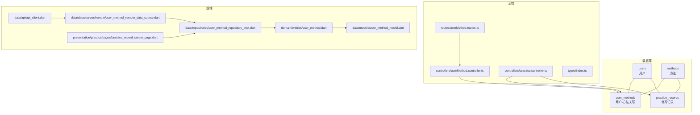
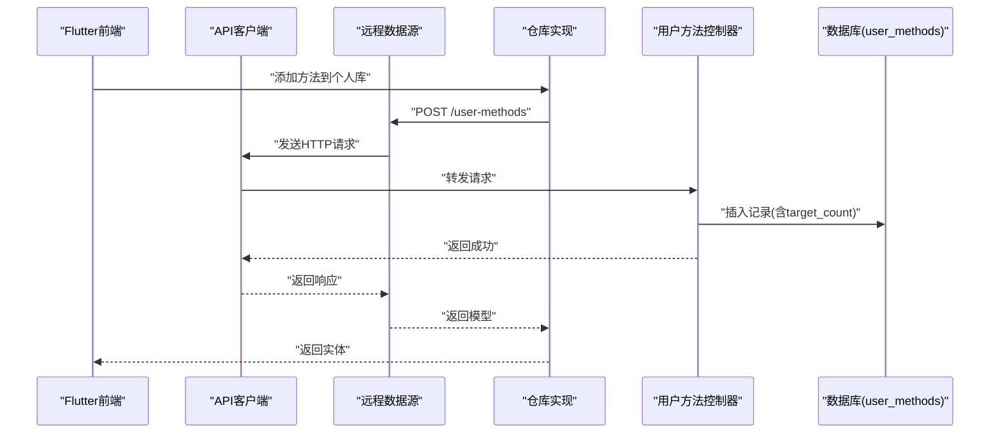
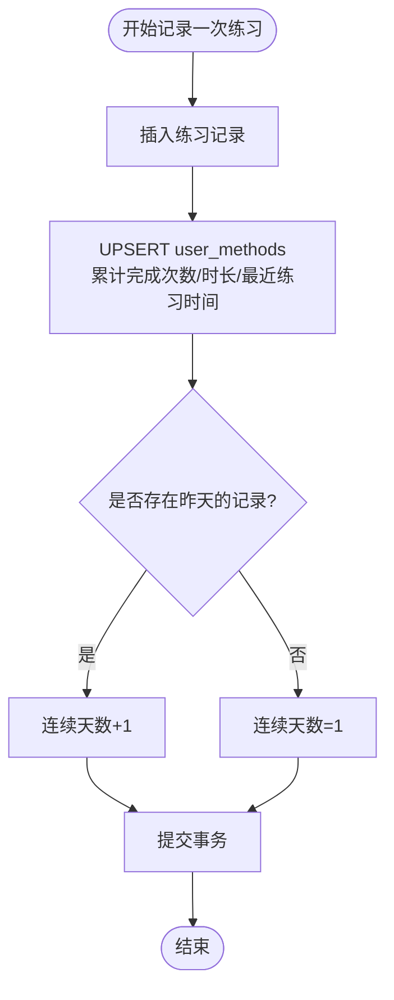
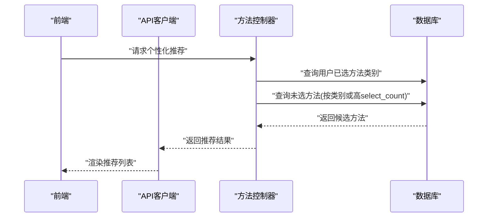
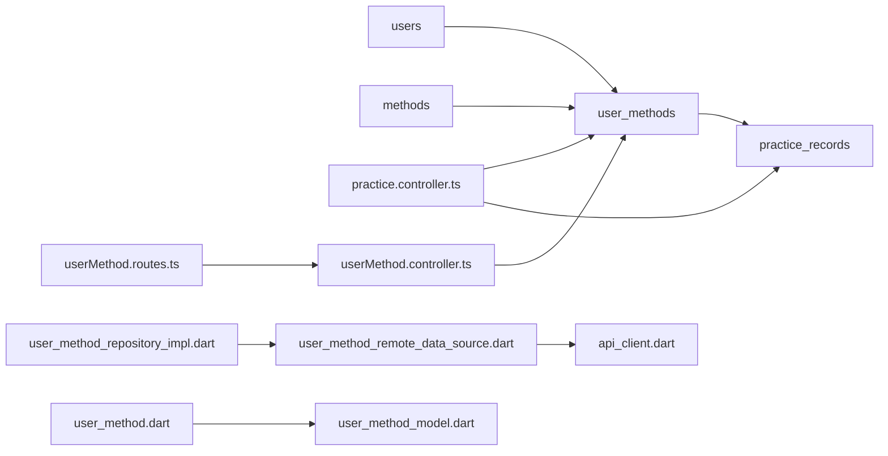

# 用户方法关联表 (user_methods)

<cite>
**本文引用的文件**
- [database/init.sql](file://database/init.sql)
- [backend/src/controllers/userMethod.controller.ts](file://backend/src/controllers/userMethod.controller.ts)
- [backend/src/controllers/practice.controller.ts](file://backend/src/controllers/practice.controller.ts)
- [backend/src/routes/userMethod.routes.ts](file://backend/src/routes/userMethod.routes.ts)
- [backend/src/types/index.ts](file://backend/src/types/index.ts)
- [flutter_app/lib/data/models/user_method_model.dart](file://flutter_app/lib/data/models/user_method_model.dart)
- [flutter_app/lib/domain/entities/user_method.dart](file://flutter_app/lib/domain/entities/user_method.dart)
- [flutter_app/lib/data/repositories/user_method_repository_impl.dart](file://flutter_app/lib/data/repositories/user_method_repository_impl.dart)
- [flutter_app/lib/data/datasources/remote/user_method_remote_data_source.dart](file://flutter_app/lib/data/datasources/remote/user_method_remote_data_source.dart)
- [flutter_app/lib/data/api/api_client.dart](file://flutter_app/lib/data/api/api_client.dart)
- [flutter_app/lib/presentation/practice/pages/practice_record_create_page.dart](file://flutter_app/lib/presentation/practice/pages/practice_record_create_page.dart)
- [backend/src/controllers/method.controller.ts](file://backend/src/controllers/method.controller.ts)
</cite>

## 目录
1. [简介](#简介)
2. [项目结构](#项目结构)
3. [核心组件](#核心组件)
4. [架构总览](#架构总览)
5. [详细组件分析](#详细组件分析)
6. [依赖关系分析](#依赖关系分析)
7. [性能考量](#性能考量)
8. [故障排查指南](#故障排查指南)
9. [结论](#结论)
10. [附录](#附录)

## 简介
本文件围绕数据库中的“用户方法关联表”user_methods，系统阐述其在个性化推荐系统中的桥梁作用，重点解析：
- 外键约束与 ON DELETE CASCADE 的安全边界
- 字段 selected_at、target_count、completed_count、total_duration_minutes、continuous_days、last_practice_at、is_favorite 如何支撑用户行为追踪、成就系统与推荐算法
- UNIQUE(user_id, method_id) 唯一约束如何防止重复收藏
- 该表在用户练习路径分析中的数据价值

## 项目结构
user_methods 位于后端数据库初始化脚本中，作为连接用户与方法的核心关联表；同时在后端控制器中提供增删改查接口，在前端 Flutter 应用中通过数据源与仓库层进行调用。

图表来源
- [database/init.sql](file://database/init.sql#L43-L61)
- [backend/src/routes/userMethod.routes.ts](file://backend/src/routes/userMethod.routes.ts#L1-L23)
- [backend/src/controllers/userMethod.controller.ts](file://backend/src/controllers/userMethod.controller.ts#L1-L162)
- [backend/src/controllers/practice.controller.ts](file://backend/src/controllers/practice.controller.ts#L1-L99)
- [backend/src/types/index.ts](file://backend/src/types/index.ts#L37-L49)
- [flutter_app/lib/data/api/api_client.dart](file://flutter_app/lib/data/api/api_client.dart#L1-L207)
- [flutter_app/lib/data/datasources/remote/user_method_remote_data_source.dart](file://flutter_app/lib/data/datasources/remote/user_method_remote_data_source.dart#L1-L86)
- [flutter_app/lib/data/repositories/user_method_repository_impl.dart](file://flutter_app/lib/data/repositories/user_method_repository_impl.dart#L1-L84)
- [flutter_app/lib/domain/entities/user_method.dart](file://flutter_app/lib/domain/entities/user_method.dart#L1-L59)
- [flutter_app/lib/data/models/user_method_model.dart](file://flutter_app/lib/data/models/user_method_model.dart#L1-L89)
- [flutter_app/lib/presentation/practice/pages/practice_record_create_page.dart](file://flutter_app/lib/presentation/practice/pages/practice_record_create_page.dart#L17-L41)

章节来源
- [database/init.sql](file://database/init.sql#L43-L61)
- [backend/src/routes/userMethod.routes.ts](file://backend/src/routes/userMethod.routes.ts#L1-L23)
- [backend/src/controllers/userMethod.controller.ts](file://backend/src/controllers/userMethod.controller.ts#L1-L162)
- [backend/src/controllers/practice.controller.ts](file://backend/src/controllers/practice.controller.ts#L1-L99)
- [flutter_app/lib/data/api/api_client.dart](file://flutter_app/lib/data/api/api_client.dart#L1-L207)
- [flutter_app/lib/data/datasources/remote/user_method_remote_data_source.dart](file://flutter_app/lib/data/datasources/remote/user_method_remote_data_source.dart#L1-L86)
- [flutter_app/lib/data/repositories/user_method_repository_impl.dart](file://flutter_app/lib/data/repositories/user_method_repository_impl.dart#L1-L84)
- [flutter_app/lib/domain/entities/user_method.dart](file://flutter_app/lib/domain/entities/user_method.dart#L1-L59)
- [flutter_app/lib/data/models/user_method_model.dart](file://flutter_app/lib/data/models/user_method_model.dart#L1-L89)
- [flutter_app/lib/presentation/practice/pages/practice_record_create_page.dart](file://flutter_app/lib/presentation/practice/pages/practice_record_create_page.dart#L17-L41)

## 核心组件
- 数据库表结构：user_methods 包含用户与方法的关联、选择时间、目标与完成计数、累计时长、连续天数、最近练习时间以及收藏标记，并对 (user_id, method_id) 建立唯一约束。
- 后端控制器：提供添加、查询、更新、删除用户方法的接口，确保认证与参数校验，维护方法的 select_count。
- 前端数据层：通过 API 客户端调用后端接口，使用仓库与数据模型处理返回数据。
- 练习记录联动：练习控制器在记录一次练习时，原子性地更新 user_methods 的累计统计与连续天数。

章节来源
- [database/init.sql](file://database/init.sql#L43-L61)
- [backend/src/controllers/userMethod.controller.ts](file://backend/src/controllers/userMethod.controller.ts#L1-L162)
- [backend/src/controllers/practice.controller.ts](file://backend/src/controllers/practice.controller.ts#L1-L99)
- [flutter_app/lib/data/datasources/remote/user_method_remote_data_source.dart](file://flutter_app/lib/data/datasources/remote/user_method_remote_data_source.dart#L1-L86)
- [flutter_app/lib/data/repositories/user_method_repository_impl.dart](file://flutter_app/lib/data/repositories/user_method_repository_impl.dart#L1-L84)

## 架构总览
user_methods 在系统中的角色是“用户-方法”的纽带，既承载用户行为数据，又为推荐算法提供输入特征。后端通过路由与控制器暴露 CRUD 接口，前端通过数据源与仓库层消费接口，练习控制器在记录练习时同步更新 user_methods 的行为指标。

图表来源
- [backend/src/routes/userMethod.routes.ts](file://backend/src/routes/userMethod.routes.ts#L1-L23)
- [backend/src/controllers/userMethod.controller.ts](file://backend/src/controllers/userMethod.controller.ts#L1-L56)
- [flutter_app/lib/data/datasources/remote/user_method_remote_data_source.dart](file://flutter_app/lib/data/datasources/remote/user_method_remote_data_source.dart#L23-L40)
- [flutter_app/lib/data/repositories/user_method_repository_impl.dart](file://flutter_app/lib/data/repositories/user_method_repository_impl.dart#L28-L46)
- [flutter_app/lib/data/api/api_client.dart](file://flutter_app/lib/data/api/api_client.dart#L59-L87)

## 详细组件分析

### 外键约束与 ON DELETE CASCADE 的安全性考量
- user_id 引用 users(id)，method_id 引用 methods(id)，均设置 ON DELETE CASCADE。
- 安全边界：
  - 当用户被删除时，其所有 user_methods 记录会级联删除，避免悬挂记录。
  - 当方法被删除时，其所有 user_methods 记录也会级联删除，保证关联完整性。
  - 由于存在 UNIQUE(user_id, method_id)，不会出现重复关联，进一步降低数据冗余风险。
- 建议：
  - 在业务上，若未来需要保留历史轨迹，可考虑改为 ON DELETE SET NULL 或引入软删除策略，但当前设计简洁且符合“用户-方法”强关联的语义。

章节来源
- [database/init.sql](file://database/init.sql#L43-L61)

### 字段与业务价值映射
- selected_at：记录用户选择方法的时间，用于排序与个性化推荐的时效性权重。
- target_count：用户设定的目标练习次数，配合 completed_count 可计算完成度。
- completed_count：累计完成次数，直接支持成就系统与进度可视化。
- total_duration_minutes：累计练习时长，用于健康与习惯追踪。
- continuous_days：连续练习天数，是成就系统与推荐算法的重要信号。
- last_practice_at：最近一次练习时间，用于提醒与活跃度判断。
- is_favorite：收藏标记，影响个人库展示顺序与推荐偏好。

这些字段共同构成用户练习路径的多维画像，支撑以下能力：
- 行为追踪：累计次数、时长、连续天数、最近练习时间
- 成就系统：完成度、连续打卡、总时长等里程碑
- 推荐算法：基于类别偏好、完成度、收藏与最近练习时间的特征

章节来源
- [database/init.sql](file://database/init.sql#L43-L61)
- [backend/src/types/index.ts](file://backend/src/types/index.ts#L37-L49)
- [flutter_app/lib/domain/entities/user_method.dart](file://flutter_app/lib/domain/entities/user_method.dart#L1-L59)
- [flutter_app/lib/data/models/user_method_model.dart](file://flutter_app/lib/data/models/user_method_model.dart#L1-L89)

### UNIQUE(user_id, method_id) 唯一约束与防重复收藏机制
- 唯一性：同一用户不可重复收藏同一方法，避免重复记录与推荐偏差。
- 防重复流程：
  - 添加时先查询是否存在相同(user_id, method_id)，若存在则返回冲突错误。
  - 删除时减少方法的 select_count，保持计数一致性。
- 前端与后端协同：
  - 前端在 UI 上避免二次点击添加
  - 后端在数据库层面强制约束，确保一致性

章节来源
- [database/init.sql](file://database/init.sql#L55-L56)
- [backend/src/controllers/userMethod.controller.ts](file://backend/src/controllers/userMethod.controller.ts#L29-L56)
- [backend/src/controllers/userMethod.controller.ts](file://backend/src/controllers/userMethod.controller.ts#L133-L161)

### 练习记录与 user_methods 的联动更新
- 原子性更新：在记录一次练习时，使用事务同时写入 practice_records 并更新 user_methods 的累计统计与连续天数。
- 连续天数规则：
  - 若昨天有记录，则连续天数+1
  - 若昨天无记录，则重置为1
- 统计查询：练习控制器从 user_methods 中读取最大连续天数，用于前端展示。

图表来源
- [backend/src/controllers/practice.controller.ts](file://backend/src/controllers/practice.controller.ts#L34-L99)

章节来源
- [backend/src/controllers/practice.controller.ts](file://backend/src/controllers/practice.controller.ts#L34-L99)

### 推荐系统中的桥梁作用
- 推荐依据：后端方法控制器基于用户已选方法的类别集合与 select_count 高值进行推荐，避免重复推荐已选方法。
- user_methods 的作用：
  - 提供用户已选方法的类别分布
  - 作为去重集合，避免重复推荐
  - 与方法热度(select_count)结合，提升推荐多样性与覆盖率

图表来源
- [backend/src/controllers/method.controller.ts](file://backend/src/controllers/method.controller.ts#L105-L136)

章节来源
- [backend/src/controllers/method.controller.ts](file://backend/src/controllers/method.controller.ts#L105-L136)

### 前后端交互与数据模型
- 前端实体与模型：
  - domain/entities/user_method.dart 定义实体属性
  - data/models/user_method_model.dart 定义序列化/反序列化
- 仓库与数据源：
  - data/repositories/user_method_repository_impl.dart 封装异常处理
  - data/datasources/remote/user_method_remote_data_source.dart 调用 API
- API 客户端：
  - data/api/api_client.dart 统一配置请求头与拦截器
- 页面集成：
  - presentation/practice/pages/practice_record_create_page.dart 在练习页面加载用户方法列表

章节来源
- [flutter_app/lib/domain/entities/user_method.dart](file://flutter_app/lib/domain/entities/user_method.dart#L1-L59)
- [flutter_app/lib/data/models/user_method_model.dart](file://flutter_app/lib/data/models/user_method_model.dart#L1-L89)
- [flutter_app/lib/data/repositories/user_method_repository_impl.dart](file://flutter_app/lib/data/repositories/user_method_repository_impl.dart#L1-L84)
- [flutter_app/lib/data/datasources/remote/user_method_remote_data_source.dart](file://flutter_app/lib/data/datasources/remote/user_method_remote_data_source.dart#L1-L86)
- [flutter_app/lib/data/api/api_client.dart](file://flutter_app/lib/data/api/api_client.dart#L1-L207)
- [flutter_app/lib/presentation/practice/pages/practice_record_create_page.dart](file://flutter_app/lib/presentation/practice/pages/practice_record_create_page.dart#L17-L41)

## 依赖关系分析
- 数据库层：
  - user_methods 依赖 users 与 methods 的主键，使用 ON DELETE CASCADE 保证级联删除
  - 对 user_id、method_id、selected_at 建立索引，优化查询与排序
- 控制器层：
  - userMethod.controller.ts 依赖数据库连接池与错误处理中间件
  - practice.controller.ts 在事务中同时更新 user_methods 与 practice_records
- 前端层：
  - 通过 API 客户端统一访问后端接口，数据源与仓库封装异常与状态

图表来源
- [database/init.sql](file://database/init.sql#L43-L75)
- [backend/src/controllers/userMethod.controller.ts](file://backend/src/controllers/userMethod.controller.ts#L1-L162)
- [backend/src/controllers/practice.controller.ts](file://backend/src/controllers/practice.controller.ts#L1-L99)
- [backend/src/routes/userMethod.routes.ts](file://backend/src/routes/userMethod.routes.ts#L1-L23)
- [flutter_app/lib/data/datasources/remote/user_method_remote_data_source.dart](file://flutter_app/lib/data/datasources/remote/user_method_remote_data_source.dart#L1-L86)
- [flutter_app/lib/data/repositories/user_method_repository_impl.dart](file://flutter_app/lib/data/repositories/user_method_repository_impl.dart#L1-L84)
- [flutter_app/lib/data/api/api_client.dart](file://flutter_app/lib/data/api/api_client.dart#L1-L207)

章节来源
- [database/init.sql](file://database/init.sql#L43-L75)
- [backend/src/controllers/userMethod.controller.ts](file://backend/src/controllers/userMethod.controller.ts#L1-L162)
- [backend/src/controllers/practice.controller.ts](file://backend/src/controllers/practice.controller.ts#L1-L99)
- [backend/src/routes/userMethod.routes.ts](file://backend/src/routes/userMethod.routes.ts#L1-L23)
- [flutter_app/lib/data/datasources/remote/user_method_remote_data_source.dart](file://flutter_app/lib/data/datasources/remote/user_method_remote_data_source.dart#L1-L86)
- [flutter_app/lib/data/repositories/user_method_repository_impl.dart](file://flutter_app/lib/data/repositories/user_method_repository_impl.dart#L1-L84)
- [flutter_app/lib/data/api/api_client.dart](file://flutter_app/lib/data/api/api_client.dart#L1-L207)

## 性能考量
- 索引策略：
  - user_methods(user_id)、method_id、selected_at 已建立索引，有利于按用户查询与排序
- 事务与批量更新：
  - 练习记录时使用事务，减少锁竞争与数据不一致风险
- 唯一约束：
  - UNIQUE(user_id, method_id) 避免重复插入，减少后续去重成本
- 建议：
  - 在高频查询场景下，可考虑为 last_practice_at 建立索引以加速最近练习筛选
  - 对连续天数与累计时长的聚合查询，可考虑物化视图或定期汇总表

[本节为通用性能建议，不直接分析具体文件]

## 故障排查指南
- 重复收藏报错：
  - 现象：添加方法时报重复条目
  - 原因：UNIQUE(user_id, method_id) 约束
  - 处理：检查前端是否已添加过，或后端是否正确拦截
- 删除后计数异常：
  - 现象：方法的 select_count 不变
  - 原因：删除接口需减少 select_count
  - 处理：确认删除接口是否执行了计数更新
- 练习记录后连续天数异常：
  - 现象：连续天数未按预期递增或重置
  - 原因：昨天是否存在记录决定递增或重置
  - 处理：检查练习记录是否按日期顺序插入，确认事务提交

章节来源
- [backend/src/controllers/userMethod.controller.ts](file://backend/src/controllers/userMethod.controller.ts#L29-L56)
- [backend/src/controllers/userMethod.controller.ts](file://backend/src/controllers/userMethod.controller.ts#L133-L161)
- [backend/src/controllers/practice.controller.ts](file://backend/src/controllers/practice.controller.ts#L34-L99)

## 结论
user_methods 是个性化推荐系统的关键枢纽：它通过外键与唯一约束确保数据完整性，通过丰富的用户行为字段支撑成就系统与推荐算法，通过与练习记录的原子性联动实现精准的行为追踪。在当前设计下，ON DELETE CASCADE 与 UNIQUE 约束共同提供了安全、简洁的数据模型，满足从用户收藏到练习路径分析的全链路需求。

[本节为总结性内容，不直接分析具体文件]

## 附录
- 字段定义与用途概览
  - selected_at：选择时间，用于排序与时效性
  - target_count/completed_count：目标与完成计数，用于完成度与成就
  - total_duration_minutes：累计时长，用于健康与习惯追踪
  - continuous_days/last_practice_at：连续天数与最近练习时间，用于活跃度与提醒
  - is_favorite：收藏标记，影响展示与偏好

[本节为概念性汇总，不直接分析具体文件]