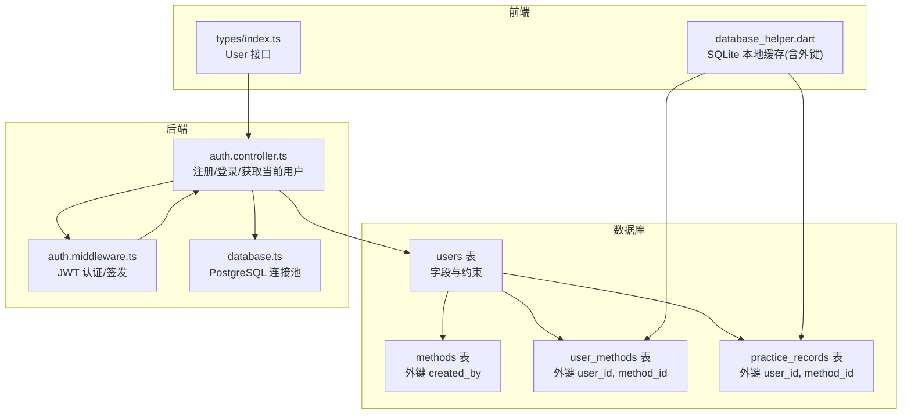
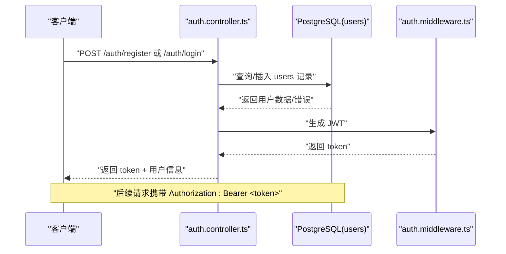
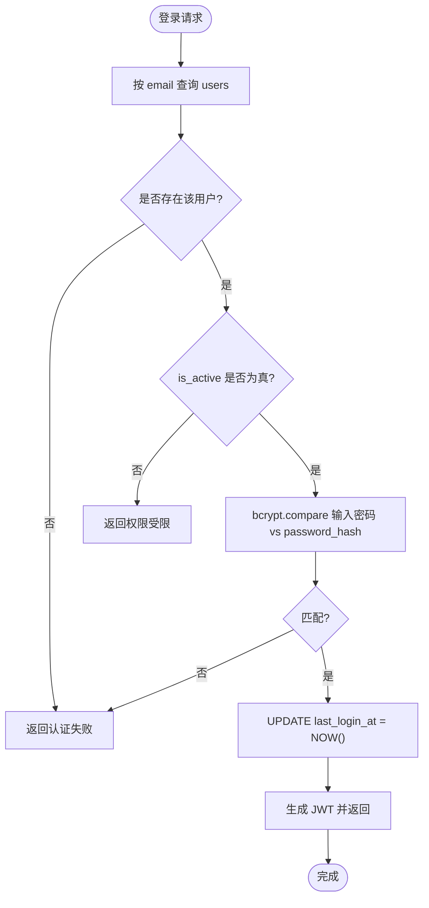
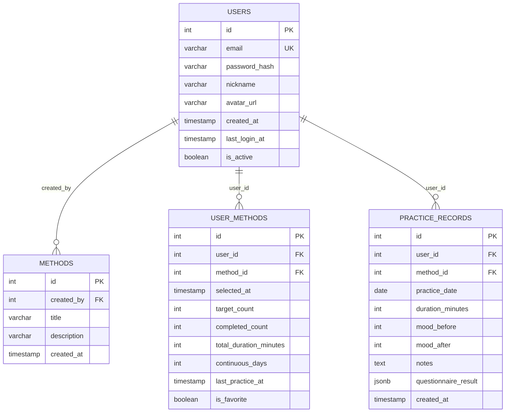
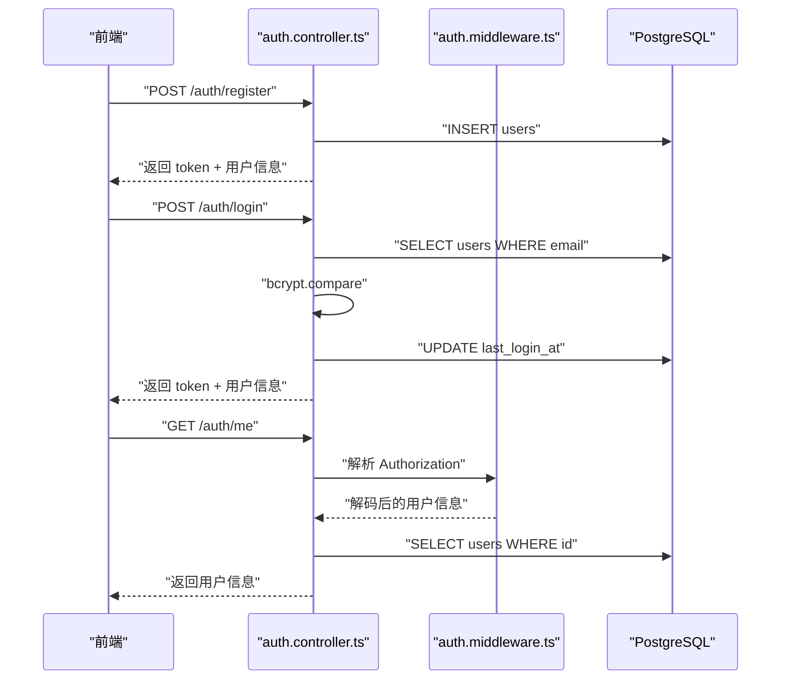
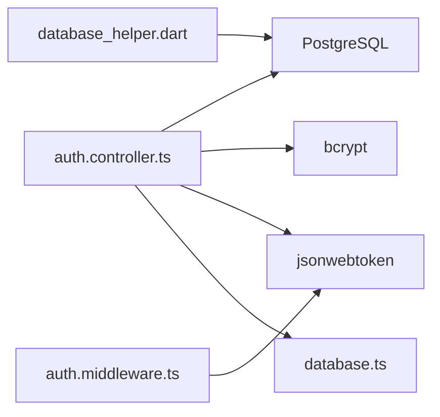

# 用户表 (users)

<cite>
**本文引用的文件**
- [init.sql](file://database/init.sql)
- [index.ts](file://backend/src/types/index.ts)
- [auth.controller.ts](file://backend/src/controllers/auth.controller.ts)
- [auth.middleware.ts](file://backend/src/middleware/auth.ts)
- [database.ts](file://backend/src/config/database.ts)
- [admin.controller.ts](file://backend/src/controllers/admin.controller.ts)
- [database_helper.dart](file://flutter_app/lib/core/storage/database_helper.dart)
</cite>

## 目录
1. [简介](#简介)
2. [项目结构](#项目结构)
3. [核心组件](#核心组件)
4. [架构总览](#架构总览)
5. [详细组件分析](#详细组件分析)
6. [依赖分析](#依赖分析)
7. [性能考虑](#性能考虑)
8. [故障排查指南](#故障排查指南)
9. [结论](#结论)

## 简介
本文件围绕数据库中的 users 表进行系统化技术与业务解读，覆盖字段设计（id、email、password_hash、nickname、avatar_url、created_at、last_login_at、is_active）、约束与索引（主键、唯一性、默认值、可空性）、安全实践（密码哈希存储）、唯一性保障（邮箱唯一）、以及与 methods、practice_records 等表的外键关联关系与在用户认证流程中的作用。内容同时结合后端初始化脚本与前端类型定义，确保技术实现与业务含义一致。

## 项目结构
users 表位于数据库初始化脚本中，其字段与约束由 SQL 脚本直接定义；后端控制器与中间件负责在运行时执行认证逻辑并对 users 表进行读写；前端类型定义与本地缓存层则体现用户实体在应用层的数据模型与持久化策略。

图表来源
- [init.sql](file://database/init.sql#L5-L18)
- [auth.controller.ts](file://backend/src/controllers/auth.controller.ts#L1-L150)
- [auth.middleware.ts](file://backend/src/middleware/auth.ts#L1-L87)
- [database.ts](file://backend/src/config/database.ts#L1-L47)
- [index.ts](file://backend/src/types/index.ts#L1-L20)
- [database_helper.dart](file://flutter_app/lib/core/storage/database_helper.dart#L101-L143)

章节来源
- [init.sql](file://database/init.sql#L5-L18)
- [auth.controller.ts](file://backend/src/controllers/auth.controller.ts#L1-L150)
- [auth.middleware.ts](file://backend/src/middleware/auth.ts#L1-L87)
- [database.ts](file://backend/src/config/database.ts#L1-L47)
- [index.ts](file://backend/src/types/index.ts#L1-L20)
- [database_helper.dart](file://flutter_app/lib/core/storage/database_helper.dart#L101-L143)

## 核心组件
- users 表：承载用户身份与认证相关的核心数据，包含主键、唯一邮箱、默认时间戳、活跃状态等关键字段。
- 后端控制器：提供注册、登录、获取当前用户信息的接口，贯穿密码哈希校验与 JWT 签发。
- 中间件：负责 JWT 解析与校验，为受保护路由提供认证能力。
- 类型定义：后端 TypeScript 的 User 接口与前端 Dart 的用户模型，统一前后端对用户实体的理解。
- 外键关联：users 与 methods（创建者）、users 与 user_methods、users 与 practice_records 的级联删除关系，支撑用户与练习行为的完整生命周期。

章节来源
- [init.sql](file://database/init.sql#L5-L18)
- [auth.controller.ts](file://backend/src/controllers/auth.controller.ts#L1-L150)
- [auth.middleware.ts](file://backend/src/middleware/auth.ts#L1-L87)
- [index.ts](file://backend/src/types/index.ts#L1-L20)
- [database_helper.dart](file://flutter_app/lib/core/storage/database_helper.dart#L101-L143)

## 架构总览
用户认证与数据流转的关键路径如下：

图表来源
- [auth.controller.ts](file://backend/src/controllers/auth.controller.ts#L1-L150)
- [auth.middleware.ts](file://backend/src/middleware/auth.ts#L1-L87)
- [database.ts](file://backend/src/config/database.ts#L1-L47)

## 详细组件分析

### users 表字段与约束详解
- 字段与类型
  - id：整型自增主键，保证每条记录唯一标识。
  - email：字符串，长度上限 255，唯一且非空，作为登录凭证与唯一标识。
  - password_hash：字符串，长度上限 255，非空，存储经哈希处理后的密码。
  - nickname：字符串，长度上限 50，可空，用于展示名称。
  - avatar_url：字符串，长度上限 255，可空，头像资源地址。
  - created_at：时间戳，默认值为当前时间，记录账户创建时间。
  - last_login_at：时间戳，可空，记录最近一次登录时间。
  - is_active：布尔，默认值为真，用于账户启用/禁用控制。

- 约束与索引
  - 主键约束：id 为主键，确保每条记录唯一。
  - 唯一性索引：email 字段具备唯一性约束，配合唯一索引，保障邮箱全局唯一。
  - 默认值设置：created_at 使用默认值函数，简化插入时的时间赋值。
  - 可空性设计：部分字段允许为空（如 nickname、avatar_url、last_login_at），便于扩展与兼容历史数据。

- 业务含义
  - 身份与凭证：email 作为登录入口，password_hash 存储密文，is_active 控制账户可用性。
  - 展示与偏好：nickname、avatar_url 支持个性化展示。
  - 追踪与审计：created_at、last_login_at 用于统计与审计。
  - 性能优化：为 email、created_at 建立索引，提升查询效率。

章节来源
- [init.sql](file://database/init.sql#L5-L18)

### 密码哈希存储与安全实践
- 存储方式：后端在注册时对明文密码进行哈希处理后再写入 users.password_hash。
- 校验流程：登录时根据 email 查询用户，取出 password_hash 并与输入密码进行比对验证。
- 安全要点：
  - 使用强哈希算法（bcrypt）与合理成本因子，降低碰撞与暴力破解风险。
  - 不存储明文密码，仅保留不可逆的哈希值。
  - 登录成功后更新 last_login_at，便于审计与异常检测。

图表来源
- [auth.controller.ts](file://backend/src/controllers/auth.controller.ts#L70-L125)

章节来源
- [auth.controller.ts](file://backend/src/controllers/auth.controller.ts#L1-L150)

### 邮箱唯一性保障机制
- 数据层：users.email 在建表时声明唯一性约束与唯一索引，防止重复注册。
- 应用层：注册前先查询 email 是否已存在，若存在则拒绝重复注册。
- 结果：双重保障确保邮箱唯一，避免多账户共享同一邮箱带来的安全与审计问题。

章节来源
- [init.sql](file://database/init.sql#L5-L18)
- [auth.controller.ts](file://backend/src/controllers/auth.controller.ts#L28-L48)

### 与 methods、practice_records 的外键关联
- users 与 methods
  - 关系：methods.created_by 引用 users.id，表示方法由用户创建。
  - 影响：当 users 记录被删除时，会级联删除其创建的所有方法（取决于数据库策略）。
- users 与 user_methods
  - 关系：user_methods.user_id 引用 users.id，支持用户与方法的关联关系管理。
  - 级联：user_methods.user_id 设置为级联删除，确保用户删除后其关联关系也被清理。
- users 与 practice_records
  - 关系：practice_records.user_id 引用 users.id，记录用户的练习行为。
  - 级联：user_id 设置为级联删除，保证用户删除后其练习记录也被清理。

图表来源
- [init.sql](file://database/init.sql#L19-L79)

章节来源
- [init.sql](file://database/init.sql#L19-L79)

### 前后端类型与数据模型一致性
- 后端 TypeScript
  - User 接口包含 id、email、nickname、avatar_url、created_at、last_login_at、is_active 等字段，与 users 表字段一一对应。
  - UserWithPassword 扩展了 password_hash，仅用于认证流程中的内部处理。
- 前端 Dart
  - Flutter 侧的数据库本地缓存中也存在 users 表结构（与后端 users 对应），并在 user_methods、practice_records 中通过外键引用 users，保证离线场景下的数据一致性。

章节来源
- [index.ts](file://backend/src/types/index.ts#L1-L20)
- [database_helper.dart](file://flutter_app/lib/core/storage/database_helper.dart#L101-L143)

### 认证流程中的角色与职责
- 注册
  - 校验必填项与邮箱格式、密码强度。
  - 检查邮箱唯一性。
  - 哈希密码并插入 users 记录。
  - 生成 JWT 返回给客户端。
- 登录
  - 按 email 查询用户，检查 is_active。
  - 使用 bcrypt 校验密码。
  - 成功后更新 last_login_at 并签发 JWT。
- 获取当前用户
  - 通过中间件解析 JWT，再查询 users 并返回用户信息。

图表来源
- [auth.controller.ts](file://backend/src/controllers/auth.controller.ts#L1-L150)
- [auth.middleware.ts](file://backend/src/middleware/auth.ts#L1-L87)
- [database.ts](file://backend/src/config/database.ts#L1-L47)

章节来源
- [auth.controller.ts](file://backend/src/controllers/auth.controller.ts#L1-L150)
- [auth.middleware.ts](file://backend/src/middleware/auth.ts#L1-L87)
- [database.ts](file://backend/src/config/database.ts#L1-L47)

### 管理员视角下的用户管理
- 管理员可查询用户详情，聚合统计用户选择的方法数量、练习次数、总时长与情绪改善均值。
- 管理员可更新用户 is_active 状态，从而启用/禁用账户。

章节来源
- [admin.controller.ts](file://backend/src/controllers/admin.controller.ts#L1298-L1344)

## 依赖分析
- 数据库层
  - users 表依赖 PostgreSQL 的序列（SERIAL）与默认函数（NOW()）。
  - 通过外键与级联删除策略，维护用户与其相关数据的一致性。
- 后端服务
  - auth.controller.ts 依赖 database.ts 的连接池与 bcrypt、jsonwebtoken。
  - auth.middleware.ts 依赖 JWT 密钥与 express 请求上下文。
- 前端缓存
  - database_helper.dart 在本地 SQLite 中重建 users 表及外键，确保与后端 users 表结构一致，便于离线同步与查询。

图表来源
- [auth.controller.ts](file://backend/src/controllers/auth.controller.ts#L1-L150)
- [auth.middleware.ts](file://backend/src/middleware/auth.ts#L1-L87)
- [database.ts](file://backend/src/config/database.ts#L1-L47)
- [database_helper.dart](file://flutter_app/lib/core/storage/database_helper.dart#L101-L143)

章节来源
- [auth.controller.ts](file://backend/src/controllers/auth.controller.ts#L1-L150)
- [auth.middleware.ts](file://backend/src/middleware/auth.ts#L1-L87)
- [database.ts](file://backend/src/config/database.ts#L1-L47)
- [database_helper.dart](file://flutter_app/lib/core/storage/database_helper.dart#L101-L143)

## 性能考虑
- 索引策略
  - users.email 唯一索引：加速登录与注册时的邮箱查询。
  - users.created_at 普通索引：支持按创建时间排序与分页查询。
- 时间戳默认值
  - created_at 使用 NOW() 默认值，减少插入时的时间计算开销。
- 外键与级联
  - user_methods.user_id 与 practice_records.user_id 的级联删除，避免孤立数据，降低清理成本。
- 建议
  - 在高频查询场景（如按 email 查询）保持现有索引。
  - 对于高并发登录场景，建议结合连接池参数与 JWT 缓存策略优化整体吞吐。

[本节为通用性能建议，无需特定文件来源]

## 故障排查指南
- 常见错误与定位
  - 验证失败：注册时邮箱格式不正确或密码过短，控制器会抛出相应错误。
  - 重复注册：邮箱已被占用，查询 email 已存在导致冲突。
  - 认证失败：邮箱不存在或密码不匹配，或账户未启用。
  - 权限不足：中间件解析 JWT 失败或令牌过期。
- 排查步骤
  - 检查数据库 users 表的 email 唯一性与 is_active 状态。
  - 核对 bcrypt 哈希与 compare 的使用是否一致。
  - 确认 JWT 密钥与过期时间配置正确。
  - 查看连接池与数据库日志，确认连接与查询是否正常。

章节来源
- [auth.controller.ts](file://backend/src/controllers/auth.controller.ts#L1-L150)
- [auth.middleware.ts](file://backend/src/middleware/auth.ts#L1-L87)

## 结论
users 表的设计在技术层面满足了身份认证与用户管理的核心需求：以 email 为唯一标识、以 password_hash 保障安全、以 is_active 实现账户控制、以 created_at/last_login_at 提供审计线索。通过合理的索引与默认值设置，兼顾了性能与易用性。与 methods、user_methods、practice_records 的外键关联，构建了完整的用户行为闭环。后端控制器与中间件、前端类型与本地缓存共同确保了从认证到数据展示的端到端一致性与可靠性。