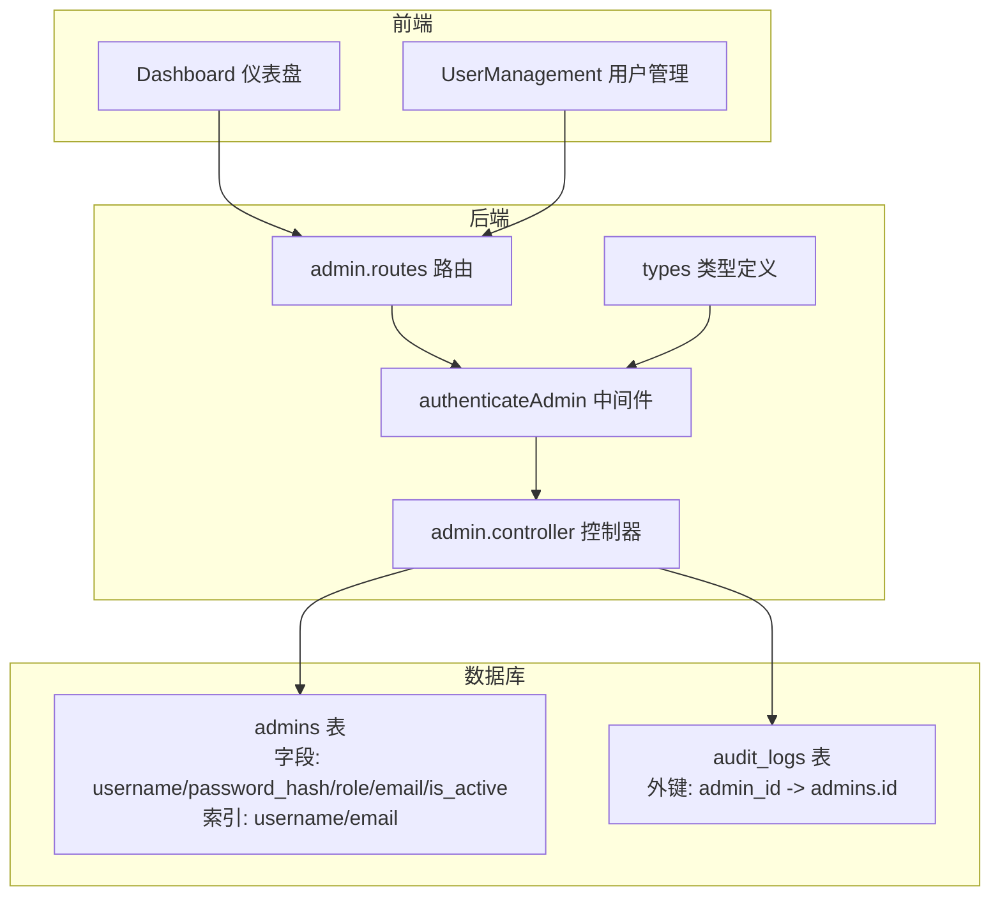
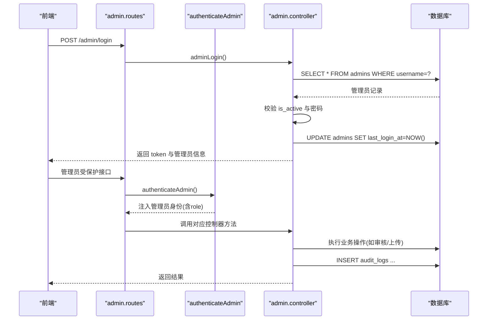
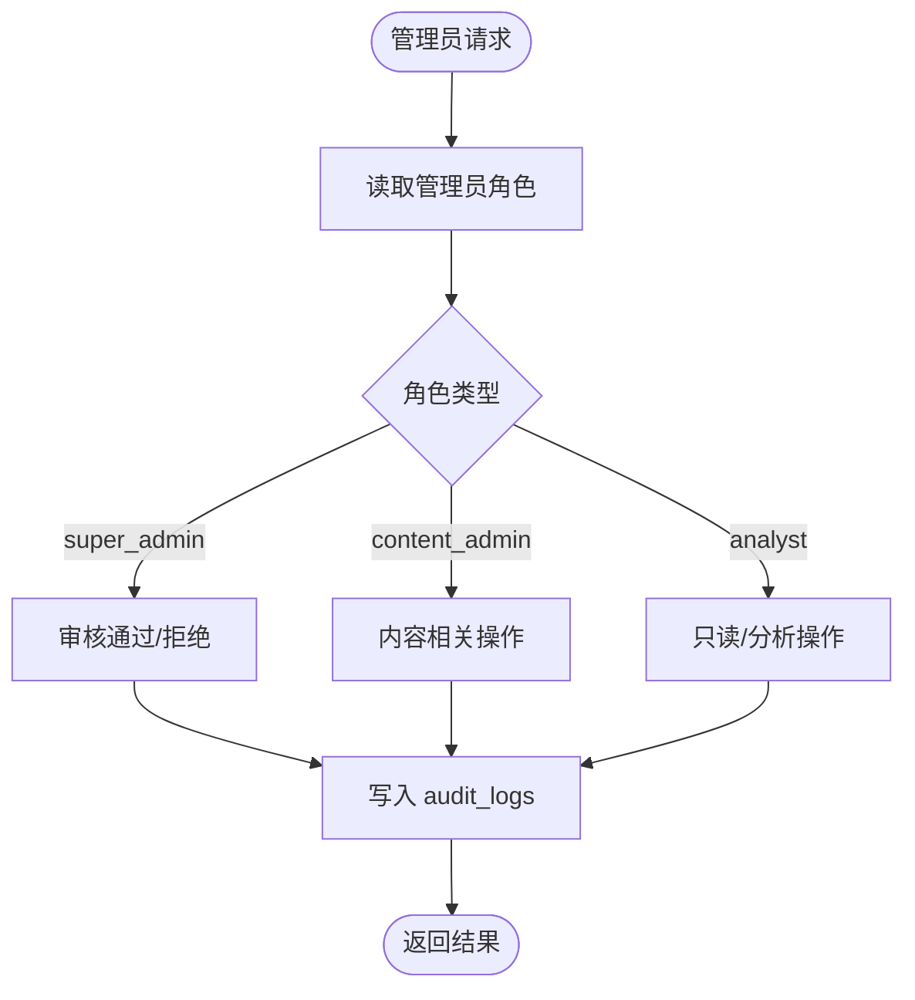
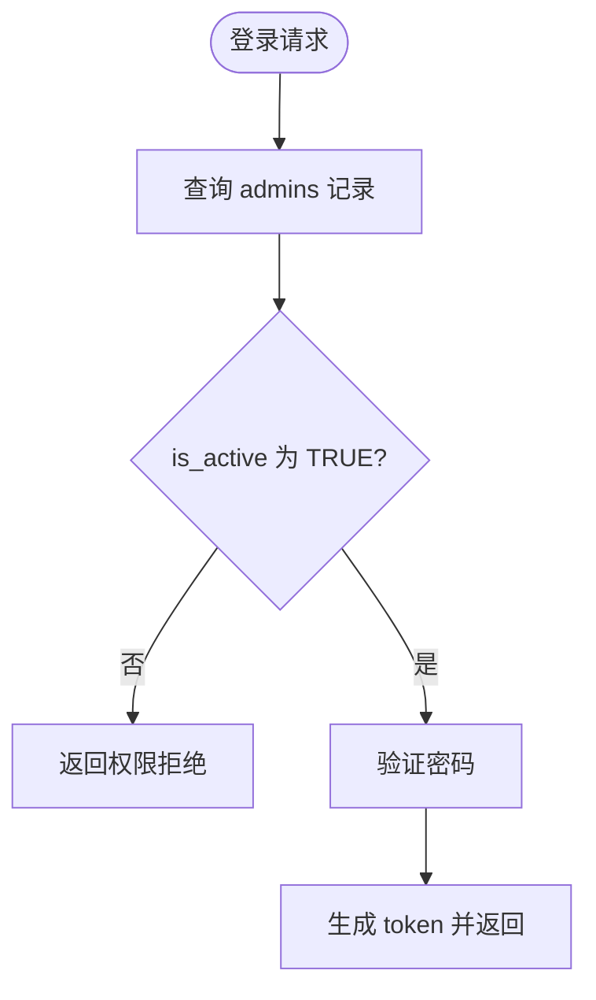
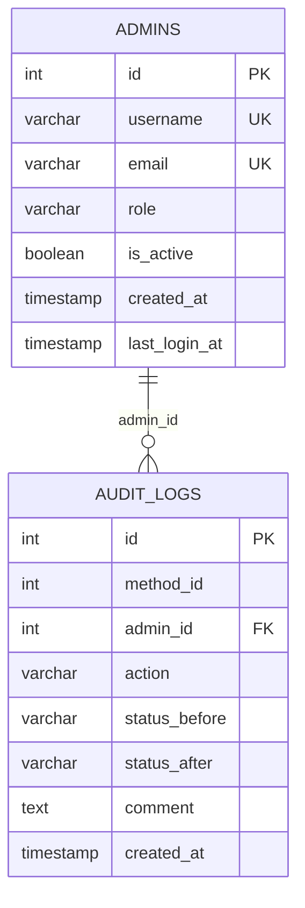
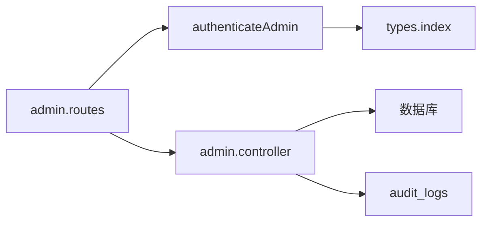

# 管理员表 (admins)

<cite>
**本文引用的文件**
- [init.sql](file://database/init.sql)
- [admin.controller.ts](file://backend/src/controllers/admin.controller.ts)
- [auth.ts](file://backend/src/middleware/auth.ts)
- [admin.routes.ts](file://backend/src/routes/admin.routes.ts)
- [index.ts](file://backend/src/types/index.ts)
- [Dashboard.tsx](file://home/user/nian/admin-web/src/pages/Dashboard.tsx)
- [UserManagement.tsx](file://home/user/nian/admin-web/src/pages/UserManagement.tsx)
</cite>

## 目录
1. [简介](#简介)
2. [项目结构](#项目结构)
3. [核心组件](#核心组件)
4. [架构总览](#架构总览)
5. [详细组件分析](#详细组件分析)
6. [依赖关系分析](#依赖关系分析)
7. [性能考量](#性能考量)
8. [故障排查指南](#故障排查指南)
9. [结论](#结论)

## 简介
本文件围绕后台管理系统中的管理员表（admins）进行深入剖析，重点说明其在权限控制中的作用，逐项解读字段业务规则（username、password_hash、role、email、is_active），解释角色枚举的CHECK约束与多维唯一性校验（UNIQUE索引），并阐述与审计日志表（audit_logs）的外键关联如何构建完整的操作审计链。同时结合后端控制器与中间件的实现，说明is_active标志在账号禁用场景下的应用逻辑。

## 项目结构
管理员表位于数据库初始化脚本中，配合后端控制器、认证中间件与前端页面共同完成权限控制与审计闭环：
- 数据库层：admins 表定义、索引与约束；audit_logs 表定义及外键关联
- 后端层：管理员登录、内容审核、媒体上传等控制器；管理员认证中间件；路由配置
- 前端层：仪表盘与用户管理页面，展示统计数据与用户状态变更入口

图表来源
- [init.sql](file://database/init.sql#L94-L124)
- [admin.routes.ts](file://backend/src/routes/admin.routes.ts#L1-L69)
- [auth.ts](file://backend/src/middleware/auth.ts#L35-L77)
- [admin.controller.ts](file://backend/src/controllers/admin.controller.ts#L1-L66)
- [index.ts](file://backend/src/types/index.ts#L65-L91)
- [Dashboard.tsx](file://home/user/nian/admin-web/src/pages/Dashboard.tsx#L1-L32)
- [UserManagement.tsx](file://home/user/nian/admin-web/src/pages/UserManagement.tsx#L66-L102)

章节来源
- [init.sql](file://database/init.sql#L94-L124)
- [admin.routes.ts](file://backend/src/routes/admin.routes.ts#L1-L69)
- [auth.ts](file://backend/src/middleware/auth.ts#L35-L77)
- [admin.controller.ts](file://backend/src/controllers/admin.controller.ts#L1-L66)
- [index.ts](file://backend/src/types/index.ts#L65-L91)
- [Dashboard.tsx](file://home/user/nian/admin-web/src/pages/Dashboard.tsx#L1-L32)
- [UserManagement.tsx](file://home/user/nian/admin-web/src/pages/UserManagement.tsx#L66-L102)

## 核心组件
- admins 表：存储管理员账户信息，包含用户名、密码哈希、角色、邮箱、启用状态与时间戳
- audit_logs 表：记录管理员对方法的状态变更操作，形成审计链
- 管理员认证中间件：校验JWT令牌并注入管理员身份信息
- 管理员控制器：实现登录、内容审核、媒体上传等管理功能
- 前端页面：仪表盘与用户管理，支持用户状态变更与统计展示

章节来源
- [init.sql](file://database/init.sql#L94-L124)
- [admin.controller.ts](file://backend/src/controllers/admin.controller.ts#L1-L66)
- [auth.ts](file://backend/src/middleware/auth.ts#L35-L77)
- [admin.routes.ts](file://backend/src/routes/admin.routes.ts#L1-L69)
- [index.ts](file://backend/src/types/index.ts#L65-L91)
- [Dashboard.tsx](file://home/user/nian/admin-web/src/pages/Dashboard.tsx#L1-L32)
- [UserManagement.tsx](file://home/user/nian/admin-web/src/pages/UserManagement.tsx#L66-L102)

## 架构总览
管理员权限控制与审计流程的关键路径如下：
- 登录流程：前端提交用户名/密码 → 后端查询 admins 表 → 校验 is_active → 验证密码 → 生成JWT → 返回管理员信息
- 权限控制：路由统一经 authenticateAdmin 中间件 → 解析JWT → 注入管理员身份（含role）→ 控制器按角色执行业务
- 审计链路：管理员操作（提交/审核通过/拒绝） → 写入 audit_logs（method_id、admin_id、action、status变更、评论）

图表来源
- [admin.controller.ts](file://backend/src/controllers/admin.controller.ts#L1-L66)
- [auth.ts](file://backend/src/middleware/auth.ts#L35-L77)
- [admin.routes.ts](file://backend/src/routes/admin.routes.ts#L1-L69)
- [init.sql](file://database/init.sql#L94-L124)

## 详细组件分析

### admins 表字段与业务规则
- username
  - 唯一性：UNIQUE 约束，确保用户名全局唯一
  - 长度限制：VARCHAR(50)，满足常见命名规范
  - 用途：登录凭据之一
- password_hash
  - 存储策略：采用安全散列算法（bcrypt）存储
  - 用途：登录时与输入密码比对验证
- role
  - 枚举约束：CHECK (role IN ('super_admin','content_admin','analyst'))
  - 作用：决定管理员可执行的操作范围（如审核通过仅允许超级管理员）
- email
  - 唯一性：UNIQUE 约束，确保邮箱唯一
  - 用途：登录凭据之一，通知与审计关联
- is_active
  - 标志位：布尔值，默认 TRUE
  - 禁用场景：登录时若为 FALSE，直接拒绝访问
- 时间戳
  - created_at：默认当前时间
  - last_login_at：登录成功后更新

章节来源
- [init.sql](file://database/init.sql#L94-L104)
- [admin.controller.ts](file://backend/src/controllers/admin.controller.ts#L1-L66)
- [index.ts](file://backend/src/types/index.ts#L65-L91)

### 角色枚举与权限控制
- 枚举定义：通过 CHECK 约束限定角色集合，避免非法值进入
- 权限判定：控制器在审核方法时读取管理员角色，仅允许 super_admin 执行 approve/reject
- 前端展示：仪表盘与用户管理页面由管理员访问，体现不同角色职责

图表来源
- [init.sql](file://database/init.sql#L94-L104)
- [admin.controller.ts](file://backend/src/controllers/admin.controller.ts#L298-L387)

章节来源
- [init.sql](file://database/init.sql#L94-L104)
- [admin.controller.ts](file://backend/src/controllers/admin.controller.ts#L298-L387)

### 多维唯一性校验机制
- username 唯一：UNIQUE 索引，防止重复用户名
- email 唯一：UNIQUE 索引，防止重复邮箱
- 索引维护：数据库层通过索引提升查询效率，约束保证数据一致性
- 应用影响：登录凭据（用户名/邮箱）均可用于身份识别，但唯一性由数据库约束保障

章节来源
- [init.sql](file://database/init.sql#L94-L108)

### is_active 标志在账号禁用场景的应用
- 登录拦截：登录时若 is_active 为 FALSE，直接返回权限拒绝
- 审计联动：禁用账号不会影响历史操作审计，仍可在 audit_logs 中追溯
- 前端提示：前端页面展示管理员状态，便于运营人员确认

图表来源
- [admin.controller.ts](file://backend/src/controllers/admin.controller.ts#L1-L66)

章节来源
- [admin.controller.ts](file://backend/src/controllers/admin.controller.ts#L1-L66)

### admins 与 audit_logs 的外键关联与审计链
- 外键关系：audit_logs.admin_id 引用 admins.id（删除时置空）
- 关联字段：action 字段通过 CHECK 约束限定为 'submit'/'approve'/'reject'
- 审计内容：记录方法 ID、管理员 ID、动作、状态变更前后值、评论与创建时间
- 业务价值：完整追踪管理员对方法状态变更的历史，支撑合规与问题回溯

图表来源
- [init.sql](file://database/init.sql#L94-L124)

章节来源
- [init.sql](file://database/init.sql#L94-L124)
- [admin.controller.ts](file://backend/src/controllers/admin.controller.ts#L267-L387)

### 媒体文件上传与管理员关联
- 上传关联：media_files.uploaded_by 引用 admins.id（删除时置空）
- 用途：管理员上传的媒体资源可被审计追踪，便于溯源

章节来源
- [init.sql](file://database/init.sql#L125-L141)
- [admin.controller.ts](file://backend/src/controllers/admin.controller.ts#L472-L513)

## 依赖关系分析
- 路由依赖：admin.routes 将受保护接口统一绑定管理员认证中间件
- 中间件依赖：authenticateAdmin 解析JWT并注入管理员身份（含role），供控制器做权限判断
- 控制器依赖：admin.controller 依赖数据库连接池执行SQL，依赖JWT生成工具返回token
- 类型依赖：types/index.ts 定义了 Admin 接口与 AuthRequest 扩展，确保中间件与控制器的类型一致

图表来源
- [admin.routes.ts](file://backend/src/routes/admin.routes.ts#L1-L69)
- [auth.ts](file://backend/src/middleware/auth.ts#L35-L77)
- [index.ts](file://backend/src/types/index.ts#L65-L91)
- [admin.controller.ts](file://backend/src/controllers/admin.controller.ts#L1-L66)

章节来源
- [admin.routes.ts](file://backend/src/routes/admin.routes.ts#L1-L69)
- [auth.ts](file://backend/src/middleware/auth.ts#L35-L77)
- [index.ts](file://backend/src/types/index.ts#L65-L91)
- [admin.controller.ts](file://backend/src/controllers/admin.controller.ts#L1-L66)

## 性能考量
- 索引优化：admins 表的 username 与 email 均建立索引，登录与查询效率更高
- 审计查询：audit_logs 建有 method_id、admin_id、created_at 索引，便于按管理员或时间范围检索
- JWT开销：管理员认证中间件解析JWT为常量时间复杂度，整体开销较小
- 数据库触发器：其他表存在更新时间自动触发器，admins 表未见类似逻辑，避免额外写放大

章节来源
- [init.sql](file://database/init.sql#L94-L124)

## 故障排查指南
- 登录失败
  - 现象：返回无效凭据或权限拒绝
  - 排查：确认用户名是否存在、is_active 是否为 TRUE、密码是否匹配
- 权限不足
  - 现象：审核通过/拒绝时报权限不足
  - 排查：确认管理员角色是否为 super_admin
- 审计缺失
  - 现象：无法看到某管理员的操作记录
  - 排查：检查 audit_logs 是否正确插入，确认 admin_id 是否有效
- 唯一性冲突
  - 现象：新增管理员时报用户名或邮箱重复
  - 排查：检查 UNIQUE 约束，确认数据唯一性

章节来源
- [admin.controller.ts](file://backend/src/controllers/admin.controller.ts#L1-L66)
- [admin.controller.ts](file://backend/src/controllers/admin.controller.ts#L298-L387)
- [init.sql](file://database/init.sql#L94-L124)

## 结论
admins 表通过唯一性约束与CHECK约束，为后台权限体系提供了坚实的数据基础。is_active 标志在登录阶段即刻生效，确保禁用账号无法访问系统。role 字段的枚举约束与控制器内的权限判断共同实现了最小权限原则。与 audit_logs 的外键关联形成了完整的操作审计链，既满足合规要求，也为问题定位提供依据。前端仪表盘与用户管理页面进一步完善了管理员的日常运维能力。