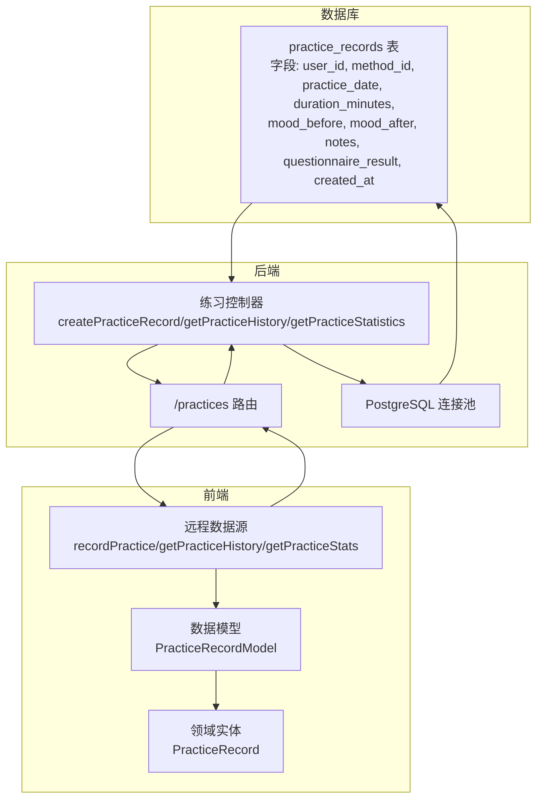
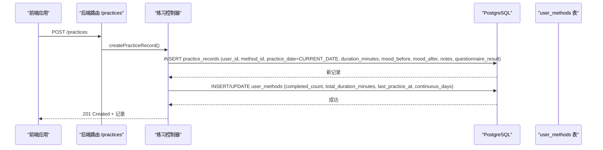
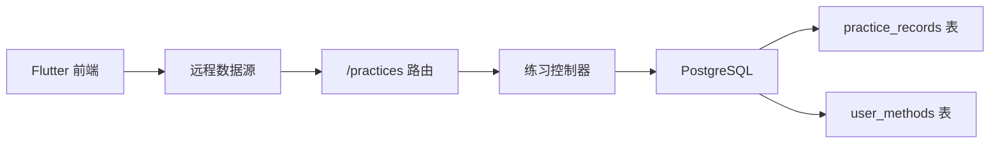

# 练习记录表 (practice_records)

<cite>
**本文引用的文件**
- [init.sql](file://database/init.sql)
- [practice.controller.ts](file://backend/src/controllers/practice.controller.ts)
- [practice.routes.ts](file://backend/src/routes/practice.routes.ts)
- [database.ts](file://backend/src/config/database.ts)
- [index.ts](file://backend/src/types/index.ts)
- [practice_record_model.dart](file://flutter_app/lib/data/models/practice_record_model.dart)
- [practice_record.dart](file://flutter_app/lib/domain/entities/practice_record.dart)
- [practice_remote_data_source.dart](file://flutter_app/lib/data/datasources/remote/practice_remote_data_source.dart)
- [database_helper.dart](file://flutter_app/lib/core/storage/database_helper.dart)
</cite>

## 目录
1. [简介](#简介)
2. [项目结构](#项目结构)
3. [核心组件](#核心组件)
4. [架构总览](#架构总览)
5. [详细组件分析](#详细组件分析)
6. [依赖关系分析](#依赖关系分析)
7. [性能考量](#性能考量)
8. [故障排查指南](#故障排查指南)
9. [结论](#结论)

## 简介
本文件系统性梳理 practice_records 表的字段设计与使用实践，围绕以下目标展开：
- 字段清单与用途：user_id、method_id、practice_date、duration_minutes、mood_before、mood_after、notes、questionnaire_result、created_at
- 设计决策解析：为何使用 DATE 类型而非 TIMESTAMP；CHECK 约束如何保证评分有效性；JSONB 存储问卷结果的扩展性
- 复合索引 idx_practice_records_user_id_date 对按日聚合统计与查询性能的优化
- 前后端数据流与一致性保障

## 项目结构
该表位于数据库初始化脚本中，并由后端控制器提供增删改查能力，前端 Flutter 应用负责提交与展示。

图表来源
- [init.sql](file://database/init.sql#L62-L79)
- [practice.routes.ts](file://backend/src/routes/practice.routes.ts#L1-L20)
- [practice.controller.ts](file://backend/src/controllers/practice.controller.ts#L1-L261)
- [database.ts](file://backend/src/config/database.ts#L1-L47)
- [practice_remote_data_source.dart](file://flutter_app/lib/data/datasources/remote/practice_remote_data_source.dart#L1-L101)
- [practice_record_model.dart](file://flutter_app/lib/data/models/practice_record_model.dart#L1-L93)
- [practice_record.dart](file://flutter_app/lib/domain/entities/practice_record.dart#L1-L67)

章节来源
- [init.sql](file://database/init.sql#L62-L79)
- [practice.controller.ts](file://backend/src/controllers/practice.controller.ts#L1-L261)
- [practice.routes.ts](file://backend/src/routes/practice.routes.ts#L1-L20)
- [database.ts](file://backend/src/config/database.ts#L1-L47)
- [practice_remote_data_source.dart](file://flutter_app/lib/data/datasources/remote/practice_remote_data_source.dart#L1-L101)
- [practice_record_model.dart](file://flutter_app/lib/data/models/practice_record_model.dart#L1-L93)
- [practice_record.dart](file://flutter_app/lib/domain/entities/practice_record.dart#L1-L67)

## 核心组件
- practice_records 表：承载用户练习事实数据，支持按日聚合与多维统计
- 后端控制器：提供记录创建、历史查询、统计分析等接口
- 前端数据源与模型：封装请求参数与返回数据结构，统一字段命名
- 数据库索引：复合索引 idx_practice_records_user_id_date 用于加速按用户+日期的查询

章节来源
- [init.sql](file://database/init.sql#L62-L79)
- [practice.controller.ts](file://backend/src/controllers/practice.controller.ts#L1-L261)
- [practice_record_model.dart](file://flutter_app/lib/data/models/practice_record_model.dart#L1-L93)
- [practice_record.dart](file://flutter_app/lib/domain/entities/practice_record.dart#L1-L67)

## 架构总览
下面的序列图展示了“记录一次练习”的完整流程，从移动端发起请求到数据库写入与关联更新。

图表来源
- [practice.routes.ts](file://backend/src/routes/practice.routes.ts#L1-L20)
- [practice.controller.ts](file://backend/src/controllers/practice.controller.ts#L1-L120)
- [init.sql](file://database/init.sql#L62-L79)

## 详细组件分析

### 字段设计与业务语义
- user_id：外键关联 users 表，标识练习归属用户
- method_id：外键关联 methods 表，标识所练习的心理自助方法
- practice_date：日期类型，表示练习发生的自然日（如 2025-04-05）
- duration_minutes：整数，记录本次练习时长（分钟）
- mood_before/mood_after：整数评分，1-10 分制，用于衡量练习前后心理状态变化
- notes：文本备注，记录练习感受或观察
- questionnaire_result：JSONB，动态存储问卷结果，便于扩展不同问卷结构
- created_at：时间戳，默认当前时间，用于审计与排序

章节来源
- [init.sql](file://database/init.sql#L62-L79)
- [index.ts](file://backend/src/types/index.ts#L51-L63)
- [practice_record_model.dart](file://flutter_app/lib/data/models/practice_record_model.dart#L1-L93)
- [practice_record.dart](file://flutter_app/lib/domain/entities/practice_record.dart#L1-L67)

### 设计决策解析

#### 1) 使用 DATE 而非 TIMESTAMP 的原因
- 业务聚焦“按日”统计：练习记录以自然日为粒度，无需精确到秒或毫秒
- 聚合效率更高：COUNT(DISTINCT practice_date) 可直接统计“练习天数”，避免时间偏移带来的重复计数
- 存储与索引更紧凑：DATE 比 TIMESTAMP 更小，索引体积更小，扫描更快
- 语义清晰：前端传入日期字符串即可，无需处理时区与时间细节

在后端统计接口中，可以看到直接基于 practice_date 进行分组与计数，体现按日聚合的天然优势。

章节来源
- [init.sql](file://database/init.sql#L62-L79)
- [practice.controller.ts](file://backend/src/controllers/practice.controller.ts#L174-L239)

#### 2) CHECK 约束确保评分有效性
- mood_before 和 mood_after 均有 1-10 的 CHECK 约束，数据库层强制评分范围
- 前端与后端也各自进行边界校验，双重保障数据质量
- 在统计时可安全地计算平均值与差值，避免异常值干扰

章节来源
- [init.sql](file://database/init.sql#L62-L79)
- [practice.controller.ts](file://backend/src/controllers/practice.controller.ts#L26-L32)

#### 3) JSONB 存储问卷结果的扩展性
- questionnaire_result 使用 JSONB，可灵活容纳不同方法的动态问卷结构
- 支持未来新增题目类型、选项集合，无需迁移表结构
- 可配合视图或查询函数进行部分路径检索与聚合（需根据具体需求在后端或数据库侧实现）

章节来源
- [init.sql](file://database/init.sql#L62-L79)

### 复合索引 idx_practice_records_user_id_date 的性能优化
- 查询模式匹配：历史查询与统计均以 user_id + practice_date 作为关键过滤条件
- 覆盖查询：复合索引可覆盖 ORDER BY practice_date DESC、LIMIT/OFFSET，减少回表
- 按日聚合：COUNT(DISTINCT practice_date)、GROUP BY practice_date 等操作可高效利用索引
- 顺序扫描优化：按日期倒序排列，有利于前端分页与最新记录优先展示

章节来源
- [init.sql](file://database/init.sql#L76-L79)
- [practice.controller.ts](file://backend/src/controllers/practice.controller.ts#L101-L172)
- [practice.controller.ts](file://backend/src/controllers/practice.controller.ts#L174-L239)

### 前后端数据流与一致性

#### 后端控制器职责
- createPracticeRecord：插入 practice_records，同时更新 user_methods 的累计次数、总时长与连续天数
- getPracticeHistory：支持按 method_id、start_date、end_date 过滤，按日期与创建时间倒序分页
- getPracticeStatistics：按周/月/年周期聚合，计算总次数、总时长、练习天数、平均情绪改善度等

章节来源
- [practice.controller.ts](file://backend/src/controllers/practice.controller.ts#L1-L261)

#### 前端数据源与模型
- 远程数据源封装了 /practices 的请求参数与响应映射
- 数据模型将后端返回的 JSON 映射为领域实体，字段命名与后端保持一致
- 领域实体提供 moodImprovement 计算属性，便于 UI 展示

章节来源
- [practice_remote_data_source.dart](file://flutter_app/lib/data/datasources/remote/practice_remote_data_source.dart#L1-L101)
- [practice_record_model.dart](file://flutter_app/lib/data/models/practice_record_model.dart#L1-L93)
- [practice_record.dart](file://flutter_app/lib/domain/entities/practice_record.dart#L1-L67)

## 依赖关系分析

图表来源
- [practice.routes.ts](file://backend/src/routes/practice.routes.ts#L1-L20)
- [practice.controller.ts](file://backend/src/controllers/practice.controller.ts#L1-L261)
- [init.sql](file://database/init.sql#L62-L79)

章节来源
- [practice.routes.ts](file://backend/src/routes/practice.routes.ts#L1-L20)
- [practice.controller.ts](file://backend/src/controllers/practice.controller.ts#L1-L261)
- [init.sql](file://database/init.sql#L62-L79)

## 性能考量
- 索引选择
  - idx_practice_records_user_id_date：覆盖按用户+日期过滤与排序，适合历史查询与按日统计
  - idx_practice_records_user_id_method_id：适合按方法维度的统计与筛选
  - idx_practice_records_created_at：适合按创建时间倒序的快速浏览
- 聚合策略
  - COUNT(DISTINCT practice_date)：直接统计“练习天数”，避免重复计数
  - GROUP BY practice_date：按日聚合情绪趋势与时长分布
- 写入路径
  - 事务内同时写入 practice_records 与 user_methods，保证一致性
  - 连续天数逻辑通过昨日是否存在记录判断，避免竞态

章节来源
- [init.sql](file://database/init.sql#L62-L79)
- [practice.controller.ts](file://backend/src/controllers/practice.controller.ts#L1-L120)
- [practice.controller.ts](file://backend/src/controllers/practice.controller.ts#L174-L239)

## 故障排查指南
- 评分越界
  - 现象：插入失败或校验错误
  - 排查：确认 mood_before/mood_after 是否在 1-10 区间；检查前端输入与后端校验
  - 参考
    - [init.sql](file://database/init.sql#L62-L79)
    - [practice.controller.ts](file://backend/src/controllers/practice.controller.ts#L26-L32)
- 日期格式问题
  - 现象：历史查询无结果或统计异常
  - 排查：确认前端传入的 start_date/end_date 为合法日期字符串；后端按 practice_date 过滤
  - 参考
    - [practice.controller.ts](file://backend/src/controllers/practice.controller.ts#L123-L139)
- 连续天数异常
  - 现象：连续天数未正确累加或重置
  - 排查：确认昨日是否存在记录；检查事务是否成功提交
  - 参考
    - [practice.controller.ts](file://backend/src/controllers/practice.controller.ts#L60-L84)
- 统计偏差
  - 现象：练习天数或平均情绪改善度与预期不符
  - 排查：确认是否正确使用 COUNT(DISTINCT practice_date) 与 AVG(mood_after - mood_before)
  - 参考
    - [practice.controller.ts](file://backend/src/controllers/practice.controller.ts#L197-L239)
    - [init.sql](file://database/init.sql#L316-L346)

## 结论
practice_records 表通过 DATE 类型聚焦“按日”统计，配合复合索引与 CHECK 约束，实现了高可用、易扩展的数据模型。后端控制器在写入时同步维护 user_methods，保证了统计口径的一致性；前端通过统一的数据源与模型，确保交互体验与数据准确性。JSONB 的引入为问卷结果的演进提供了弹性空间，满足未来功能扩展的需求。