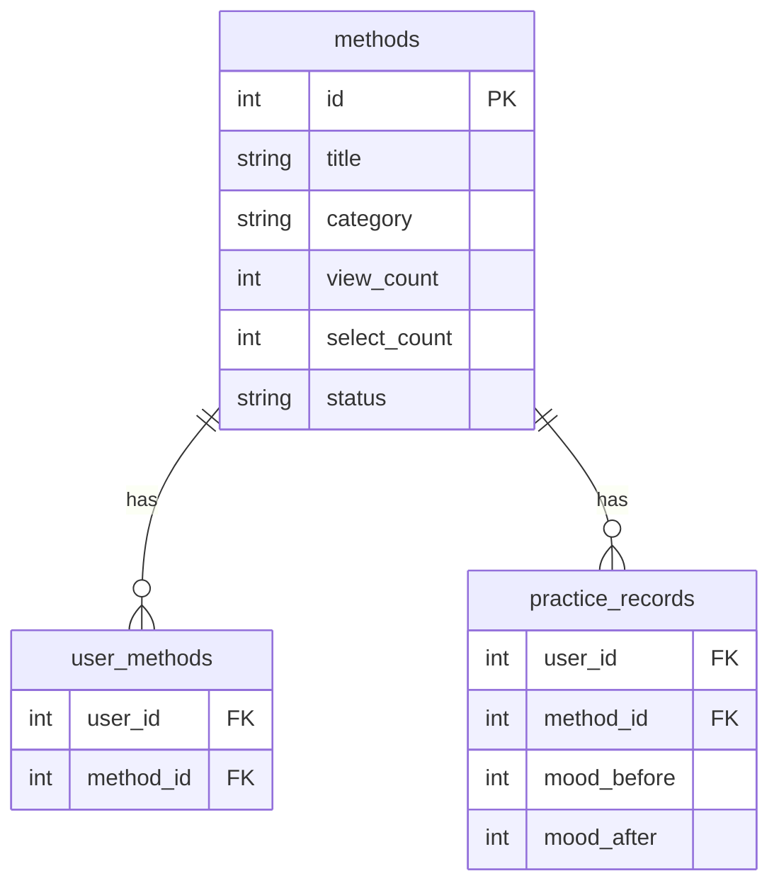
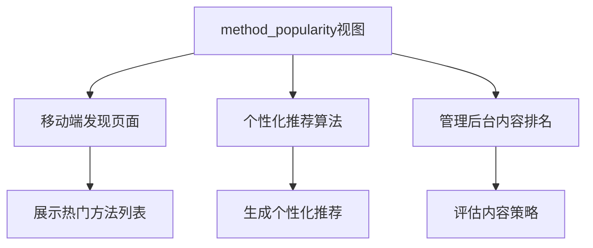

# 方法热度统计视图

<cite>
**本文档引用的文件**   
- [init.sql](file://database/init.sql#L329-L345)
- [method.controller.ts](file://backend/src/controllers/method.controller.ts#L7-L73)
- [method.routes.ts](file://backend/src/routes/method.controller.ts#L8)
- [admin.controller.ts](file://backend/src/controllers/admin.controller.ts#L437-L467)
- [admin.routes.ts](file://backend/src/routes/admin.routes.ts#L49)
- [method_discover_page.dart](file://flutter_app/lib/presentation/methods/pages/method_discover_page.dart#L1-L449)
- [MethodList.tsx](file://home/user/nian/admin-web/src/pages/MethodList.tsx#L1-L339)
- [Dashboard.tsx](file://home/user/nian/admin-web/src/pages/Dashboard.tsx#L1-L78)
</cite>

## 目录
1. [实现机制](#实现机制)
2. [应用场景](#应用场景)
3. [查询示例](#查询示例)
4. [关键价值](#关键价值)

## 实现机制

方法热度统计视图 `method_popularity` 是一个数据库视图，通过复杂的SQL查询实现了对心理自助方法的多维度热度分析。该视图的核心实现机制是通过 `LEFT JOIN` 连接 `methods`、`user_methods` 和 `practice_records` 三张表，从而聚合出全面的统计指标。

视图首先从 `methods` 表中选择方法的基本信息（ID、标题、分类、浏览次数和选择次数），然后通过 `LEFT JOIN` 连接 `user_methods` 表来统计每个方法的唯一用户数（`unique_users`），即有多少不同的用户将该方法添加到了他们的个人方法库中。接着，通过连接 `practice_records` 表来计算总练习次数（`total_practices`）和平均有效性（`avg_effectiveness`），其中平均有效性是通过计算练习前后情绪评分的差值（`mood_after - mood_before`）的平均值得出的。

为了确保统计数据的准确性和相关性，视图在 `WHERE` 子句中添加了 `m.status = 'published'` 条件，仅包含已发布状态的方法。这避免了草稿或待审核方法对热度排名的干扰。最后，结果按 `select_count`（选择次数）降序排列，使得最受欢迎的方法排在最前面。



**图表来源**
- [init.sql](file://database/init.sql#L19-L78)

**本节来源**
- [init.sql](file://database/init.sql#L329-L345)

## 应用场景

`method_popularity` 视图为系统的多个核心功能模块提供了关键的数据支持，是数据驱动决策的重要基础。

在移动端的“发现”页面，该视图为用户提供了最热门的心理自助方法列表。通过调用后端的 `/methods` 接口（由 `getMethods` 控制器处理），应用能够获取按热度排序的方法数据，并在 `MethodDiscoverPage` 中展示给用户。这帮助新用户快速找到社区中最受欢迎和最有效的练习方法，降低了选择困难。

在个性化推荐算法中，`method_popularity` 视图的数据被用作一个重要的特征。`getRecommendedMethods` 控制器结合了用户的个人偏好（如已选择的方法类别）和全局的热度数据（`select_count`），为用户生成个性化的推荐列表。例如，一个推荐算法可能会优先推荐那些在用户感兴趣类别中选择次数较多的方法。

在管理后台的内容热度排名中，该视图直接支撑了数据仪表盘和内容分析功能。管理员可以通过 `/admin/statistics/methods` 接口获取热度最高的方法列表，用于评估内容策略的有效性。`MethodList` 和 `Dashboard` 页面利用这些数据，让管理员能够直观地看到哪些方法最受欢迎，从而指导内容创作和推广决策。



**图表来源**
- [method.controller.ts](file://backend/src/controllers/method.controller.ts#L7-L73)
- [admin.controller.ts](file://backend/src/controllers/admin.controller.ts#L437-L467)
- [method_discover_page.dart](file://flutter_app/lib/presentation/methods/pages/method_discover_page.dart#L1-L449)
- [Dashboard.tsx](file://home/user/nian/admin-web/src/pages/Dashboard.tsx#L1-L78)

**本节来源**
- [method.controller.ts](file://backend/src/controllers/method.controller.ts#L7-L73)
- [admin.controller.ts](file://backend/src/controllers/admin.controller.ts#L437-L467)
- [method_discover_page.dart](file://flutter_app/lib/presentation/methods/pages/method_discover_page.dart#L1-L449)
- [MethodList.tsx](file://home/user/nian/admin-web/src/pages/MethodList.tsx#L1-L339)
- [Dashboard.tsx](file://home/user/nian/admin-web/src/pages/Dashboard.tsx#L1-L78)

## 查询示例

以下是一个获取最热门方法列表的SQL查询示例。此查询直接利用 `method_popularity` 视图，返回选择次数最多的前10个方法，包括其ID、标题、分类、唯一用户数、总练习次数和平均有效性。

```sql
SELECT 
    id,
    title,
    category,
    unique_users,
    total_practices,
    avg_effectiveness
FROM method_popularity
ORDER BY select_count DESC
LIMIT 10;
```

这个查询的结果可以被后端API直接使用，例如在 `getRecommendedMethods` 或 `getMethodStatistics` 控制器中，经过格式化后返回给前端应用。

**本节来源**
- [init.sql](file://database/init.sql#L329-L345)

## 关键价值

`method_popularity` 视图在系统架构中扮演着至关重要的角色，其关键价值体现在多个方面。

首先，它极大地优化了复杂聚合查询的性能。如果没有这个视图，每次需要获取热度数据时，应用层都必须执行一次包含多个 `JOIN` 和 `GROUP BY` 的复杂SQL查询，这会对数据库造成巨大压力。通过将这个复杂的查询逻辑封装在数据库视图中，查询可以被优化和缓存，从而显著提高了响应速度。

其次，它有效减少了应用层的数据处理负担。后端控制器（如 `getMethods` 和 `getMethodStatistics`）可以直接查询视图，获取已经聚合好的数据，而无需在应用代码中编写复杂的聚合逻辑。这不仅简化了业务逻辑，也降低了出错的可能性。

最后，它为数据驱动的决策提供了坚实的基础。无论是为用户推荐内容，还是为管理员提供运营洞察，`method_popularity` 视图都提供了一个统一、准确且实时的热度数据源。这种基于数据的洞察力使得产品团队能够更好地理解用户行为，优化产品功能，并制定更有效的运营策略。

**本节来源**
- [init.sql](file://database/init.sql#L329-L345)
- [method.controller.ts](file://backend/src/controllers/method.controller.ts#L7-L73)
- [admin.controller.ts](file://backend/src/controllers/admin.controller.ts#L437-L467)