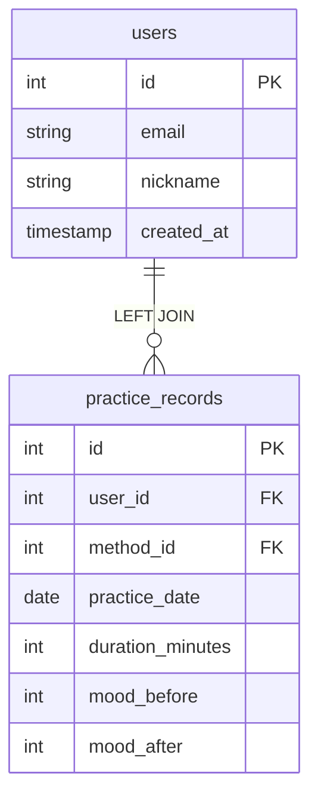
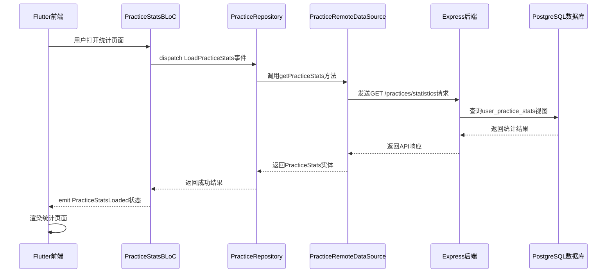

# 用户练习统计视图

<cite>
**本文档引用文件**  
- [init.sql](file://database/init.sql#L316-L327)
- [practice.controller.ts](file://backend/src/controllers/practice.controller.ts#L174-L260)
- [practice.routes.ts](file://backend/src/routes/practice.routes.ts#L16-L17)
- [practice_stats_page.dart](file://flutter_app/lib/presentation/practice/pages/practice_stats_page.dart#L1-L329)
- [practice_stats_bloc.dart](file://flutter_app/lib/presentation/practice/bloc/practice_stats_bloc.dart#L1-L56)
- [practice_remote_data_source.dart](file://flutter_app/lib/data/datasources/remote/practice_remote_data_source.dart#L60-L84)
- [practice_repository_impl.dart](file://flutter_app/lib/data/repositories/practice_repository_impl.dart#L63-L82)
- [practice_stats.dart](file://flutter_app/lib/domain/entities/practice_stats.dart#L1-L47)
- [index.ts](file://backend/src/types/index.ts#L104-L110)
</cite>

## 目录
1. [简介](#简介)
2. [视图定义与SQL结构](#视图定义与sql结构)
3. [业务逻辑与聚合计算](#业务逻辑与聚合计算)
4. [核心应用场景](#核心应用场景)
5. [实际查询示例](#实际查询示例)
6. [性能与架构优势](#性能与架构优势)
7. [依赖关系与数据实时性](#依赖关系与数据实时性)
8. [前后端集成实现](#前后端集成实现)

## 简介
`user_practice_stats` 视图是心理自助应用系统中的核心统计组件，用于提供用户练习行为的综合分析。该视图通过聚合用户的练习记录，为个人统计页面、成就系统和用户行为分析提供统一的数据支持。视图设计遵循数据一致性原则，确保统计结果的准确性和实时性。

## 视图定义与SQL结构
`user_practice_stats` 视图通过 `LEFT JOIN` 操作关联 `users` 和 `practice_records` 表，确保即使没有练习记录的用户也能在统计结果中体现。视图使用 `CREATE OR REPLACE VIEW` 语法定义，保证了结构的可维护性。



**图表来源**  
- [init.sql](file://database/init.sql#L316-L327)

**本节来源**  
- [init.sql](file://database/init.sql#L316-L327)

## 业务逻辑与聚合计算
该视图实现了四个核心统计指标的计算：

1. **总练习次数 (total_practices)**：使用 `COUNT(DISTINCT pr.id)` 统计每个用户的练习记录总数。
2. **总时长 (total_duration)**：通过 `COALESCE(SUM(pr.duration_minutes), 0)` 计算累计练习时长，处理空值情况。
3. **练习天数 (practice_days)**：利用 `COUNT(DISTINCT pr.practice_date)` 统计用户在不同日期的练习天数。
4. **平均情绪改善值 (avg_mood_improvement)**：计算 `COALESCE(AVG(pr.mood_after - pr.mood_before), 0)`，反映练习对用户情绪的改善效果。

这些聚合函数在 `GROUP BY u.id, u.email` 的基础上进行计算，确保统计结果按用户维度正确分组。

**本节来源**  
- [init.sql](file://database/init.sql#L316-L327)

## 核心应用场景
`user_practice_stats` 视图在系统中扮演着关键角色，主要应用于以下三个场景：

1. **个人统计页面**：为用户提供练习行为的可视化展示，包括总练习次数、总时长、练习天数和情绪改善趋势。
2. **成就系统**：作为成就解锁的判断依据，例如"连续练习7天"或"累计练习100次"等成就。
3. **用户行为分析**：为运营团队提供用户活跃度分析数据，支持产品优化和用户留存策略制定。

视图的标准化输出简化了前端开发，确保不同模块使用一致的统计逻辑。

**本节来源**  
- [practice_stats_page.dart](file://flutter_app/lib/presentation/practice/pages/practice_stats_page.dart#L1-L329)
- [practice_stats_bloc.dart](file://flutter_app/lib/presentation/practice/bloc/practice_stats_bloc.dart#L1-L56)

## 实际查询示例
以下示例展示了如何获取特定用户的统计信息：

```sql
SELECT * FROM user_practice_stats WHERE user_id = 123;
```

此查询将返回用户ID为123的所有统计指标。前端应用通过调用 `/practices/statistics` API 端点获取这些数据，后端控制器会根据认证用户的ID自动过滤结果。

**本节来源**  
- [practice.controller.ts](file://backend/src/controllers/practice.controller.ts#L174-L260)
- [practice.routes.ts](file://backend/src/routes/practice.routes.ts#L16-L17)

## 性能与架构优势
`user_practice_stats` 视图为系统带来了显著的性能和架构优势：

1. **简化后端统计查询**：将复杂的聚合逻辑封装在数据库层，后端代码只需执行简单的 `SELECT` 操作。
2. **提升API响应性能**：预计算的统计结果减少了实时计算的开销，确保API响应快速稳定。
3. **保障数据一致性**：集中化的统计逻辑避免了不同模块实现差异导致的数据不一致问题。
4. **降低前端复杂度**：前端应用无需理解复杂的统计逻辑，只需消费标准化的API响应。

这些优势共同提升了系统的可维护性和用户体验。

**本节来源**  
- [practice.controller.ts](file://backend/src/controllers/practice.controller.ts#L174-L260)
- [index.ts](file://backend/src/types/index.ts#L104-L110)

## 依赖关系与数据实时性
`user_practice_stats` 视图与 `practice_records` 表存在直接依赖关系。每当有新的练习记录插入或现有记录更新时，视图的统计结果会实时反映这些变化。

这种实时性得益于视图的动态查询特性——每次访问视图时都会重新执行底层查询，确保返回最新的统计结果。与物化视图不同，这种设计避免了数据同步延迟，但可能在高并发场景下对数据库性能产生影响。

**本节来源**  
- [init.sql](file://database/init.sql#L316-L327)
- [practice.controller.ts](file://backend/src/controllers/practice.controller.ts#L7-L98)

## 前后端集成实现
系统通过分层架构实现了 `user_practice_stats` 视图的完整集成：



**图表来源**  
- [practice_stats_page.dart](file://flutter_app/lib/presentation/practice/pages/practice_stats_page.dart#L1-L329)
- [practice.controller.ts](file://backend/src/controllers/practice.controller.ts#L174-L260)

**本节来源**  
- [practice_stats_page.dart](file://flutter_app/lib/presentation/practice/pages/practice_stats_page.dart#L1-L329)
- [practice_stats_bloc.dart](file://flutter_app/lib/presentation/practice/bloc/practice_stats_bloc.dart#L1-L56)
- [practice_repository_impl.dart](file://flutter_app/lib/data/repositories/practice_repository_impl.dart#L63-L82)
- [practice_remote_data_source.dart](file://flutter_app/lib/data/datasources/remote/practice_remote_data_source.dart#L60-L84)
- [practice.controller.ts](file://backend/src/controllers/practice.controller.ts#L174-L260)