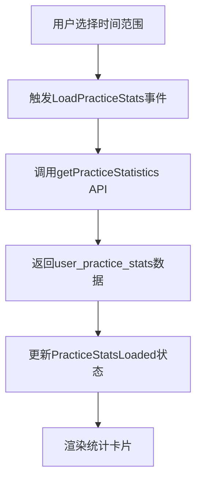
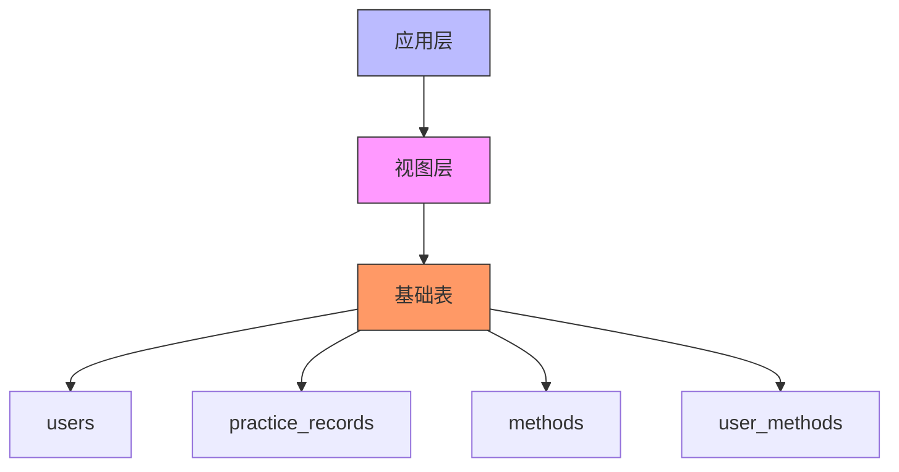
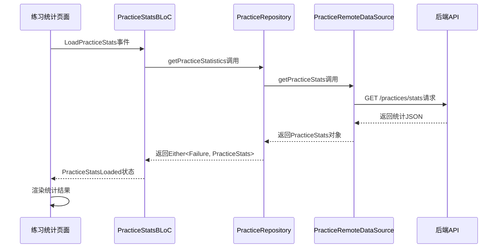

# 视图与统计

<cite>
**本文档引用的文件**   
- [init.sql](file://database/init.sql#L316-L345)
- [practice.controller.ts](file://backend/src/controllers/practice.controller.ts#L174-L261)
- [method.controller.ts](file://backend/src/controllers/method.controller.ts#L100-L136)
- [practice_stats_page.dart](file://flutter_app/lib/presentation/practice/pages/practice_stats_page.dart#L1-L329)
- [practice_stats_bloc.dart](file://flutter_app/lib/presentation/practice/bloc/practice_stats_bloc.dart#L1-L56)
- [practice_repository_impl.dart](file://flutter_app/lib/data/repositories/practice_repository_impl.dart#L64-L82)
- [practice_remote_data_source.dart](file://flutter_app/lib/data/datasources/remote/practice_remote_data_source.dart#L60-L84)
</cite>

## 目录
1. [引言](#引言)
2. [用户练习统计视图](#用户练习统计视图)
3. [方法热度统计视图](#方法热度统计视图)
4. [视图的业务价值](#视图的业务价值)
5. [视图的技术优势](#视图的技术优势)
6. [前端数据流分析](#前端数据流分析)
7. [结论](#结论)

## 引言
nian项目是一个全平台心理自助应用系统，其核心功能包括心理自助方法的提供、用户练习记录和统计分析。本项目通过数据库视图`user_practice_stats`和`method_popularity`来简化复杂查询、提高代码复用性和保障数据安全。这两个视图分别服务于个人统计功能和内容推荐算法，是系统数据分析层的关键组件。本文档将详细分析这两个视图的SQL查询逻辑、业务价值和技术优势。

## 用户练习统计视图

`user_practice_stats`视图为用户提供个性化的练习统计功能，通过聚合用户的练习数据来支持个人成长追踪。该视图使用LEFT JOIN操作连接users表和practice_records表，实现了对用户练习行为的全面统计。

```mermaid
erDiagram
USER {
id PK
email
}
PRACTICE_RECORDS {
id PK
user_id FK
duration_minutes
practice_date
mood_before
mood_after
}
USER ||--o{ PRACTICE_RECORDS : "LEFT JOIN"
```

**图示来源**
- [init.sql](file://database/init.sql#L317-L327)

该视图的核心查询逻辑如下：
- `total_practices`: 使用COUNT(DISTINCT pr.id)计算用户的总练习次数
- `total_duration`: 使用COALESCE(SUM(pr.duration_minutes), 0)计算总练习时长，COALESCE函数确保当用户没有练习记录时返回0而非NULL
- `practice_days`: 使用COUNT(DISTINCT pr.practice_date)计算练习天数，避免同一天多次练习被重复计算
- `avg_mood_improvement`: 使用COALESCE(AVG(pr.mood_after - pr.mood_before), 0)计算情绪改善平均值，反映练习对用户心理状态的影响

视图通过GROUP BY u.id, u.email确保每个用户只返回一行统计结果，为前端提供简洁高效的统计接口。

**本节来源**
- [init.sql](file://database/init.sql#L316-L327)

## 方法热度统计视图

`method_popularity`视图用于计算心理自助方法的热度指标，支持内容推荐算法的实现。该视图通过LEFT JOIN连接methods表、user_methods表和practice_records表，构建了多维度的方法评估体系。

```mermaid
erDiagram
METHODS {
id PK
title
category
view_count
select_count
}
USER_METHODS {
id PK
user_id FK
method_id FK
}
PRACTICE_RECORDS {
id PK
method_id FK
mood_before
mood_after
}
METHODS ||--o{ USER_METHODS : "LEFT JOIN"
METHODS ||--o{ PRACTICE_RECORDS : "LEFT JOIN"
```

**图示来源**
- [init.sql](file://database/init.sql#L330-L344)

该视图的查询逻辑包含三个关键指标：
- `unique_users`: 使用COUNT(DISTINCT um.user_id)计算选择该方法的唯一用户数，反映方法的普及程度
- `total_practices`: 使用COUNT(DISTINCT pr.id)计算总练习次数，衡量方法的实际使用频率
- `avg_effectiveness`: 使用COALESCE(AVG(pr.mood_after - pr.mood_before), 0)计算平均有效性，量化方法对用户情绪改善的实际效果

视图通过WHERE m.status = 'published'条件确保只统计已发布的方法，并按select_count降序排列，为热门方法推荐提供数据支持。

**本节来源**
- [init.sql](file://database/init.sql#L329-L344)

## 视图的业务价值

`user_practice_stats`视图直接支持前端的个人统计功能，为用户提供清晰的练习成果反馈。在`practice_stats_page.dart`中，该视图的数据被用于展示关键指标卡片，包括总练习次数、总练习时长和平均心情改善度。用户可以通过时间范围选择器查看不同周期的统计结果，增强数据的可探索性。



**图示来源**
- [practice_stats_page.dart](file://flutter_app/lib/presentation/practice/pages/practice_stats_page.dart#L106-L148)
- [practice_stats_bloc.dart](file://flutter_app/lib/presentation/practice/bloc/practice_stats_bloc.dart#L17-L33)

`method_popularity`视图则支撑内容推荐算法，通过量化方法的热度和有效性来优化推荐结果。在`getRecommendedMethods`控制器中，该视图的数据被用于实现基于协同过滤的推荐逻辑：优先推荐选择次数多且被相似用户群体青睐的方法。这种基于数据驱动的推荐策略提高了内容的相关性和用户满意度。

**本节来源**
- [practice_stats_page.dart](file://flutter_app/lib/presentation/practice/pages/practice_stats_page.dart#L152-L240)
- [method.controller.ts](file://backend/src/controllers/method.controller.ts#L109-L128)

## 视图的技术优势

数据库视图在nian项目中发挥了重要作用，主要体现在三个方面：

首先，视图简化了复杂查询。`user_practice_stats`和`method_popularity`将多表JOIN和聚合操作封装在数据库层，使应用代码更加简洁。例如，`getPracticeStatistics`控制器无需编写复杂的SQL语句，而是直接查询视图或使用类似逻辑的查询，降低了代码复杂度。

其次，视图提高了代码复用性。两个视图作为标准化的数据接口，被多个业务模块复用。`user_practice_stats`不仅服务于用户个人统计，还可用于管理员的数据分析功能；`method_popularity`既支持推荐算法，也可用于方法排行榜的展示。

最后，视图增强了数据安全性。通过视图暴露必要的数据字段，隐藏了底层表的敏感信息和实现细节。例如，`user_practice_stats`视图只暴露统计结果，而不暴露原始练习记录的详细信息，实现了数据访问的最小权限原则。



**图示来源**
- [init.sql](file://database/init.sql#L316-L345)

**本节来源**
- [init.sql](file://database/init.sql#L316-L345)
- [practice.controller.ts](file://backend/src/controllers/practice.controller.ts#L197-L206)

## 前端数据流分析

nian项目的前端采用BLoC模式管理状态，形成了清晰的数据流。以练习统计功能为例，数据流从UI层开始，经过BLoC层、Repository层到Remote DataSource层，最终通过HTTP请求获取后端数据。



**图示来源**
- [practice_stats_page.dart](file://flutter_app/lib/presentation/practice/pages/practice_stats_page.dart#L26-L27)
- [practice_stats_bloc.dart](file://flutter_app/lib/presentation/practice/bloc/practice_stats_bloc.dart#L23-L32)
- [practice_repository_impl.dart](file://flutter_app/lib/data/repositories/practice_repository_impl.dart#L64-L82)
- [practice_remote_data_source.dart](file://flutter_app/lib/data/datasources/remote/practice_remote_data_source.dart#L60-L84)

这种分层架构确保了数据流的单向性和可预测性，便于调试和测试。同时，Repository层的抽象使数据源的替换成为可能，提高了代码的可维护性。

**本节来源**
- [practice_stats_bloc.dart](file://flutter_app/lib/presentation/practice/bloc/practice_stats_bloc.dart#L17-L33)
- [practice_repository_impl.dart](file://flutter_app/lib/data/repositories/practice_repository_impl.dart#L64-L82)
- [practice_remote_data_source.dart](file://flutter_app/lib/data/datasources/remote/practice_remote_data_source.dart#L60-L84)

## 结论
`user_practice_stats`和`method_popularity`两个数据库视图在nian项目中扮演着关键角色，不仅简化了复杂查询、提高了代码复用性，还增强了数据安全性。通过LEFT JOIN和聚合函数的巧妙运用，这两个视图为个人统计功能和内容推荐算法提供了坚实的数据支持。前端采用BLoC模式构建了清晰的数据流，实现了UI与业务逻辑的分离。这种后端视图与前端状态管理相结合的架构，为心理自助应用的可扩展性和可维护性奠定了良好基础。