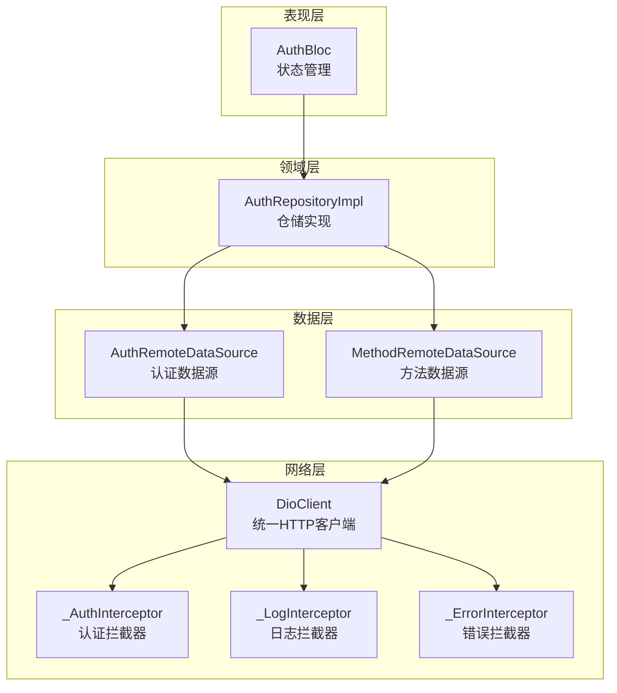
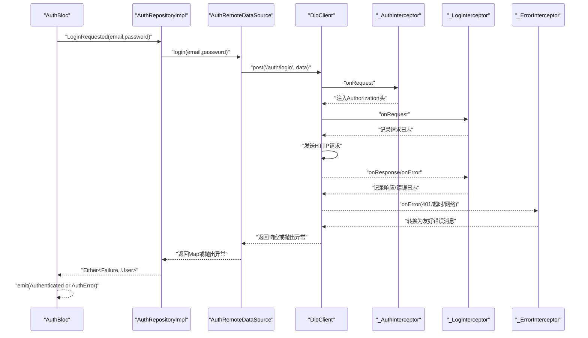
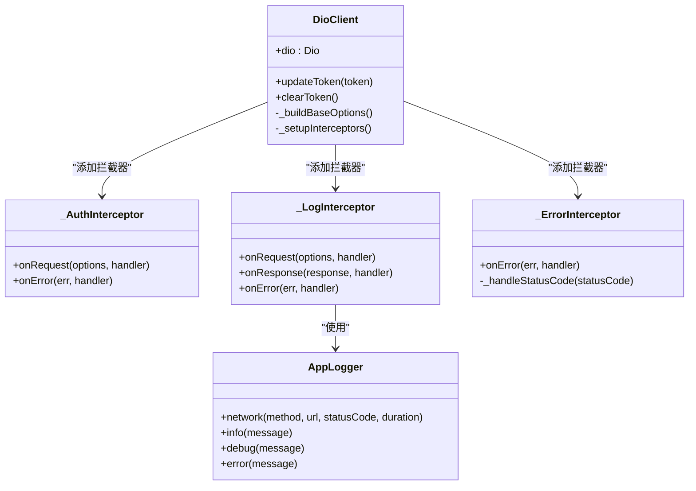
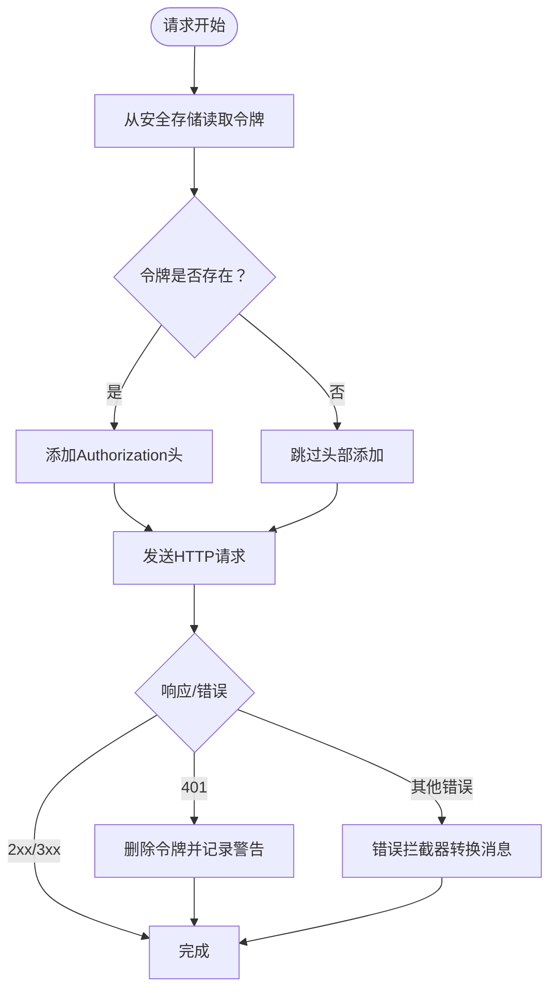
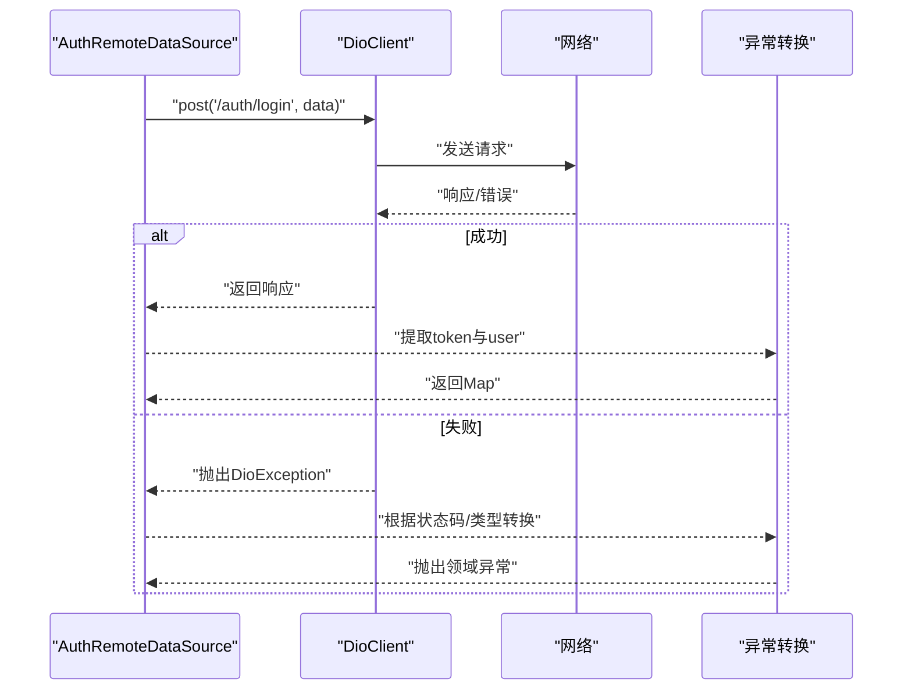
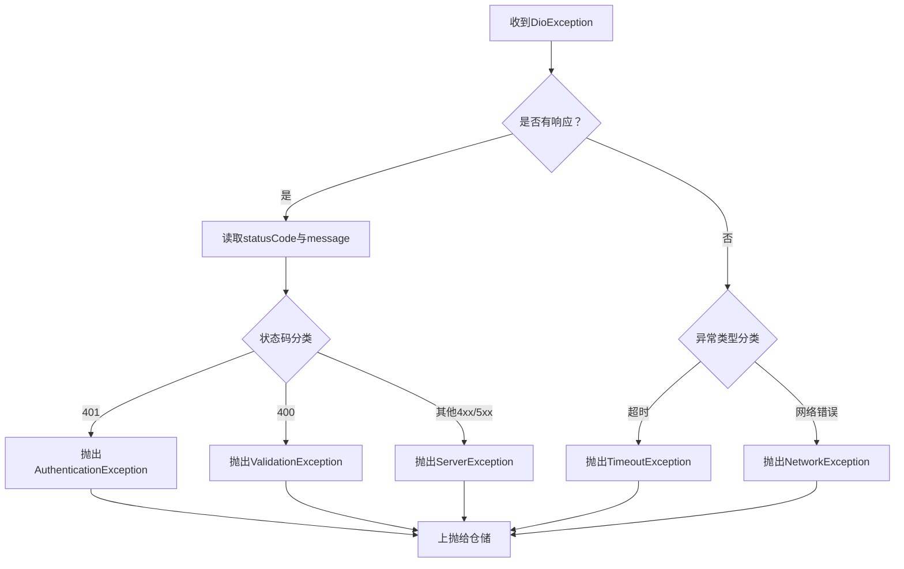
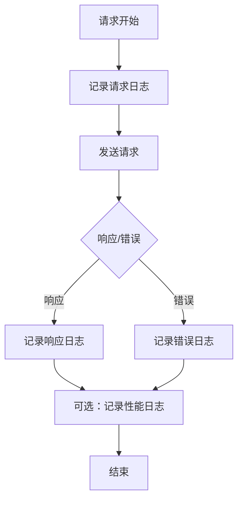
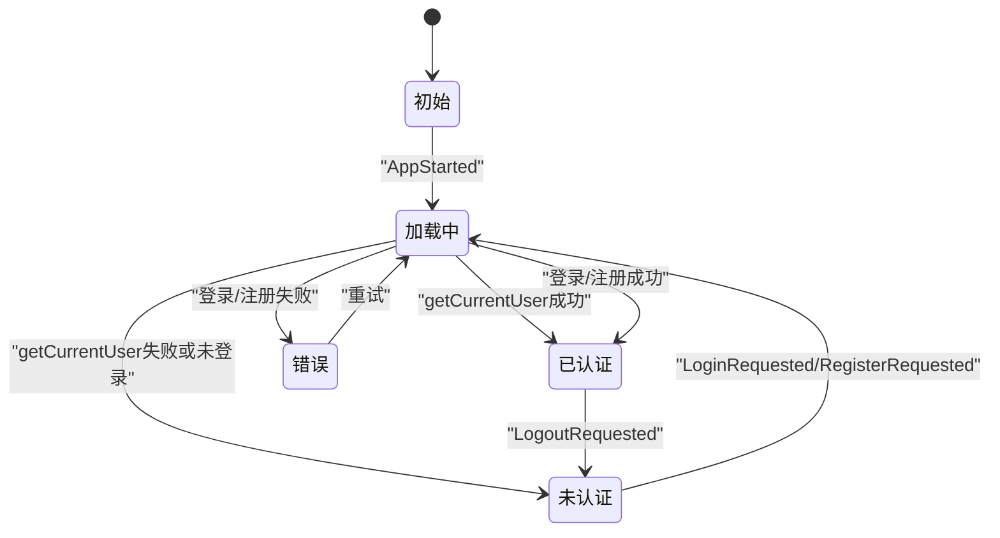
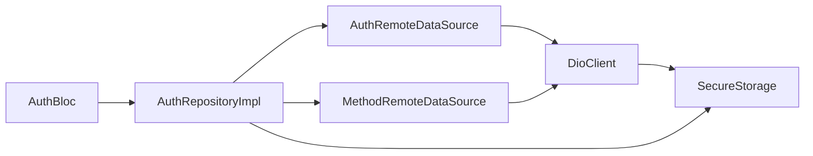

# API客户端实现

<cite>
**本文引用的文件**
- [api_client.dart](file://flutter_app/lib/data/api/api_client.dart)
- [dio_client.dart](file://flutter_app/lib/core/network/dio_client.dart)
- [api_constants.dart](file://flutter_app/lib/config/api_constants.dart)
- [secure_storage.dart](file://flutter_app/lib/data/storage/secure_storage.dart)
- [auth_remote_data_source.dart](file://flutter_app/lib/data/datasources/remote/auth_remote_data_source.dart)
- [method_remote_data_source.dart](file://flutter_app/lib/data/datasources/remote/method_remote_data_source.dart)
- [auth_repository_impl.dart](file://flutter_app/lib/data/repositories/auth_repository_impl.dart)
- [auth_bloc.dart](file://flutter_app/lib/presentation/auth/bloc/auth_bloc.dart)
- [exceptions.dart](file://flutter_app/lib/core/error/exceptions.dart)
- [app_logger.dart](file://flutter_app/lib/core/utils/app_logger.dart)
</cite>

## 目录
1. [引言](#引言)
2. [项目结构](#项目结构)
3. [核心组件](#核心组件)
4. [架构总览](#架构总览)
5. [详细组件分析](#详细组件分析)
6. [依赖关系分析](#依赖关系分析)
7. [性能考虑](#性能考虑)
8. [故障排查指南](#故障排查指南)
9. [结论](#结论)
10. [附录](#附录)

## 引言
本文件深入解析移动端数据层的统一入口——API客户端实现，重点围绕以下目标展开：
- 如何以dio_client.dart为基础，构建统一的HTTP客户端配置（基础URL、超时、请求/响应拦截器）。
- 认证令牌（JWT）在请求头中的自动注入机制，以及401错误时的统一处理策略（如清理令牌）。
- 结合代码示例展示GET/POST等请求的封装方式，解释泛型响应处理与异常转换流程。
- 如何实现请求日志记录、性能监控埋点等横切关注点，并提供扩展自定义拦截器的指导。
- 分析与BLoC状态管理的协作模式，确保异步请求结果能正确触发UI更新。

## 项目结构
移动端数据层采用“仓储-数据源-网络客户端”的分层设计：
- 仓储层负责业务逻辑与失败封装，向上游提供Either类型的统一结果。
- 数据源层负责具体API调用，向上游返回领域模型或抛出自定义异常。
- 网络层提供统一的HTTP客户端与拦截器，屏蔽底层细节。

图表来源
- [auth_bloc.dart](file://flutter_app/lib/presentation/auth/bloc/auth_bloc.dart#L1-L82)
- [auth_repository_impl.dart](file://flutter_app/lib/data/repositories/auth_repository_impl.dart#L1-L114)
- [auth_remote_data_source.dart](file://flutter_app/lib/data/datasources/remote/auth_remote_data_source.dart#L1-L77)
- [method_remote_data_source.dart](file://flutter_app/lib/data/datasources/remote/method_remote_data_source.dart#L1-L83)
- [dio_client.dart](file://flutter_app/lib/core/network/dio_client.dart#L1-L262)

章节来源
- [auth_bloc.dart](file://flutter_app/lib/presentation/auth/bloc/auth_bloc.dart#L1-L82)
- [auth_repository_impl.dart](file://flutter_app/lib/data/repositories/auth_repository_impl.dart#L1-L114)
- [auth_remote_data_source.dart](file://flutter_app/lib/data/datasources/remote/auth_remote_data_source.dart#L1-L77)
- [method_remote_data_source.dart](file://flutter_app/lib/data/datasources/remote/method_remote_data_source.dart#L1-L83)
- [dio_client.dart](file://flutter_app/lib/core/network/dio_client.dart#L1-L262)

## 核心组件
- 统一HTTP客户端：DioClient提供基础配置、拦截器链与令牌更新/清除能力。
- 认证拦截器：自动从安全存储读取JWT并在请求头中注入Authorization。
- 日志拦截器：记录请求/响应与错误，支持网络日志与性能日志。
- 错误拦截器：将底层Dio异常转换为更友好的错误消息。
- 远程数据源：封装具体API调用，负责异常转换与模型映射。
- 仓储实现：统一处理成功与失败，向上游返回Either类型。
- BLoC状态管理：监听仓储结果，驱动UI状态变更。

章节来源
- [dio_client.dart](file://flutter_app/lib/core/network/dio_client.dart#L1-L262)
- [auth_remote_data_source.dart](file://flutter_app/lib/data/datasources/remote/auth_remote_data_source.dart#L1-L77)
- [method_remote_data_source.dart](file://flutter_app/lib/data/datasources/remote/method_remote_data_source.dart#L1-L83)
- [auth_repository_impl.dart](file://flutter_app/lib/data/repositories/auth_repository_impl.dart#L1-L114)
- [auth_bloc.dart](file://flutter_app/lib/presentation/auth/bloc/auth_bloc.dart#L1-L82)

## 架构总览
下面的序列图展示了认证登录流程，体现从BLoC到仓储、数据源、网络客户端与拦截器的完整调用链。

图表来源
- [auth_bloc.dart](file://flutter_app/lib/presentation/auth/bloc/auth_bloc.dart#L1-L82)
- [auth_repository_impl.dart](file://flutter_app/lib/data/repositories/auth_repository_impl.dart#L1-L114)
- [auth_remote_data_source.dart](file://flutter_app/lib/data/datasources/remote/auth_remote_data_source.dart#L1-L77)
- [dio_client.dart](file://flutter_app/lib/core/network/dio_client.dart#L1-L262)

## 详细组件分析

### 统一HTTP客户端（DioClient）
- 基础配置：统一设置baseUrl、连接/发送/接收超时、默认JSON头。
- 拦截器链：认证拦截器、日志拦截器、错误拦截器按顺序执行。
- 令牌管理：提供更新与清除令牌的方法，配合安全存储使用。
- 错误处理：validateStatus允许所有状态码进入拦截器统一处理；错误拦截器将DioException转换为更友好的消息。

图表来源
- [dio_client.dart](file://flutter_app/lib/core/network/dio_client.dart#L1-L262)
- [app_logger.dart](file://flutter_app/lib/core/utils/app_logger.dart#L1-L294)

章节来源
- [dio_client.dart](file://flutter_app/lib/core/network/dio_client.dart#L1-L262)
- [app_logger.dart](file://flutter_app/lib/core/utils/app_logger.dart#L1-L294)

### 认证令牌注入与401处理
- 注入机制：请求前从安全存储读取令牌，若存在则在Authorization头中添加Bearer前缀。
- 401处理：当出现401错误时，拦截器删除令牌并记录警告信息，便于上层识别认证失效。

图表来源
- [dio_client.dart](file://flutter_app/lib/core/network/dio_client.dart#L62-L100)
- [dio_client.dart](file://flutter_app/lib/core/network/dio_client.dart#L157-L205)

章节来源
- [dio_client.dart](file://flutter_app/lib/core/network/dio_client.dart#L62-L100)
- [dio_client.dart](file://flutter_app/lib/core/network/dio_client.dart#L157-L205)

### GET/POST请求封装与异常转换
- GET/POST封装：远程数据源通过DioClient的get/post方法发起请求，统一捕获DioException并转换为领域异常。
- 异常转换：依据响应状态码与Dio异常类型，映射为AuthenticationException、ValidationException、ServerException、TimeoutException或NetworkException。

图表来源
- [auth_remote_data_source.dart](file://flutter_app/lib/data/datasources/remote/auth_remote_data_source.dart#L1-L77)
- [method_remote_data_source.dart](file://flutter_app/lib/data/datasources/remote/method_remote_data_source.dart#L1-L83)
- [exceptions.dart](file://flutter_app/lib/core/error/exceptions.dart#L1-L110)

章节来源
- [auth_remote_data_source.dart](file://flutter_app/lib/data/datasources/remote/auth_remote_data_source.dart#L1-L77)
- [method_remote_data_source.dart](file://flutter_app/lib/data/datasources/remote/method_remote_data_source.dart#L1-L83)
- [exceptions.dart](file://flutter_app/lib/core/error/exceptions.dart#L1-L110)

### 泛型响应处理与异常转换流程
- 远程数据源：对响应数据进行解析（如Map或List），并进行模型映射。
- 异常转换：在远程数据源中根据响应状态码与Dio异常类型，抛出对应的领域异常。
- 仓储实现：将异常转换为Failure，保持上游一致的Either类型返回。

图表来源
- [auth_remote_data_source.dart](file://flutter_app/lib/data/datasources/remote/auth_remote_data_source.dart#L56-L77)
- [method_remote_data_source.dart](file://flutter_app/lib/data/datasources/remote/method_remote_data_source.dart#L68-L83)
- [exceptions.dart](file://flutter_app/lib/core/error/exceptions.dart#L1-L110)

章节来源
- [auth_remote_data_source.dart](file://flutter_app/lib/data/datasources/remote/auth_remote_data_source.dart#L56-L77)
- [method_remote_data_source.dart](file://flutter_app/lib/data/datasources/remote/method_remote_data_source.dart#L68-L83)
- [exceptions.dart](file://flutter_app/lib/core/error/exceptions.dart#L1-L110)

### 请求日志记录与性能监控埋点
- 日志拦截器：记录请求方法、URL、查询参数、响应状态码与响应数据；错误时记录错误消息与响应体。
- 网络日志：提供network方法，支持记录耗时与状态码。
- 性能日志：提供performance方法，基于耗时判断慢请求并输出日志。

图表来源
- [dio_client.dart](file://flutter_app/lib/core/network/dio_client.dart#L100-L155)
- [app_logger.dart](file://flutter_app/lib/core/utils/app_logger.dart#L107-L175)

章节来源
- [dio_client.dart](file://flutter_app/lib/core/network/dio_client.dart#L100-L155)
- [app_logger.dart](file://flutter_app/lib/core/utils/app_logger.dart#L107-L175)

### 扩展自定义拦截器的指导
- 新增拦截器：在DioClient的_setupInterceptors中添加新拦截器实例。
- 注意事项：拦截器顺序很重要，认证拦截器通常在最前，日志与错误拦截器在后，避免相互覆盖。
- 最佳实践：每个拦截器职责单一，遵循链式调用的next(handler)模式。

章节来源
- [dio_client.dart](file://flutter_app/lib/core/network/dio_client.dart#L42-L49)

### 与BLoC状态管理的协作模式
- BLoC监听仓储返回的Either结果，根据左侧Failure或右侧成功值切换状态。
- 登录/注册成功后，BLoC发射Authenticated状态；失败时发射AuthError并携带错误消息。
- 启动时检查登录状态，若已登录则尝试获取当前用户信息并更新状态。

图表来源
- [auth_bloc.dart](file://flutter_app/lib/presentation/auth/bloc/auth_bloc.dart#L1-L82)
- [auth_repository_impl.dart](file://flutter_app/lib/data/repositories/auth_repository_impl.dart#L1-L114)

章节来源
- [auth_bloc.dart](file://flutter_app/lib/presentation/auth/bloc/auth_bloc.dart#L1-L82)
- [auth_repository_impl.dart](file://flutter_app/lib/data/repositories/auth_repository_impl.dart#L1-L114)

## 依赖关系分析
- 组件耦合：数据源依赖DioClient；仓储依赖数据源与安全存储；BLoC依赖仓储。
- 外部依赖：Dio、FlutterSecureStorage、logger、dartz。
- 可能的循环依赖：当前结构清晰，未发现循环依赖迹象。

图表来源
- [auth_bloc.dart](file://flutter_app/lib/presentation/auth/bloc/auth_bloc.dart#L1-L82)
- [auth_repository_impl.dart](file://flutter_app/lib/data/repositories/auth_repository_impl.dart#L1-L114)
- [auth_remote_data_source.dart](file://flutter_app/lib/data/datasources/remote/auth_remote_data_source.dart#L1-L77)
- [method_remote_data_source.dart](file://flutter_app/lib/data/datasources/remote/method_remote_data_source.dart#L1-L83)
- [secure_storage.dart](file://flutter_app/lib/data/storage/secure_storage.dart#L1-L46)

章节来源
- [auth_bloc.dart](file://flutter_app/lib/presentation/auth/bloc/auth_bloc.dart#L1-L82)
- [auth_repository_impl.dart](file://flutter_app/lib/data/repositories/auth_repository_impl.dart#L1-L114)
- [auth_remote_data_source.dart](file://flutter_app/lib/data/datasources/remote/auth_remote_data_source.dart#L1-L77)
- [method_remote_data_source.dart](file://flutter_app/lib/data/datasources/remote/method_remote_data_source.dart#L1-L83)
- [secure_storage.dart](file://flutter_app/lib/data/storage/secure_storage.dart#L1-L46)

## 性能考虑
- 超时设置：连接/发送/接收超时统一配置，避免长时间阻塞UI线程。
- 拦截器链开销：日志与错误拦截器会增加少量CPU与IO开销，建议在Release模式降低日志级别。
- 并发请求：合理并发与缓存策略可减少重复请求，提升用户体验。
- 网络重试：对于临时性错误可考虑在上层进行有限重试，但需避免无限重试导致资源浪费。

## 故障排查指南
- 401未授权：确认令牌是否过期或被删除；检查认证拦截器是否正常注入Authorization头。
- 超时/网络错误：检查网络状态与超时配置；查看日志拦截器输出的请求URL与错误消息。
- 400参数错误：检查请求体与查询参数格式；查看服务端返回的错误字段。
- 5xx服务器错误：联系后端排查；查看日志拦截器中的错误响应体。
- BLoC状态不更新：确认仓储返回的Either是否正确；检查BLoC的fold分支是否覆盖了所有情况。

章节来源
- [dio_client.dart](file://flutter_app/lib/core/network/dio_client.dart#L157-L205)
- [auth_remote_data_source.dart](file://flutter_app/lib/data/datasources/remote/auth_remote_data_source.dart#L56-L77)
- [method_remote_data_source.dart](file://flutter_app/lib/data/datasources/remote/method_remote_data_source.dart#L68-L83)
- [auth_bloc.dart](file://flutter_app/lib/presentation/auth/bloc/auth_bloc.dart#L1-L82)

## 结论
该API客户端实现通过统一的DioClient与拦截器链，实现了认证令牌自动注入、日志记录、错误统一处理与性能监控埋点等横切关注点。结合仓储与BLoC的状态管理，形成了清晰的数据流与UI更新路径。整体设计具备良好的可扩展性与可维护性，适合在复杂移动端应用中推广使用。

## 附录
- 基础URL与超时配置：通过ApiConstants集中管理，便于多环境切换。
- 安全存储：提供令牌与用户信息的读写与清理能力。
- 异常体系：定义了完善的异常类型，便于上层统一处理。

章节来源
- [api_constants.dart](file://flutter_app/lib/config/api_constants.dart#L1-L73)
- [secure_storage.dart](file://flutter_app/lib/data/storage/secure_storage.dart#L1-L46)
- [exceptions.dart](file://flutter_app/lib/core/error/exceptions.dart#L1-L110)