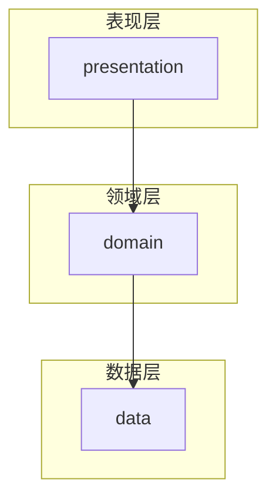
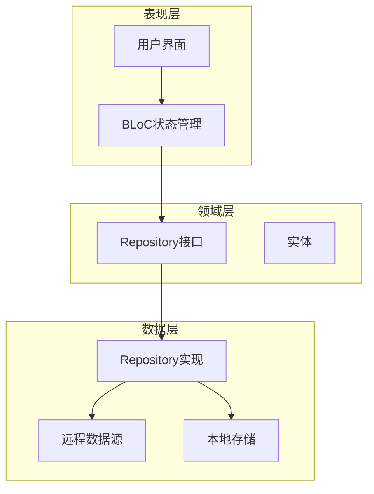
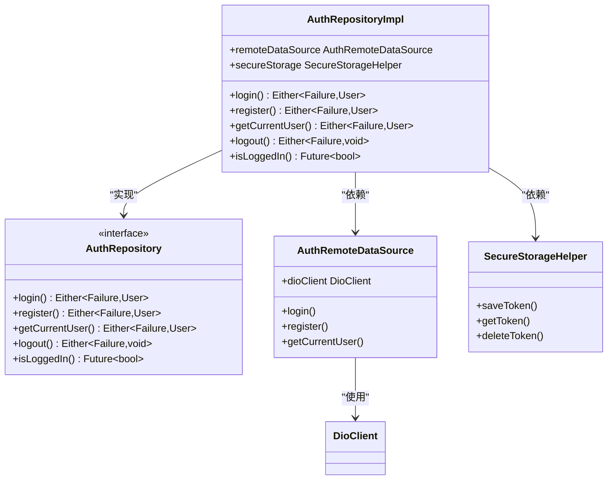
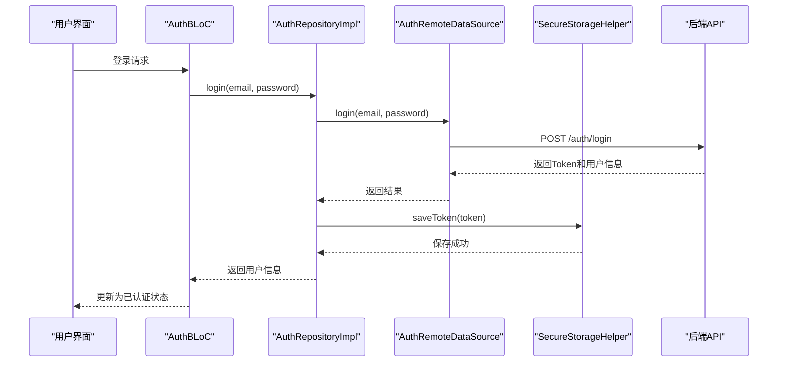
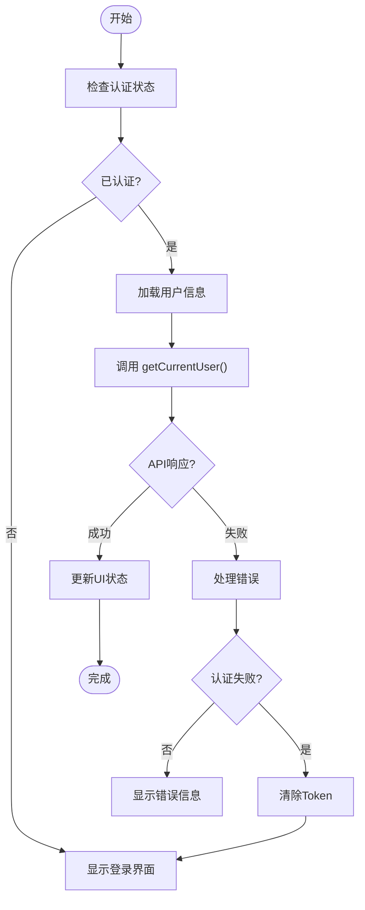
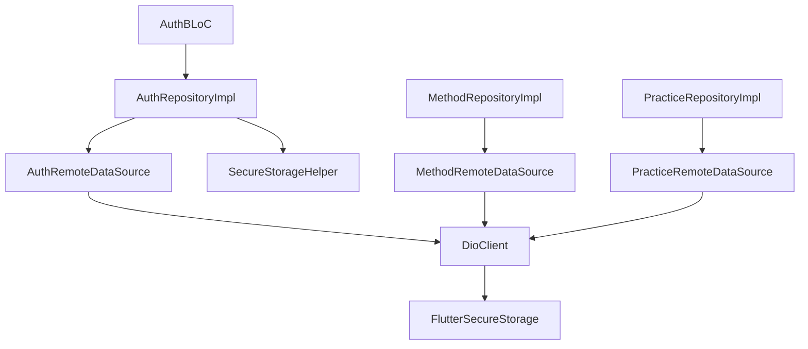

# 仓库实现与数据协调

<cite>
**本文档引用的文件**
- [auth_repository_impl.dart](file://flutter_app/lib/data/repositories/auth_repository_impl.dart)
- [auth_repository.dart](file://flutter_app/lib/domain/repositories/auth_repository.dart)
- [auth_remote_data_source.dart](file://flutter_app/lib/data/datasources/remote/auth_remote_data_source.dart)
- [secure_storage_helper.dart](file://flutter_app/lib/core/storage/secure_storage_helper.dart)
- [auth_bloc.dart](file://flutter_app/lib/presentation/auth/bloc/auth_bloc.dart)
- [method_repository_impl.dart](file://flutter_app/lib/data/repositories/method_repository_impl.dart)
- [practice_repository_impl.dart](file://flutter_app/lib/data/repositories/practice_repository_impl.dart)
- [user_model.dart](file://flutter_app/lib/data/models/user_model.dart)
- [user.dart](file://flutter_app/lib/domain/entities/user.dart)
- [injection.dart](file://flutter_app/lib/core/di/injection.dart)
- [exceptions.dart](file://flutter_app/lib/core/error/exceptions.dart)
- [failures.dart](file://flutter_app/lib/core/error/failures.dart)
- [dio_client.dart](file://flutter_app/lib/core/network/dio_client.dart)
</cite>

## 目录
1. [简介](#简介)
2. [项目结构](#项目结构)
3. [核心组件](#核心组件)
4. [架构概述](#架构概述)
5. [详细组件分析](#详细组件分析)
6. [依赖分析](#依赖分析)
7. [性能考虑](#性能考虑)
8. [故障排除指南](#故障排除指南)
9. [结论](#结论)

## 简介
本文档深入剖析了基于Clean Architecture的Flutter应用中仓库实现类的核心作用，重点分析了`auth_repository_impl.dart`等实现类如何协调多个数据源、管理数据获取策略、处理错误传播以及实现本地存储与远程服务的协同工作。文档详细说明了认证状态、方法列表、练习记录等关键数据的加载与同步机制，并阐述了如何正确实现新的仓库类及其依赖注入配置。

## 项目结构
该项目遵循Clean Architecture分层架构，清晰地分离了关注点。核心结构包括：`domain`层定义业务逻辑和实体，`data`层实现数据获取和存储，`presentation`层处理用户界面和状态管理。这种分层设计确保了代码的可维护性和可测试性。

**图示来源**
- [auth_repository_impl.dart](file://flutter_app/lib/data/repositories/auth_repository_impl.dart)
- [auth_repository.dart](file://flutter_app/lib/domain/repositories/auth_repository.dart)

**本节来源**
- [auth_repository_impl.dart](file://flutter_app/lib/data/repositories/auth_repository_impl.dart)
- [auth_repository.dart](file://flutter_app/lib/domain/repositories/auth_repository.dart)

## 核心组件
核心组件包括认证、方法和练习三大功能模块的仓库实现。这些实现类位于`data/repositories`目录下，负责协调远程数据源和本地存储，实现统一的数据访问接口。每个仓库实现都遵循相同的模式：实现领域层定义的接口，注入必要的数据源依赖，并处理错误转换。

**本节来源**
- [auth_repository_impl.dart](file://flutter_app/lib/data/repositories/auth_repository_impl.dart)
- [method_repository_impl.dart](file://flutter_app/lib/data/repositories/method_repository_impl.dart)
- [practice_repository_impl.dart](file://flutter_app/lib/data/repositories/practice_repository_impl.dart)

## 架构概述
系统采用Clean Architecture架构，分为表现层、领域层和数据层。领域层定义了业务逻辑和接口，数据层实现这些接口并协调多个数据源，表现层通过BLoC模式管理UI状态。这种架构确保了业务逻辑的独立性和可测试性。

**图示来源**
- [auth_repository_impl.dart](file://flutter_app/lib/data/repositories/auth_repository_impl.dart)
- [auth_repository.dart](file://flutter_app/lib/domain/repositories/auth_repository.dart)
- [auth_remote_data_source.dart](file://flutter_app/lib/data/datasources/remote/auth_remote_data_source.dart)
- [secure_storage_helper.dart](file://flutter_app/lib/core/storage/secure_storage_helper.dart)

## 详细组件分析
本节深入分析认证仓库实现类的核心功能和实现细节，包括数据获取策略、错误处理机制和依赖注入配置。

### 认证仓库实现分析
`AuthRepositoryImpl`是认证功能的核心实现类，负责协调远程API和本地安全存储，管理用户认证状态的整个生命周期。

#### 类关系与依赖

**图示来源**
- [auth_repository_impl.dart](file://flutter_app/lib/data/repositories/auth_repository_impl.dart)
- [auth_repository.dart](file://flutter_app/lib/domain/repositories/auth_repository.dart)
- [auth_remote_data_source.dart](file://flutter_app/lib/data/datasources/remote/auth_remote_data_source.dart)
- [secure_storage_helper.dart](file://flutter_app/lib/core/storage/secure_storage_helper.dart)

#### 认证流程序列图

**图示来源**
- [auth_repository_impl.dart](file://flutter_app/lib/data/repositories/auth_repository_impl.dart)
- [auth_bloc.dart](file://flutter_app/lib/presentation/auth/bloc/auth_bloc.dart)
- [auth_remote_data_source.dart](file://flutter_app/lib/data/datasources/remote/auth_remote_data_source.dart)
- [secure_storage_helper.dart](file://flutter_app/lib/core/storage/secure_storage_helper.dart)

**本节来源**
- [auth_repository_impl.dart](file://flutter_app/lib/data/repositories/auth_repository_impl.dart)
- [auth_bloc.dart](file://flutter_app/lib/presentation/auth/bloc/auth_bloc.dart)

### 数据获取策略
仓库实现类采用了多种数据获取策略来优化用户体验和性能。

#### 数据加载流程

**图示来源**
- [auth_repository_impl.dart](file://flutter_app/lib/data/repositories/auth_repository_impl.dart)
- [auth_bloc.dart](file://flutter_app/lib/presentation/auth/bloc/auth_bloc.dart)

## 依赖分析
系统通过依赖注入管理各组件之间的依赖关系，确保代码的可测试性和松耦合。

**图示来源**
- [auth_repository_impl.dart](file://flutter_app/lib/data/repositories/auth_repository_impl.dart)
- [injection.dart](file://flutter_app/lib/core/di/injection.dart)
- [dio_client.dart](file://flutter_app/lib/core/network/dio_client.dart)

**本节来源**
- [injection.dart](file://flutter_app/lib/core/di/injection.dart)
- [auth_repository_impl.dart](file://flutter_app/lib/data/repositories/auth_repository_impl.dart)

## 性能考虑
仓库实现类通过合理的缓存策略和错误处理机制来优化应用性能。安全存储用于持久化认证令牌，确保应用重启后用户仍保持登录状态。网络请求通过Dio拦截器进行日志记录和错误处理，便于调试和监控。

## 故障排除指南
当遇到认证相关问题时，应首先检查安全存储中的令牌是否有效，然后验证网络连接状态。错误信息通过统一的Failure类型传播，确保BLoC能够正确捕获并转换为相应的UI状态。

**本节来源**
- [exceptions.dart](file://flutter_app/lib/core/error/exceptions.dart)
- [failures.dart](file://flutter_app/lib/core/error/failures.dart)
- [auth_repository_impl.dart](file://flutter_app/lib/data/repositories/auth_repository_impl.dart)

## 结论
仓库实现类在Clean Architecture中扮演着关键角色，它们作为领域层和数据层之间的桥梁，协调多个数据源并提供统一的数据访问接口。通过合理的错误处理和依赖注入配置，这些实现类确保了应用的稳定性、可维护性和可测试性。开发者在实现新的仓库类时，应遵循相同的模式和最佳实践。