# 数据层实现

<cite>
**本文档引用的文件**  
- [api_client.dart](file://flutter_app/lib/data/api/api_client.dart)
- [dio_client.dart](file://flutter_app/lib/core/network/dio_client.dart)
- [auth_remote_data_source.dart](file://flutter_app/lib/data/datasources/remote/auth_remote_data_source.dart)
- [user_model.dart](file://flutter_app/lib/data/models/user_model.dart)
- [user.dart](file://flutter_app/lib/domain/entities/user.dart)
- [auth_repository_impl.dart](file://flutter_app/lib/data/repositories/auth_repository_impl.dart)
- [method_model.dart](file://flutter_app/lib/data/models/method_model.dart)
- [method.dart](file://flutter_app/lib/domain/entities/method.dart)
- [method_remote_data_source.dart](file://flutter_app/lib/data/datasources/remote/method_remote_data_source.dart)
- [cache_manager.dart](file://flutter_app/lib/core/utils/cache_manager.dart)
- [api_constants.dart](file://flutter_app/lib/config/api_constants.dart)
- [secure_storage_helper.dart](file://flutter_app/lib/core/storage/secure_storage_helper.dart)
- [secure_storage.dart](file://flutter_app/lib/data/storage/secure_storage.dart)
- [exceptions.dart](file://flutter_app/lib/core/error/exceptions.dart)
- [failures.dart](file://flutter_app/lib/core/error/failures.dart)
</cite>

## 目录
1. [数据层分层架构](#数据层分层架构)
2. [远程数据源实现机制](#远程数据源实现机制)
3. [数据模型与实体映射](#数据模型与实体映射)
4. [仓库实现与数据协调](#仓库实现与数据协调)
5. [API网关统一管理](#api网关统一管理)
6. [类型安全与错误传播](#类型安全与错误传播)
7. [性能优化建议](#性能优化建议)

## 数据层分层架构

nian移动端应用的数据层采用标准的Clean Architecture分层设计，分为四个主要层级：API层、远程数据源层、模型层和仓库实现层。这种分层结构确保了关注点分离，提高了代码的可维护性和可测试性。

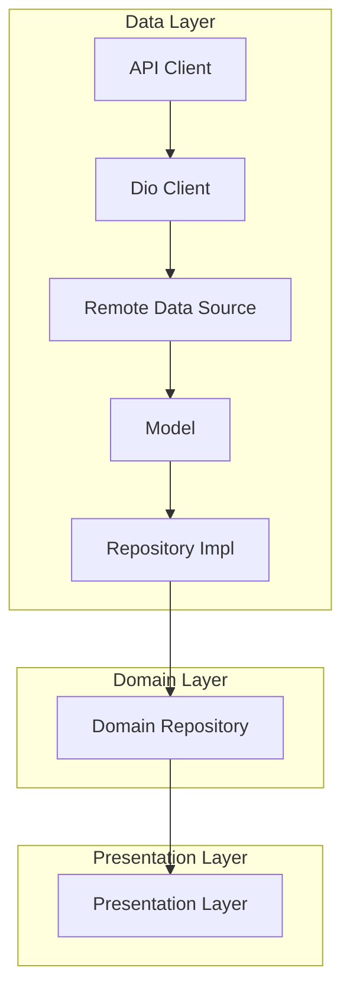

**图示来源**
- [api_client.dart](file://flutter_app/lib/data/api/api_client.dart#L1-L207)
- [dio_client.dart](file://flutter_app/lib/core/network/dio_client.dart#L1-L262)
- [auth_repository_impl.dart](file://flutter_app/lib/data/repositories/auth_repository_impl.dart#L1-L114)

## 远程数据源实现机制

远程数据源（Remote Data Source）负责封装RESTful API调用，通过Dio客户端进行HTTP请求的统一配置与拦截处理。每个远程数据源类都封装了特定业务领域的API调用，如认证、方法管理等。

### 认证远程数据源

`AuthRemoteDataSource`类封装了用户认证相关的API调用，包括登录、注册和获取当前用户信息。该类通过依赖注入接收`DioClient`实例，利用其统一的HTTP配置进行网络请求。

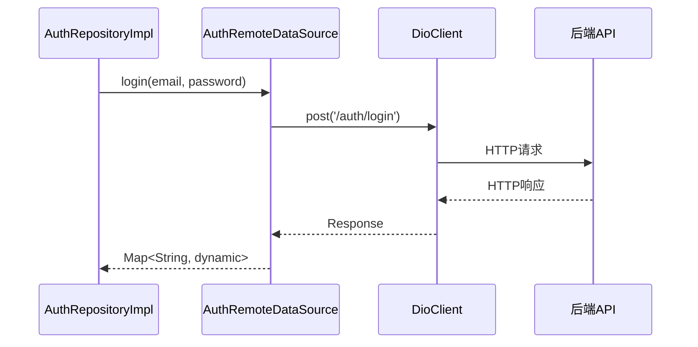

**图示来源**
- [auth_remote_data_source.dart](file://flutter_app/lib/data/datasources/remote/auth_remote_data_source.dart#L1-L77)
- [dio_client.dart](file://flutter_app/lib/core/network/dio_client.dart#L1-L262)

### Dio客户端统一配置

`DioClient`类提供了统一的HTTP请求配置和拦截器机制，确保所有网络请求遵循一致的规范。该类通过依赖注入框架进行单例管理，保证应用全局使用同一个Dio实例。

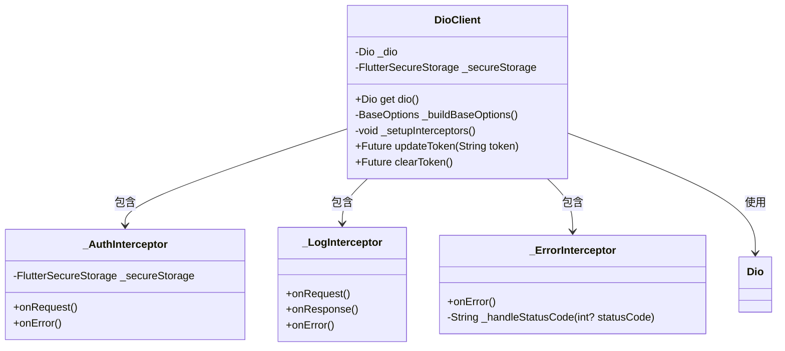

**图示来源**
- [dio_client.dart](file://flutter_app/lib/core/network/dio_client.dart#L1-L262)
- [api_constants.dart](file://flutter_app/lib/config/api_constants.dart#L1-L73)

## 数据模型与实体映射

数据层采用分离的数据模型（Model）和领域实体（Entity）设计模式，实现了数据传输对象与业务领域对象的解耦。

### 模型与实体关系

数据模型类（如`UserModel`）继承自对应的领域实体类（如`User`），并实现了JSON序列化和反序列化的逻辑。这种设计模式确保了网络层与领域层之间的数据转换既安全又高效。

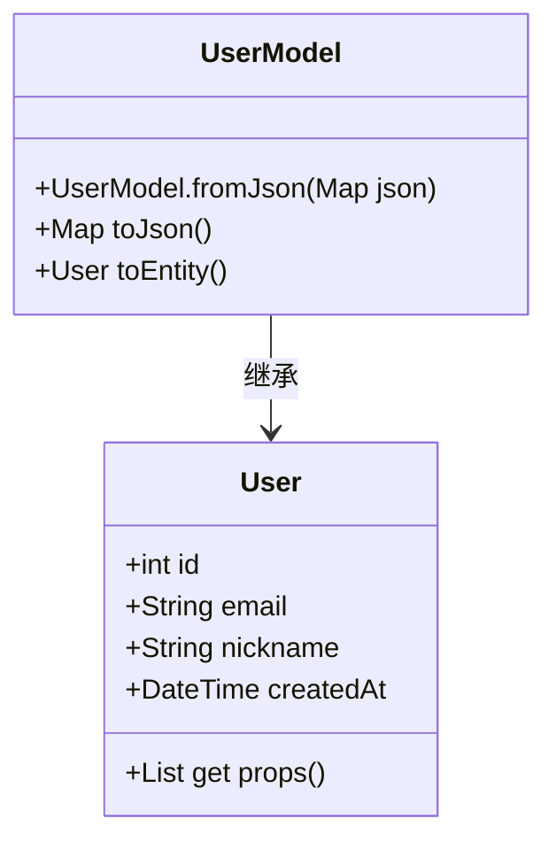

**图示来源**
- [user_model.dart](file://flutter_app/lib/data/models/user_model.dart#L1-L44)
- [user.dart](file://flutter_app/lib/domain/entities/user.dart#L1-L32)

### 序列化逻辑实现

模型类实现了`fromJson`和`toJson`工厂方法，用于在JSON格式和Dart对象之间进行转换。`toEntity`方法则用于将数据模型转换为领域实体，确保领域层只与纯净的业务对象交互。

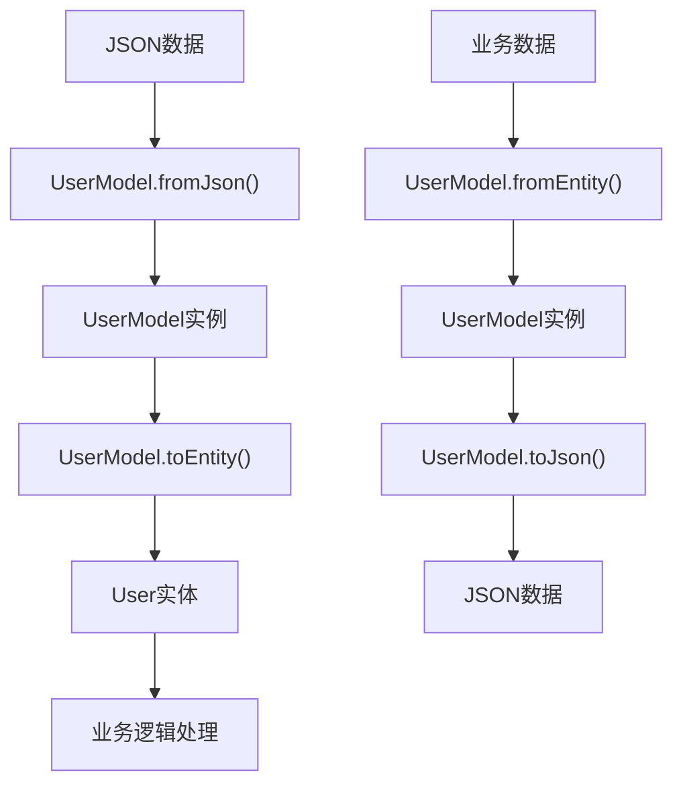

**图示来源**
- [user_model.dart](file://flutter_app/lib/data/models/user_model.dart#L1-L44)
- [method_model.dart](file://flutter_app/lib/data/models/method_model.dart#L1-L54)

## 仓库实现与数据协调

仓库实现类（Repository Impl）是数据层的核心协调者，负责整合多个数据源（远程和本地）并实现缓存策略与离线支持。

### 认证仓库实现

`AuthRepositoryImpl`类协调`AuthRemoteDataSource`和`SecureStorageHelper`，实现了认证相关的业务逻辑。该类处理了登录、注册、获取用户信息和登出等操作，并在适当的时候更新本地存储。

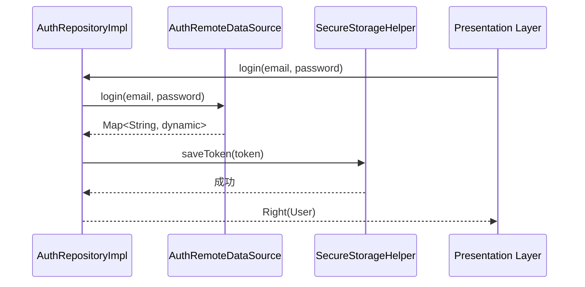

**图示来源**
- [auth_repository_impl.dart](file://flutter_app/lib/data/repositories/auth_repository_impl.dart#L1-L114)
- [secure_storage_helper.dart](file://flutter_app/lib/core/storage/secure_storage_helper.dart#L1-L194)

### 缓存策略与离线支持

数据层通过`SecureStorageHelper`和`CacheManager`实现了多层次的缓存策略。敏感数据（如认证令牌）存储在安全存储中，而其他数据则根据业务需求进行缓存管理。

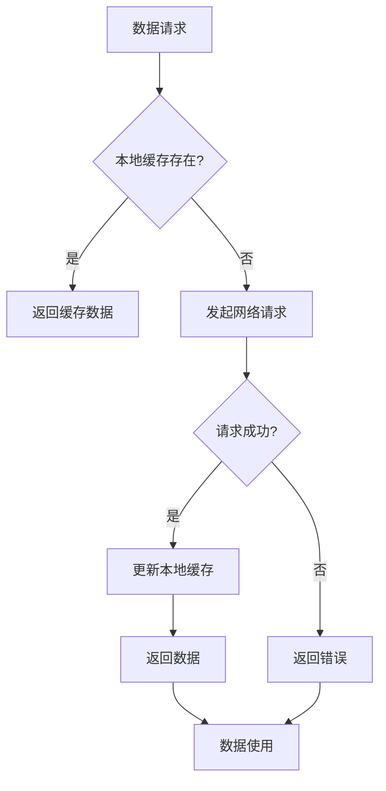

**图示来源**
- [cache_manager.dart](file://flutter_app/lib/core/utils/cache_manager.dart#L1-L226)
- [secure_storage_helper.dart](file://flutter_app/lib/core/storage/secure_storage_helper.dart#L1-L194)

## API网关统一管理

`ApiClient`类作为统一的API网关，负责请求路由、错误处理和认证头注入等跨领域关注点。

### API网关职责

API网关封装了所有HTTP请求的公共逻辑，包括：
- 统一的基础URL配置
- 请求超时设置
- 认证令牌自动注入
- 错误状态码处理
- 请求/响应日志记录

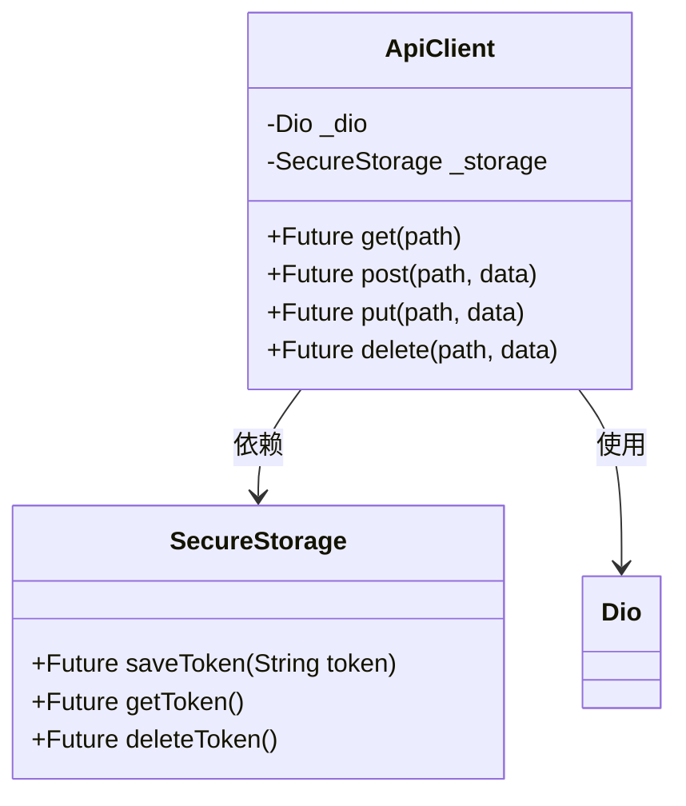

**图示来源**
- [api_client.dart](file://flutter_app/lib/data/api/api_client.dart#L1-L207)
- [secure_storage.dart](file://flutter_app/lib/data/storage/secure_storage.dart#L1-L46)

### 请求拦截器链

API网关通过Dio的拦截器机制实现了请求处理链，每个拦截器负责特定的职责，如认证、日志记录和错误处理。

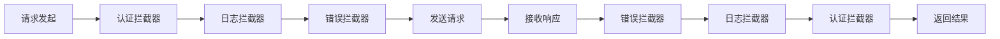

**图示来源**
- [dio_client.dart](file://flutter_app/lib/core/network/dio_client.dart#L1-L262)
- [api_client.dart](file://flutter_app/lib/data/api/api_client.dart#L1-L207)

## 类型安全与错误传播

数据层通过Dart的类型系统和Either模式实现了强类型安全和优雅的错误传播机制。

### 异常与失败分离

数据层区分了异常（Exception）和失败（Failure）两种错误类型：
- **异常**：表示技术层面的错误，如网络连接失败、JSON解析错误等
- **失败**：表示业务层面的错误，如认证失败、验证错误等

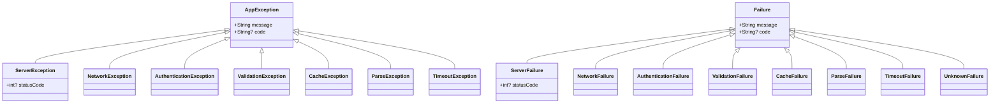

**图示来源**
- [exceptions.dart](file://flutter_app/lib/core/error/exceptions.dart#L1-L110)
- [failures.dart](file://flutter_app/lib/core/error/failures.dart#L1-L157)

### Either模式错误处理

仓库实现类使用`Either<Failure, T>`模式返回结果，明确区分成功和失败两种状态，避免了异常的意外抛出，提高了代码的可预测性。

```mermaid
flowchart TD
A[方法调用] --> B{操作成功?}
B --> |是| C[Right(数据)]
B --> |否| D[Left(Failure)]
C --> E[成功处理]
D --> F[错误处理]
```

**图示来源**
- [auth_repository_impl.dart](file://flutter_app/lib/data/repositories/auth_repository_impl.dart#L1-L114)
- [failures.dart](file://flutter_app/lib/core/error/failures.dart#L1-L157)

## 性能优化建议

基于当前数据层架构，提出以下性能优化建议：

### 请求合并与批处理

对于频繁的小型请求，可以考虑实现请求合并机制，将多个相关请求合并为一个批量请求，减少网络开销。

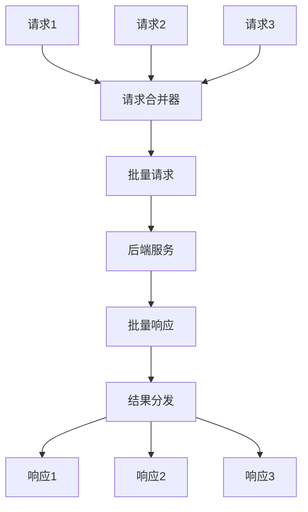

### 智能缓存控制

实现基于时间的缓存失效策略和基于内容的缓存验证机制，平衡数据新鲜度和性能。

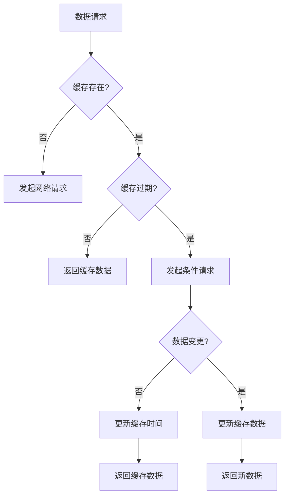

### 网络状态感知

结合`NetworkInfo`类实现网络状态感知，根据网络状况调整请求策略，如在弱网环境下降低请求频率或使用压缩数据格式。

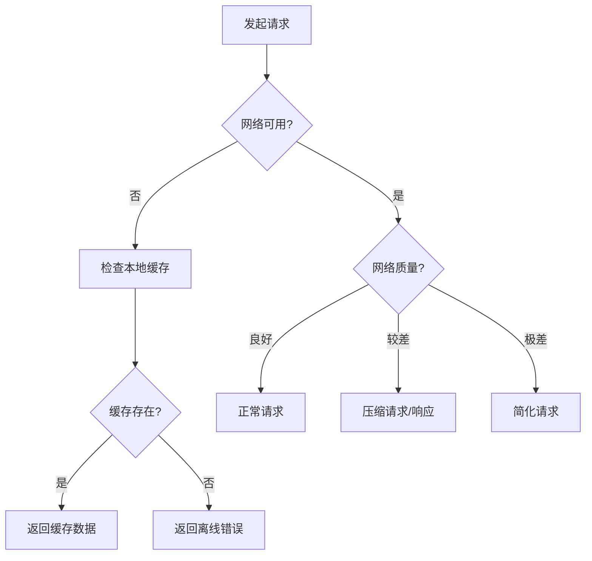

**图示来源**
- [cache_manager.dart](file://flutter_app/lib/core/utils/cache_manager.dart#L1-L226)
- [secure_storage.dart](file://flutter_app/lib/data/storage/secure_storage.dart#L1-L46)