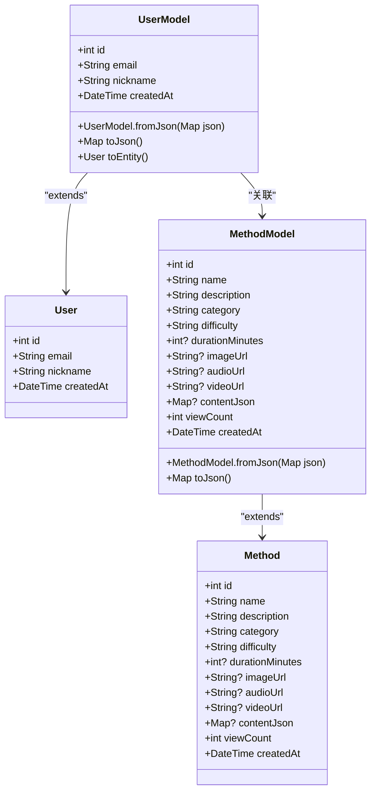
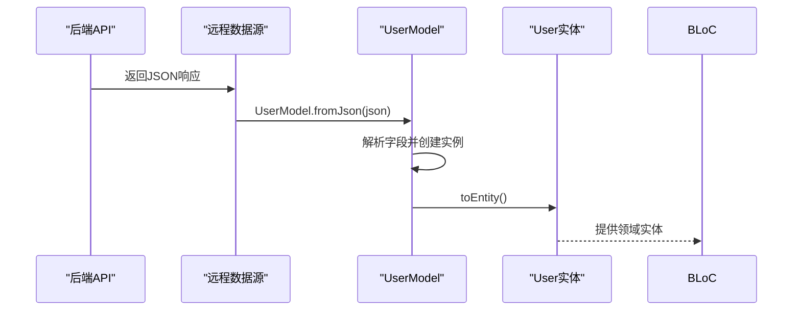
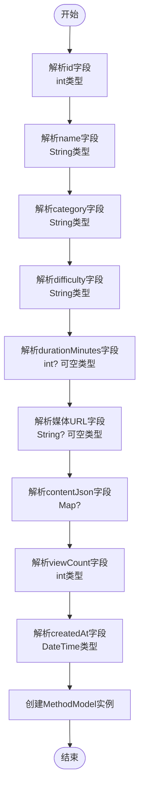
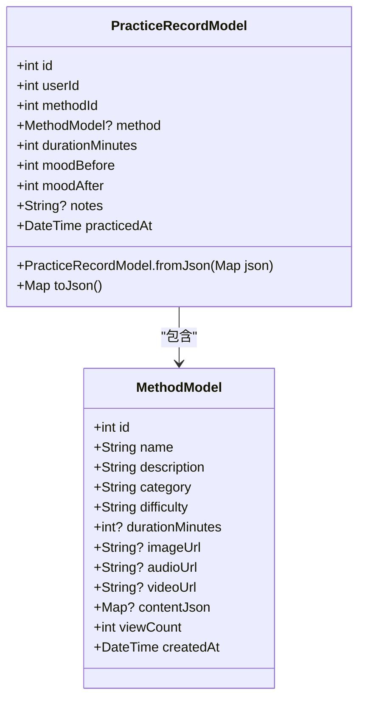
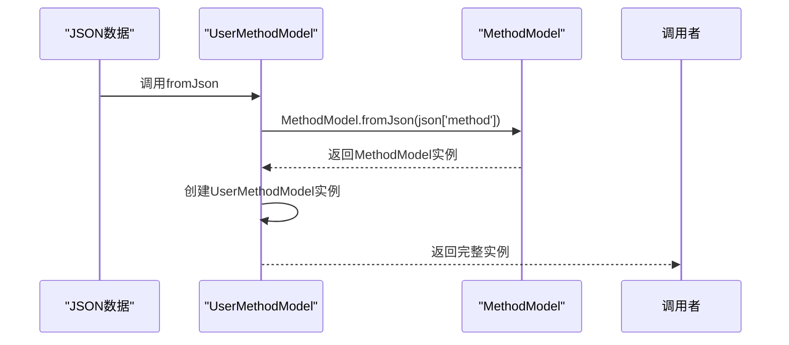
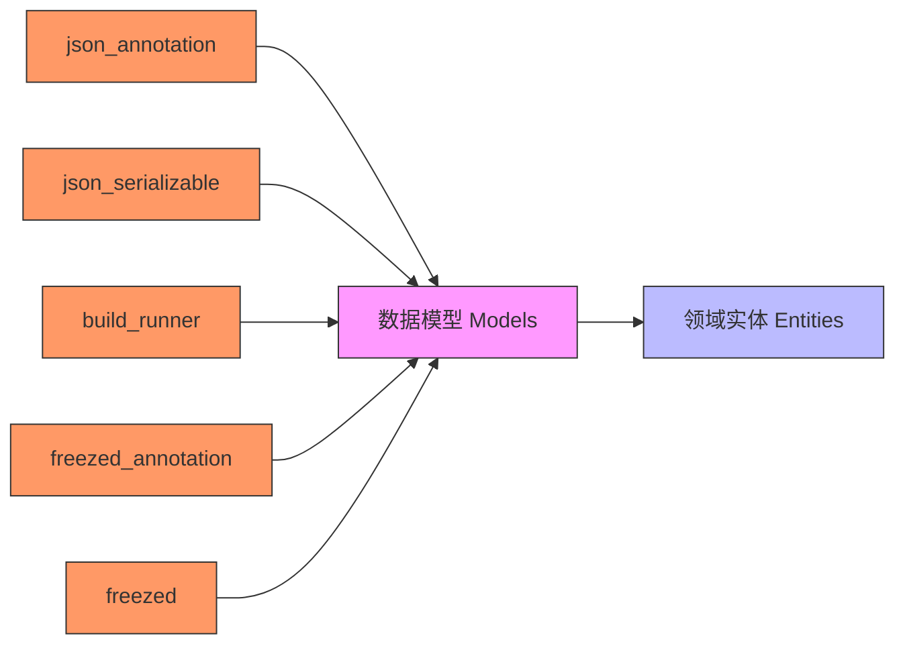

# 数据模型与序列化

<cite>
**本文档引用的文件**
- [user_model.dart](file://flutter_app/lib/data/models/user_model.dart)
- [method_model.dart](file://flutter_app/lib/data/models/method_model.dart)
- [practice_record_model.dart](file://flutter_app/lib/data/models/practice_record_model.dart)
- [user_method_model.dart](file://flutter_app/lib/data/models/user_method_model.dart)
- [user.dart](file://flutter_app/lib/domain/entities/user.dart)
- [method.dart](file://flutter_app/lib/domain/entities/method.dart)
- [practice_record.dart](file://flutter_app/lib/domain/entities/practice_record.dart)
- [user_method.dart](file://flutter_app/lib/domain/entities/user_method.dart)
- [pubspec.yaml](file://flutter_app/pubspec.yaml)
- [auth_remote_data_source.dart](file://flutter_app/lib/data/datasources/remote/auth_remote_data_source.dart)
</cite>

## 目录
1. [简介](#简介)
2. [项目结构](#项目结构)
3. [核心组件](#核心组件)
4. [架构概述](#架构概述)
5. [详细组件分析](#详细组件分析)
6. [依赖分析](#依赖分析)
7. [性能考虑](#性能考虑)
8. [故障排除指南](#故障排除指南)
9. [结论](#结论)

## 简介
本文档系统性讲解数据模型层（models）在数据层中的角色，重点说明Model类（如user_model.dart）如何实现JSON序列化与反序列化。分析fromJson/toJson方法的生成机制或手动实现逻辑，确保与后端API数据结构精确匹配。阐述Model类与领域层Entity之间的映射关系，以及Mapper类或扩展方法如何实现两者间的转换。讨论嵌套对象、列表类型、时间戳处理等复杂场景的序列化策略。说明如何通过静态分析工具保障类型安全，避免运行时解析错误。提供新增模型类的模板与验证流程，确保字段类型、命名规范与空安全符合项目标准。

## 项目结构
本项目采用标准的Flutter Clean Architecture分层架构，数据模型层位于`flutter_app/lib/data/models/`目录下，与领域层实体类（entities）分离，确保关注点分离和类型安全。

```mermaid
graph TB
subgraph "Presentation Layer"
UI[用户界面]
BLoC[BLoC]
end
subgraph "Domain Layer"
Entities[实体 Entities]
Repositories[仓库接口]
end
subgraph "Data Layer"
Models[数据模型 Models]
DataSources[数据源]
RepositoriesImpl[仓库实现]
end
UI --> BLoC
BLoC --> DomainLayer
DomainLayer --> DataLayer
DataLayer --> ExternalAPIs[外部API/数据库]
Models --> Entities : "映射转换"
Entities --> Models : "反向映射"
```

**图示来源**
- [user_model.dart](file://flutter_app/lib/data/models/user_model.dart#L6)
- [user.dart](file://flutter_app/lib/domain/entities/user.dart#L6)

**本节来源**
- [user_model.dart](file://flutter_app/lib/data/models/user_model.dart)
- [user.dart](file://flutter_app/lib/domain/entities/user.dart)

## 核心组件
数据模型层的核心组件包括UserModel、MethodModel、PracticeRecordModel和UserMethodModel，这些类负责与后端API进行JSON数据交换，并通过手动实现的fromJson/toJson方法确保类型安全和数据完整性。

**本节来源**
- [user_model.dart](file://flutter_app/lib/data/models/user_model.dart#L6-L43)
- [method_model.dart](file://flutter_app/lib/data/models/method_model.dart#L4-L54)

## 架构概述
系统采用分层架构，数据模型层（Models）作为数据层的核心，负责处理与后端API的JSON序列化和反序列化。模型类从领域层实体类继承，确保数据结构的一致性，并通过toEntity方法实现向领域实体的转换。



**图示来源**
- [user_model.dart](file://flutter_app/lib/data/models/user_model.dart#L6)
- [user.dart](file://flutter_app/lib/domain/entities/user.dart#L6)
- [method_model.dart](file://flutter_app/lib/data/models/method_model.dart#L4)
- [method.dart](file://flutter_app/lib/domain/entities/method.dart#L6)

## 详细组件分析
本节详细分析数据模型层的关键组件，包括JSON序列化实现、实体映射机制和复杂数据结构处理。

### 用户模型分析
UserModel类实现了完整的JSON序列化与反序列化逻辑，通过工厂构造函数fromJson从JSON数据创建模型实例，并通过toJson方法将模型转换为JSON格式。模型类继承自领域层的User实体，确保数据结构的一致性。



**图示来源**
- [user_model.dart](file://flutter_app/lib/data/models/user_model.dart#L15-L32)
- [auth_remote_data_source.dart](file://flutter_app/lib/data/datasources/remote/auth_remote_data_source.dart#L50)

**本节来源**
- [user_model.dart](file://flutter_app/lib/data/models/user_model.dart#L1-L43)
- [user.dart](file://flutter_app/lib/domain/entities/user.dart#L1-L31)

### 方法模型分析
MethodModel类处理心理方法数据的序列化，支持可空字段（如durationMinutes、imageUrl等）的处理，并正确解析时间戳字段createdAt。



**图示来源**
- [method_model.dart](file://flutter_app/lib/data/models/method_model.dart#L20-L34)

**本节来源**
- [method_model.dart](file://flutter_app/lib/data/models/method_model.dart#L1-L54)
- [method.dart](file://flutter_app/lib/domain/entities/method.dart#L1-L77)

### 练习记录模型分析
PracticeRecordModel展示了嵌套对象的序列化策略，其中method字段是另一个模型对象（MethodModel），需要递归调用其fromJson方法进行解析。



**图示来源**
- [practice_record_model.dart](file://flutter_app/lib/data/models/practice_record_model.dart#L23-L25)
- [method_model.dart](file://flutter_app/lib/data/models/method_model.dart#L4)

**本节来源**
- [practice_record_model.dart](file://flutter_app/lib/data/models/practice_record_model.dart#L1-L92)
- [practice_record.dart](file://flutter_app/lib/domain/entities/practice_record.dart#L1-L67)

### 用户方法模型分析
UserMethodModel展示了更复杂的嵌套对象处理，其中method字段是必需的MethodModel对象，需要在fromJson中直接调用其构造方法。



**图示来源**
- [user_method_model.dart](file://flutter_app/lib/data/models/user_method_model.dart#L23-L24)

**本节来源**
- [user_method_model.dart](file://flutter_app/lib/data/models/user_method_model.dart#L1-L89)
- [user_method.dart](file://flutter_app/lib/domain/entities/user_method.dart#L1-L59)

## 依赖分析
数据模型层依赖于领域层的实体类，并通过pubspec.yaml中的依赖管理确保类型安全和代码生成工具的正确配置。



**图示来源**
- [pubspec.yaml](file://flutter_app/pubspec.yaml#L57-L71)
- [user_model.dart](file://flutter_app/lib/data/models/user_model.dart#L1)

**本节来源**
- [pubspec.yaml](file://flutter_app/pubspec.yaml#L57-L71)
- [user_model.dart](file://flutter_app/lib/data/models/user_model.dart#L1)

## 性能考虑
数据模型层的序列化实现采用手动编码而非代码生成，虽然增加了维护成本，但提供了更好的性能控制和错误处理能力。所有模型类都是const类，支持编译时优化和内存效率。

## 故障排除指南
当遇到JSON序列化错误时，应检查字段类型是否匹配、空安全处理是否正确、时间戳格式是否符合ISO 8601标准。使用Dart的类型系统和静态分析工具可以帮助在编译时捕获大多数序列化错误。

**本节来源**
- [analysis_options.yaml](file://flutter_app/analysis_options.yaml)
- [user_model.dart](file://flutter_app/lib/data/models/user_model.dart#L20)

## 结论
本项目的数据模型层通过手动实现的JSON序列化逻辑，确保了与后端API的精确匹配和类型安全。模型类与领域实体的继承关系简化了数据转换，而嵌套对象的递归解析策略处理了复杂的数据结构。尽管没有使用代码生成工具，但清晰的实现逻辑和完整的错误处理机制保证了数据层的稳定性和可靠性。