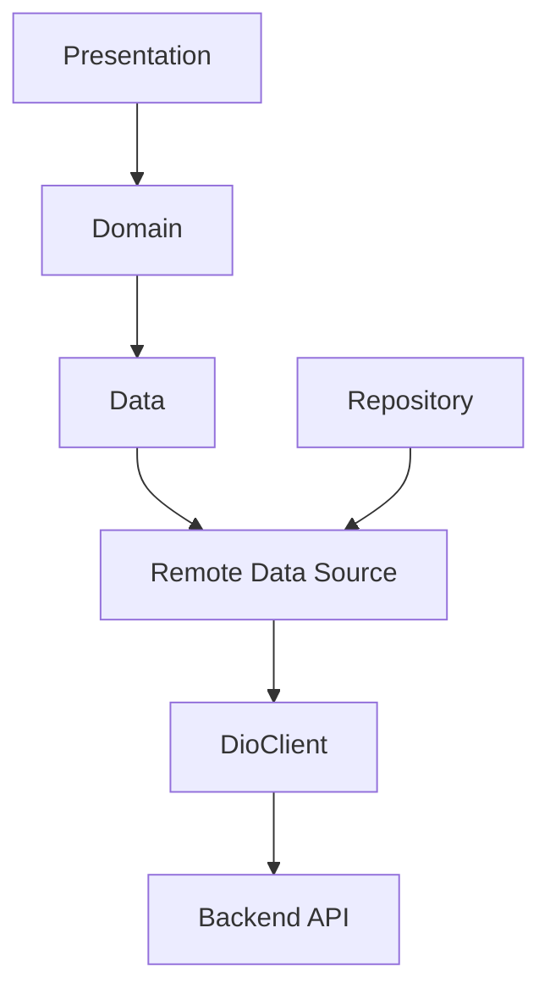
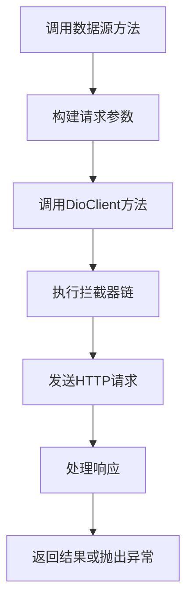
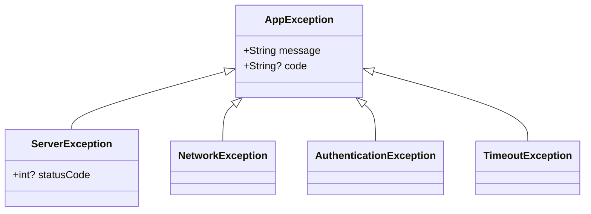
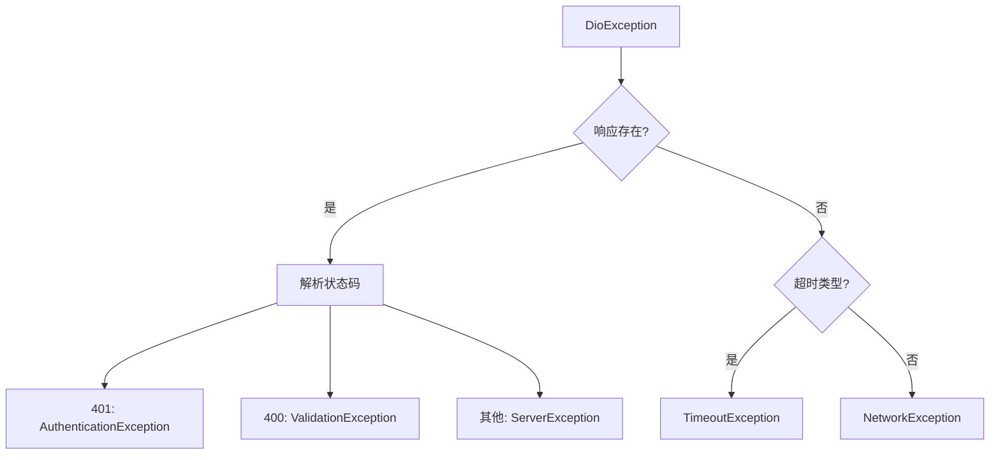
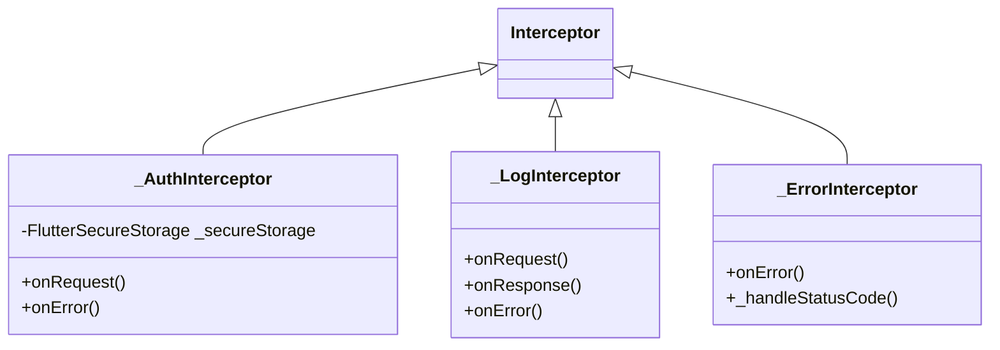
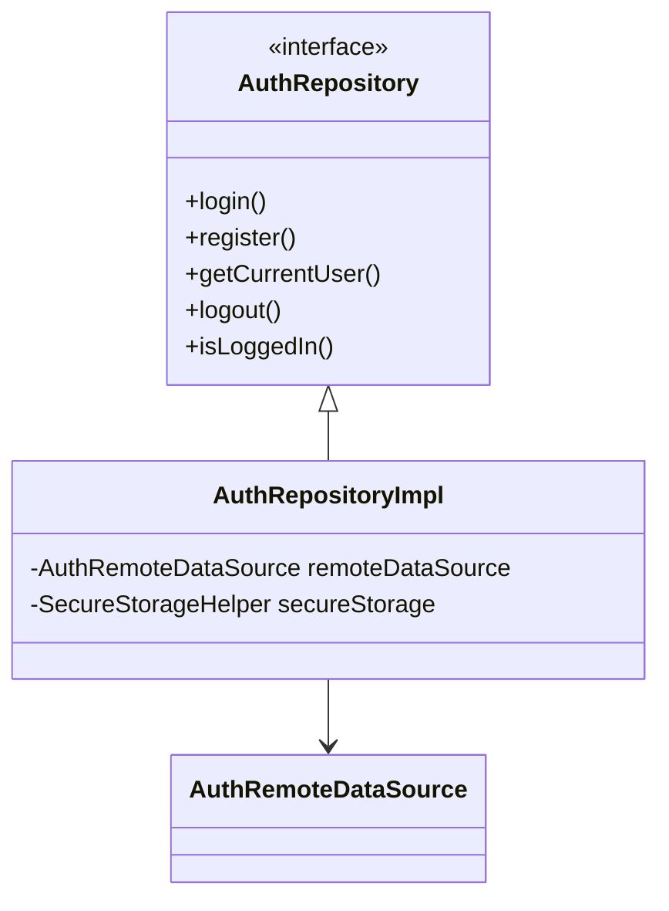

# 远程数据源

<cite>
**本文档中引用的文件**  
- [auth_remote_data_source.dart](file://flutter_app/lib/data/datasources/remote/auth_remote_data_source.dart)
- [method_remote_data_source.dart](file://flutter_app/lib/data/datasources/remote/method_remote_data_source.dart)
- [practice_remote_data_source.dart](file://flutter_app/lib/data/datasources/remote/practice_remote_data_source.dart)
- [user_method_remote_data_source.dart](file://flutter_app/lib/data/datasources/remote/user_method_remote_data_source.dart)
- [dio_client.dart](file://flutter_app/lib/core/network/dio_client.dart)
- [exceptions.dart](file://flutter_app/lib/core/error/exceptions.dart)
- [failures.dart](file://flutter_app/lib/core/error/failures.dart)
- [api_constants.dart](file://flutter_app/lib/config/api_constants.dart)
- [auth_repository_impl.dart](file://flutter_app/lib/data/repositories/auth_repository_impl.dart)
- [method_repository_impl.dart](file://flutter_app/lib/data/repositories/method_repository_impl.dart)
</cite>

## 目录
1. [引言](#引言)
2. [远程数据源设计概述](#远程数据源设计概述)
3. [核心职责与架构角色](#核心职责与架构角色)
4. [数据源与后端资源映射](#数据源与后端资源映射)
5. [HTTP请求执行机制](#http请求执行机制)
6. [错误映射与异常处理](#错误映射与异常处理)
7. [共性逻辑抽象与复用策略](#共性逻辑抽象与复用策略)
8. [接口隔离与可测试性](#接口隔离与可测试性)
9. [新增远程数据源标准流程](#新增远程数据源标准流程)
10. [最佳实践总结](#最佳实践总结)

## 引言
远程数据源是Flutter应用数据层的关键组成部分，负责与后端API进行通信，封装所有网络请求逻辑。本文档详细阐述了`auth_remote_data_source.dart`等远程数据源类的设计目的、职责划分及实现机制，分析其作为数据层与外部服务通信桥梁的作用，并提供新增数据源的标准流程与最佳实践。

## 远程数据源设计概述



**图示来源**  
- [auth_remote_data_source.dart](file://flutter_app/lib/data/datasources/remote/auth_remote_data_source.dart)
- [dio_client.dart](file://flutter_app/lib/core/network/dio_client.dart)

**本节来源**  
- [auth_remote_data_source.dart](file://flutter_app/lib/data/datasources/remote/auth_remote_data_source.dart)
- [dio_client.dart](file://flutter_app/lib/core/network/dio_client.dart)

## 核心职责与架构角色

远程数据源的核心职责是作为数据层与外部API之间的桥梁，承担以下关键角色：

- **协议转换器**：将领域层的抽象请求转换为具体的HTTP请求
- **数据序列化器**：处理请求体的序列化与响应数据的反序列化
- **错误翻译器**：将网络层异常转换为应用层可处理的失败类型
- **认证管理者**：自动处理JWT令牌的附加与刷新逻辑

每个远程数据源专注于特定业务资源的CRUD操作，遵循单一职责原则。

**本节来源**  
- [auth_remote_data_source.dart](file://flutter_app/lib/data/datasources/remote/auth_remote_data_source.dart)
- [method_remote_data_source.dart](file://flutter_app/lib/data/datasources/remote/method_remote_data_source.dart)

## 数据源与后端资源映射

各远程数据源与后端特定资源一一对应，封装对应的CRUD操作：

| 数据源类 | 对应后端资源 | 主要方法 | 对应API端点 |
|---------|------------|---------|-----------|
| `AuthRemoteDataSource` | 用户认证 | login, register, getCurrentUser | /auth/login, /auth/register, /auth/me |
| `MethodRemoteDataSource` | 方法资源 | getMethods, getMethodDetail, searchMethods | /methods, /methods/:id, /methods/search |
| `PracticeRemoteDataSource` | 练习记录 | recordPractice, getPracticeHistory, getPracticeStats | /practices, /practices/stats |
| `UserMethodRemoteDataSource` | 用户方法库 | getUserMethods, addMethodToLibrary, updateUserMethod | /user-methods, /user-methods/:id |

这种映射关系确保了关注点分离，每个数据源只负责特定资源的网络通信。

**本节来源**  
- [auth_remote_data_source.dart](file://flutter_app/lib/data/datasources/remote/auth_remote_data_source.dart)
- [method_remote_data_source.dart](file://flutter_app/lib/data/datasources/remote/method_remote_data_source.dart)
- [practice_remote_data_source.dart](file://flutter_app/lib/data/datasources/remote/practice_remote_data_source.dart)
- [user_method_remote_data_source.dart](file://flutter_app/lib/data/datasources/remote/user_method_remote_data_source.dart)

## HTTP请求执行机制

远程数据源通过Dio客户端执行HTTP请求，实现请求的封装与执行：

### 请求参数处理
- **查询参数**：通过`queryParameters`参数传递，如`getMethods`中的分页和筛选参数
- **请求体**：通过`data`参数传递，自动序列化为JSON格式
- **路径参数**：使用字符串插值方式嵌入URL路径中

### 请求执行流程


**图示来源**  
- [dio_client.dart](file://flutter_app/lib/core/network/dio_client.dart)
- [auth_remote_data_source.dart](file://flutter_app/lib/data/datasources/remote/auth_remote_data_source.dart)

**本节来源**  
- [auth_remote_data_source.dart](file://flutter_app/lib/data/datasources/remote/auth_remote_data_source.dart)
- [dio_client.dart](file://flutter_app/lib/core/network/dio_client.dart)

## 错误映射与异常处理

远程数据源实现了完善的错误映射机制，将网络层异常转换为应用层可处理的Failure类型：

### 异常类型映射


**图示来源**  
- [exceptions.dart](file://flutter_app/lib/core/error/exceptions.dart)

### 错误处理流程


**图示来源**  
- [auth_remote_data_source.dart](file://flutter_app/lib/data/datasources/remote/auth_remote_data_source.dart)
- [exceptions.dart](file://flutter_app/lib/core/error/exceptions.dart)

**本节来源**  
- [auth_remote_data_source.dart](file://flutter_app/lib/data/datasources/remote/auth_remote_data_source.dart)
- [exceptions.dart](file://flutter_app/lib/core/error/exceptions.dart)
- [failures.dart](file://flutter_app/lib/core/error/failures.dart)

## 共性逻辑抽象与复用策略

系统通过多层次抽象实现共性逻辑的复用：

### DioClient封装
`DioClient`类封装了Dio的配置与拦截器，提供统一的网络请求基础：

- **基础配置**：统一设置base URL、超时时间、请求头
- **拦截器链**：认证、日志、错误处理等横切关注点
- **令牌管理**：提供`updateToken`和`clearToken`方法

### 拦截器模式


**图示来源**  
- [dio_client.dart](file://flutter_app/lib/core/network/dio_client.dart)

**本节来源**  
- [dio_client.dart](file://flutter_app/lib/core/network/dio_client.dart)

## 接口隔离与可测试性

通过接口隔离实现单元测试的可模拟性（mocking）：

### 依赖倒置原则
数据源通过构造函数注入`DioClient`，而非直接创建实例，便于在测试中替换为模拟对象。

### Repository层抽象


**图示来源**  
- [auth_repository.dart](file://flutter_app/lib/domain/repositories/auth_repository.dart)
- [auth_repository_impl.dart](file://flutter_app/lib/data/repositories/auth_repository_impl.dart)

### 测试友好设计
- **单一职责**：每个数据源只负责特定资源的网络通信
- **无状态设计**：数据源本身不维护状态，状态由Repository或Bloc管理
- **依赖注入**：通过构造函数注入依赖，便于替换

**本节来源**  
- [auth_repository.dart](file://flutter_app/lib/domain/repositories/auth_repository.dart)
- [auth_repository_impl.dart](file://flutter_app/lib/data/repositories/auth_repository_impl.dart)
- [auth_remote_data_source.dart](file://flutter_app/lib/data/datasources/remote/auth_remote_data_source.dart)

## 新增远程数据源标准流程

新增远程数据源的标准流程如下：

### 1. 创建数据源类
```dart
class NewResourceRemoteDataSource {
  final DioClient dioClient;
  
  NewResourceRemoteDataSource(this.dioClient);
  
  // CRUD方法实现
}
```

### 2. 实现CRUD操作
- 使用`dioClient.get`、`post`、`put`、`delete`等方法
- 处理查询参数、请求体序列化
- 实现响应解码与模型转换

### 3. 错误处理
- 实现`_handleDioError`方法
- 将DioException映射为适当的AppException

### 4. 创建Repository接口
```dart
abstract class NewResourceRepository {
  // 方法定义
}
```

### 5. 实现Repository
```dart
class NewResourceRepositoryImpl implements NewResourceRepository {
  final NewResourceRemoteDataSource remoteDataSource;
  
  NewResourceRepositoryImpl({required this.remoteDataSource});
  
  // 实现方法，处理异常映射
}
```

### 6. 依赖注入配置
在`injection.dart`中注册新服务。

**本节来源**  
- [auth_remote_data_source.dart](file://flutter_app/lib/data/datasources/remote/auth_remote_data_source.dart)
- [auth_repository.dart](file://flutter_app/lib/domain/repositories/auth_repository.dart)
- [auth_repository_impl.dart](file://flutter_app/lib/data/repositories/auth_repository_impl.dart)

## 最佳实践总结

### 设计原则
- **单一职责**：每个数据源只负责一个业务资源
- **高内聚**：相关操作集中在同一数据源
- **低耦合**：通过接口和依赖注入降低耦合度

### 编码规范
- **异常处理**：始终捕获DioException并转换为AppException
- **参数验证**：在调用前验证输入参数
- **文档注释**：为每个方法提供详细的文档注释

### 性能优化
- **缓存策略**：结合本地存储实现数据缓存
- **批量操作**：支持批量请求以减少网络开销
- **分页支持**：所有列表接口支持分页参数

### 安全考虑
- **敏感数据**：避免在日志中记录敏感信息
- **令牌安全**：使用FlutterSecureStorage安全存储认证令牌
- **输入验证**：在客户端进行基本输入验证

**本节来源**  
- [auth_remote_data_source.dart](file://flutter_app/lib/data/datasources/remote/auth_remote_data_source.dart)
- [dio_client.dart](file://flutter_app/lib/core/network/dio_client.dart)
- [exceptions.dart](file://flutter_app/lib/core/error/exceptions.dart)