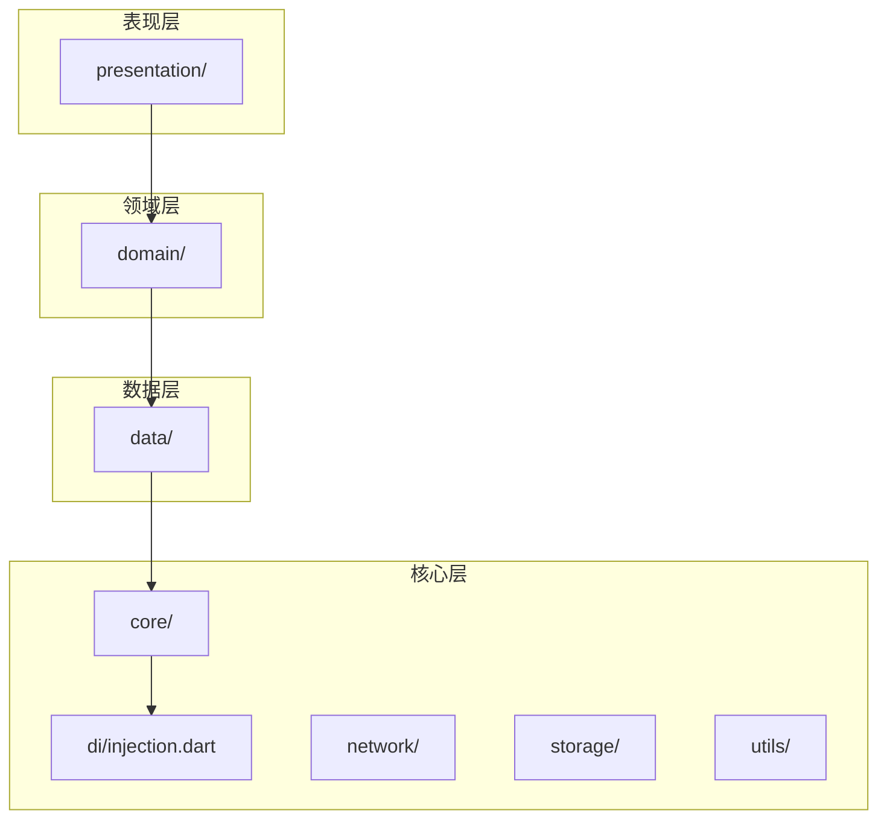
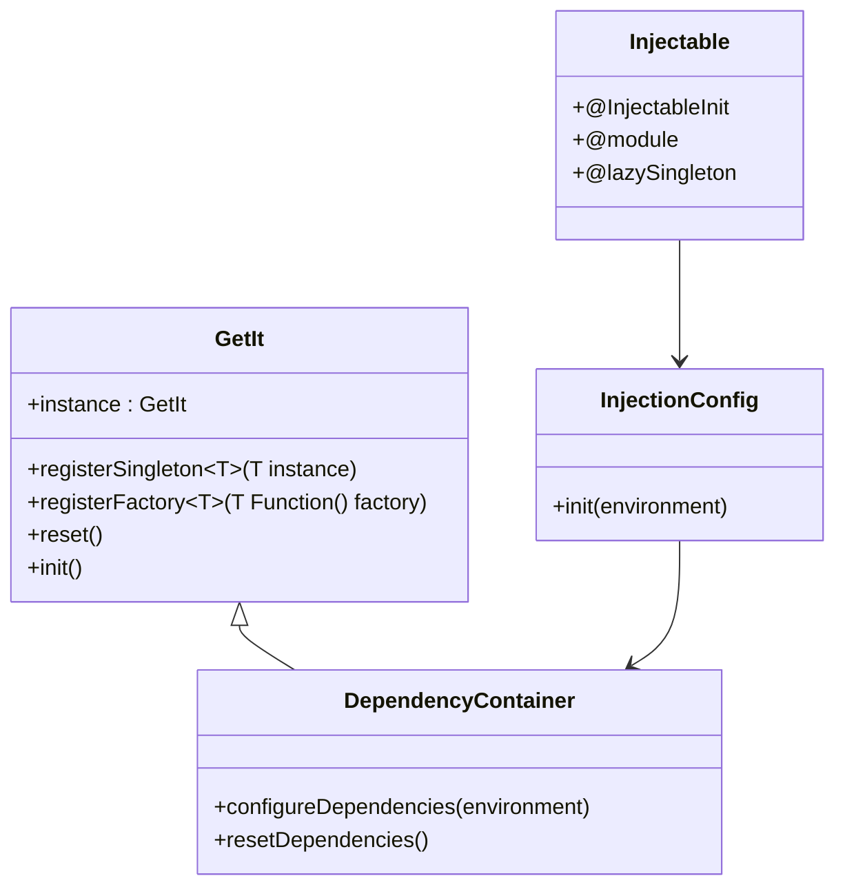
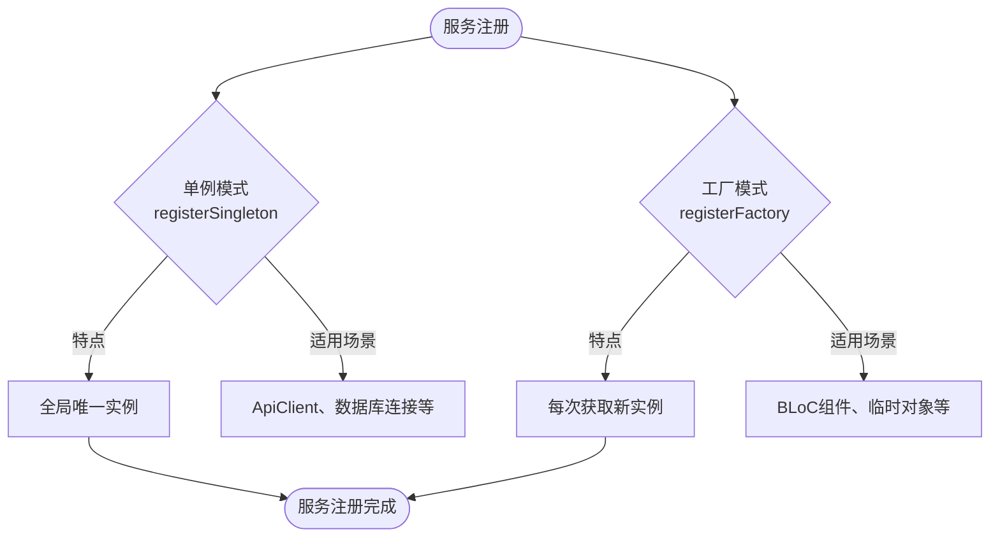
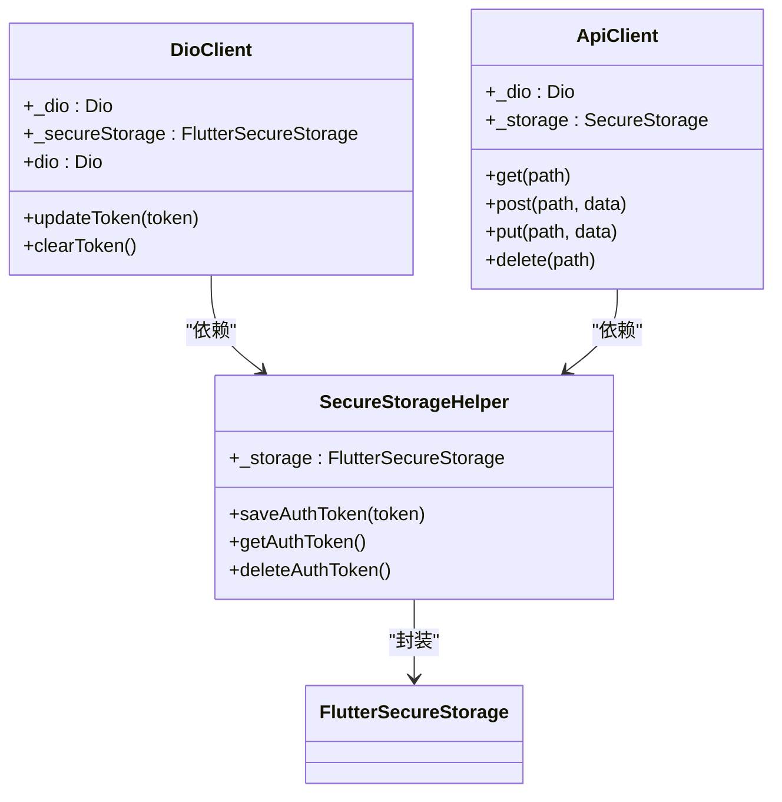
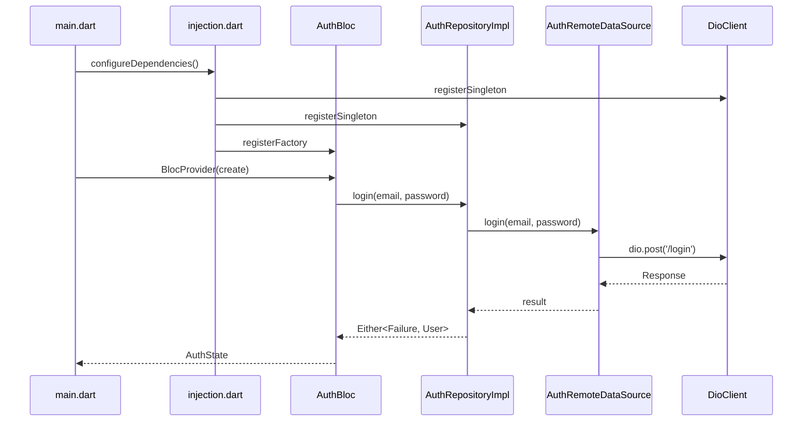
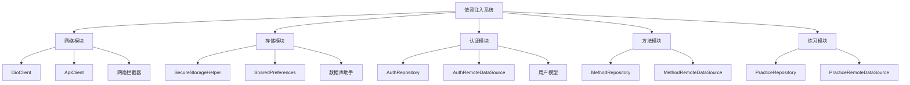

# 依赖注入容器

<cite>
**本文档中引用的文件**   
- [injection.dart](file://flutter_app/lib/core/di/injection.dart)
- [main.dart](file://flutter_app/lib/main.dart)
- [dio_client.dart](file://flutter_app/lib/core/network/dio_client.dart)
- [api_client.dart](file://flutter_app/lib/data/api/api_client.dart)
- [auth_repository_impl.dart](file://flutter_app/lib/data/repositories/auth_repository_impl.dart)
- [auth_bloc.dart](file://flutter_app/lib/presentation/auth/bloc/auth_bloc.dart)
- [secure_storage_helper.dart](file://flutter_app/lib/core/storage/secure_storage_helper.dart)
- [pubspec.yaml](file://flutter_app/pubspec.yaml)
</cite>

## 目录
1. [简介](#简介)
2. [项目结构](#项目结构)
3. [核心组件](#核心组件)
4. [架构概述](#架构概述)
5. [详细组件分析](#详细组件分析)
6. [依赖分析](#依赖分析)
7. [性能考虑](#性能考虑)
8. [故障排除指南](#故障排除指南)
9. [结论](#结论)

## 简介
本文档详细说明了nian移动端应用中依赖注入系统的设计与实现。该系统基于GetIt和Injectable库构建，实现了表现层、领域层与数据层之间的解耦。通过模块化注册函数组织服务依赖，确保了系统的可维护性与测试隔离性。文档阐述了单例与工厂模式在不同服务类型中的应用，并提供了新增服务的完整示例。同时强调了DI机制对单元测试和集成测试的支持，以及初始化流程在main.dart中的调用时机与异常处理。

## 项目结构
nian移动端项目采用分层架构设计，主要分为核心层、数据层、领域层和表现层。依赖注入系统位于核心层的di目录下，通过injection.dart文件统一管理所有服务的注册与解析。

**Diagram sources**
- [injection.dart](file://flutter_app/lib/core/di/injection.dart)
- [main.dart](file://flutter_app/lib/main.dart)

**Section sources**
- [injection.dart](file://flutter_app/lib/core/di/injection.dart)
- [main.dart](file://flutter_app/lib/main.dart)

## 核心组件
依赖注入系统的核心组件包括GetIt服务定位器实例、依赖配置函数和模块化注册机制。系统使用Injectable注解自动生成依赖注册代码，通过configureDependencies函数在应用启动时初始化所有依赖项。

**Section sources**
- [injection.dart](file://flutter_app/lib/core/di/injection.dart)
- [pubspec.yaml](file://flutter_app/pubspec.yaml)

## 架构概述
nian应用的依赖注入架构采用服务定位器模式，通过GetIt库实现全局服务注册容器。系统使用Injectable库的代码生成能力，将依赖关系声明转换为实际的注册代码。架构支持不同环境（生产、开发、测试）的依赖配置，确保了环境间的隔离性。

**Diagram sources**
- [injection.dart](file://flutter_app/lib/core/di/injection.dart)
- [dio_client.dart](file://flutter_app/lib/core/network/dio_client.dart)

## 详细组件分析

### 依赖注入容器分析
依赖注入容器通过GetIt库实现，提供统一的服务注册与解析接口。容器支持单例和工厂两种注册模式，满足不同类型服务的需求。

#### 服务注册模式

**Diagram sources**
- [injection.dart](file://flutter_app/lib/core/di/injection.dart)
- [auth_bloc.dart](file://flutter_app/lib/presentation/auth/bloc/auth_bloc.dart)

### 网络模块分析
网络模块是依赖注入系统的重要组成部分，负责HTTP客户端和服务的注册与管理。

#### 网络服务依赖关系

**Diagram sources**
- [dio_client.dart](file://flutter_app/lib/core/network/dio_client.dart)
- [api_client.dart](file://flutter_app/lib/data/api/api_client.dart)
- [secure_storage_helper.dart](file://flutter_app/lib/core/storage/secure_storage_helper.dart)

### 认证模块分析
认证模块展示了依赖注入在实际业务场景中的应用，通过依赖注入实现各组件间的解耦。

#### 认证流程依赖注入

**Diagram sources**
- [main.dart](file://flutter_app/lib/main.dart)
- [injection.dart](file://flutter_app/lib/core/di/injection.dart)
- [auth_bloc.dart](file://flutter_app/lib/presentation/auth/bloc/auth_bloc.dart)
- [auth_repository_impl.dart](file://flutter_app/lib/data/repositories/auth_repository_impl.dart)

**Section sources**
- [auth_repository_impl.dart](file://flutter_app/lib/data/repositories/auth_repository_impl.dart)
- [auth_bloc.dart](file://flutter_app/lib/presentation/auth/bloc/auth_bloc.dart)

## 依赖分析
依赖注入系统通过模块化方式组织服务依赖，确保了代码的可维护性和可测试性。

### 依赖模块组织策略

**Diagram sources**
- [injection.dart](file://flutter_app/lib/core/di/injection.dart)
- [dio_client.dart](file://flutter_app/lib/core/network/dio_client.dart)
- [secure_storage_helper.dart](file://flutter_app/lib/core/storage/secure_storage_helper.dart)

**Section sources**
- [injection.dart](file://flutter_app/lib/core/di/injection.dart)
- [dio_client.dart](file://flutter_app/lib/core/network/dio_client.dart)

## 性能考虑
依赖注入系统在设计时充分考虑了性能因素，通过合理的实例生命周期管理确保应用的高效运行。

- 单例服务在应用生命周期内只创建一次，减少了对象创建的开销
- 工厂模式用于需要频繁创建和销毁的对象，避免内存泄漏
- 延迟单例（@lazySingleton）确保服务在首次使用时才被初始化，优化启动性能
- 依赖注入容器本身经过优化，服务解析速度快，对性能影响极小

## 故障排除指南
当依赖注入系统出现问题时，可参考以下常见问题及解决方案：

**Section sources**
- [injection.dart](file://flutter_app/lib/core/di/injection.dart)
- [main.dart](file://flutter_app/lib/main.dart)

### 常见问题
1. **服务未注册异常**：确保在相应的模块中正确使用@lazySingleton或相关注解
2. **循环依赖问题**：检查服务间的依赖关系，避免A依赖B，B又依赖A的情况
3. **环境配置错误**：确认configureDependencies调用时传递了正确的环境参数
4. **测试隔离失败**：在测试前后调用resetDependencies确保测试环境的纯净

## 结论
nian移动端的依赖注入系统通过GetIt和Injectable库的结合，实现了高效、可维护的依赖管理。系统采用模块化注册策略，将服务按功能分组，提高了代码的组织性和可读性。单例与工厂模式的合理应用满足了不同类型服务的需求，既保证了资源的高效利用，又确保了对象状态的正确管理。该系统不仅支持正常的生产环境运行，还为测试提供了完善的隔离机制，通过resetDependencies函数实现测试环境的重置。整体设计遵循了依赖倒置原则，有效解耦了应用的各个层次，为后续的功能扩展和维护提供了坚实的基础。