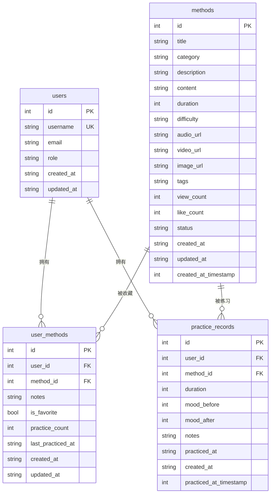
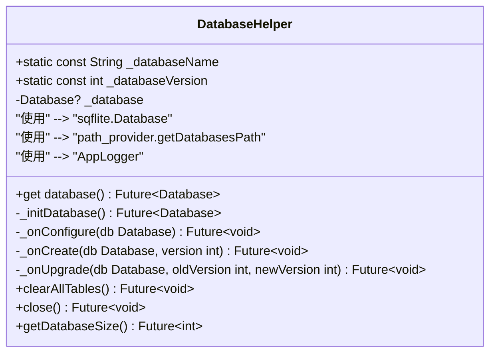
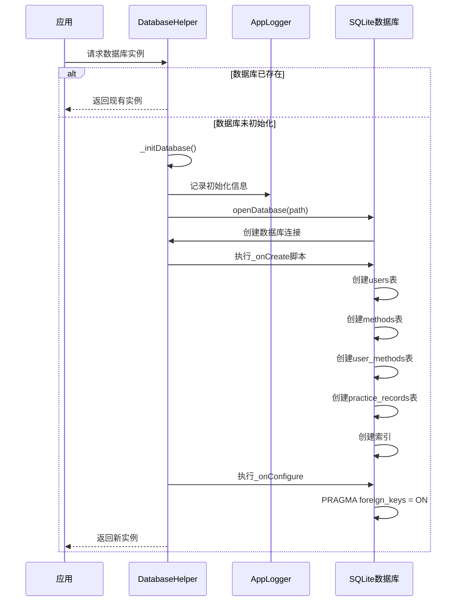
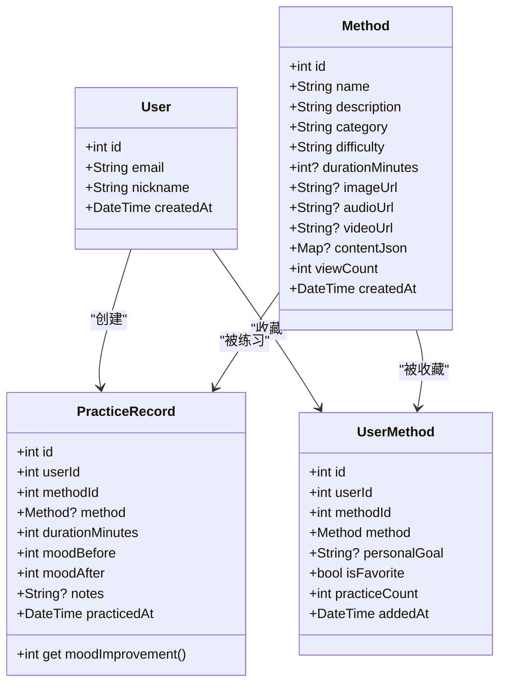
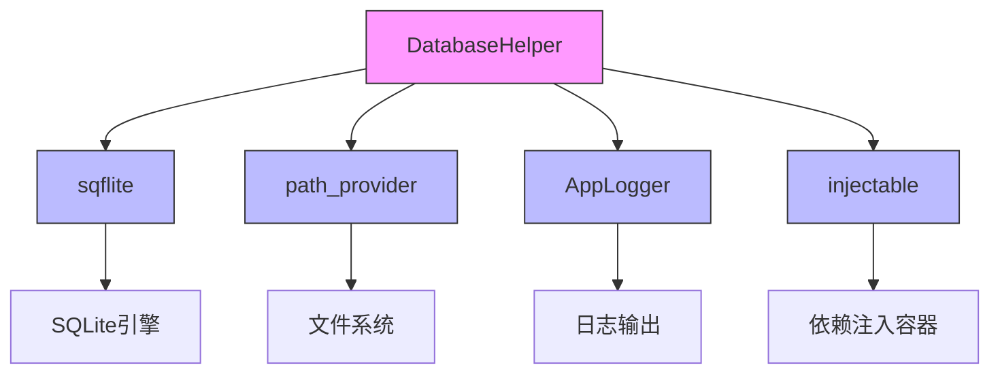

# SQLite数据库实现

<cite>
**本文档引用的文件**
- [database_helper.dart](file://flutter_app/lib/core/storage/database_helper.dart)
- [user_model.dart](file://flutter_app/lib/data/models/user_model.dart)
- [method_model.dart](file://flutter_app/lib/data/models/method_model.dart)
- [practice_record_model.dart](file://flutter_app/lib/data/models/practice_record_model.dart)
- [user_method_model.dart](file://flutter_app/lib/data/models/user_method_model.dart)
- [user.dart](file://flutter_app/lib/domain/entities/user.dart)
- [method.dart](file://flutter_app/lib/domain/entities/method.dart)
- [practice_record.dart](file://flutter_app/lib/domain/entities/practice_record.dart)
- [user_method.dart](file://flutter_app/lib/domain/entities/user_method.dart)
- [pubspec.yaml](file://flutter_app/pubspec.yaml)
</cite>

## 目录
1. [简介](#简介)
2. [核心组件分析](#核心组件分析)
3. [数据库架构概览](#数据库架构概览)
4. [详细组件分析](#详细组件分析)
5. [依赖关系分析](#依赖关系分析)
6. [性能考量](#性能考量)
7. [故障排除指南](#故障排除指南)
8. [结论](#结论)

## 简介
本项目中的`DatabaseHelper`类实现了基于sqflite库的本地SQLite数据库管理功能，为应用提供持久化存储层。该实现通过单例模式确保数据库连接的唯一性，并采用延迟初始化机制优化资源使用。数据库设计包含users、methods、user_methods和practice_records四张核心表，通过外键约束维护数据完整性，并利用索引优化关键查询路径的性能。系统还预留了版本升级机制以支持未来演进。

## 核心组件分析
`DatabaseHelper`类是本地数据持久化的中心组件，负责数据库的生命周期管理。它通过`_databaseName`和`_databaseVersion`常量定义数据库文件名和版本号，在应用启动时根据版本号决定执行创建或升级逻辑。`_getDatabase`方法实现了单例模式与延迟初始化，确保数据库仅被初始化一次且按需加载。`_onCreate`方法中定义了四张核心表的Schema结构，包括字段类型、约束条件及外键关联。`_onConfigure`方法启用外键约束以保证引用完整性，而`_onUpgrade`方法为未来版本迁移提供了扩展点。`clearAllTables`方法可用于测试环境重置数据，但存在数据丢失风险；`close`方法则确保数据库连接被正确释放；`getDatabaseSize`方法提供了监控存储使用情况的潜在路径。

**Section sources**
- [database_helper.dart](file://flutter_app/lib/core/storage/database_helper.dart#L7-L204)

## 数据库架构概览

**Diagram sources**
- [database_helper.dart](file://flutter_app/lib/core/storage/database_helper.dart#L52-L155)

## 详细组件分析

### DatabaseHelper类分析

#### 类图

**Diagram sources**
- [database_helper.dart](file://flutter_app/lib/core/storage/database_helper.dart#L11-L204)

#### 初始化流程

**Diagram sources**
- [database_helper.dart](file://flutter_app/lib/core/storage/database_helper.dart#L18-L39)

### 数据模型分析

#### 用户与方法关系

**Diagram sources**
- [user.dart](file://flutter_app/lib/domain/entities/user.dart#L6-L32)
- [method.dart](file://flutter_app/lib/domain/entities/method.dart#L6-L77)
- [practice_record.dart](file://flutter_app/lib/domain/entities/practice_record.dart#L7-L67)
- [user_method.dart](file://flutter_app/lib/domain/entities/user_method.dart#L7-L59)

## 依赖关系分析

**Diagram sources**
- [pubspec.yaml](file://flutter_app/pubspec.yaml#L30-L32)
- [database_helper.dart](file://flutter_app/lib/core/storage/database_helper.dart#L1-L6)

## 性能考量
数据库性能优化主要体现在三个方面：首先是索引策略，在`methods`表上创建了`idx_methods_category`、`idx_methods_status`和`idx_methods_created_at`索引，显著提升了按分类、状态和创建时间的查询效率；在`practice_records`表上创建了`idx_practice_records_practiced_at`索引，优化了按练习时间排序的查询性能。其次是外键约束的启用，通过`PRAGMA foreign_keys = ON`确保了数据引用完整性，避免了孤儿记录的产生。最后是单例模式的应用，避免了重复创建数据库连接带来的开销。然而，`getDatabaseSize`方法的实现尚不完整，当前返回固定值0，需要补充实际的文件大小获取逻辑。

**Section sources**
- [database_helper.dart](file://flutter_app/lib/core/storage/database_helper.dart#L87-L97)
- [database_helper.dart](file://flutter_app/lib/core/storage/database_helper.dart#L143-L151)
- [database_helper.dart](file://flutter_app/lib/core/storage/database_helper.dart#L189-L203)

## 故障排除指南
常见问题包括数据库初始化失败、外键约束未生效和查询性能低下。初始化失败通常源于路径获取异常，可通过检查`getDatabasesPath()`返回值进行诊断。外键约束未生效的问题可通过在`_onConfigure`方法中确认执行了`PRAGMA foreign_keys = ON`语句来解决。查询性能问题可通过分析执行计划并确保相关字段已建立适当索引来优化。`clearAllTables`方法在生产环境中使用可能导致数据丢失，应仅限于测试场景。数据库连接未正确关闭可能导致资源泄漏，需确保在适当生命周期阶段调用`close`方法。

**Section sources**
- [database_helper.dart](file://flutter_app/lib/core/storage/database_helper.dart#L42-L45)
- [database_helper.dart](file://flutter_app/lib/core/storage/database_helper.dart#L168-L178)
- [database_helper.dart](file://flutter_app/lib/core/storage/database_helper.dart#L180-L187)

## 结论
`DatabaseHelper`类提供了一个完整且可扩展的本地数据库解决方案。其设计充分考虑了数据完整性、查询性能和未来可维护性。通过合理的表结构设计和索引策略，满足了应用的核心数据存储需求。单例模式和延迟初始化确保了资源的高效利用，而版本控制机制为未来的数据结构演进预留了空间。尽管`getDatabaseSize`方法尚需完善，但整体实现已具备生产就绪的稳定性与功能性。