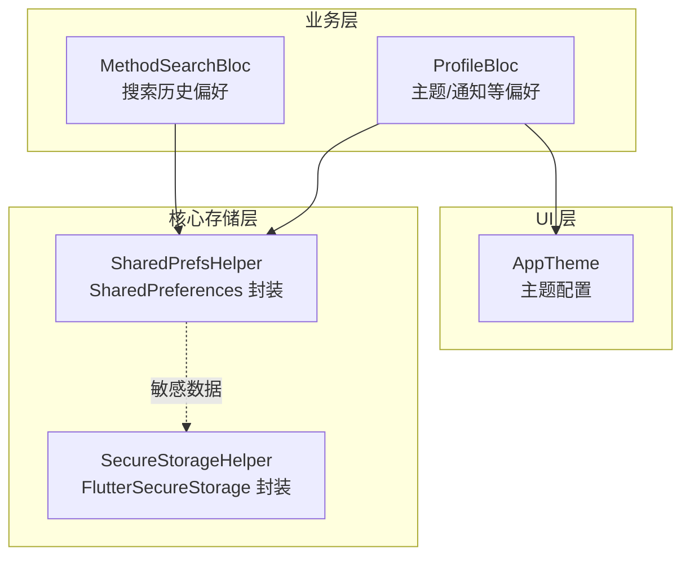
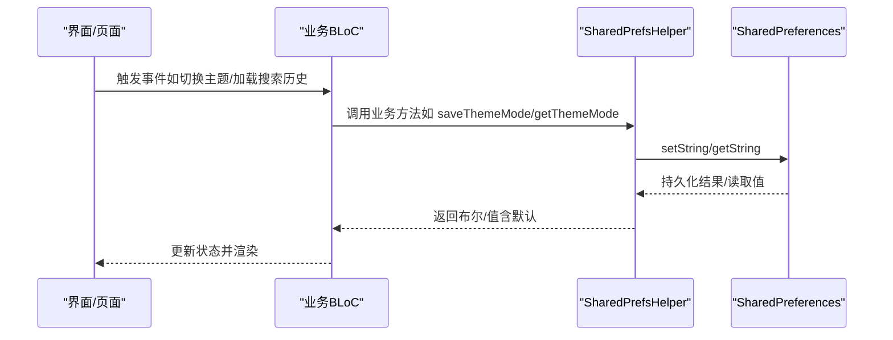
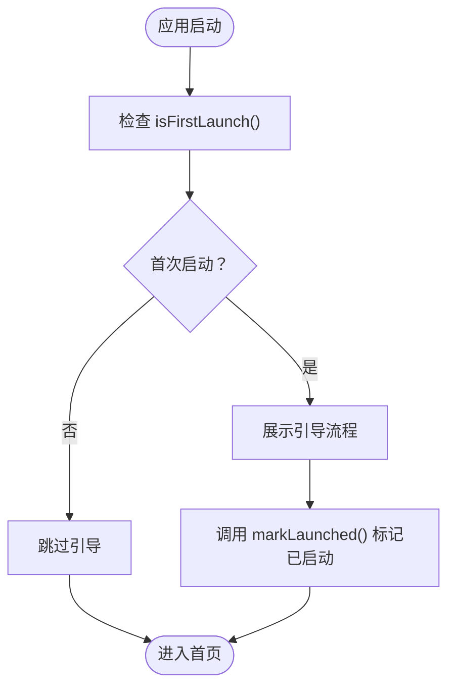
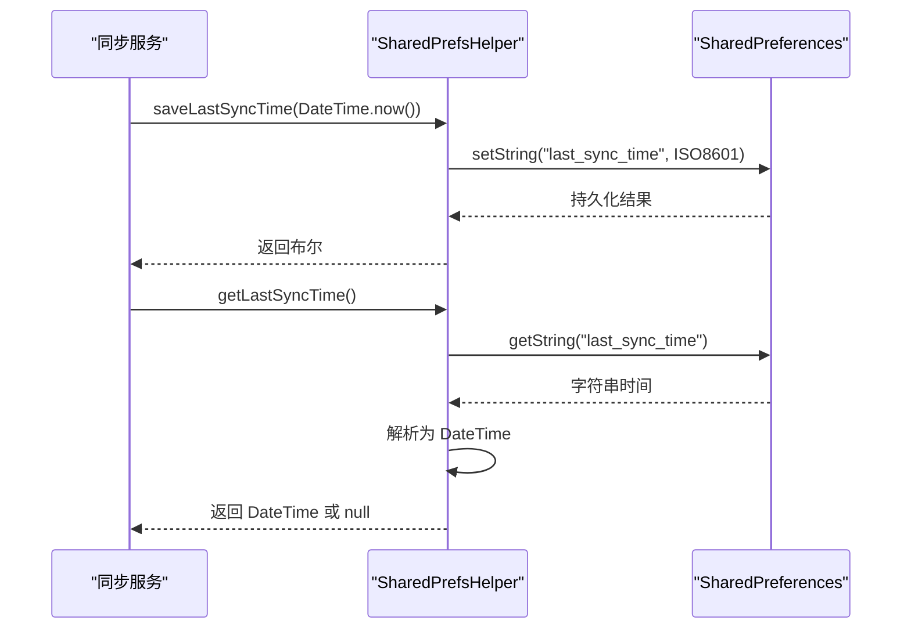
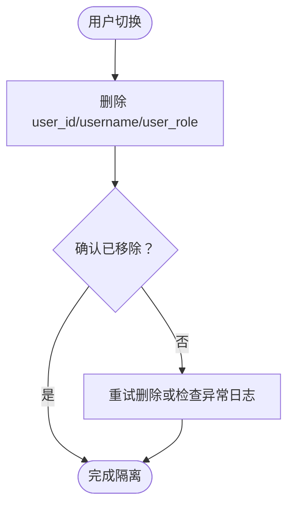
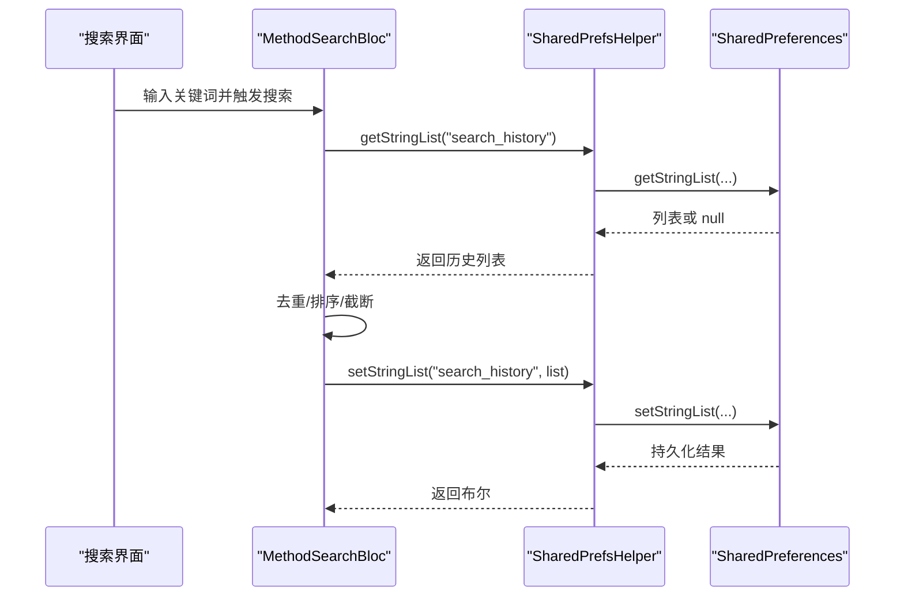
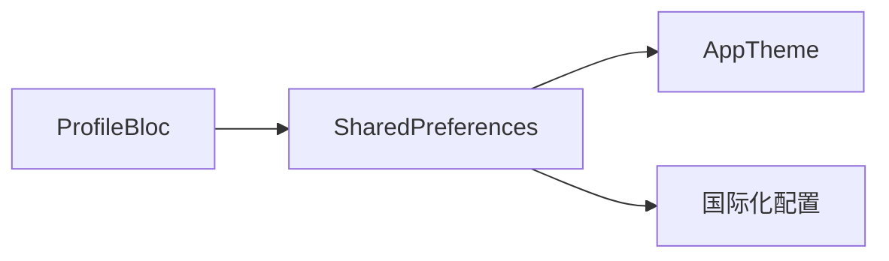
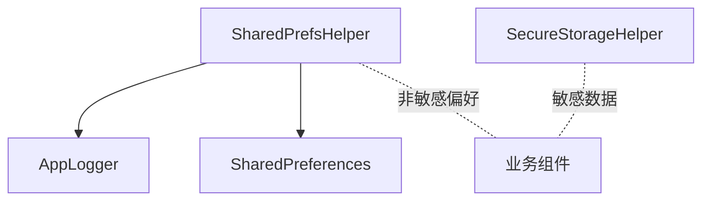

# 共享偏好设置实现

<cite>
**本文引用的文件**
- [shared_prefs_helper.dart](file://flutter_app/lib/core/storage/shared_prefs_helper.dart)
- [secure_storage_helper.dart](file://flutter_app/lib/core/storage/secure_storage_helper.dart)
- [method_search_bloc.dart](file://flutter_app/lib/presentation/methods/bloc/method_search_bloc.dart)
- [profile_bloc.dart](file://flutter_app/lib/presentation/profile/bloc/profile_bloc.dart)
- [theme.dart](file://flutter_app/lib/config/theme.dart)
</cite>

## 目录
1. [简介](#简介)
2. [项目结构](#项目结构)
3. [核心组件](#核心组件)
4. [架构概览](#架构概览)
5. [详细组件分析](#详细组件分析)
6. [依赖关系分析](#依赖关系分析)
7. [性能考量](#性能考量)
8. [故障排查指南](#故障排查指南)
9. [结论](#结论)

## 简介
本文件系统性解析 SharedPrefsHelper 类的设计与实现，阐述其基于 SharedPreferences 的轻量级键值存储机制在用户偏好管理中的应用。文档覆盖以下要点：
- 存储键常量与数据类型处理方法（如 user_id、theme_mode、language_code 等）
- 复杂数据类型的序列化逻辑（如 getStringList、getDouble 的使用场景与边界）
- 业务方法封装（saveUserId/getUserId、saveThemeMode/getThemeMode、markLaunched/isFirstLaunch、getLastSyncTime/saveLastSyncTime）
- 用户切换时的数据隔离策略（clearUserData）
- 在新用户引导流程与数据同步场景中的职责边界与协作方式

## 项目结构
SharedPrefsHelper 位于核心存储层，作为 SharedPreferences 的类型安全封装器，为上层业务组件提供统一的偏好读写接口。其典型使用路径如下：
- 业务层通过注入或直接获取 SharedPrefsHelper 实例进行偏好读写
- 搜索历史等轻量数据使用 SharedPrefsHelper
- 登录态与敏感令牌使用 SecureStorageHelper 进行安全存储

图表来源
- [shared_prefs_helper.dart](file://flutter_app/lib/core/storage/shared_prefs_helper.dart#L1-L306)
- [secure_storage_helper.dart](file://flutter_app/lib/core/storage/secure_storage_helper.dart#L1-L192)
- [method_search_bloc.dart](file://flutter_app/lib/presentation/methods/bloc/method_search_bloc.dart#L1-L119)
- [profile_bloc.dart](file://flutter_app/lib/presentation/profile/bloc/profile_bloc.dart#L1-L166)
- [theme.dart](file://flutter_app/lib/config/theme.dart#L1-L77)

章节来源
- [shared_prefs_helper.dart](file://flutter_app/lib/core/storage/shared_prefs_helper.dart#L1-L306)

## 核心组件
SharedPrefsHelper 提供两类能力：
- 通用类型安全读写：setString/setInt/setBool/setDouble/setStringList 与对应的 getter
- 业务方法封装：围绕用户 ID、主题模式、语言代码、通知开关、音频设置、WiFi 媒体加载、首次启动标记、上次同步时间等键位的读写

关键特性
- 类型安全：每个 setter 返回 Future<bool> 表示持久化结果；getter 支持默认值
- 错误处理：内部捕获异常并记录日志，返回布尔或默认值，避免崩溃
- 可扩展：提供 containsKey/remove/clear/getKeys 等通用能力
- 单例注入：通过 @lazySingleton 与 SharedPrefsModule 提供全局实例

章节来源
- [shared_prefs_helper.dart](file://flutter_app/lib/core/storage/shared_prefs_helper.dart#L1-L306)

## 架构概览
SharedPrefsHelper 与业务层的交互遵循“存储层抽象 + 业务层调用”的分层设计。业务组件通过 BLoC 或 Repository 间接使用 SharedPrefsHelper，确保数据访问的一致性与可测试性。

图表来源
- [method_search_bloc.dart](file://flutter_app/lib/presentation/methods/bloc/method_search_bloc.dart#L80-L118)
- [profile_bloc.dart](file://flutter_app/lib/presentation/profile/bloc/profile_bloc.dart#L96-L105)
- [shared_prefs_helper.dart](file://flutter_app/lib/core/storage/shared_prefs_helper.dart#L170-L221)

## 详细组件分析

### 数据类型与序列化逻辑
- 字符串：setString/getString 直接持久化
- 整数：setInt/getInt 直接持久化
- 布尔：setBool/getBool 直接持久化
- 双精度浮点：setDouble/getDouble 直接持久化
- 字符串列表：setStringList/getStringList 直接持久化
- 复杂对象（如 DateTime）：通过 ISO 8601 字符串序列化（保存时 toIso8601String，读取时 parse），并在解析失败时返回 null 并记录错误日志

章节来源
- [shared_prefs_helper.dart](file://flutter_app/lib/core/storage/shared_prefs_helper.dart#L52-L135)
- [shared_prefs_helper.dart](file://flutter_app/lib/core/storage/shared_prefs_helper.dart#L243-L259)

### 存储键常量与用途
- 用户相关：user_id、username、user_role
- 应用行为：is_first_launch、theme_mode、language_code、notifications_enabled、auto_play_audio、audio_volume、wifi_only_media
- 同步与时间：last_sync_time

章节来源
- [shared_prefs_helper.dart](file://flutter_app/lib/core/storage/shared_prefs_helper.dart#L16-L49)

### 业务方法封装与默认值策略
- 用户标识：saveUserId/getUserId
- 用户名与角色：saveUsername/getUsername、saveUserRole/getUserRole
- 首次启动：isFirstLaunch（默认 true）、markLaunched
- 主题模式：saveThemeMode/getThemeMode（默认 'system'）
- 语言代码：saveLanguageCode/getLanguageCode
- 通知开关：saveNotificationsEnabled/getNotificationsEnabled（默认 true）
- 音频设置：saveAutoPlayAudio/getAutoPlayAudio（默认 true）、saveAudioVolume/getAudioVolume（默认 0.8）
- WiFi 媒体加载：saveWifiOnlyMedia/getWifiOnlyMedia（默认 false）
- 同步时间：saveLastSyncTime/getLastSyncTime（字符串序列化）

章节来源
- [shared_prefs_helper.dart](file://flutter_app/lib/core/storage/shared_prefs_helper.dart#L173-L296)

### 新用户引导流程：isFirstLaunch 与 markLaunched
- 首次启动检测：isFirstLaunch 返回布尔值，默认 true，确保新用户看到引导流程
- 标记已启动：markLaunched 将 is_first_launch 设为 false，避免后续重复引导
- 使用建议：通常在应用启动后首次进入首页或完成引导后调用 markLaunched

图表来源
- [shared_prefs_helper.dart](file://flutter_app/lib/core/storage/shared_prefs_helper.dart#L203-L211)

章节来源
- [shared_prefs_helper.dart](file://flutter_app/lib/core/storage/shared_prefs_helper.dart#L203-L211)

### 数据同步场景：getLastSyncTime 与 saveLastSyncTime
- 保存时间：saveLastSyncTime 将 DateTime 转为 ISO 8601 字符串后持久化
- 读取时间：getLastSyncTime 读取字符串并尝试解析为 DateTime，解析失败返回 null 并记录错误日志
- 使用建议：结合业务定时任务或手动触发同步时更新该时间，用于判断下次同步时机或展示上次同步提示

图表来源
- [shared_prefs_helper.dart](file://flutter_app/lib/core/storage/shared_prefs_helper.dart#L243-L259)

章节来源
- [shared_prefs_helper.dart](file://flutter_app/lib/core/storage/shared_prefs_helper.dart#L243-L259)

### 用户切换时的数据隔离：clearUserData
- 目标：清理与当前用户强相关的轻量偏好（user_id、username、user_role），避免用户切换后残留
- 策略：逐键删除，确保下次登录时不会读取到前一位用户的偏好
- 注意：该方法不涉及敏感令牌等安全存储，敏感数据应由 SecureStorageHelper 管理

图表来源
- [shared_prefs_helper.dart](file://flutter_app/lib/core/storage/shared_prefs_helper.dart#L291-L296)

章节来源
- [shared_prefs_helper.dart](file://flutter_app/lib/core/storage/shared_prefs_helper.dart#L291-L296)

### 搜索历史偏好：getStringList 的使用
- 场景：MethodSearchBloc 使用 SharedPrefsHelper 保存/读取搜索历史列表
- 方法：setStringList/getStringList
- 业务逻辑：去重、限制长度、插入到首位、持久化

图表来源
- [method_search_bloc.dart](file://flutter_app/lib/presentation/methods/bloc/method_search_bloc.dart#L80-L118)
- [shared_prefs_helper.dart](file://flutter_app/lib/core/storage/shared_prefs_helper.dart#L120-L135)

章节来源
- [method_search_bloc.dart](file://flutter_app/lib/presentation/methods/bloc/method_search_bloc.dart#L80-L118)
- [shared_prefs_helper.dart](file://flutter_app/lib/core/storage/shared_prefs_helper.dart#L120-L135)

### 主题与语言偏好：与 UI 的衔接
- 主题：ProfileBloc 中直接使用 SharedPreferences 设置 theme_mode；AppTheme 提供浅色/深色主题配置
- 语言：SharedPrefsHelper 提供 language_code 键位，可在国际化模块中读取并应用

图表来源
- [profile_bloc.dart](file://flutter_app/lib/presentation/profile/bloc/profile_bloc.dart#L96-L105)
- [theme.dart](file://flutter_app/lib/config/theme.dart#L1-L77)
- [shared_prefs_helper.dart](file://flutter_app/lib/core/storage/shared_prefs_helper.dart#L213-L231)

章节来源
- [profile_bloc.dart](file://flutter_app/lib/presentation/profile/bloc/profile_bloc.dart#L96-L105)
- [theme.dart](file://flutter_app/lib/config/theme.dart#L1-L77)
- [shared_prefs_helper.dart](file://flutter_app/lib/core/storage/shared_prefs_helper.dart#L213-L231)

## 依赖关系分析
- 外部依赖：shared_preferences、injectable
- 内部依赖：AppLogger（日志）
- 与安全存储的边界：敏感数据（如令牌）由 SecureStorageHelper 管理，非敏感偏好由 SharedPrefsHelper 管理

图表来源
- [shared_prefs_helper.dart](file://flutter_app/lib/core/storage/shared_prefs_helper.dart#L1-L306)
- [secure_storage_helper.dart](file://flutter_app/lib/core/storage/secure_storage_helper.dart#L1-L192)

章节来源
- [shared_prefs_helper.dart](file://flutter_app/lib/core/storage/shared_prefs_helper.dart#L1-L306)
- [secure_storage_helper.dart](file://flutter_app/lib/core/storage/secure_storage_helper.dart#L1-L192)

## 性能考量
- 写入开销：SharedPreferences 采用异步写入，单次写入耗时极低；批量写入建议合并为一次操作以减少 IO 次数
- 读取开销：读取字符串/整数/布尔/双精度均为 O(1)，字符串列表读取为 O(n)（n 为元素个数）
- 序列化成本：DateTime 通过 ISO 8601 字符串序列化，解析失败会记录日志并返回 null，避免阻塞
- 清理策略：clearUserData 仅删除少量键，性能开销可忽略；clear 会清空全部键，慎用
- 默认值策略：getter 提供默认值可避免空值分支，提升稳定性

[本节为通用性能讨论，无需特定文件引用]

## 故障排查指南
- 写入失败：setXxx 返回 false，同时记录错误日志；检查设备存储权限与磁盘空间
- 读取为空：getter 返回 null 或默认值；确认键是否存在（containsKey），或检查是否被 clear/remove
- 时间解析失败：getLastSyncTime 解析字符串为 DateTime 失败时返回 null 并记录错误；检查保存格式是否为 ISO 8601
- 首次启动误判：isFirstLaunch 默认 true，若出现异常需检查 markLaunched 是否正确调用
- 用户切换残留：确认 clearUserData 已调用；注意该方法不清理安全存储中的敏感数据

章节来源
- [shared_prefs_helper.dart](file://flutter_app/lib/core/storage/shared_prefs_helper.dart#L52-L135)
- [shared_prefs_helper.dart](file://flutter_app/lib/core/storage/shared_prefs_helper.dart#L243-L259)
- [shared_prefs_helper.dart](file://flutter_app/lib/core/storage/shared_prefs_helper.dart#L291-L296)

## 结论
SharedPrefsHelper 通过类型安全的封装与完善的错误处理，为应用提供了稳定可靠的轻量级偏好存储能力。其在用户偏好管理、新用户引导、数据同步与用户切换等场景中发挥关键作用。配合 SecureStorageHelper 的安全存储边界，形成“非敏感偏好 + 敏感数据”的清晰分工，既保证了用户体验的一致性，也兼顾了数据安全与性能。